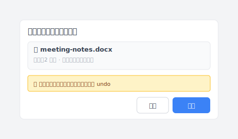

# 【2026 檔案管理】Windows 3 種「備份」：沒一個能找回「會議後加結論」那版

> Windows 內建 3 個都叫「備份」的功能。它們都答不出「我會議後存的那版在哪」。

剛買筆電的時候你打開了 File History。覺得有保護了。3 個月後，你想找昨天那版——尤其是「會議後加結論」那版。

對話框打開，給你的是一排時間戳：14:00、15:00、16:00。哪一個是「會議後」那版？逐版打開看才知道。

你以為「備份」是一件事。其實 Windows 內建有 3 件不同的事，全部都不解這個問題。

這篇拆完那 3 個 Windows 工具各自在做什麼、為什麼都答不出「會議後那版」，然後講 [Keeply](https://keeply.work) 怎麼把這層補起來——它在你電腦本機上跑、每 30 分鐘背景存一次、加上你隨時可以手動「儲存版本」+ 寫一行筆記。

## 你真正需要的版本工具長這樣

「會議後加結論」這版要找得回來，工具其實要做到 3 件事：

1. **每一版可以寫筆記**——半年後翻回來不用逐版打開看才知道哪版是哪版
2. **不靠外接硬碟**——出差不帶硬碟版本還是繼續存
3. **自動 + 手動兩種**——背景定期存一次顧短週期 + 你重要時刻手動標一版加筆記

[Keeply](https://keeply.work) 是這 3 件事一起做的。它跑在你電腦本機上、背景每 30 分鐘自動輪詢檔案變更（有改才存）、同時你隨時可以點主視窗「儲存版本」、跳出對話框寫一行筆記再存。

開會結束後你點「儲存版本」、跳的對話框長這樣：

寫完「會議後加結論」、點儲存版本、關掉電腦走人。

半年後翻時間軸，你看到的是這樣：

「會議後加結論」自己一行、自己一個標記。要找的版本不用看時間戳猜。

## Windows 內建 3 個「備份」為什麼都做不到這件事

Microsoft 在 Windows 裡塞了 3 個都叫「備份」的東西。它們不是同一件事、但**全都不寫筆記**。

| 功能 | 它實際在做什麼 | 為什麼答不出「會議後那版」 |
|---|---|---|
| **File History** | 把你選的資料夾按小時複製到外接硬碟 | 每版只有時間戳、不寫筆記。而且外接硬碟沒接就不存 |
| **Windows Backup**（備份與還原） | 把整台電腦拍一張快照 | 給你整台電腦、不是單一檔案的版本史 |
| **版本歷史**（OneDrive） | 雲端記每個檔案改了幾次 | 純時間戳、保留期過了就消失、只對有同步的檔案 |

3 種不同用途、3 種不同任務。它們共通的只有「備份」兩個字——所以很多人開了其中一個，就以為其他兩個也顧到了。

而且就算 3 個都開、**還是缺一件事**：每個版本有「為什麼存」的筆記。File History 給你 14:00、15:00、16:00 三個時間戳，但「會議後加結論」是哪一版？File History 不知道、Windows Backup 不知道、OneDrive 也不知道。

Keeply 補的就是這層。

## 4 種怕、4 種工具各自能救你什麼

換個方式看：你會怕的事其實有 4 種。

**怕硬碟掛掉、系統開不起來**——Windows Backup 救你這個。File History、OneDrive、Keeply 都救不了系統本身。

**怕想回到這個月某天的資料夾狀態**——File History 救你這個（如果硬碟接著）。Keeply 也能（30 分鐘自動存）。

**怕昨天某個檔案打錯字想退回**——OneDrive 版本歷史救你（如果有同步、還在保留期）。File History 也能（看當天硬碟有沒有接）。Keeply 也能（30 分鐘自動存）。

**怕找不到「會議後加結論」那版**——這是 Keeply 主場。File History、Backup、OneDrive 三個全答不出來，因為它們的版本只有時間戳、沒有筆記。

對照表：

| 你遇到的事 | File History | Windows Backup | OneDrive 版本歷史 | Keeply |
|---|---|---|---|---|
| SSD 物理壞掉 | ❌ | ✅ | ✅ 只救已同步的 | ⚠️ 看你有沒有同步到外部 |
| Windows 開不起來 | ❌ | ✅ | ❌ 救不了系統 | ❌ 救不了系統 |
| 勒索軟體把整顆碟加密 | ⚠️ 硬碟沒插時可以救 | ✅ 映像放外面可以救 | ⚠️ 看同步快不快 | ⚠️ 看你有沒有同步到外部 |
| Word 改錯字、想退回昨天 | ⚠️ 看硬碟有沒有接 | ❌ 顆粒太粗 | ✅ 有同步、且還在保留期 | ✅ 自動每 30 分鐘存一版 |
| **想找「會議後加結論」那版** | ❌ 只有時間戳 | ❌ 不是檔案版本 | ❌ 只有時間戳 | ✅ **你寫的筆記找得到** |
| 想回到 3 個月前那版 | ⚠️ 看當天 File History 有沒有跑、硬碟有沒有接 | ❌ 映像不是檔案版本 | ❌ 通常已過保留期 | ✅ 本機沒時間上限 |
| 兩週前不小心刪了檔案 | ✅ 在監看的資料夾裡的話 | ✅ 映像有 | ✅ 30 天回收筒 | ✅ 版本歷史裡有 |

你只用其中一個，看不到的事：

- **只開 File History**：昨天的草稿大概顧得到（如果硬碟接著）、但找不到「會議後」那版。硬碟整顆壞掉、Windows 開不起來就抓瞎。
- **只開 Windows Backup**：災難級的事它救你，但你每天工作覆蓋掉的小檔案完全沒在它裡面。
- **只用 OneDrive**：有同步的、保留期內的檔案它救你，本機檔、過了保留期、整台電腦壞掉它都救不了。
- **只裝 Keeply**：每個有筆記的版本它都記、不靠外接硬碟，但 SSD 整顆壞掉就要看你有沒有同步到外部位置。

雲端保留期這塊另一篇——[iCloud vs Dropbox 版本歷史的天花板](/zh-tw/post/cloud-version-history-cliff/)。

## 為什麼 Keeply 能補這 4 件事的第 4 個

回去看那張表，最後一行「想找『會議後加結論』那版」——3 個 Windows 工具全是 ❌。

不是它們做不好，是它們**設計目標不同**：

- File History 的目標：時間排程把資料夾複製到外接硬碟。版本是時間戳的副本、不是「有意義的存檔點」。
- Windows Backup 的目標：整台電腦的快照。不在乎你哪一份檔案改了幾次。
- OneDrive 的目標：雲端同步 + 災難復原。版本歷史是附加功能、依方案有上限。

[Keeply](https://keeply.work) 的目標就是補第 4 件——**每個版本有「為什麼」的版本歷史**，跑在你電腦本機上、不靠外接硬碟。

它怎麼做：

- **背景每 30 分鐘自動輪詢**——檔案有變更才存，沒改不會產生空版本
- **隨時可以手動「儲存版本」**——重要時刻你點按鈕、跳對話框、寫一行筆記再存
- **每版有筆記欄位**——半年後翻回來看到的是描述、不是時間戳
- **完全本機跑**——版本就在你檔案旁邊、不需要外接硬碟、不需要雲端帳號
- **不暴露 Git 術語**——介面用「儲存版本」、「紀錄」、「還原」這種日常詞，沒有 commit / branch / merge

它**不取代** File History 或 Windows Backup——那兩個繼續顧它們擅長的災難。Keeply 補的是 Windows 內建一直沒人顧的第 4 件事。

挑到「會議後加結論」那一版要還原時，介面長這樣——比 Windows 檔案總管「先前版本」分頁直覺很多：

點還原前 Keeply 自動把目前那版存進時間軸，誤按也救得回——這是 File History「先前版本」分頁少掉的安全網。

想看具體場景：[我跟 Windows File History 要昨天的草稿，它給我 2019 年的檔案](/zh-tw/post/windows-file-history-wrong-version/)——就是這個第 4 件事缺口踩進去會發生什麼。

## 不必加 Keeply 或類似工具的時候

幾種情況確實不需要：

**你在公司 IT 管控的環境**。IT 用 SCCM、Veeam 或別的集中備份系統，能不能裝 Keeply 不是你決定。先去問 IT。

**你的工作短週期、不在乎「哪版有筆記」**。如果你的需求是「找回幾小時前」、不會半年後才回頭找特定版本，File History 每小時一次就涵蓋了。

**法規合規場景**。SOX、HIPAA、GDPR 要不可變存檔的需求要正規工具（Veeam、Acronis、產業專屬封存軟體）。本篇講的是日常工作流程的保護、不是合規。

## 延伸閱讀

主篇 [檔案版本管理完整指南](/zh-tw/post/file-version-management-complete-guide/) 講為什麼工具就是沒設計給你這件事——拆 4 個根本原因。

實際場景：[我跟 Windows File History 要昨天的草稿，它給我 2019 年的檔案](/zh-tw/post/windows-file-history-wrong-version/) 講一個具體的失敗案例。

Mac 對應：[Time Machine vs Dropbox：備份、同步、跟兩者都不是的第三軸](/zh-tw/post/time-machine-vs-dropbox/) 同樣這套思路、換到 macOS。

---

「備份」這個詞把 3 件事塞進同一個桶子。Windows 三個內建備份各自做得不錯，但「會議後加結論那版在哪」——3 個全部答不出來。

[Keeply](https://keeply.work) 補的就是那層：每個版本有筆記、跑在你電腦本機上、不靠外接硬碟。半年後你翻時間軸，看到「會議後加結論」自己一行，不是 14:00、15:00、16:00 一排時間戳。

---

> 關於作者：Ting-Wei Tsao，[Keeply](https://keeply.work) 創辦人。
> [LinkedIn](https://www.linkedin.com/in/ting-wei-tsao-b57480152/)
