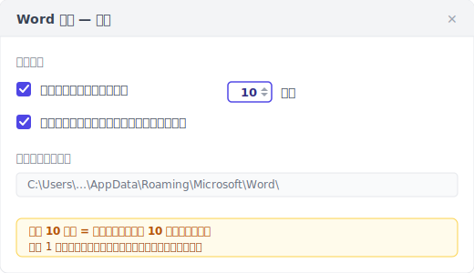
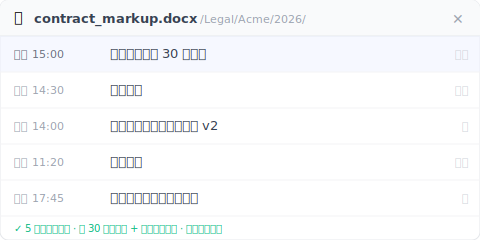

自動回復是當機救援，不是版本歷史。Word 內建的，只有救當機那一份。

> 週五下午三點，你寫了 90 分鐘合約批註，準備五點開會用。Word 不動了，畫面凍住，你等了三分鐘按了強制結束。
>
> 重開 Word，「文件回復」工作窗格跳了出來。你滿懷希望點開。**裡面一片空白**。
>
> 90 分鐘的工作沒了。客戶 5 點要看。

不是運氣不好。是「自動回復」設計上本來就不會救這份檔。

下面 5 種狀況，是從 Microsoft 官方文件、搜尋結果裡同事們的求救貼文、以及實際機制反推出來的。每一種都跟你直覺想的不一樣。

---

## 狀況 1：你從沒按過 Ctrl+S {#case-1-never-saved}

你新開一份 Word，按了「空白文件」開始打字，30 分鐘後當機。重開 Word，「文件回復」工作窗格。空的。

這不是程式出錯。**自動回復要追蹤一份文件，前提是這份文件有檔名、有路徑**。從沒按過 Ctrl+S = 沒檔名 = 沒路徑 = 自動回復不知道要把暫存檔存到哪。

Microsoft 自家[官方說明](https://support.microsoft.com/zh-tw/office/%E5%BE%A9%E5%8E%9F-office-%E6%AA%94%E6%A1%88-d0b6ef1b-77b0-44d0-9899-21d6b65cab86)寫得很白：「自動回復」需要這份檔案至少存過一次，才會開始幫你做 .asd 暫存。

新建 → 寫 30 分鐘 → 當機，這個順序裡自動回復從頭到尾沒被叫起來過一次。

> **習慣建議**：開新檔的第一個動作，永遠是 Ctrl+S → 起檔名 → 然後再開始寫。30 秒的事，可以避免這種事故。

---

## 狀況 2：Word 凍住，你按了強制結束 {#case-2-force-quit}

這是開頭那個合約批註的場景。Word 不是真的當掉跳回復對話框。是凍住沒回應，你**主動**按了強制結束。

Word 自動回復**預設每 10 分鐘**存一次 .asd 暫存檔。在那 10 分鐘之間，你打的字都在記憶體緩衝裡。強制結束 = 記憶體內容沒寫到 .asd = 從 .asd 救只能回到上次寫入磁碟那瞬間。

「上次寫入」可能是 9 分鐘前的版本，也可能是 1 分鐘前的版本。取決於你正好在 10 分鐘週期的哪個位置。最壞情況：你 9:59 寫了一大段，10:00 Word 凍住，這段都沒寫進 .asd。

這個 10 分鐘預設值，是 Microsoft 在「磁碟讀寫負擔」跟「資料丟失風險」之間的取捨。對你來說，這 10 分鐘的延遲 = 最多 10 分鐘的工作暴露在風險裡。

可以調短：檔案 → 選項 → 儲存 → 「儲存自動回復資訊的時間間隔」改成 1。代價是磁碟讀寫變高，舊筆電可能感覺得到。

> 自動回復救的不是「你剛打的那 8 分鐘」，是「8 分鐘之前那個寫進磁碟的版本」。差別不大但決定誰活下來。

---

## 狀況 3：「文件回復」跳出來了。但裡面是空白 {#case-3-blank-recovery}

這是最讓人崩潰的一種。Word 真的跳了「文件回復」工作窗格，你滿懷希望點開。**檔案內容是空的**或亂碼。

機制上發生了什麼：自動回復把當下狀態打包成 .asd 檔寫入磁碟，這個動作要時間。如果寫到一半電源切斷 / 程式在打包中途當掉。半截的 .asd 檔留在磁碟，無法解析。Word 看到 .asd 存在所以跳回復窗格，但開啟後解析失敗 → 顯示空白或亂碼。

Microsoft 自己論壇上有一則 Q&A：[「My recovered unsaved word document is entirely blank」](https://learn.microsoft.com/en-us/answers/questions/5285105/my-recovered-unsaved-word-document-is-entirely-bla)。Microsoft 自家論壇都在問這個狀況。這不是邊緣事故，是常見的。

> 「文件回復」工作窗格跳出來，不等於救得回來。自動回復承諾的是「嘗試」，不是「保證」。

---

## 狀況 4：你換了一台電腦 {#case-4-cross-machine}

你昨天用辦公室桌機寫了一份 Word，今天回家用筆電開檔，發現只回到上週六手動存檔那版。**昨天 8 小時的修改不見了**。

自動回復的 .asd 檔存在本機：

- **Windows**：`%LocalAppData%\Microsoft\Office\UnsavedFiles` 與 `%AppData%\Microsoft\Word`
- **macOS**：`~/Library/Containers/com.microsoft.Word/Data/Library/Preferences/AutoRecovery`

**這些路徑不會自動同步到 OneDrive、不會同步到 Dropbox、不會同步到 iCloud Drive**。它設計上就是一份本機快取。

你可能會問「我的 Word 不是綁 OneDrive 嗎？」對，但 OneDrive 同步的是「檔案本體」，不是「自動回復的 .asd 暫存檔」。即使 AutoSave 開了（要 Microsoft 365 訂閱 + 檔案放 OneDrive），AutoSave 同步檔案本體到雲端、自動回復寫本機 .asd 緩衝。**兩個並存不互通**。

換電腦開檔，新機讀不到舊機的 .asd。

> .asd 是自動回復給你那台機的本地小抄。它不出國。

---

## 狀況 5：你按了「不要儲存」 {#case-5-dont-save}

關 Word 時跳「儲存變更?」對話框，你想都沒想按了「不要儲存」。因為以為自己已經存過。3 秒後想起來剛剛改了重要段落沒存。

按「不要儲存」是使用者主動行為。Word 認定「使用者明確選擇丟棄這次編輯的修改」。**自動回復設計上立刻清掉這份檔的 .asd 緩衝**。因為保留就違反使用者的意願。

這個狀況在 Google 英文搜尋結果第 8 名的小站[`integrisit.com/accidentally-clicked-dont-save`](https://integrisit.com/accidentally-clicked-dont-save/)（網站權重只有 DA 41）就在講。為什麼權重這麼低的小站能排進前十？因為這個狀況 **Microsoft 自家文件不會講**。承認「使用者按了不要儲存我們立刻清緩衝」會打到產品自己的說法。

> 「不要儲存」不是手滑打錯字。是 Word 內部的「確認丟棄 + 立刻清緩衝」雙重指令。

---

## 補位：一層永久版本歷史，背景自動 + 你主動標記 {#keeply-fills-gap}

5 種狀況走完，你看到「自動回復」是一層特定設計的網。它接得到「正在打字 + 落在兩次記錄中間 + Word 真的當機」這個短窗，但接不到其他 5 種。共同點是：自動回復的暫存**用完就清**。正常關閉清、按不要儲存清、強制關閉時可能根本沒寫完。

要補位，要的是一層**不會被清掉的版本歷史**：每一版都是完整存檔、永久保留，強制關閉跟不要儲存都動不到。它有兩個來源。**背景每 30 分鐘自動記一版**，加上**你主動點「儲存版本」按鈕、寫一句筆記**標記里程碑（例如「這版是客戶要的」）。

把上面 5 種狀況跟這層對照一遍：

| 狀況 | 自動回復 | 永久版本歷史（30 分鐘自動 + 手動儲存版本）|
|---|---|---|
| 1. 從沒存過 | 沒有基準點 = 無紀錄 | 也救不到。檔案沒寫進磁碟，這層看不到（見下方邊界）|
| 2. 強制結束 | 緩衝可能空白或寫一半 | 最近一次自動快照或手動儲存版本完整可開（最多丟 30 分鐘，但拿回的是完整檔不是空白）|
| 3. 回復窗格空白 | 緩衝寫一半損毀 | 每一版都是完整存檔快照，不是半截緩衝 |
| 4. 換電腦 | 本機 .asd 沒同步 | 版本同步到雲端，跨機可開 |
| 5. 按了不要儲存 | 緩衝立刻清 | 上次自動快照/手動儲存版本已寫，不要儲存只丟掉那之後沒存的改動 |

Keeply 是這層的一個實作。安裝後它監看你的 Word 資料夾，背景每 30 分鐘自動記一版；你也可以隨時點「儲存版本」立刻記一版、附一句筆記。版本側欄能看到每一版的時間戳記 + 一鍵還原任意一版。

**重點不是「比較頻繁」**。30 分鐘其實比自動回復的 10 分鐘還粗。重點是**永久 + 完整可開 + 強制關閉和不要儲存都動不到**。自動回復對「正在打、還沒到下次記錄、突然當機」這個短窗仍可能留住更新的內容，所以 Keeply **不取代**自動回復，是補在它底下的那一層。

---

## Keeply 也救不到的 3 種事故 {#limits}

說清楚邊界：

**1. 從沒存進磁碟的檔，Keeply 也救不到**。Keeply 監看的是磁碟上的資料夾。檔案要先存過一次、寫進那個資料夾，Keeply 才看得到它、才能開始記版本。從沒按存檔的新檔，Keeply 跟自動回復一樣無能為力。所以前面那個習慣建議。新建文件第一個動作 = 存檔起名。對兩者都成立。

**2. 損毀的 .docx，Keeply 只回得到上一個健康版本**。如果某次自動快照或手動儲存版本記下的時候，檔案本身已經損毀（罕見但有），Keeply 記的就是損毀那一版。版本歷史回不到健康狀態，需要再往前找一個沒壞的版本還原。

**3. 沒同步出去的跨機檔留在原機**。Keeply 把版本寫進本機的版本庫，雲端同步是另一步。如果你在筆電寫了 8 小時但網路斷線沒同步，後來桌機開啟沒看到那 8 小時。不是 Keeply 故障，是同步還沒完成。

這三個比自動回復的 5 種狀況都明確、都能驗證。你知道「我有沒有存過檔」「檔案是不是壞了」「網路有沒有斷」，不用反推機制。

---

## 不必裝 Keeply 的 3 種 Word 場景 {#when-not-needed}

不是每個人都需要這層。

**1. 短時間作業（< 10 分鐘的回信備忘）**。自動回復 10 分鐘間隔都還沒到，Keeply 的下次自動快照也還沒到。這種輕量作業內建已經夠。

**2. 你已養成每 5 分鐘存檔習慣 + 檔案放 OneDrive**。OneDrive 25 版 / 30 天保留 + 你的高頻存檔已經接近一層版本歷史。Keeply 在你想跨 30 天回溯時才有加值。例如客戶三個月後問你「上次那版的 v2 還在嗎」。

**3. 公司布了 SharePoint + Version History**。SharePoint 版本史保留更長、admin 控管、合規可審。個人 Keeply 是補位不是替代。你還是用 SharePoint。

Keeply 是給「在 5 種狀況任一被咬過」+「以後不想再咬」的個人用戶。沒被咬過或公司已有方案，原狀沒問題。

---

## 常見問題 {#faq}

**Q1. 我把 Keeply 裝在 Word 資料夾，會跟自動回復打架嗎？**

不會，是兩層不同的東西。Keeply 監看磁碟上的 .docx 檔（你存過一次、寫進它監看的資料夾之後），背景每 30 分鐘記一版；自動回復寫的是 `%LocalAppData%` 裡的 .asd 暫存檔。兩個碰不到對方的儲存路徑。

**Q2. 我可以把 Word 自動回復間隔改成 1 分鐘嗎？**

可以。檔案 → 選項 → 儲存 → 「儲存自動回復資訊的時間間隔」改成 1。間隔越短 = 當機時可救回的內容越新，代價是磁碟讀寫變高，舊筆電可能感覺得到。但這仍是當機緩衝。正常關閉/按不要儲存照樣清掉。如果你要的是一層「當機、按了不要儲存都還在」的永久版本歷史，那是另一條路：Keeply 背景每 30 分鐘自動記一版 + 你主動按儲存版本，不靠你記得去調間隔。

**Q3. 為什麼我正常關閉 Word，「文件回復」工作窗格不出現？**

因為 Word 正常關閉 = 沒當機 = 自動回復認定「使用者已經存好了」= 把 .asd 緩衝清掉。下次開啟就沒東西可回復。這是設計：自動回復只在「異常結束」的場景下保留 .asd。

**Q4. OneDrive AutoSave 會不會取代自動回復？**

不會。AutoSave 同步檔案本體到雲端（你需要 Microsoft 365 訂閱 + 檔案放在 OneDrive 路徑），自動回復寫本機 .asd 緩衝。AutoSave 解的是「跨裝置即時同步」，自動回復解的是「當機那一刻的最後幾分鐘」。兩個並存不互通。底下還可以加第三層：永久版本歷史（例如 Keeply），背景每 30 分鐘自動記一版 + 手動儲存版本，獨立於雲端同步狀態。

**Q5. Keeply 救得回我刪掉的、從沒存過檔的 Word 檔嗎？**

救不到。Keeply 的起點 = 檔案第一次存進磁碟（你按存檔起名）。把這個動作變成習慣：開新檔 → 先存檔起名 → 再開始寫。檔案進了 Keeply 監看的資料夾後，背景每 30 分鐘自動記一版，你也可以隨時手動按「儲存版本」。

---

## 延伸閱讀

- [Excel 版本歷史只回 1-2 版是 Microsoft 設計，不是故障](/zh-tw/post/excel-version-history-limits/)
- [存檔後不小心覆蓋舊版？Excel/Word/PPT 覆蓋救援的機制斷層](/zh-tw/post/recover-overwritten-file/)
- [Photoshop 自動儲存救當機，救不了你存錯版本](/zh-tw/post/photoshop-autosave-not-version-history/)
- [檔案版本管理完整指南](/zh-tw/post/file-version-management-complete-guide/)

---

*作者：[Ting-Wei Tsao](https://www.linkedin.com/in/ting-wei-tsao-b57480152/)。Keeply 創辦人，做檔案版本管理工具給不是工程師的人。*
