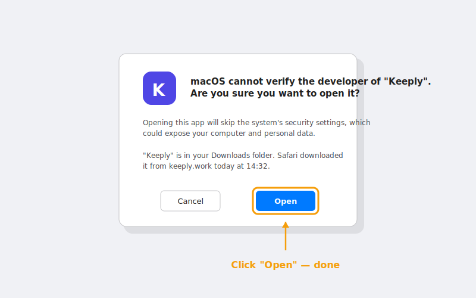

> „Ich habe doppelgeklickt, der blaue Bildschirm tauchte auf, und ich dachte mir, das ist ein Virus, und habe es zugemacht."
>
> — Ein Designer, der gerade von Keeply gehört hatte, antwortete am selben Nachmittag.

Er ist nicht der Erste. Der blaue Bildschirm unter Windows hält wahrscheinlich mehr Leute auf, als die Installation tatsächlich abschließen.

Hier ist der ganze Weg von Anfang bis Ende: **warum der blaue Bildschirm auftaucht → drei sauberere Wege zu installieren → direkt danach dein erstes Projekt öffnen**.

## Inhalt

1. [Warum der blaue Bildschirm auftaucht (es liegt nicht an Keeply)](#why-smartscreen)
2. [Drei Wege — nimm den, der zu dir passt](#three-paths)
3. [Windows Weg 1: ein winget-Befehl (empfohlen)](#path-winget)
4. [Windows Weg 2: die .exe herunterladen](#path-exe)
5. [macOS-Installation: der Rechtsklick-Schritt, den du nicht überspringen kannst](#path-macos)
6. [Nach der Installation: dein erstes Projekt einwerfen](#first-project)
7. [Hängen geblieben? 5 häufige Fehler](#troubleshoot)

## Warum der blaue Bildschirm auftaucht (es liegt nicht an Keeply) {#why-smartscreen}

Dieser Bildschirm heißt [SmartScreen](https://learn.microsoft.com/de-de/windows/security/operating-system-security/virus-and-threat-protection/microsoft-defender-smartscreen/). Er entscheidet nicht „ist diese Software bösartig?" — er entscheidet „haben schon genug Leute das hier benutzt?".

Stell es dir so vor: Ein neues Restaurant ohne Google-Bewertungen ist kein schlechtes Essen. Es ist nur Essen, das noch niemand bewertet hat.

SmartScreen behandelt neue Software genauso. Es baut Vertrauen über **Downloadvolumen + Zeit** auf, und jede neue Version durchläuft diese Beobachtungsphase wieder. Keeply trifft das jedes Mal, wenn ein Update veröffentlicht wird. Nichts davon hat damit zu tun, ob die Software selbst sicher ist.

Warum macht es den Leuten dann Angst? Weil der Bildschirm dir nur einen riesigen „Nicht ausführen"-Knopf gibt. Um trotzdem auszuführen, musst du auf einen winzigen Link namens **Weitere Informationen** seitlich klicken. Optisch liest sich das nicht als Hinweis — es liest sich als Mauer.

Aber du musst dich gar nicht damit beschäftigen. **Keeply ist im [winget-Paketverzeichnis von Microsoft](https://github.com/microsoft/winget-pkgs) veröffentlicht**, und dieser Weg löst die Warnung gar nicht erst aus.

Der Punkt ist also nicht, wie man die Warnung umgeht. Der Punkt ist, einen Weg zu nehmen, auf dem die Warnung nie auftaucht.


## Drei Wege — nimm den, der zu dir passt {#three-paths}

| Weg | Am besten, wenn du | Zeit | Blauer Bildschirm? |
| --- | --- | --- | --- |
| **A. winget-Befehl** (Windows) | nichts dagegen hast, eine Zeile in PowerShell zu kopieren | 2 Min. | Nein |
| **B. Offizieller .exe-Download** (Windows) | kein schwarzes Terminal öffnen willst | 5 Min. | Ja — wir führen dich durch |
| **C. Offizieller .dmg-Download** (macOS) | auf einem Mac bist | 3 Min. | Nein, aber Rechtsklick erforderlich |

Einen ausgesucht? Spring zum passenden Abschnitt. Überspring die anderen.

## Windows Weg 1 — ein winget-Befehl (empfohlen) {#path-winget}

**winget** ist Windows' eingebauter „Paketmanager" — im Grunde ein Microsoft Store, aber für die Kommandozeile. Er ist seit Windows 10 Version 1809 fest dabei. Du musst nichts extra installieren.

Öffne PowerShell (im Startmenü „PowerShell" suchen), füge diese Zeile ein, drücke Enter:

```powershell
winget install Boy1690.Keeply
```


Ungefähr 30 Sekunden, und es ist fertig. Kein blauer Bildschirm. Kein Kleingedrucktes mit „Weitere Informationen".

Warum ist dieser Weg so sauber? Weil Keeply, um überhaupt in winget gelistet zu werden, [Microsofts offizielle Prüfung auf GitHub](https://github.com/microsoft/winget-pkgs) bestehen muss: sie prüfen Installerquelle, Dateisignaturen und Installationsverhalten. Es geht nur raus, wenn alles besteht.

Anders gesagt: Wenn du diesen Befehl ausführst, hat Microsoft schon eine Prüfrunde für dich gemacht. SmartScreens Prüfung ist auf diesem Weg überflüssig, also taucht sie schlicht nicht auf.

Kurzer Weg und Vertrauensweg, in einer Zeile.

## Windows Weg 2 — die .exe herunterladen {#path-exe}

Du willst PowerShell nicht anfassen? Gut. Geh auf keeply.work, klick auf Download, hol dir die `.exe`, doppelklick drauf.

Der SmartScreen-Bildschirm taucht auf. **Das ist normal** ([warum, siehe oben](#why-smartscreen)). Um weiterzumachen:

1. Klick auf **Weitere Informationen** (der kleine unterstrichene Text auf der Warnung)
2. Ein **Trotzdem ausführen**-Knopf erscheint
3. Klick drauf. Der Installer übernimmt ab da.


Der ganze Umweg kostet vielleicht 3 Minuten — das meiste davon ist psychologisch, nicht echte Klicks. Ab hier laufen dieser Weg und Weg 1 zusammen.

## macOS-Installation — der Rechtsklick-Schritt, den du nicht überspringen kannst {#path-macos}

Auf dem Mac kein blauer Bildschirm. Aber beim ersten Start kannst du nicht doppelklicken — [macOS Gatekeeper](https://support.apple.com/de-de/102445) blockt es.

Richtiger Ablauf:

1. Lad die `.dmg` runter, zieh Keeply in deinen Programme-Ordner
2. Öffne Programme, finde Keeply
3. **Rechtsklick → Öffnen** (nicht doppelklicken)

   

4. Ein Dialog erscheint — klick „Öffnen"

   

Das war's. **Nur der erste Start braucht das** — danach funktioniert Doppelklick normal.

Warum der Umweg beim ersten Mal? Gatekeeper blockt den Doppelklickstart für jede App, deren Notarisierung er noch nicht gesehen hat. Rechtsklick → Öffnen ist Apples Art zu sagen „ich weiß, was ich installiere, lass mich durch".

Das ist keine Keeply-Eigenheit. Jede neue Mac-App, die noch nicht auf deinem Rechner war, verhält sich beim ersten Start gleich.

## Nach der Installation — dein erstes Projekt einwerfen {#first-project}

Installiert ist nicht fertig. Dein erstes Projekt am selben Tag geschützt — das ist fertig.

Öffne Keeply, klick **Neues Projekt**, wähl einen Ordner, in dem du gerade aktiv arbeitest.

<!-- TODO: Durch echten Screenshot ersetzen keeply-add-project.png (Keeply-Dialog „Neues Projekt") -->

**Was du als Erstes einwerfen sollst**: was du gerade in der Hand hast und nicht verlieren darfst und was du laufend bearbeitest. Ein Pitch, ein Vertrag, eine Designdatei, eine Präsentation — alles davon geht. Wähl keinen Ordner, den du sechs Monate nicht angefasst hast. Der Wert dieses Ordners liegt im Archivieren, nicht im Schutz. Andere Geschichte.

Der erste Scan dauert 1 bis 2 Minuten. Danach beobachtet Keeply den Ordner im Hintergrund und **legt automatisch Versionen an, während du speicherst**. Kein manueller „Speicherpunkt"-Knopf zum Drücken.

Ein erfundenes, aber typisches Beispiel: Eine Designerin wirft direkt nach der Installation ihren Q2-Pitch-Ordner ein. Erster Scan dauert 2 Minuten. Drei Tage später merkt sie, dass sie letzten Samstag eine Logofarbe falsch getauscht hat — die vorherige Version aus der Historie zu holen dauert 20 Sekunden.

Leute, die das erste Projekt am Installationstag nutzen, bleiben deutlich häufiger dabei als Leute, die eine Woche warten.

## Hängen geblieben? 5 häufige Fehler {#troubleshoot}

| Symptom | Lösung |
| --- | --- |
| `winget`-Befehl nicht gefunden | Heißt, dein Windows hat noch keinen App Installer. Nimm stattdessen Weg 2 (.exe herunterladen) — nicht dagegen kämpfen |
| Win 11 sagt „benötigt Administrator" | PowerShell neu öffnen mit **Als Administrator ausführen** |
| Mac sagt „kann nicht geöffnet werden, da es von einem nicht verifizierten Entwickler stammt" | Rechtsklick → Öffnen (nicht doppelklicken). Siehe macOS-Abschnitt oben |
| Firmennetzwerk blockt den Download | Nimm stattdessen den winget-Befehl — der geht über Microsofts CDN und kommt meistens durch |
| Installiert, lässt sich aber nicht öffnen | Einmal neu starten. Immer noch nichts? Schreib an [support@keeply.work](mailto:support@keeply.work) |

## Das Eine, was du dir merken sollst

Eines:

**Der blaue Bildschirm ist kein Urteil — er ist Ruf, der noch aufgebaut wird.**

Du musst die Warnung nicht umgehen. Du musst nur den winget-Weg nehmen, auf dem die Warnung nie auftaucht.
