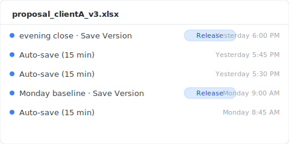
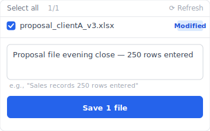

> 2:32 PM, Tuesday. Suzuki, a sales rep (**composite case**), opened `proposal_clientA_v3.xlsx` from OneDrive — the file he'd been working on since Monday. 19 hours and 28 minutes until tomorrow's 10 AM client pitch. The moment the file opened, the screen froze. The "Sales Records" sheet was empty. Tabs still there, column headers A through AZ still there, row numbers 1 to 250 still there. But every cell was blank. The linked "Quotes" sheet's totals column showed `#REF!` all the way down. The OneDrive sync indicator was a green check. Excel showed "1 other person is editing" in the top bar. Tanaka, the junior on the team, had opened the file during lunch.

Search "Excel data recovery" and you get a wall of recovery software ads. EaseUS, 4DDiG, Recoverit, iMyFone — all about scanning SSD sectors for disk-level recovery. But what actually happened wasn't a disk problem. A colleague deleted a sheet during collaborative editing, and that delete got pushed to the cloud. This is the record I put together, tracing this kind of incident minute by minute.

## 14:32: what happened on screen in that second

2:32:17 PM, Suzuki opened `proposal_clientA_v3.xlsx`. Excel loaded. He clicked the "Sales Records" sheet. Loading for 0.4 seconds, then completely white. Tabs present, column headers A to AZ present, row numbers 1 to 250 present. Every cell empty. Excel's top bar showed "1 other person is editing," with Tanaka's avatar next to it. 15 seconds before, Tanaka had been editing the file. What Suzuki was seeing was the cloud state from Tanaka's lunchtime session at 2:32 PM.

What actually happened:

- **Yesterday 17:50** — Suzuki entered 250 rows of client records into "Sales Records," closed the file.
- **Today 12:31** — Tanaka (junior) opened the file (Suzuki had pinged him about "tomorrow's pitch").
- **Today 12:46** — Tanaka right-clicked the "Sales Records" tab and chose "Delete Sheet" (misclick; later said "I thought I was deleting the test sheet").
- **Today 12:46:03** — Excel pushed the change to SharePoint, the deletion was reflected in the cloud as major version v8, AutoSave treated it as "normal editing."
- **Today 12:46–14:32** — For 1 hour 46 minutes, the file existed in the cloud as "Sales Records sheet, gone."
- **Today 14:32** — Suzuki opened the file; cloud state (sheet deleted) was applied.

Why didn't Excel warn him? Office 365 co-authoring uses last-writer-wins commit semantics for sheet-level deletes ([Microsoft Learn: Co-authoring in Office](https://learn.microsoft.com/en-us/office365/servicedescriptions/office-online-service-description/sharing-and-collaboration)). Sheet deletion counts as "normal editing"; no confirmation dialog.

But that's just the surface symptom.

## T+30 seconds: why OneDrive showed a green check

2:32:47 PM, Suzuki tried to make sense of things and first looked at the OneDrive icon. Green check. Everything synced, no errors. Really?

The OneDrive sync mark means "your local file matches the cloud." It does not mean "your data is intact." Tanaka deleted the sheet at 12:46:03, the deletion was pushed to the cloud, Suzuki's PC (in the office, hadn't been turned on until afternoon) was waiting to sync. The moment Suzuki opened the file at 14:32, OneDrive sync pulled the cloud state and overwrote the local file with the "sheet deleted" version. Green check: success.

"Synced" does not equal "your work is safe." In a collaborative editing context, other people's deletes also sync.

## T+5 minutes: what SharePoint version history didn't bring back

2:37 PM, Suzuki opened OneDrive in the browser, right-clicked the file, chose "Version History." The list appeared: v8 (12:46, Tanaka) / v7 (yesterday 17:50, Suzuki) / v6 (yesterday 17:30, Suzuki)...

He clicked "Restore v7."

A few seconds. The file re-downloaded. He checked "Sales Records" — 250 rows back. Relief.

Then he checked "Quotes." All `#REF!`. The reason: v7 restored the whole workbook, but at v7's point in time, the "Quotes" sheet formulas referenced cells in "Sales Records" as they were in v6. Formulas pointing to the sheet that v8 deleted still return `#REF!` even after restoring v7. SharePoint version history is a workbook-level snapshot, not per-sheet diff ([SharePoint version history limits](https://learn.microsoft.com/en-us/sharepoint/document-library-version-history-limits)). It records "sheet deletion" as a major version event, but it doesn't roll back the cascading formula damage from the deleted sheet.

Time lost so far: 3 hours 28 minutes. 15 hours 60 minutes until tomorrow's pitch.

## T+1 hour: closing Excel wipes the undo stack

3:32 PM, Suzuki gave up and closed Excel. He reopened it thinking "let me try restoring another version."

He noticed: Ctrl+Z doesn't work. "Undo" is greyed out. Excel's undo stack is per-session — close the file, and the entire undo history (your own actions, and the visible record of your collaborator's actions) resets. The editing session that could have undone Tanaka's sheet deletion disappeared at 14:46 when the file closed.

The undo stack lives in memory as a per-session structure, never persisted to file or cloud. This is a Microsoft Office-wide spec.

## T+24 hours: Time Machine captured the cloud state

The next morning at 9 AM, Suzuki remembered "the company Mac has Time Machine," and emailed IT. 30 minutes later: "Time Machine snapshots, yes, every hour, automatic."

He opened yesterday's 3 PM snapshot. He opened "Sales Records." Empty.

Why? Time Machine snapshots the local file state on the OneDrive sync folder ([Apple Support: Back up your files with Time Machine on Mac](https://support.apple.com/en-us/104984)). At 14:32, OneDrive had already overwritten the local file with the "sheet deleted" state. The 3 PM Time Machine snapshot captured what was on disk by then: the local file edition already tainted by cloud state. Time Machine recorded "the latest version that came down from the cloud," not the local editing history.

4 hours since the incident. Suzuki has restored nothing.

## Parallel timeline: what would happen at 14:32 if Keeply were on Suzuki's PC

If, in a parallel timeline, Keeply had been on Suzuki's PC, what would have happened at 14:32?

Keeply keeps independent snapshots in a local vault — separate path from OneDrive sync, separate storage. Keeply doesn't know about Office 365 co-authoring; precisely because it doesn't know, Tanaka's delete doesn't propagate into Keeply's vault.

In Suzuki's setup, Keeply auto-saves every 15 minutes in the background. Right after Suzuki closed the file at yesterday 17:50, Keeply's last auto-save at 18:00 captured: "Sales Records" with 250 rows, "Quotes" formulas all intact. Today at 12:46, Tanaka's delete happened on the cloud side; Suzuki's office PC was powered off, Keeply did nothing. At 14:32, Suzuki turned on his PC, OneDrive sync pulled the cloud state — but Keeply's vault lives on a separate path from OneDrive, untouched.

14:33, Suzuki opens Keeply:

1. In the left timeline, click yesterday's 18:00 auto-save of `proposal_clientA_v3.xlsx`
2. Click "Restore this version"
3. Keeply outputs to a new filename (`proposal_clientA_v3_RESTORED.xlsx`)

He opens the file: "Sales Records" 250 rows ✅, "Quotes" formulas ✅. Suzuki LINEs Tanaka: "What you were testing on — please redo from this new file. This one's the real one." 30 seconds.

Keeply auto-saves in the background (you choose the interval: 15, 30, or 60 minutes; default 30; Suzuki's machine is set to 15) + you can hit "Save Version" yourself at important moments + each snapshot lives in its own vault without overwriting the others. The whole flow goes nowhere near co-authoring or cloud sync — it's a parallel world on your local disk.

## Limits: three collaborative-edit losses Keeply also can't save

Keeply is not magic. In a collaborative editing environment, here are three situations Keeply also can't rescue.

1. **The file lives on a shared network drive, with no local copy on Suzuki's PC.** Keeply watches local files only — it doesn't see what others do on a shared drive. Shared drives need a separate Keeply mirror vault, run by the team.
2. **Tanaka logs into Suzuki's PC directly (e.g., remote desktop) and deletes the file.** Now the delete is a local event Keeply records. Restoring from the Keeply vault works, but at that moment the restore also pushes to the cloud, and remote sync gets complicated.
3. **The incident hour falls outside Keeply's auto-save sweet spot.** For example: 14:30 scheduled save, 14:32 incident, the 14:31 snapshot is too stale, or the 14:15 save captured the "Sales Records" sheet half-empty already. Hitting "Save Version" manually at important moments closes this blind spot.

The forensic record ends here. Preventing this kind of incident next time is a different conversation.

---

**Author**: [Ting-Wei Tsao](https://www.linkedin.com/in/ting-wei-tsao-b57480152), Founder of Keeply. Building your file management guardian.

## FAQ {#faq}

**Q. How does Keeply close the gap when collaborative editing wipes your data?**

A. By keeping the local vault separate from OneDrive, so edits on the cloud side don't directly touch your local storage. Keeply auto-saves in the background (15, 30, or 60 minute interval, your choice) + you can hit "Save Version" manually at important moments + each snapshot is kept in its own vault without overwriting the others. When a colleague deletes a sheet on the cloud side, that delete doesn't reach Keeply's vault. When an incident happens, open Keeply, pick the previous version, hit "Restore this version" — 30 seconds. The four layers above (OneDrive sync / SharePoint version history / Time Machine / recovery software) all depend on cloud state for post-event rescue and are particularly weak against collaborative-edit conflicts. Keeply is a pre-event defense layer decoupled from cloud state.

**Q. How do I recover lost Excel data?**

A. It depends. For a single-user Ctrl+S overwrite, use SharePoint version history (if major versions are still there) or Excel's built-in Version History button. For data deleted by someone else during collaborative editing, you can restore at the SharePoint workbook level, but cascading formulas need manual rebuilding. For local-only files with Windows Shadow Copy off, it's essentially unrecoverable.

**Q. Can I recover a sheet a colleague accidentally deleted during collaborative editing?**

A. SharePoint version history can restore at the workbook level, provided the pre-delete bundle was recorded as a major version. With AutoSave writing continuously, intermediate states don't always get logged individually. Other sheets with cascading formulas pointing at the deleted sheet will still show `#REF!` after restoring v7 — they need manual rebuilding. If you had a local snapshot layer in place before the incident (like Keeply), you could restore from the original untouched by the cloud-side delete.

**Q. Can I recover an Excel file I closed without saving?**

A. AutoRecover (default 10-minute interval) may keep "the most recent unsaved state." Open Excel and look under File → Info → Manage Workbook → Unsaved Workbooks. But AutoRecover temp files are auto-deleted the moment the file closes normally — close without checking and they're gone. Keeply runs in the background regardless of whether you save, so even after a close-without-save, the vault still has a recent state.

**Q. Can recovery software recover cell-level data?**

A. Almost never. Recovery software works at the disk-sector level to rescue "just-deleted bytes," assuming you're trying to bring back an entire deleted file. For a still-alive file with vanished cell data (collaborative delete or `#REF!` cascade), recovery software isn't structurally equipped. And on SSD + TRIM, even sector-level recovery is under 5% success ([NIST SP 800-88r1: Guidelines for Media Sanitization](https://nvlpubs.nist.gov/nistpubs/SpecialPublications/NIST.SP.800-88r1.pdf)). Collaborative-edit data loss is something recovery software can't solve by design — your only option is a local snapshot layer in place beforehand.

## Related

- 📚 Pillar: [File version management: the complete guide to why most tools miss it](/en/post/file-version-management-complete-guide/)
- 🔁 Sibling: [Excel overwrite recovery forensics: 9:14 Tuesday, what 4 layers retrieved](/en/post/excel-overwrite-postmortem/)
- 📊 Sibling: [Why Excel's version history button is greyed out: 4 conditions you don't meet](/en/post/excel-version-history-limits/)
- 🔄 Sibling: [Dropbox conflicted copy: 4 trigger scenarios](/en/post/dropbox-conflicted-copy/)

## Sources

1. [Microsoft Learn: Co-authoring in Office](https://learn.microsoft.com/en-us/office365/servicedescriptions/office-online-service-description/sharing-and-collaboration)
2. [SharePoint version history limits: Microsoft Learn](https://learn.microsoft.com/en-us/sharepoint/document-library-version-history-limits)
3. [Apple Support: Back up your files with Time Machine on Mac](https://support.apple.com/en-us/104984)
4. [NIST SP 800-88r1: Guidelines for Media Sanitization (SSD TRIM behavior)](https://nvlpubs.nist.gov/nistpubs/SpecialPublications/NIST.SP.800-88r1.pdf)
