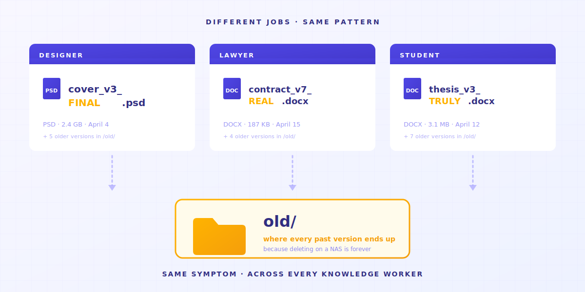
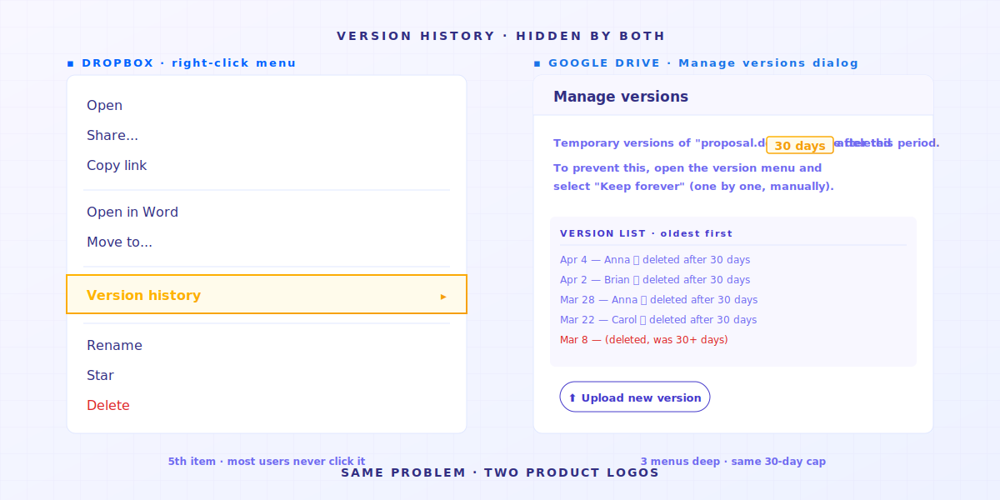
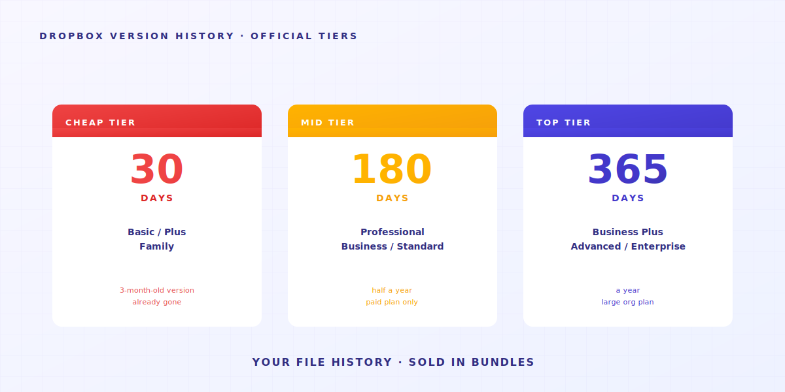
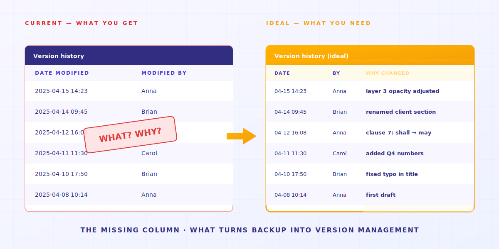
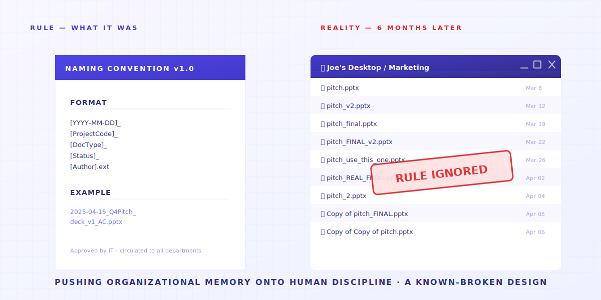

> It's not your discipline. Your tool wasn't designed for this.

Take three people.

**A** is a freelance designer. Desktop has `_v3_final_FINAL.psd`.
**B** works at a law firm. Drive has `contract_v7_clientcopy_2025-04-15.docx`.
**You**, reading this, might be looking at `thesis_chapter3_post-advisor_truly-final-v2.docx` right now.

Different jobs. Different filenames. **Same symptom**.

Not because they all have OCD. Because if you don't do this, **your files turn into a mess**. And on a NAS, deleted means gone for good. So you end up with an `old/` folder, parking every past edit.



---

> **TL;DR** —  Shared folders, Dropbox, and NAS drives **weren't designed to manage file history**. They have 4 structural gaps, and each one pushes the work back onto you. This article unpacks each one — and admits which Keeply solves and which it doesn't.

## Article map

1. [The "previous version" button never existed](#reason-1)
2. [The 30-day version history has fine print](#reason-2)
3. [Version history tells you when, not why](#reason-3)
4. [Naming conventions push memory onto people](#reason-4)
5. [When Keeply isn't the answer](#limitations)

---

## 1. The "previous version" button never existed {#reason-1}

You want yesterday's version of that design file.

Open Dropbox or Google Drive — everything's the latest. Version history is hidden three menus deep. You wouldn't know unless someone told you.



Open the company NAS — those messy version numbers up there are your version history.


**These tools were never designed to manage file history**.

What cloud drives care about most is making your files look identical across three devices.
That goal fights with "keep every old version".

So tools picked sync. **They don't show you the timeline of changes**.

> In 2015, UCSD linguistics PhD Will Styler lost his dissertation files. He had 7 different backup plans. Every single one failed. He wrote up the post-mortem for future grad students. The closing line: "Redundancy doesn't prevent stupidity." [Full incident](https://wstyler.ucsd.edu/posts/lost_dissertation_files.html)

→ Related: [Why your master's thesis on a single laptop is a gamble nobody warned you about](/en/post/thesis-single-point-of-failure/)

---

## 2. The 30-day version history has fine print {#reason-2}

Good. You found out Dropbox actually has version history. Relief?

Wait. The next bad news is on its way: **a 30-day cap**.



Translate to daily life: you want last quarter's client brief? Unless you're paying enterprise, **it's already gone**.

The 30-day limit isn't a technical constraint, it's a business decision — version history turned into a reason to upgrade.
(Keeply gives you file history that's free, forever.)

> April 2026, Hacker News. User julianozen posts: their dad overwrote a file that hadn't been touched in 2 years. Two days later, he tried to recover it — couldn't. Dropbox's reason: outside the 30-day retention window. julianozen's reaction: "That's not what 30-day history means." A reply from lazide: "Which is bonkers." [Full thread](https://news.ycombinator.com/item?id=47772260)

The 30-day window was designed for "I accidentally overwrote yesterday's file."
For "my client wants last quarter's pitch back next week" — **using the wrong tool rarely gets you what you want**.

→ Related: [The hidden cost of shared folders](/en/post/hidden-cost-shared-folders/)

---

## 3. Version history tells you when, not why {#reason-3}

Suppose you've solved the first two: history's on, 30 days is enough.
There's a deeper problem waiting.

Version history says "modified 2025-04-15 14:23".
**It doesn't tell you what changed at 14:23. It doesn't tell you why.**



For some jobs, that's fine. For others, it's lethal:

- **A designer** changed one layer's opacity to 30%. History says "modified". Doesn't say which layer.
- **A lawyer** changed a contract clause from "shall" to "may". One word. History says "modified". Doesn't say which word.
- **A grad student** changed "but this argument has limitations" to "this argument clearly stands" — from cautious to assertive. History says "modified". Doesn't say the meaning's been flipped.

> January 2025, Legal Cheek published an anonymous solicitor story: "I sent the wrong will to the wrong dead person's family as an enclosure as a trainee." The disaster wasn't "no version saved" — it was "didn't know which version was current." [Full story](https://www.legalcheek.com/2025/01/courtroom-etiquette-email-blunders-and-document-mix-ups-lawyers-share-their-most-embarrassing-mistakes/)

Here's where most people get it wrong.

**Backup means keeping the file.**
**Version management means keeping the file *plus* a record of what you changed and why.**

**Backup gives you the first. Management gives you the second.**

So you start cramming intent into filenames: `contract_v7_per_client_request_clause3.docx`.
The filename runs out of room. You open a spreadsheet. The spreadsheet can't keep up. You start a Slack channel.
**Eventually your "version management system" is filenames + a spreadsheet + Slack + your memory**. Any one piece fails, the whole thing tilts.
Three months later, you open your records and find your own past habits don't match your current ones.

---

## 4. Naming conventions push memory onto people {#reason-4}

After hitting all three problems above, every company does the same thing — **writes a 14-page naming convention PDF**.

Usually it looks like this:

```text
[YYYY-MM-DD]_[ProjectCode]_[DocType]_[Status]_[Author].ext
```

Very tidy.



Then six months later, nobody follows it.

Not because your coworkers are lazy.
**It's that we're trying to control a population of uncontrollable creatures, and the ending writes itself.**

> Asana forum, June 2023, a thread on "epic file-naming fails." Becky_Caday: "Multiple versions of the same file because someone didn't know they could open and edit the original — they just changed one word to all caps. `List 2.0` became `LIST 2.0`." Arndt_Dienstbier: "They were using whitespace for versioning" (multiple `Document.docx` files distinguished only by trailing spaces). [Full thread](https://forum.asana.com/t/share-your-epic-file-naming-fails-and-lets-laugh-together/462366)

Every team member, every save, has to remember + agree + have time to follow the rule. Any one of those fails, **congratulations — you've got another mess**.

Remembering a naming convention is something **a tool should just do**.
Not something to push onto every individual's discipline.

→ Related: [When the AutoCAD crew loaded the wrong version](/en/post/autocad-wrong-version-crew/)

---

## 5. When Keeply isn't the answer {#limitations}

We built Keeply to fill these 4 structural gaps.
But there are scenarios **where Keeply isn't the answer**:

- **Live collaborative meeting notes** → use Notion / Google Docs. Keeply is long-term version memory for individuals and small teams, not a real-time collaboration tool.
- **Video footage 50GB+** → use Frame.io / PostHaste. Keeply's version logic (recording differences each save) doesn't scale economically to large binary files.
- **Cross-organization legal signing** → use DocuSign / Adobe Sign. If a contract goes to 10 outside law firms, Keeply isn't in that compliance framework.

For the other 80% of knowledge-worker scenarios — **designers, paralegals inside law firms, accountants, grad students, PM teams, freelancers** — those 4 structural gaps will hit you.
That's what we're here for.

---

Back to the opening question: why does everyone who's used a shared folder end up inventing their own naming scheme?

Because **what they actually wanted was a clean structure, so they wouldn't make decisions on stale information**.
So they put versions into filenames, into spreadsheets, into memory.

Pushing organizational memory onto human discipline is a known-broken design.

**The question isn't how to enforce naming conventions better.
It's whether your tool can do that job for you.**

## Related articles

- **[Shared folder version problems: the 83-hour micro-panic tax](/en/post/hidden-cost-shared-folders/)** —— The real cost of shared folders isn't lost files — it's the daily defensive-naming tax everyone pays.
- **[Masters Thesis Version Control: The Diff You Forgot](/en/post/thesis-single-point-of-failure/)** —— Your thesis is one drive failure away from being gone, if you only have one copy.
- **[Why your crew keeps opening last week's AutoCAD drawing](/en/post/autocad-wrong-version-crew/)** —— The crew keeps getting the old CAD because the office got the new version and didn't tell the field.
- **[What the 3-2-1 backup rule doesn't cover in 2026](/en/post/3-2-1-backup-rule/)** —— 3-2-1 protects against disaster, not operator-error. Keeply builds 3-2-1 + version history into one tool.

---

> About the author: Ting-Wei Tsao, founder of Keeply.
> [LinkedIn](https://www.linkedin.com/in/ting-wei-tsao-b57480152/)
