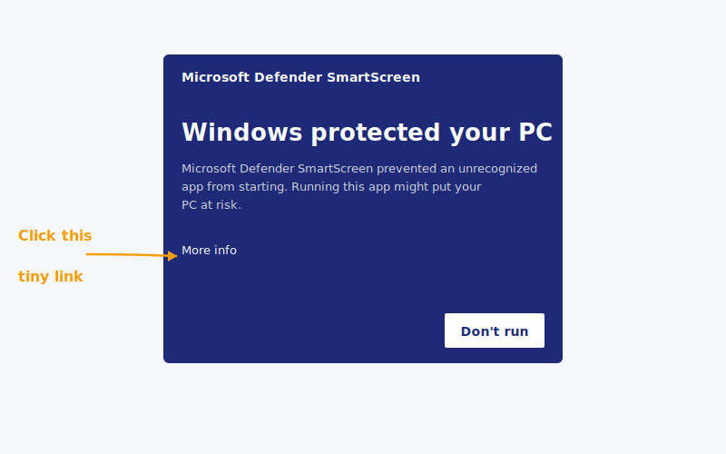
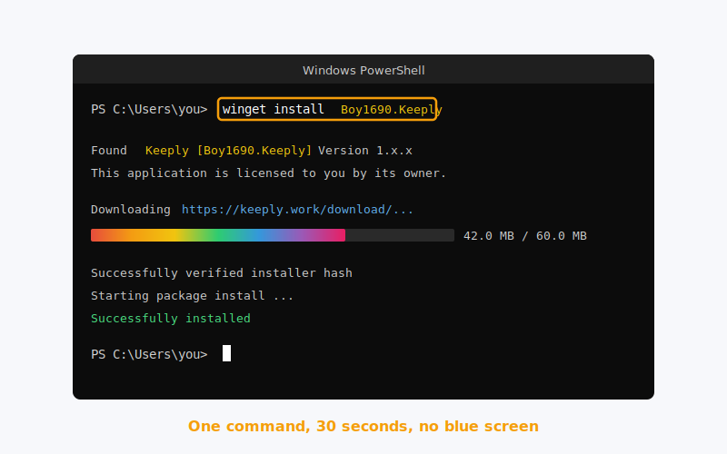
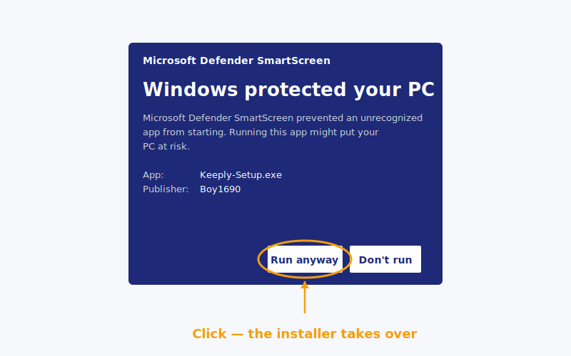
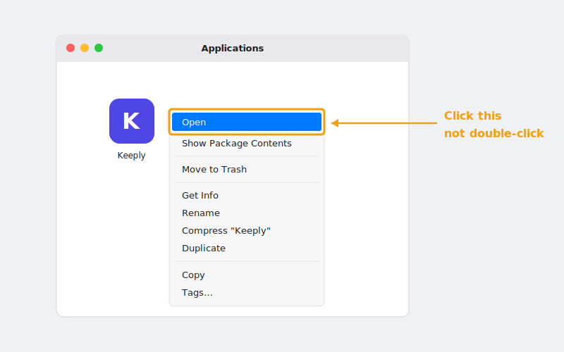
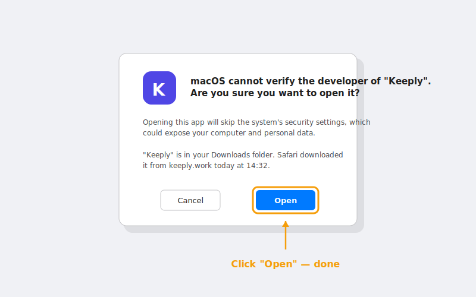

> "I double-clicked, the blue screen popped up, and I figured it was a virus and closed it."
>
>. A designer who'd just heard about Keeply, replying that same afternoon.

He's not the first. The blue screen on Windows probably stops more people than actually finish installing.

Here's the whole path from start to finish: **why the blue screen shows up → three cleaner ways to install → opening your first project right after**.

## Table of contents

1. [Why the blue screen shows up (it's not a Keeply problem)](#why-smartscreen)
2. [Three paths. Pick whichever fits you](#three-paths)
3. [Windows path 1: one winget command (recommended)](#path-winget)
4. [Windows path 2: download the .exe](#path-exe)
5. [macOS install: the right-click step you can't skip](#path-macos)
6. [After install: drop in your first project](#first-project)
7. [Stuck? 5 common errors](#troubleshoot)

## Why the blue screen shows up (it's not a Keeply problem) {#why-smartscreen}

That screen is called [SmartScreen](https://learn.microsoft.com/en-us/windows/security/operating-system-security/virus-and-threat-protection/microsoft-defender-smartscreen/). It doesn't decide "is this software malicious?". It decides "has enough people used this yet?".

Think of it this way: a new restaurant with no Google reviews isn't bad food. It's just food no one's rated yet.

SmartScreen treats new software the same way. It builds trust with **download volume + time**, and every new release goes through this observation period again. Keeply hits this every time it ships an update. None of it has to do with whether the software itself is safe.

So why does it scare people? Because the screen only gives you a giant "Don't run" button. To run anyway, you have to click a tiny link called **More info** off to the side. Visually it doesn't read as a notice. It reads as a wall.

But you don't have to deal with it. **Keeply is published in [Microsoft's winget package repo](https://github.com/microsoft/winget-pkgs)**, and that path doesn't trigger the warning at all.

So the point isn't how to bypass the warning. It's how to take a path where the warning never appears.



## Three paths. Pick whichever fits you {#three-paths}

| Path | Best if you | Time | Blue screen? |
| --- | --- | --- | --- |
| **A. winget command** (Windows) | don't mind pasting one line into PowerShell | 2 min | No |
| **B. Official .exe download** (Windows) | don't want to open a black terminal | 5 min | Yes. We'll walk you through it |
| **C. Official .dmg download** (macOS) | are on a Mac | 3 min | No, but right-click required |

Picked one? Jump to the matching section. Skip the others.

## Windows path 1. One winget command (recommended) {#path-winget}

**winget** is Windows' built-in "package manager". Basically a Microsoft Store but for the command line. It's been baked into Windows since version 10 1809. You don't need to install anything extra.

Open PowerShell (search "PowerShell" in the Start menu), paste this line, hit Enter:

```powershell
winget install Boy1690.Keeply
```



About 30 seconds and it's done. No blue screen. No "More info" fine print.

Why is this path so clean? Because to be listed in winget at all, Keeply has to pass [Microsoft's official review on GitHub](https://github.com/microsoft/winget-pkgs): they check installer source, file signatures, and installation behaviour. It only ships once everything passes.

Put differently: when you run that command, Microsoft has already done a round of vetting for you. SmartScreen's check is redundant on this path, so it just doesn't appear.

Short path and trust path, in one line.

## Windows path 2. Download the .exe {#path-exe}

Don't want to touch PowerShell? Fine. Go to keeply.work, click download, grab the `.exe`, double-click it.

The SmartScreen blue screen will pop up. **That's normal** ([why, see above](#why-smartscreen)). To proceed:

1. Click **More info** (the small underlined text on the warning)
2. A **Run anyway** button appears
3. Click it. The installer takes over from there.



The whole detour adds maybe 3 minutes. Most of it psychological, not actual clicks. From here on, this path and path 1 converge.

## macOS install. The right-click step you can't skip {#path-macos}

No blue screen on Mac. But you can't double-click on first launch ,  [macOS Gatekeeper](https://support.apple.com/en-us/102445) will block it.

Correct flow:

1. Download the `.dmg`, drag Keeply into your Applications folder
2. Open Applications, find Keeply
3. **Right-click → Open** (not double-click)

   

4. A dialog appears. Click "Open"

   

That's it. **Only the first launch needs this**. Double-click works normally afterwards.

Why the detour first time? Gatekeeper blocks double-click launch for any app it hasn't seen notarized. Right-click → Open is Apple's way of saying "I know what I'm installing, let me through".

This isn't a Keeply quirk. Every new Mac app that hasn't been on your machine before behaves the same way on first launch.

## After install. Drop in your first project {#first-project}

Installed isn't done. Your first project being protected the same day. That's done.

Open Keeply, hit **New project**, pick a folder you're actively working in.

**What to drop in first**: whatever you're holding right now that you can't afford to lose and that you keep editing. A pitch, a contract, a design file, a deck. Any of those work. Don't pick a folder you haven't touched in six months. That folder's value is in archiving, not in protection. Different story.

The first scan takes 1 to 2 minutes. After that, Keeply watches the folder in the background and **records versions automatically as you save**. No manual "checkpoint" button to press.

A made-up but typical example: a designer drops in their Q2 pitch folder right after install. First scan takes 2 minutes. Three days later, they realize they swapped a logo colour wrong last Saturday. Pulling the previous version from history takes 20 seconds.

People who use the first project on install day stick around far more than people who wait a week.

## Stuck? 5 common errors {#troubleshoot}

| Symptom | Fix |
| --- | --- |
| `winget` command not found | Means your Windows doesn't have App Installer yet. Use path 2 (download the .exe) instead. Don't fight it |
| Win 11 says "needs administrator" | Reopen PowerShell with **Run as administrator** |
| Mac says "cannot be opened because it is from an unidentified developer" | Right-click → Open (not double-click). See macOS section above |
| Company network blocks the download | Use the winget command instead. It goes through Microsoft's CDN and usually gets through |
| Installed but won't open | Restart once. Still nothing? Email [support@keeply.work](mailto:support@keeply.work) |

## The one thing to remember

One thing:

**The blue screen isn't a verdict. It's reputation still being built.**

You don't need to bypass the warning. You just need to take the winget path where the warning never shows up.

---

> About the author: Ting-Wei Tsao, founder of Keeply.
> [LinkedIn](https://www.linkedin.com/in/ting-wei-tsao-b57480152/)
