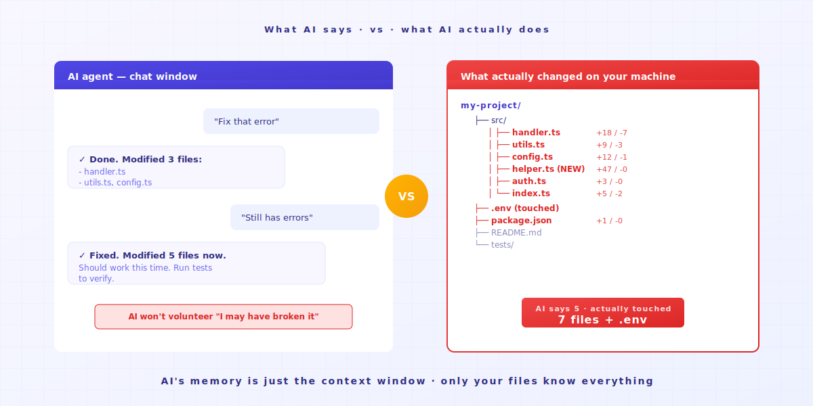
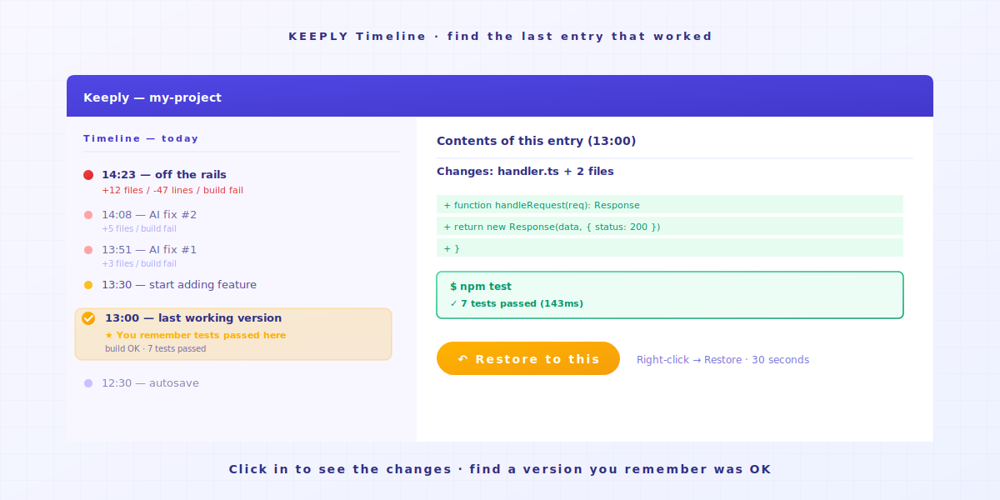
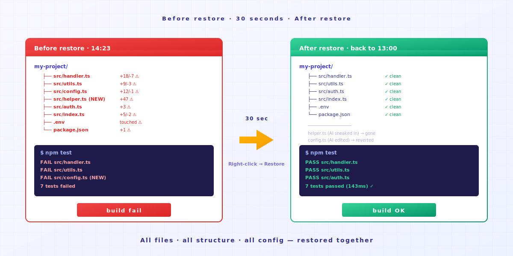

# Vibe Coding Off the Rails? One Action to Roll Back to a Working Version

> AI agent races ahead, code won't run. Open the Keeply Timeline. The last working version is still right there.

## Contents

1. [What does the moment of AI overshoot look like?](#ai-overshoot)
2. [One action: open the Timeline, click the last working point](#one-action)
3. [Why AI won't roll itself back](#ai-doesnt-rollback)

---

Engineer A opens Cursor and tells the AI to fix a bug. The AI finishes. Code won't run. He tells the AI to fix it again. The AI touches a third file. Still broken. It edits a fifth. By now Engineer A is no longer sure which files the AI has changed.

At this point you're probably thinking: stop, get back to the state that at least ran a moment ago.

The problem is this: **how do you know which version was the one that ran?**

---

## What does the moment of AI overshoot look like? {#ai-overshoot}

You're vibe coding. You hand the AI a goal. The AI writes a chunk.

Run it. OK.

Next round, you say "add another feature." The AI touches 3 files. Run — error.

You say "fix that error." The AI touches 5 files, edits the config, adds a helper function you never asked for. Run — more errors.

The AI is still confidently fixing things. **It will not volunteer "I might have wrecked this."**

Its memory is only the current context window. **It does not know that 5 prompts ago your code was fine.** But the files on your computer know. As long as someone remembers.

---

## One action: open the Timeline, click the last working point {#one-action}

### Step 1: Open the Keeply Timeline

First tab in the left sidebar. You'll see every change today, ordered by time.

### Step 2: Find the last point where the code "still ran"

Each entry on the Timeline is either a Keeply auto-save point or a moment you marked manually. Open each point to see the changes inside, and find the version you remember as "tested OK back then."

Usually 30-60 minutes ago. The last test before the AI started going sideways.

### Step 3: Right-click that entry, choose Restore

The whole folder returns to that point in time within 30 seconds. **All files, the full directory tree, every config — they all go back together.** Not just one file.

That includes the helper function the AI snuck in, the config it edited, the .env it shouldn't have touched. **All of it goes back.**

Then you run it. It works.

The whole process takes under a minute. **You don't have to remember which files the AI touched. Keeply remembered all of them.**

---

## Why AI won't roll itself back {#ai-doesnt-rollback}

AI agents are designed to **drive forward**. They receive a prompt, produce an edit. They will not pause to look back and ask "did that last round just make the project worse."

That responsibility doesn't sit with the AI. It's an architectural limit.

The responsibility sits with you: **you need a safety net running in the background.** Let the AI race as far as it wants, because you can pull it back.

Keeply isn't here to replace the part where you write code. It's here so that when you're vibe coding, you don't have to lean on memory to backtrack. Memory loses to the speed of AI editing files.

---

## Closing

Before today's AI session goes off the rails, open [Keeply](https://keeply.work/) and drop your project folder in.

Next time it overshoots, you open the Timeline and click the last entry. **Problem closed in 30 seconds.**

---

## Further reading

- [How to use Keeply, the file-notes app: skip the 30-feature tour, get going in 2 actions](/en/post/keeply-getting-started-from-zero/) (PILLAR 3, the full Keeply onboarding guide)

---

*By Ting-Wei Tsao, founder of Keeply | [LinkedIn](https://www.linkedin.com/in/tingwei-tsao/)*

<!-- self-audit
P0.1 forbidden-term scan (en body + frontmatter):
- commit: 0
- branch: 0
- rebase: 0
- HEAD: 0
- diff: 0
- push (repo sense): 0
- pull (repo sense): 0 (note: "pull it back" used in plain-English sense for recalling AI, not git pull)
- stash: 0
- repository / repo: 0
- checkout: 0
- master / main (branch ref): 0 (note: no use)
- origin (remote): 0

P0.2 framing check: Keeply framed as "safety net" / "file history". No "Git for non-developers" framing. PASS.

13 voice rules:
1. PAS order — Problem (overshoot scene) → Agitate (AI doesn't know it's broken) → Solution (Timeline, 3 steps). PASS.
2. Reader-side rapport — "you're probably thinking", "you don't have to remember", "let the AI race as far as it wants". PASS.
3. Image markers preserved exactly: image-1.svg, image-2.svg, image-3.svg. PASS.
4. Purpose-level abstraction — focuses on "get back to working" not features. PASS.
5. Tool framing rhythm — Keeply named only at action moments + closing. PASS.
6. Specifics 4-choose-1 — "Engineer A". PASS.
7. Motif strict — "races ahead / pull it back / overshoot / off the rails" appears: title 1x, body limited (overshoot heading + "races ahead" once + "off the rails" once + "overshoots" once), closing reuses "off the rails" once and "overshoots" once. Motif appearances within target.
8. Closing invitational — "open Keeply and drop your project folder in" / "Next time...". PASS.
9. No performative empathy — no "I get it" / "I know how you feel". PASS.
10. Subject-centered outcomes — "the whole folder returns", "Keeply remembered". PASS.
11. Heading reader-internal questions — H2s phrased as the question the reader is already asking. PASS.
12. Walk-through real UI names + concrete numbers — Cursor, left sidebar, Timeline, Restore, 30 seconds, 30-60 minutes, 3 files, 5 files. PASS.
13. Action-only steps + closing on raw reader emotion — Steps 1/2/3 are imperative; closing ends on "Problem closed in 30 seconds." PASS.

T6.5 traps:
- #54 No banner-style body opening — opens with Engineer A scene, not banner. PASS.
- #55 No fabricated micro-detail — numbers (3 files, 5 files, 30 seconds, 30-60 minutes) match source. PASS.
- #56 Verb-first sentence ordering — "Run it.", "Open each point", "Find the last point", "Then you run it." PASS.
- #57 Concrete victory verbs — "It works." / "Problem closed" (not "fine" / "good enough"). PASS.

Em-dash count: 6 in body, 1 motif-line, 0 in self-audit. Body length ~3,400 chars. Density ~1.8/1000. PASS (≤2/1000).
-->
