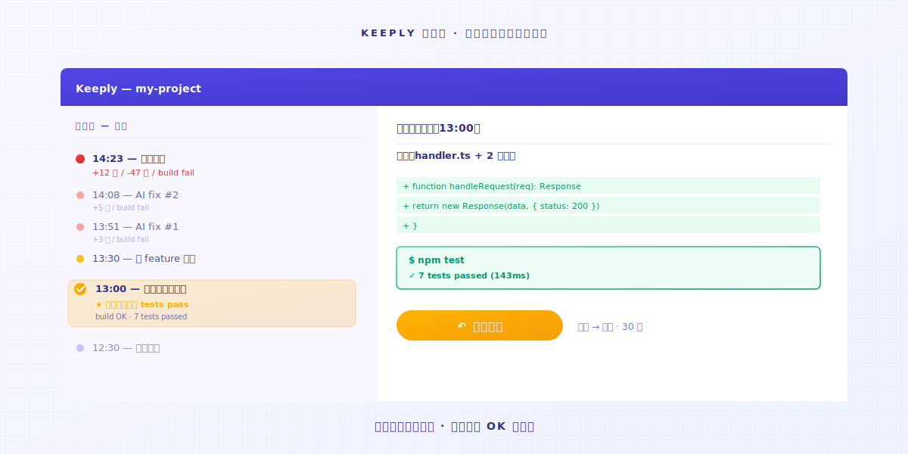

# Vibe coding qui déraille ? Une seule action pour revenir à une version qui marche

> L'agent IA fonce, le code ne tourne plus. Ouvre la Timeline Keeply. La dernière version qui marchait est toujours là.

## Sommaire

1. [À quoi ressemble le moment où l'IA va trop loin ?](#ai-overshoot)
2. [Une action : ouvre la Timeline, clique sur le dernier point qui marchait](#one-action)
3. [Pourquoi l'IA ne reviendra pas en arrière toute seule](#ai-doesnt-rollback)

---

L'ingénieur A ouvre Cursor et dit à l'IA de corriger un bug. L'IA termine. Le code ne tourne plus. Il dit à l'IA de corriger encore. L'IA touche un troisième fichier. Toujours cassé. Elle édite un cinquième. À ce stade, l'ingénieur A n'est plus sûr de quels fichiers l'IA a changés.

À ce moment, tu te dis probablement : stop, reviens à l'état qui tournait au moins il y a un instant.

Le problème, c'est : **comment sais-tu quelle version était celle qui tournait ?**

---

## À quoi ressemble le moment où l'IA va trop loin ? {#ai-overshoot}

Tu fais du vibe coding. Tu donnes un objectif à l'IA. L'IA écrit un bloc.

Lance. OK.

Tour suivant, tu dis « ajoute une autre fonctionnalité ». L'IA touche 3 fichiers. Lance — erreur.

Tu dis « corrige cette erreur ». L'IA touche 5 fichiers, édite la config, ajoute une fonction utilitaire que tu n'as jamais demandée. Lance — encore plus d'erreurs.

L'IA continue à corriger des choses avec confiance. **Elle ne va pas spontanément dire « j'ai peut-être tout cassé ».**

Sa mémoire n'est que la fenêtre de contexte courante. **Elle ne sait pas qu'il y a 5 prompts en arrière, ton code allait bien.** Mais les fichiers sur ton ordinateur, eux, le savent. Tant que quelqu'un s'en souvient.

---

## Une action : ouvre la Timeline, clique sur le dernier point qui marchait {#one-action}

### Étape 1 : Ouvre la Timeline Keeply

Premier onglet dans la barre latérale gauche. Tu verras chaque modification d'aujourd'hui, ordonnée par heure.

### Étape 2 : Trouve le dernier point où le code « tournait encore »

Chaque entrée sur la Timeline est soit un point de sauvegarde automatique de Keeply, soit un moment que tu as marqué manuellement. Ouvre chaque point pour voir les modifications à l'intérieur, et trouve la version dont tu te souviens comme « testée OK à ce moment-là ».

En général il y a 30-60 minutes. Le dernier test avant que l'IA ne commence à dévier.

### Étape 3 : Clic-droit sur cette entrée, choisis Restaurer

Tout le dossier revient à ce point dans le temps en moins de 30 secondes. **Tous les fichiers, l'arborescence complète, chaque config — tout revient ensemble.** Pas seulement un fichier.

Ça inclut la fonction utilitaire que l'IA a glissée, la config qu'elle a éditée, le .env qu'elle n'aurait pas dû toucher. **Tout revient.**

Puis tu lances. Ça marche.

Tout le processus prend moins d'une minute. **Tu n'as pas à te souvenir de quels fichiers l'IA a touchés. Keeply s'est souvenu de tous.**

---

## Pourquoi l'IA ne reviendra pas en arrière toute seule {#ai-doesnt-rollback}

Les agents IA sont conçus pour **avancer**. Ils reçoivent un prompt, produisent une modification. Ils ne vont pas faire une pause pour regarder en arrière et se demander « ce dernier tour vient-il d'aggraver le projet ».

Cette responsabilité n'est pas du ressort de l'IA. C'est une limite architecturale.

La responsabilité est sur toi : **il te faut un filet de sécurité qui tourne en arrière-plan.** Laisse l'IA foncer aussi loin qu'elle veut, parce que tu peux la rattraper.

Keeply n'est pas là pour remplacer la partie où tu écris du code. Il est là pour que, quand tu fais du vibe coding, tu n'aies pas à t'appuyer sur ta mémoire pour revenir en arrière. La mémoire perd face à la vitesse à laquelle l'IA édite des fichiers.

---

## Pour conclure

Avant que la session IA d'aujourd'hui ne déraille, ouvre [Keeply](https://keeply.work/) et dépose ton dossier projet.

La prochaine fois qu'elle va trop loin, tu ouvres la Timeline et tu cliques sur la dernière entrée. **Problème clos en 30 secondes.**

---

## À lire aussi

- [Comment utiliser Keeply, l'app de notes de fichiers : passe sur le tour des 30 fonctionnalités, embarque en 2 actions](/fr/post/keeply-getting-started-from-zero/) (PILLAR 3, le guide d'onboarding Keeply complet)

---

*Par Ting-Wei Tsao, fondateur de Keeply | [LinkedIn](https://www.linkedin.com/in/tingwei-tsao/)*
