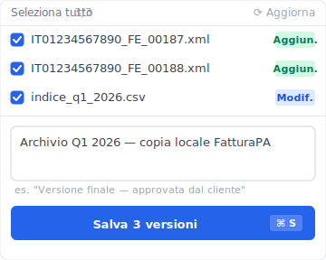
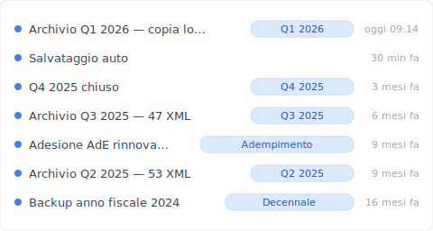

# Archiviazione fatture elettroniche: 3 strati per leggerle nel 2036

*Il certificato vale 10 anni. Il fornitore SaaS che lo emette, non sempre.*

Pensi di essere in regola: conservazione sostitutiva attiva, certificato emesso, fattura protocollata sul SdI. Poi il tuo gestionale viene acquisito — è già successo. Nel 2012 [TeamSystem ha acquisito Danea](https://www.crunchbase.com/acquisition/teamsystem-acquires-danea-soft--37db35aa); nel 2015 [ha comprato il 51% di Fatture in Cloud](https://www.crunchbase.com/acquisition/teamsystem-acquires-fatture-in-cloud--543911ac). Nel frattempo [Tecnoinvestimenti — oggi Tinexta, holding di InfoCert — si è quotata sull'AIM di Borsa Italiana nel 2014, ha cambiato nome nel 2018 e nel 2019 è passata al segmento STAR del mercato principale](https://it.wikipedia.org/wiki/Tinexta). Nel 2036, quando l'Agenzia delle Entrate ti chiederà una fattura del 2026, su quale piattaforma starà? Tu lo sai oggi?

La conservazione sostitutiva attiva non basta. Servono 3 strati che lavorano insieme. Vediamo perché il primo — quello che usi ogni giorno — è proprio il più fragile.

## La conservazione sostitutiva non garantisce che tu possa leggere il file nel 2036

Il certificato di conservazione sostitutiva attesta tre cose: l'autenticità del file al momento dell'archiviazione, l'integrità dei metadata, la marca temporale. Non attesta — perché non può — che tra dieci anni quel file sarà ancora accessibile dal tuo gestionale.

La cornice normativa è chiara. Il [DM 17 giugno 2014](https://www.agid.gov.it/sites/agid/files/2024-05/linee_guida_sul_documento_informatico.pdf), il [Codice dell'Amministrazione Digitale (D.Lgs. 82/2005)](https://www.agid.gov.it/sites/agid/files/2024-05/linee_guida_sul_documento_informatico.pdf) e le AgID Linee Guida sulla formazione e conservazione dei documenti informatici (in vigore dal 1° gennaio 2022) definiscono i requisiti tecnici della conservazione a norma: firma digitale qualificata, marca temporale, metadata strutturati, responsabile della conservazione nominato.

Quello che la norma **non** ti garantisce è la sopravvivenza del fornitore. Né l'esportabilità in un formato portabile se il SaaS chiude o cambia modello commerciale. Né l'accesso veloce ai documenti se cambi gestionale tre volte in dieci anni.

L'obbligo di conservare è chiaro: dieci anni dall'ultima registrazione, secondo [l'art. 2220 del Codice Civile](https://www.brocardi.it/codice-civile/libro-quinto/titolo-ii/capo-iii/sezione-iii/art2220.html) e l'art. 39 del [DPR 633/1972](https://www.gazzettaufficiale.it/eli/id/1972/11/11/072U0633/sg). E se nel frattempo è in corso un accertamento o un contenzioso, l'obbligo si estende fino alla definizione finale. Dieci anni minimi. Quindici reali, se ti va male.

Ed è qui che entra in gioco la consolidazione del mercato.

## Strato 1: il tuo gestionale SaaS (il più fragile)

Il tuo SaaS è lo strato più comodo e il più rischioso. Comodo perché archivia, firma e fatturazione vivono nello stesso posto. Rischioso perché negli ultimi dieci anni il mercato italiano è stato già rimescolato due volte, e il prossimo movimento di consolidazione è solo questione di tempo.

Guardiamo le tappe concrete. Nel gennaio 2012 [TeamSystem ha acquisito Danea](https://www.crunchbase.com/acquisition/teamsystem-acquires-danea-soft--37db35aa), software house padovana attiva nel mercato gestionale italiano. Nel settembre 2015 [TeamSystem ha acquisito il 51% di Fatture in Cloud](https://www.crunchbase.com/acquisition/teamsystem-acquires-fatture-in-cloud--543911ac), oggi con [oltre 580.000 clienti](https://www.fattureincloud.it/). Tecnoinvestimenti, holding di InfoCert — uno dei conservatori AgID-accreditati più usati in Italia — [si è quotata sull'AIM di Borsa Italiana nel 2014, ha assunto la denominazione Tinexta nel 2018 e nel 2019 è passata al segmento STAR](https://it.wikipedia.org/wiki/Tinexta). Tre tappe consolidate in sette anni che ridisegnano la mappa dei fornitori.

Quando il tuo fornitore cambia proprietà, succedono cose che il contratto originale non copriva. Il piano gratuito diventa a pagamento. L'export dell'archivio storico passa da self-service a ticket di supporto. Il formato proprietario interno cambia tra una versione e l'altra. E le fatture del 2019, dietro al login del vecchio gestionale, diventano sempre meno comode da recuperare.

> **Esempio rappresentativo · Esportazione archivio dopo cambio di proprietà**
>
> | Periodo fatture | Disponibilità | Formato di export |
> |:---|:---|:---|
> | 2024 (corrente) | ✓ Immediata | FatturaPA XML |
> | 2023 | ✓ Immediata | FatturaPA XML |
> | 2022 | ⏱ Richiesta in coda · 48-72 h | XML + meta CSV |
> | 2021 | ⚠ Funzionalità migrata al nuovo gruppo | Contatta assistenza |
> | 2020 e precedenti | ⚠ Servizio retroattivo terminato | Pacchetto a pagamento |
>
> *Pattern tipico osservato dopo un'acquisizione o un cambio di piano commerciale del gestionale SaaS. Il contratto originale spesso non prevedeva clausole di portabilità per archivi storici.*

Aggiungi un dettaglio che molti non sanno. Il [Sistema di Interscambio](https://www.fatturapa.gov.it/it/sistemainterscambio/cose-il-sdi/), gestito dall'Agenzia delle Entrate e operato tecnicamente da [Sogei S.p.A.](https://www.sogei.it/it/sogei-homepage/soluzioni/controllo-della-spesa/fatturazione-elettronica.html), **non è un archivio di lungo periodo**. Il SdI è un nodo di scambio: riceve la tua fattura, la valida, la consegna al cliente o la scarta. [Dal portale Fatture e Corrispettivi](https://www.agenziaentrate.gov.it/portale/aree-tematiche/fatturazione-elettronica/guida-fatturazione-elettronica/i-servizi-dell-agenzia-fe/consultazione-fatture-e-ricevute) i file completi delle fatture restano consultabili fino al 31 dicembre del secondo anno successivo alla ricezione; dopo restano solo i dati di sintesi, fino all'ottavo anno. Per la conservazione decennale serve qualcos'altro.

Esiste un'alternativa che non dipende dal mercato? Sì, ed è gratuita.

## Strato 2: il servizio gratuito dell'Agenzia delle Entrate (15 anni, ma…)

L'[Agenzia delle Entrate offre un servizio di conservazione a norma gratuito](https://www.agenziaentrate.gov.it/portale/aree-tematiche/fatturazione-elettronica/guida-fatturazione-elettronica/i-servizi-dell-agenzia-fe/servizio-conservazione-elettronica), valido 15 anni, con adesione triennale rinnovabile. Copre solo le fatture transitate via Sistema di Interscambio, e l'accesso ai documenti archiviati avviene attraverso il portale Fatture e Corrispettivi — non con ricerca a testo libero.

Quattro fatti concreti per inquadrarlo bene.

Primo, è effettivamente gratis. Nessun costo nascosto, nessun add-on da comprare per attivare l'archiviazione decennale.

Secondo, dura 15 anni. Cinque anni oltre il minimo obbligatorio dei 10 anni dal Codice Civile — un margine non da poco se nel frattempo arriva un accertamento.

Terzo, copre solo le fatture passate dal SdI. Le fatture estere transmesse via esterometro prima della transizione SdI con i tipi TD17/TD18/TD19, le fatture cartacee residuali, le note di credito gestite fuori canale: tutto questo non è dentro l'archivio gratuito AdE.

Quarto, l'adesione è triennale e si rinnova automaticamente salvo revoca esplicita. Controlla annualmente che la convenzione sia ancora attiva — un cambio di intermediario o una revoca involontaria può interrompere il flusso, e tu rischi di scoprirlo solo all'audit successivo.

I limiti reali stanno nell'uso quotidiano. Non puoi cercare per cliente o per importo se non passi dal portale AdE. La larghezza di banda e l'esperienza utente del portale rallentano vistosamente sugli archivi grandi. Dipendi dall'infrastruttura statale — manutenzioni programmate, cambi di API, restrizioni di accesso decise unilateralmente.

Resta un punto cieco: cosa c'è di tuo, sotto il tuo controllo diretto?

## Strato 3: la tua copia FatturaPA XML locale (l'unica che controlli)

L'unico strato sotto il tuo controllo diretto è la copia FatturaPA XML che scarichi e conservi tu. Stessa identica autenticità legale del file archiviato dal SaaS — basta firma CAdES-BES (`.xml.p7m`) o XAdES-BES (`.xml`) integra — ma vive su una macchina che decidi tu, in un formato standardizzato che l'Agenzia delle Entrate riconosce in eterno.

Una nota importante prima di proseguire. **Il formato legale unico in Italia è FatturaPA XML**, definito dalle [specifiche tecniche del SdI](https://www.fatturapa.gov.it/it/norme-e-regole/documentazione-fattura-elettronica/formato-fatturapa/). Non è PDF/A-3. Il PDF/A-3 è la strada del modello tedesco ZUGFeRD, dove il file ibrido contiene insieme il PDF leggibile e l'XML strutturato. In Italia il SdI scarta qualsiasi file non conforme alle specifiche FatturaPA — un PDF, anche se firmato e marcato temporalmente, viene considerato analogico, non elettronico. Quindi non confondere le strade: per le tue fatture italiane scarica l'XML originale, non il PDF di cortesia.

Sul controllo delle versioni di questa copia locale conviene investire un attimo di pensiero. Ogni FatturaPA XML che produci o ricevi è un file immutabile per definizione — la firma digitale lo blocca. Ma l'archivio in sé cresce, cambia struttura di cartelle, può venire spostato tra macchine quando aggiorni il PC del lavoro. Uno strumento di cronologia file installato sul tuo computer — non un altro SaaS in più — registra automaticamente ogni versione della cartella in cui salvi gli XML, ti fa tornare a qualsiasi punto del tempo, e non dipende da nessun fornitore esterno per ricostruire l'archivio.

Strumenti come [Keeply](https://keeply.work/) servono esattamente a questo: tenere un'istantanea locale immutabile della tua cartella fatture, indipendente dal gestionale che usi quest'anno. Quando l'anno prossimo cambierai SaaS, la tua copia FatturaPA XML rimane dov'è — sul disco che possiedi tu.

Concretamente, alla chiusura di ogni trimestre apri il pannello «Salva versione» di Keeply, contrassegni i nuovi file FatturaPA scaricati e scrivi una nota — l'archivio trimestrale è chiuso, con timestamp e cronologia:

Mesi dopo, quando il commercialista ti chiede «mi mandi le fatture del Q3 2025?» — apri la timeline di Keeply e ritrovi esattamente l'archivio chiuso a fine trimestre, senza dipendere dal portale del gestionale o dall'AdE:

> **In sintesi · perché servono tutti e tre**
>
> - **Strato 1 (SaaS)** risolve la praticità quotidiana — emissione, ricezione, firma in un solo posto.
> - **Strato 2 (Agenzia delle Entrate)** copre l'evoluzione del mercato — se il tuo fornitore esce di scena, il file è ancora dentro un'infrastruttura statale.
> - **Strato 3 (XML locale)** garantisce il controllo finale — anche se SaaS e portale AdE diventassero entrambi inaccessibili nel 2036, la tua copia firmata vive sul tuo disco.
>
> Nessuno dei tre basta da solo. Tutti e tre insieme costano zero euro in più: serve solo disciplina trimestrale.

Quanto rischi se questi tre strati non sono in piedi? Vediamo le cifre.

## Quanto costa sbagliare: le sanzioni del D.Lgs. 471/1997

Per l'irregolare tenuta della contabilità il [D.Lgs. 471/1997](https://www.studiosalvetta.it/la-sanatoria-delle-violazioni-formali-e-la-mancata-conservazione-nei-termini-delle-e-fatture/) prevede sanzioni da 1.000 a 8.000 euro. Se nell'anno l'evasione contestata supera i 50.000 euro, le sanzioni raddoppiano: da 2.000 a 16.000 euro. Più grave del numero in sé è il rischio collaterale.

Tre cifre concrete da tenere a mente.

La forbice standard è 1.000-8.000 euro. La forbice raddoppiata sopra i 50.000 di evasione contestata è 2.000-16.000 euro. In caso di irregolarità formale di scarsa rilevanza che non abbia ostacolato il controllo, la sanzione minima si riduce fino alla metà — ovvero 500 euro.

Ma la cifra che pesa davvero non è la multa diretta. È l'**accertamento induttivo**: quando l'Agenzia delle Entrate non riesce a ricostruire le scritture, può ricalcolare il fatturato in via presuntiva — partendo da consumi, costi del personale, scontrini, qualsiasi dato collaterale. Per una PMI questo significa un'imposta dovuta calcolata su un fatturato stimato che spesso supera quello reale. La sanzione contabile è il sintomo. L'accertamento induttivo è la malattia.

Ma non serve a tutti questa architettura — vediamo quando NON basta.

## Per chi non basta: PA, contenzioso, audit ricorrenti

I 3 strati funzionano per la maggior parte delle PMI italiane. Non bastano in tre casi specifici: pubblica amministrazione, contenzioso tributario aperto, audit AgID ricorrenti.

La pubblica amministrazione che esternalizza la conservazione deve usare un conservatore qualificato AgID-accreditato. La lista ufficiale dei [conservatori qualificati](https://conservatoriqualificati.agid.gov.it/?page_id=464&lang=en) include nomi come InfoCert, Aruba PEC, Namirial — tutti soggetti a vigilanza AgID. Se sei una PA o un fornitore in convenzione con una PA, il servizio gratuito dell'AdE non basta come unica copertura per quel perimetro.

Il contenzioso tributario aperto estende l'obbligo. Se hai un accertamento contestato e ricorri davanti alla Corte di Giustizia Tributaria, l'obbligo decennale si estende fino alla definizione finale del giudizio — possono diventare 12, 14 o più anni di retention attiva, a seconda della durata del procedimento. In quel caso lo strato 1 (SaaS) è il più esposto, perché il fornitore non ha alcun obbligo legale di seguirti per quel periodo.

Le aziende con audit AgID ricorrenti — trade B2B ad alta frequenza, settori regolamentati — hanno bisogno di un conservatore qualificato dedicato. [Aruba PEC è AgID-accreditato dal gennaio 2015](http://www.datamanager.it/2015/01/aruba-pec-diventa-conservatore-accreditato-presso-agid/); altri operatori qualificati offrono livelli di servizio dedicati alle aziende strutturate. Se sei in questa categoria, integri lo strato 1 con un conservatore qualificato pagato — non lo sostituisci con quello gratuito AdE.

## Cosa fare lunedì mattina: una checklist concreta

Quattro azioni, ordine di priorità reale.

**1. Verifica l'adesione al servizio gratuito dell'Agenzia delle Entrate.** Entri su Fatture e Corrispettivi, cerchi "Conservazione" sotto i servizi disponibili, vedi se l'adesione è attiva e scopri la data di scadenza triennale. Se non è attiva, l'attivazione si fa nello stesso portale in cinque minuti. Se è attiva ma scade fra meno di sei mesi, segnati il rinnovo adesso, non a maggio prossimo. Questa è la prima copertura legale gratuita ed è incredibilmente sottoutilizzata.

**2. Scarica le tue FatturaPA XML originali ogni trimestre.** Dal portale del tuo gestionale o direttamente da Fatture e Corrispettivi, esporti gli XML del trimestre appena chiuso. Non i PDF di cortesia — gli XML firmati. Sono questi gli unici file che mantengono valore legale identico a quello dell'archivio del fornitore.

**3. Tieni una copia locale, su una macchina che possiedi, non solo la schermata del SaaS.** Una cartella sul tuo computer, replicata su un disco esterno o NAS aziendale. Aggiungi sopra uno strumento di cronologia file come [Keeply](https://keeply.work/) per avere ogni nuova fattura registrata come versione tracciabile automaticamente — senza dipendere da nessun fornitore esterno e senza altri abbonamenti da rinnovare.

**4. Annota la data di rinnovo dell'adesione AdE nel calendario aziendale.** Triennale significa che il 2026 diventa 2029. Mettilo sul calendario condiviso del commercialista, non solo sul tuo. Le scadenze fiscali non si dimenticano da soli.

L'obiettivo non è la perfezione burocratica. È che nel 2036 — quando l'Agenzia delle Entrate ti chiederà una fattura del 2026 — tu sappia esattamente dove cercarla, in che formato, su quale dispositivo. Senza dover aprire un ticket di supporto al gestionale di turno.

---

*Ting-Wei Tsao — fondatore di Keeply. [LinkedIn](https://www.linkedin.com/in/ting-wei-tsao-b57480152)*
