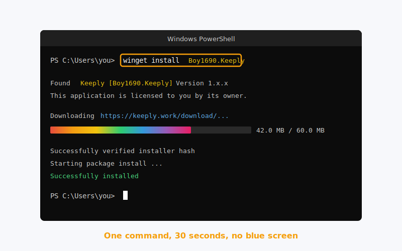
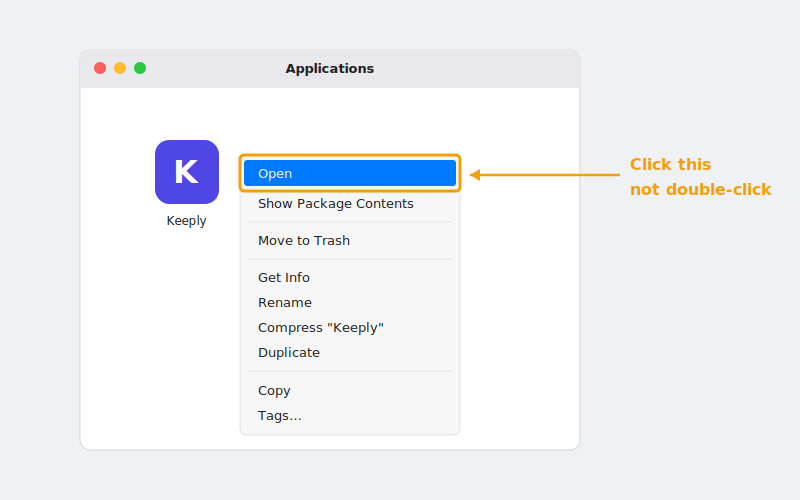

> "Ho fatto doppio click, è apparsa la schermata blu e ho pensato che fosse un virus, così l'ho chiusa."
>
>. Una designer che aveva appena sentito parlare di Keeply, mi ha risposto quello stesso pomeriggio.

Non è la prima. La schermata blu su Windows probabilmente ferma più persone di quante ne completino l'installazione.

Ecco l'intero percorso dall'inizio alla fine: **perché compare la schermata blu → tre modi più puliti per installare → aprire il tuo primo progetto subito dopo**.

## Indice

1. [Perché compare la schermata blu (non è un problema di Keeply)](#why-smartscreen)
2. [Tre percorsi. Scegli quello che ti si addice](#three-paths)
3. [Windows percorso 1: un solo comando winget (consigliato)](#path-winget)
4. [Windows percorso 2: scarica il .exe](#path-exe)
5. [Installazione macOS: il passaggio col tasto destro che non puoi saltare](#path-macos)
6. [Dopo l'installazione: aggiungi il tuo primo progetto](#first-project)
7. [Bloccato? 5 errori comuni](#troubleshoot)

## Perché compare la schermata blu (non è un problema di Keeply) {#why-smartscreen}

Quella schermata si chiama [SmartScreen](https://learn.microsoft.com/en-us/windows/security/operating-system-security/virus-and-threat-protection/microsoft-defender-smartscreen/). Non decide "questo software è dannoso?". Decide "abbastanza persone l'hanno già usato?".

Pensala così: un nuovo ristorante senza recensioni Google non vuol dire cibo cattivo. È solo cibo che nessuno ha ancora valutato.

SmartScreen tratta il software nuovo allo stesso modo. Costruisce fiducia con **volume di download + tempo**, e ogni nuova release passa di nuovo per questo periodo di osservazione. Keeply ci sbatte ogni volta che rilascia un aggiornamento. Niente di tutto questo ha a che fare con la sicurezza del software in sé.

E allora perché spaventa le persone? Perché la schermata ti dà solo un enorme pulsante "Non eseguire". Per eseguire comunque, devi cliccare un piccolo link chiamato **Ulteriori informazioni** di lato. Visivamente non si legge come un avviso. Si legge come un muro.

Ma non devi affrontarlo. **Keeply è pubblicato nel [repository di pacchetti winget di Microsoft](https://github.com/microsoft/winget-pkgs)**, e quel percorso non innesca affatto l'avviso.

Quindi il punto non è come aggirare l'avviso. È come prendere un percorso dove l'avviso non compare mai.


## Tre percorsi. Scegli quello che ti si addice {#three-paths}

| Percorso | Adatto se | Tempo | Schermata blu? |
| --- | --- | --- | --- |
| **A. Comando winget** (Windows) | non ti dispiace incollare una riga in PowerShell | 2 min | No |
| **B. Download .exe ufficiale** (Windows) | non vuoi aprire un terminale nero | 5 min | Sì. Ti guidiamo noi |
| **C. Download .dmg ufficiale** (macOS) | sei su un Mac | 3 min | No, ma serve il tasto destro |

Scelto uno? Vai alla sezione corrispondente. Salta le altre.

## Windows percorso 1. Un solo comando winget (consigliato) {#path-winget}

**winget** è il "package manager" integrato di Windows. In pratica un Microsoft Store ma per la riga di comando. È incorporato in Windows fin dalla versione 10 1809. Non devi installare nulla in più.

Apri PowerShell (cerca "PowerShell" nel menu Start), incolla questa riga, premi Invio:

```powershell
winget install Boy1690.Keeply
```



Circa 30 secondi e hai finito. Niente schermata blu. Niente righe in piccolo dell'"Ulteriori informazioni".

Perché questo percorso è così pulito? Perché per essere elencato in winget, Keeply deve passare la [revisione ufficiale di Microsoft su GitHub](https://github.com/microsoft/winget-pkgs): controllano la sorgente dell'installer, le firme dei file e il comportamento di installazione. Esce solo quando tutto passa.

In altre parole: quando esegui quel comando, Microsoft ha già fatto un giro di verifica per te. Il controllo di SmartScreen è ridondante su questo percorso, quindi semplicemente non compare.

Percorso breve e percorso di fiducia, in una sola riga.

## Windows percorso 2. Scarica il .exe {#path-exe}

Non vuoi toccare PowerShell? Va bene. Vai su keeply.work, clicca su download, prendi il `.exe`, fai doppio click.

Comparirà la schermata blu di SmartScreen. **È normale** ([perché, vedi sopra](#why-smartscreen)). Per procedere:

1. Clicca **Ulteriori informazioni** (il piccolo testo sottolineato sull'avviso)
2. Compare un pulsante **Esegui comunque**
3. Cliccalo. Da lì in poi prende il sopravvento l'installer.


L'intera deviazione aggiunge forse 3 minuti. La maggior parte è psicologica, non click effettivi. Da qui in poi, questo percorso e il percorso 1 convergono.

## Installazione macOS. Il passaggio col tasto destro che non puoi saltare {#path-macos}

Niente schermata blu su Mac. Ma non puoi fare doppio click al primo avvio ,  [Gatekeeper di macOS](https://support.apple.com/en-us/102445) lo bloccherà.

Flusso corretto:

1. Scarica il `.dmg`, trascina Keeply nella cartella Applicazioni
2. Apri Applicazioni, trova Keeply
3. **Tasto destro → Apri** (non doppio click)

   

4. Compare una finestra di dialogo. Clicca "Apri"

   

Tutto qui. **Solo il primo avvio richiede questo**. Il doppio click funziona normalmente dopo.

Perché la deviazione la prima volta? Gatekeeper blocca l'avvio col doppio click per qualsiasi app di cui non abbia visto la notarizzazione. Tasto destro → Apri è il modo di Apple di dire "so cosa sto installando, fammi passare".

Non è una particolarità di Keeply. Ogni nuova app Mac che non sia mai stata sulla tua macchina si comporta allo stesso modo al primo avvio.

## Dopo l'installazione. Aggiungi il tuo primo progetto {#first-project}

Installato non vuol dire fatto. Il tuo primo progetto protetto in giornata. Quello è fatto.

Apri Keeply, clicca **Nuovo progetto**, scegli una cartella su cui stai attivamente lavorando.

<!-- TODO: 替換為真實截圖 keeply-add-project.png（Keeply「新增專案」對話框） -->

**Cosa mettere dentro per primo**: qualunque cosa tu abbia in mano in questo momento che non ti puoi permettere di perdere e che continui a modificare. Una pitch, un contratto, un file di design, una presentazione. Qualsiasi di questi va bene. Non scegliere una cartella che non hai toccato da sei mesi. Il valore di quella cartella è nell'archiviazione, non nella protezione. Storia diversa.

La prima scansione richiede da 1 a 2 minuti. Dopo, Keeply osserva la cartella in background e **registra le versioni automaticamente mentre salvi**. Nessun pulsante "checkpoint" da premere a mano.

Un esempio inventato ma tipico: una designer aggiunge la sua cartella della pitch del Q2 subito dopo l'installazione. La prima scansione dura 2 minuti. Tre giorni dopo, si accorge di aver scambiato male un colore del logo sabato scorso. Recuperare la versione precedente dalla cronologia richiede 20 secondi.

Le persone che usano il primo progetto nel giorno dell'installazione restano molto più di quelle che aspettano una settimana.

## Bloccato? 5 errori comuni {#troubleshoot}

| Sintomo | Soluzione |
| --- | --- |
| Comando `winget` non trovato | Significa che il tuo Windows non ha ancora App Installer. Usa il percorso 2 (scarica il .exe). Non lottare contro |
| Win 11 dice "richiede l'amministratore" | Riapri PowerShell con **Esegui come amministratore** |
| Mac dice "non può essere aperto perché proviene da uno sviluppatore non identificato" | Tasto destro → Apri (non doppio click). Vedi sezione macOS sopra |
| La rete aziendale blocca il download | Usa il comando winget. Passa per la CDN di Microsoft e di solito riesce a passare |
| Installato ma non si apre | Riavvia una volta. Ancora niente? Scrivi a [support@keeply.work](mailto:support@keeply.work) |

## L'unica cosa da ricordare

Una cosa:

**La schermata blu non è un verdetto. È la reputazione che è ancora in costruzione.**

Non devi aggirare l'avviso. Devi solo prendere il percorso winget dove l'avviso non compare mai.

---

> Sull'autore: Ting-Wei Tsao, fondatore di Keeply.
> [LinkedIn](https://www.linkedin.com/in/ting-wei-tsao-b57480152/)
