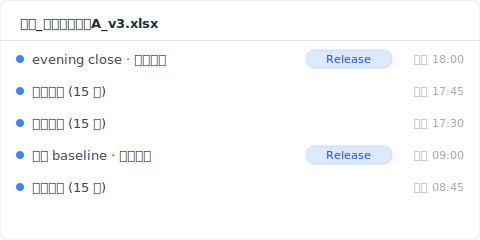
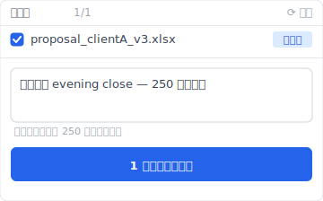

> 14 時 32 分。火曜日の午後。営業の鈴木さん（**合成例**）が、月曜から準備していた「提案_クライアントA_v3.xlsx」を OneDrive から開いた。明日 10 時の提案ミーティングまで残り 19 時間 28 分。ファイルが開いた瞬間、画面が止まった。Sheet「販売実績」が空。タブはあるけど、セルは全部白。連動していた Sheet「見積もり」の合計欄も `#REF!` で全滅。OneDrive の同期マークは緑のチェック。Excel の上に小さく「他 1 人が編集中」と表示されていた。昼休みに後輩の田中さんがファイルを開いていた、らしい。

「エクセル 復元 データ」で検索すると、復元ソフト広告がずらりと並ぶ。EaseUS、4DDiG、Recoverit、iMyFone。みんな SSD を scan して disk sector から復旧する話をする。だが本当に起きていたのは、disk の問題ではなかった。共同編集中に同僚が Sheet を 1 つ削除した、それが cloud に push されただけ。私はこの種の事故を分単位で追ったレポートをまとめた。今日その記録を共有する。

## 共同編集で Sheet が消えた瞬間に画面で起きたこと

14 時 32 分 17 秒、鈴木さんが「提案_クライアントA_v3.xlsx」を開く。Excel が起動し、Sheet「販売実績」をクリック。画面は読み込み中、0.4 秒後、完全に白。Sheet タブは残っている、列ヘッダーも A から AZ まで揃っている、行番号も 1 から 250 まで。ただセルは全部 empty。Excel の上部に「他 1 人が編集中」表示、その隣に同僚 田中さん（後輩）のアバター。15 秒前まで、田中さんがこのファイルを開いていた。鈴木さんが見ているのは、田中さんが昼休みに編集していた瞬間 14 時 32 分の cloud state そのものだった。

事故の細部：

- **昨日 17:50**：鈴木さん、Sheet「販売実績」に 250 行のクライアント実績を入力、ファイルを閉じる。
- **今日 12:31**：田中さん（後輩）、ファイルを開く（鈴木さんから「明日提案」とメンションされた）。
- **今日 12:46**：田中さん、Sheet「販売実績」を右クリック、「シートの削除」をクリック（誤操作、本人後談「テスト用の Sheet を削除したつもりだった」）。
- **今日 12:46:03**：Excel が SharePoint に push、Sheet 削除が cloud に反映、削除が メジャーバージョン v8 として記録される、AutoSave がそれを「正常な編集」として扱う。
- **今日 12:46〜14:32**：その間 1 時間 46 分、ファイルは cloud 側に「Sheet 販売実績 なし」の状態で存在。
- **今日 14:32**：鈴木さんが開く、cloud state（Sheet 削除済）が反映される。

なぜ Excel は警告しないか。Office 365 共同編集の commit semantics は last-writer-wins for sheet-level deletes（[Microsoft Learn: Co-authoring in Office](https://learn.microsoft.com/en-us/office365/servicedescriptions/office-online-service-description/sharing-and-collaboration)）。Sheet 削除は「正常な編集操作」として扱われる、確認ダイアログは出ない。

だが、これは表面的な症状にすぎない。

## OneDrive 同期マークが緑のままだった理由

14 時 32 分 47 秒、鈴木さんが状況を理解しようとして、まず OneDrive アイコンを見た。緑のチェック。すべて同期済、エラーなし。本当に？

OneDrive の同期マークは「ローカルファイルが cloud と一致している」状態を示す。それは「データが壊れていない」ではない。田中さんが Sheet を削除した 12:46:03、その削除は cloud に反映、鈴木さんの PC（事務所、夕方まで未起動）には反映待ち。14:32 鈴木さんがファイルを開く瞬間、OneDrive sync engine が cloud state を pull、ローカルファイルを「Sheet 削除済」状態に上書き。緑チェック表示：成功。

つまり「同期されている」イコール「あなたの作業が安全」ではない。ましてや共同編集中は、他人の delete も同期される。

## SharePoint バージョン履歴で復元しても #REF! が残る理由

14 時 37 分、鈴木さんがブラウザで OneDrive を開き、ファイルを右クリック、【バージョン履歴】を選ぶ。リストが表示される：v8（12:46、田中さん）/ v7（昨日 17:50、鈴木さん）/ v6（昨日 17:30、鈴木さん）...

【v7 に戻す】をクリック。

数秒待つ。ファイルが再ダウンロードされる。Sheet「販売実績」を確認、250 行のデータが戻ってきた。安堵。

だが、Sheet「見積もり」を確認。`#REF!` が全滅。原因：v7 復元したのは workbook 全体だけど、v7 時点では Sheet「見積もり」は v6 時点で参照していた「販売実績」のセルを指していた。v8 で削除された Sheet を参照する formula は、v7 復元後も `#REF!` を返す。SharePoint バージョン履歴は workbook-level スナップショット、per-sheet diff ではない（[SharePoint version history limits](https://learn.microsoft.com/en-us/sharepoint/document-library-version-history-limits)）。Sheet 削除という event を「主要版本」として記録するが、deleted-sheet cascade の formula 影響まで巻き戻すわけではない。

**復元後の cascade formula 修復手順**：

1. 復元された Sheet「販売実績」を確認（250 行のデータが戻っている）
2. Sheet「見積もり」を開く → `#REF!` が大量に出ている
3. formula bar で参照先 cell address を 1 つずつ書き換え
4. cell 数が多い場合は VLOOKUP / XLOOKUP で一括置換も検討

ここまでで失われた時間：3 時間 28 分。明日の提案まで残り 15 時間 60 分。

## Excel を閉じると Ctrl+Z で undo できなくなる仕様

15 時 32 分、鈴木さんが諦めて Excel を一度閉じた。再度開いて「もう一度バージョン復元してみよう」と思った。

ここで気づく：Ctrl+Z が効かない。「直前の操作を元に戻す」が grayed out。Excel の undo stack は per-session、ファイルを閉じた瞬間、すべての undo history（自分の操作も、共同編集相手の操作の表示も）リセット。田中さんの Sheet 削除を「undo」できるはずだった編集セッションは、ファイルが閉じた 14:46 にすでに消えていた。

undo stack は memory 上の per-session 構造、ファイルにも cloud にも persistent されない。これは Microsoft Office 全製品共通の仕様。

## Time Machine で前日のバージョンを救えなかった理由

翌日朝 9 時、鈴木さんが「会社の Mac には Time Machine があるはず」と気づいて、IT 部に依頼。返答は 30 分後：「Time Machine スナップショット ありますよ、毎時自動」。

15 時の スナップショット を確認。Sheet「販売実績」を開く、空。

なぜか。Time Machine は OneDrive 同期フォルダ上のローカル file state を スナップショット する（[Apple Support: Back up your files with Time Machine on Mac](https://support.apple.com/en-us/104984)）。14:32 時点で OneDrive がファイルを「Sheet 削除済」状態に上書きしていた。15:00 の Time Machine スナップショット に映ったのは、すでに cloud state に染まったローカル file edition。Time Machine が記録したのは「cloud から落ちてきた最新版」、本機での編集 history ではない。

事故から 4 時間。鈴木さんはまだ何も復元できていない。

## Keeply で共同編集データ消失から復元する方法

もしも、別の世界線で鈴木さんの PC に Keeply が入っていたら、14 時 32 分のあの瞬間、何が起きていたか？

Keeply は本機保管庫に独立スナップショットを持つ。OneDrive sync とは別の経路、別のストレージ。Keeply は「Office 365 共同編集」を知らない、だから知らずに、田中さんの delete も自分の保管庫には反映しない。

鈴木さんの設定では、Keeply は 15 分間隔で背景自動保存。昨日 17:50 鈴木さんがファイルを閉じた直後、18:00 に Keeply が最後の 自動保存：「販売実績」250 行入り、「見積もり」formula 全部正常。今日 12:46 田中さんの delete はその cloud 側で発生、鈴木さんの PC は事務所で電源 off、Keeply は何もしない。14:32 鈴木さんが PC を起動、OneDrive sync が cloud state を pull、だが Keeply の保管庫は OneDrive とは別、影響なし。

14 時 33 分、鈴木さんが Keeply を開く：

1. 左タイムラインで「提案_クライアントA_v3.xlsx」昨日 18:00 の 自動保存 版を選ぶ
2. 「このバージョンを復元」をクリック
3. Keeply は別ファイル名（`提案_クライアントA_v3_RESTORED.xlsx`）で出力

ファイルを確認、「販売実績」250 行 ✅、「見積もり」formula ✅。鈴木さんが田中さんに「テスト中のはこのファイルからやり直して、こっちが本物」と LINE。30 秒。

Keeply はバックグラウンドで自動保存（間隔は 15 / 30 / 60 分から選択、デフォルト 30 分；鈴木さんの設定は 15 分）+ 節目で「儲存版本」ボタンを手動で押せる + 各スナップショットは独立保管庫に上書きせず保存。共同編集や cloud sync を一切経由しない、本機 disk 上の別世界。

## Keeply でも救えない 3 種類の共同編集データ消失

Keeply は万能ではない。共同編集環境で、Keeply も次の 3 ケースは救えない。

1. **対象ファイルが共有ネットワークドライブ上にあり、鈴木さんの PC にローカルコピーが存在しない場合**。Keeply は本機にあるファイルしか watch しない。共有ドライブ専用は team 側に Keeply 鏡像保管庫を別途構築する必要。
2. **田中さんが鈴木さんの PC から直接編集（リモートデスクトップ等）してファイルを削除した場合**。本機イベントとして Keeply に取り込まれる、削除を取り消すのは Keeply の保管庫からの復元、その瞬間 cloud にも push される、リモート同期されると複雑。
3. **事故発生からこの 1 時間が「Keeply 自動保存の sweet spot 外」だった場合**。例えば 14:30 設定で 自動保存、14:32 事故、14:31 の最後 スナップショット が古すぎる、または 14:15 の保存が「販売実績」を一部空にしたまま閉じていた、というケース。手動「儲存版本」を節目で押す習慣で防ぐ。

事故報告書はここで終わる。次にこの種の事故が起きないようにする話は、また別の機会に。

---

**著者**：[Ting-Wei Tsao](https://www.linkedin.com/in/ting-wei-tsao-b57480152)、Keeply 創業者。ファイル管理守護神を作っている人。

## よくある質問 {#faq}

**Q. Keeply は共同編集衝突によるデータ消失をどう補いますか？**

A. 本機保管庫を OneDrive と独立させて、cloud 側の編集が本機ストレージに直接反映されない構造にする。Keeply はバックグラウンドで自動保存（15 / 30 / 60 分間隔から選択）+ 節目で「儲存版本」ボタンを手動で押す + 各スナップショットは保管庫に独立保存。同僚が cloud 側で Sheet を削除しても、その削除は Keeply の保管庫まで到達しない。事故時に Keeply を開いて前のバージョンを選んで「復元」、30 秒で完了。前述の 4 層（OneDrive 同期 / SharePoint バージョン履歴 / Time Machine / 復元ソフト）はどれも cloud-state に依存する事後救援、共同編集衝突に弱い。Keeply は cloud-state から切り離された事前防御層。

**Q. Excel で消えたデータを取り戻す方法は？**

A. ケース次第。単独編集で Ctrl+S 上書きした場合は SharePoint バージョン履歴（メジャーバージョンが残っていれば）または Excel 内部「バージョン履歴」ボタン。共同編集中に他者がデータを削除した場合は SharePoint workbook-level スナップショット から復元できるが、cascade formula は再構築が必要。本機にしか存在しないファイルで Windows shadow copy が ON でない時はほぼ無理。

**Q. 共同編集中に同僚が誤って Sheet を削除した、復元できますか？**

A. SharePoint バージョン履歴から workbook-level で復元は可能、ただし削除直前の bundle が「主要版本」として記録されていることが前提。AutoSave で連続的に書き込まれた状態だと中間 state が個別に残らないことがある。cascade formula を参照していた他 Sheet は v7 復元後も `#REF!` が残るため、formula 手動再構築が必要。事故発生前に本機 スナップショット を持つ層（Keeply のような）があれば、cloud 側 delete に汚染されない原本から復元できる。

**Q. 保存せずに閉じた Excel ファイルは復元できますか？**

A. オートリカバリ機能（既定 10 分間隔）で「保存していない最近の状態」が残っている可能性。Excel を開いて「ファイル → 情報 → 未保存のブック」から確認。ただし正常に閉じた瞬間にオートリカバリ temp ファイルが消えるため、ファイル名を確認なしで閉じてしまうとそれで終了。Keeply は user の保存操作と無関係に背景で自動保存するため、未保存 close でも保管庫に直近の state が残る。

**Q. Excel ファイル復元ソフトでセル単位のデータを復元できますか？**

A. ほぼ不可能。復元ソフトは disk sector レベルで「削除直前のバイト」を救う設計、削除されたファイル全体の復活が前提。生きているファイル内のセル単位データ消失（共同編集 delete や formula `#REF!` cascade）には対応していない。SSD + TRIM 環境では disk sector recovery 自体も成功率 < 5%（[NIST SP 800-88r1: Guidelines for Media Sanitization](https://nvlpubs.nist.gov/nistpubs/SpecialPublications/NIST.SP.800-88r1.pdf)）。共同編集データ消失は、復元ソフトでは構造的に解けない問題、事前に本機 スナップショット 層を持つしかない。

## 関連記事

- 📚 Pillar: [ファイルバージョン管理完全ガイド：5 つの理由でほとんどのツールが対応できない](/ja/post/file-version-management-complete-guide/)
- 🔁 Sibling: [Excel 上書き 復元の現場検証：9:14 火曜、4 層で何が間に合ったか](/ja/post/excel-overwrite-postmortem/)
- 📊 Sibling: [Excel バージョン履歴ボタンが灰色の 4 つの条件](/ja/post/excel-version-history-limits/)
- 🔄 Sibling: [Dropbox 衝突の副本：4 種類の触発シナリオ](/ja/post/dropbox-conflicted-copy/)

## 資料來源

1. [Microsoft Learn: Co-authoring in Office](https://learn.microsoft.com/en-us/office365/servicedescriptions/office-online-service-description/sharing-and-collaboration)
2. [SharePoint version history limits: Microsoft Learn](https://learn.microsoft.com/en-us/sharepoint/document-library-version-history-limits)
3. [Apple Support: Back up your files with Time Machine on Mac](https://support.apple.com/en-us/104984)
4. [NIST SP 800-88r1: Guidelines for Media Sanitization (SSD TRIM behavior)](https://nvlpubs.nist.gov/nistpubs/SpecialPublications/NIST.SP.800-88r1.pdf)
