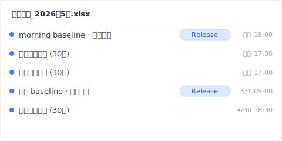
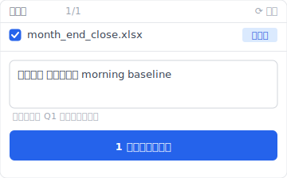

> 9 時 14 分、火曜日。月末締めの「月次決算_2026年5月.xlsx」が、たった一度の上書き保存で消えた。経理担当の田中さん（**合成例**）が気づいたのは、9 時 16 分にファイルを閉じようとした瞬間だった。Ctrl+Z は効かない。さっき閉じたから。自動回復 フォルダは空。OneDrive の同期マークは緑のチェック。何の警告も出ていない。何も。

これは「Excel 上書き 復元」で検索した時、ほとんどの記事が教えてくれない話だ。Microsoft 公式は機能を説明する、復元ソフトベンダーはセールスする、操作 tips ブログは「方法 1 / 方法 2 / 方法 3」をリストする。だがどれも、その事故が起きた瞬間から 30 日後までに、各層の救援窓がいつ・なぜ閉じたかを分単位で追ったものではない。本文は私が整理したその記録だ。

## 9:14：その瞬間に起きたこと {#h2-1-the-incident}

9 時 14 分 3 秒、田中さんは「月次決算_2026年5月.xlsx」で上書き保存（Ctrl+S）を実行した。その操作で消えたのは、前日 18 時に保存した「正しい売上集計シート」を含むファイル全体。自動回復 には残らない、OneDrive の同期マークは緑、Excel は何のダイアログも出さない。Microsoft の設計上、これは「正常な操作」だった。

事故の細部はこうだ。9:14:03 Ctrl+S → Excel が新しいバイトストリームを `xlsx` ファイルに書き込む。9:14 過ぎ、OneDrive sync engine が変更を検出し、cloud 側へ push を始める。十数秒以内に cloud 側で前日 18:00 のバージョンが上書きされる。9:16 田中さんがファイルを閉じる。この瞬間に 自動回復 ファイル（あれば）が自動削除される。9:23 翌週分のシートを開こうとして、別タブの計算結果が空になっていることに気づく。

なぜ何の警告も出ないか。Microsoft Office の save semantics 設計上、上書き保存は destructive な操作として扱われない。「保存」ボタンは常に「現在の状態を確定する」操作であり、「前の状態と置き換える」と認識されない。これは仕様であって、bug ではない。

で、ここから何が起きたか。

## T+0〜十数秒：OneDrive AutoSave のレース・コンディション {#h2-2-onedrive-autosave}

OneDrive AutoSave が ON の Excel で上書き保存をした瞬間、ローカル変更が cloud に sync されるまで数秒から十数秒の窓がある。その窓のうちに別端末で同じファイルを開くか、ネット切断するか、cloud 側の version history を呼び出せば前のバージョンを救える可能性がある。だが田中さんはこのことを知らない。9 時 14 分の十数秒後、cloud のバージョンは上書きされた。

OneDrive の sync interval は network condition と file size 次第で変動する（[Microsoft Learn: Sync files with OneDrive in Windows](https://support.microsoft.com/en-us/office/sync-files-with-onedrive-in-windows-615391c4-2bd3-4aae-a42a-858262e42a49)）。AutoSave がもたらす「常時 cloud と一致」の安心感は、上書き事故では逆方向に働く。SharePoint Online の version history は最大 500 主要バージョンを自動保存する（[SharePoint version history limits](https://learn.microsoft.com/en-us/sharepoint/document-library-version-history-limits)）。だがそれは「sync 完了したバージョンが履歴に残る」話で、「事故直前のバージョンが必ず履歴に残っている」とは別の話だ。

田中さんのケースで救援可否を分けたのは「9 時 13 分の状態が明示的な save 点として version history に残っていたか」だった。残っていれば SharePoint の「バージョン履歴」から戻せる。残っていなければ、ここで終わる。だがこれは、まだ始まりに過ぎない。

## T+15分：「以前のバージョン」が空だった理由 {#h2-3-previous-versions-empty}

9 時 29 分、田中さんは Excel の「ファイル → 情報 → バージョン履歴」を開いた。表示は「使用可能なバージョンはありません」。OneDrive sync は確かに動いていた、AutoSave も ON だった、なのに空。理由は単純で、「以前のバージョン」と SharePoint version history は別物だからだ。

Windows エクスプローラで右クリックして出る「以前のバージョン」は、Windows shadow copy（VSS）に依存する。Microsoft 365 個人版や Business 標準構成では shadow copy が常時 ON ではない。OneDrive 同期フォルダ内のファイルでさえ、shadow copy 提供は OneDrive sync 機能とは独立して動く。

Excel 内部の「バージョン履歴」ボタンは SharePoint Online の API を呼ぶ。これは sync 完了したバージョン群を表示するが、AutoSave で連続的に上書きされたファイルの中間状態は「主要バージョン」として認識されない場合がある。本機 Excel ファイル（OneDrive 外）の場合は、そもそも SharePoint version history が存在しない。

田中さんの会社は OneDrive for Business だった。SharePoint 側を直接開いて履歴を見たら、9 時 14 分の上書き直前のバージョンが残っていなかった。AutoSave による細かい save が直前数分間連続し、9 時 13 分時点の意図的な save 点がそもそも作られていなかった。

## T+24時間：Time Machine の 1 時間間隔 {#h2-4-time-machine-gap}

翌日 9 時 14 分、田中さんは IT 部の同僚から「Time Machine で前日分を救えるかも」と教わる。だが Apple Time Machine の default スナップショット interval は 1 時間（[Apple Support: Back up your files with Time Machine on Mac](https://support.apple.com/en-us/104984)）。9:14 に消えた、9:15 に sync 完了、10:00 に Time Machine スナップショット — その スナップショット に映っているのは、すでに上書きされた後のファイルだった。10 時の スナップショット は事故 46 分後に撮られた死体写真だった。

なぜ multi-tool defense（Office 自動回復 / OneDrive version history / Time Machine）が同じ事故で全滅するか。理由は、それぞれが数十分以上の time-gap を持っているからだ。自動回復 は「Excel がクラッシュ中に救援する」目的、interval default 10 分。OneDrive sync は「cloud と最終状態を一致させる」目的、interval は network 次第で数秒〜十数秒。Time Machine は「定期 スナップショット で過去を遡る」目的、interval default 1 時間。3 層すべてが、9 時 14 分から 9 時 16 分の 2 分間に起きた事故の前後の状態を、別々の理由で取り損ねた。

ここまでで失われた時間：14 時間 46 分。

## T+30日：復元ソフトが何も持ってこなかった理由 {#h2-5-recovery-software}

30 日後、田中さんはデータ復元ソフトの年間サブスクリプションを購入した。SSD を scan しても、9:14 以前のバイトはどこにもなかった。

なぜか。Windows と macOS の SSD は TRIM コマンドを実行して、削除された / 上書きされたセクターを即座に物理的にゼロクリアする。「上書き直後の disk sector scanning」が機能するのは HDD 時代の話で、2025 年の SSD では物理的に書き直されていない記号が存在しない（[NIST SP 800-88r1: Guidelines for Media Sanitization](https://nvlpubs.nist.gov/nistpubs/SpecialPublications/NIST.SP.800-88r1.pdf) — SSD TRIM behavior section）。

復元ソフトベンダーが宣伝する高い成功率の前提条件は、削除直後 + HDD + ファイルシステム未上書き。業務 PC が今 SSD であることを考えると、上書きが起きた瞬間に物理的に救援不可能だ。これは EaseUS / Recoverit / iMyFone / AOMEI 全部に共通する物理限界で、software 選択の問題ではない。

田中さんがサブスクリプション料金を払って得たのは、確証だった。もう戻ってこないという確証。

## 別の世界線：その PC に Keeply が入っていたら 9:14 に何が起きていたか {#h2-6-keeply-counterfactual}

もし田中さんの PC に Keeply が入っていたら、9:14 の事故時点で既にローカルに「2026/05/17 18:00 morning baseline」というバージョン名のスナップショットが存在していた。Keeply は 30 分ごとの自動取り込みと、ユーザーが Excel を閉じる前に「儲存版本」ボタンを押した手動スナップショットを、ローカルの隔離保管庫に重ね書きせず保存する。9 時 14 分の Ctrl+S は Excel 内部の話で、Keeply の保管庫には届かない。

9 時 14 分 16 秒、田中さんが「あ、消した」と気づいた瞬間：

1. Keeply のアプリを開く
2. 左タイムラインで「月次決算_2026年5月.xlsx」の前日 18:00 バージョンを選ぶ
3. 「このバージョンを復元」を押す

復元先は別ファイル名（`月次決算_2026年5月_RESTORED_5-17.xlsx`）で保管庫から取り出される。原ファイルは上書きされない。田中さんが内容確認後、原ファイルに置き換える。所要時間：30 秒。

Keeply は git 用語を使わない。UI は「バージョン履歴」「儲存版本」「復元」のみ。あなたが理解する必要があるのは「30 分おきに勝手にスナップショットが取られている」と「節目では自分でも『儲存版本』ボタンを押せる」の 2 つだけだ。

## 限界：Keeply もこの 3 種類の上書きには間に合わない {#h2-7-limits}

Keeply は万能ではない。3 つのケースでは Keeply もこの事故を救えない。

1. **Keeply 導入から 30 分未満で起きた事故**。最初の自動取り込みがまだ動いていない。導入直後は朝イチで手動「儲存版本」を一度押す習慣で防げる。
2. **共有ネットワークドライブ上の Excel ファイル**。Keeply はクライアント PC 配置で、network drive 上の他者編集を監視しない。共有ドライブ用は別 Keeply インスタンスを team 側に立てて mirror 構成にする必要がある。
3. **Excel が開いている間に別端末で起きた cloud 側の上書き**。Keeply はあなたの PC のローカル変更を取り込む。同僚が同じ SharePoint ファイルを別 PC で上書きしたケースは、SharePoint 側 version history に頼るしかない。

事故報告書はここで終わる。次に起きないようにする話は、私の別の記事で続ける。

---

**著者**：[Ting-Wei Tsao](https://www.linkedin.com/in/ting-wei-tsao-b57480152)、Keeply 創業者。檔案管理守護神を作っている人。

## よくある質問 {#faq}

**Q. Excel で上書き保存した後、元に戻せますか？**

A. ケース次第。OneDrive for Business 同期かつ事故前に明示的な save 点があれば SharePoint version history から戻せる。本機 Excel ファイル（OneDrive 外）の場合、Windows shadow copy が ON かつ SSD でない時のみ部分的に可能。事故から時間が経つほど成功率は下がる。

**Q. Excel オートリカバリで前のバージョンを復元できますか？**

A. オートリカバリは「Excel がクラッシュ中の救援」用。正常終了したファイルでは 自動回復 ファイルが自動削除される。上書き保存して閉じた後の復元はできない。

**Q. Excel ファイル復元ソフトで上書きされたファイルは戻りますか？**

A. SSD + TRIM 環境では物理的に困難（NIST SP 800-88r1 参照）。HDD 環境 + 上書き直後 + ファイルシステム未上書きの 3 条件揃った場合のみ可能性がある。業務 PC は SSD が主流のため、現実的には期待できない。

**Q. OneDrive で同期した Excel ファイルの古いバージョンを開く方法は？**

A. OneDrive を browser で開く → 該当ファイルを右クリック → 「バージョン履歴」。Excel 内部の「バージョン履歴」ボタンより SharePoint 側を直接見るほうが正確な履歴を表示する。

**Q. Time Machine で 1 時間以内の Excel 上書きを救えますか？**

A. Default 1 時間 スナップショット interval では救えない。Time Machine 設定を「Local スナップショット more frequent」にカスタマイズするか、手動 スナップショット を撮る習慣がある場合のみ可能。多くの企業配布 Mac は default 設定のまま。

## 関連記事

- 📚 Pillar: [ファイルバージョン管理完全ガイド: 5 つの理由でほとんどのツールが対応できない](/ja/post/file-version-management-complete-guide/)
- 🔁 Sibling: [上書き 復元の限界：自動回復 が消えた後でも間に合う方法](/ja/post/recover-overwritten-file/)
- 📊 Sibling: [Excel バージョン履歴ボタンが灰色の 4 つの条件](/ja/post/excel-version-history-limits/)

## 資料來源

1. [Microsoft Learn: Sync files with OneDrive in Windows](https://support.microsoft.com/en-us/office/sync-files-with-onedrive-in-windows-615391c4-2bd3-4aae-a42a-858262e42a49)
2. [SharePoint version history limits: Microsoft Learn](https://learn.microsoft.com/en-us/sharepoint/document-library-version-history-limits)
3. [Apple Support: Back up your files with Time Machine on Mac](https://support.apple.com/en-us/104984)
4. [NIST SP 800-88r1: Guidelines for Media Sanitization (SSD TRIM behavior)](https://nvlpubs.nist.gov/nistpubs/SpecialPublications/NIST.SP.800-88r1.pdf)
