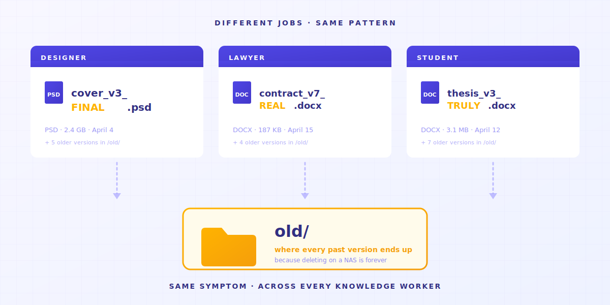
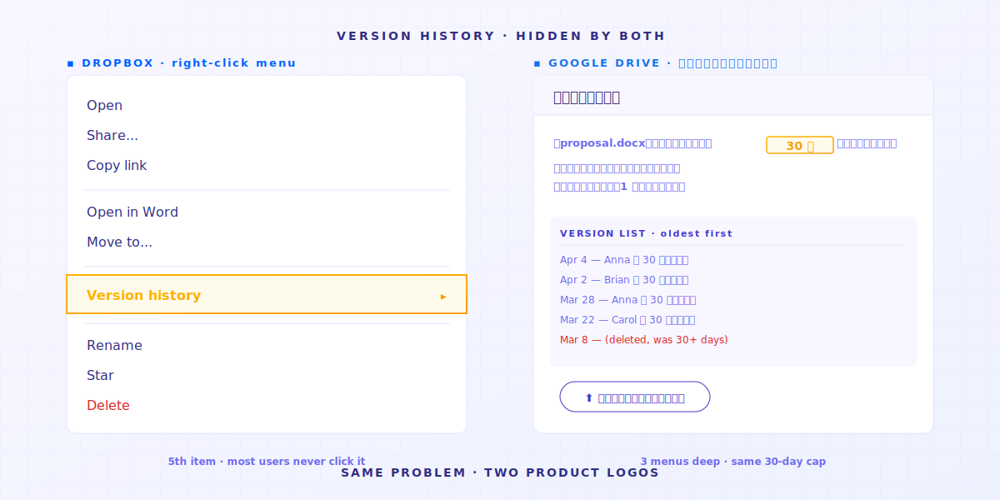
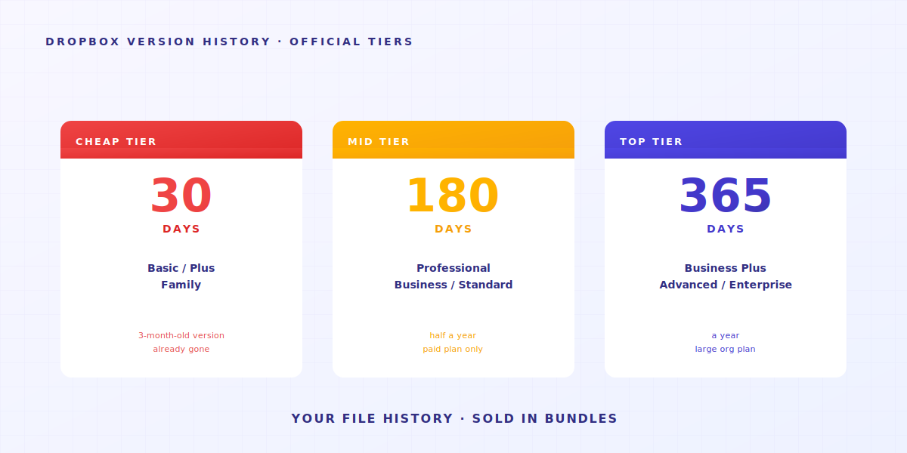
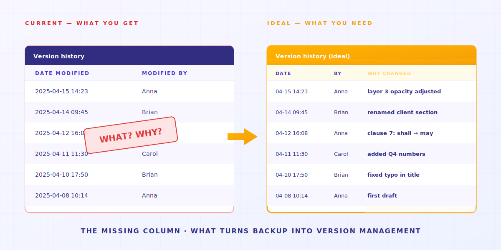
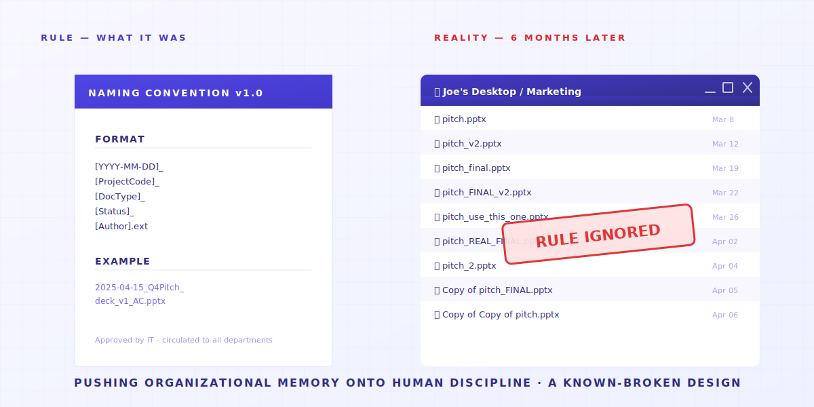

> あなたが規律不足なのではない。あなたのツールが、そう設計されていないだけ。

A さんはフリーランスのデザイナー。デスクトップに `_v3_final_FINAL.psd` がある。
B さんは法律事務所のパラリーガル。ハードディスクに `契約書_v7_クライアント版_2025-04-15.docx` がある。
そして画面の向こうのあなた。今まさに `論文_第3章_指導後_本当の最終版_v2.docx` を開いているかもしれない。

違う職業、違うファイル名、**同じ症状**。

別に強迫症があるわけじゃない。
ただ、こうしないと**ファイル構造がぐちゃぐちゃになる**。しかも NAS に保存している場合、削除したらもう戻せない。
だからよく、過去の編集を「とりあえず置いておく」用の `old/` フォルダがある。



---

> **TL;DR** — 共有フォルダ・Dropbox・NAS——これらのツールは、**もともとファイル履歴を管理するために設計されていない**。4 つの構造的な穴があり、それぞれが本来ツールがやるべき仕事をあなたに押し付けている。本記事は一つずつ解いていく。そして Keeply が何を埋め、何を埋めないかも正直に書く。

## 目次

1. [「前のバージョン」ボタンが、そもそも存在しない](#reason-1)
2. [30 日のバージョン履歴には条件がある](#reason-2)
3. [バージョン履歴は「いつ」を教えるが、「なぜ」を教えない](#reason-3)
4. [命名規則は、組織の記憶を人間の規律に押し付ける](#reason-4)
5. [境界——Keeply が答えではない場面](#limitations)

---

## 1. 「前のバージョン」ボタンが、そもそも存在しない {#reason-1}

昨日のバージョンのデザインファイルを探したい。

Dropbox か Google Drive を開く。全部最新のファイル。バージョン履歴はメニュー 3 階層の奥。誰かに教えられないと、わからない。



会社の NAS を開く。そこにある雑然とした番号群こそが、あなたのバージョン履歴だ。


**この種のツールは、もともとファイル履歴を管理するために設計されていない**。

クラウドストレージが一番大事にしているのは、3 台のパソコンで同じファイルが見える同期。
これは「すべての旧バージョンを保存する」とぶつかる。

だからツールは同期を選んだ。**履歴の流れを見せない**。

> 2015 年、UCSD 言語学博士の Will Styler は、論文ファイルを失った。彼には 7 種類のバックアップ計画があった。すべて失敗した。彼は事後に未来の大学院生のために分析を書いた。最後の一文：「Redundancy doesn't prevent stupidity（多重バックアップは愚かさを防げない）」。 [事故全文](https://wstyler.ucsd.edu/posts/lost_dissertation_files.html)

→ 関連記事：[修士論文を 1 台のパソコンに賭ける——誰も教えてくれないギャンブル](/ja/post/thesis-single-point-of-failure/)

---

## 2. 30 日のバージョン履歴には条件がある {#reason-2}

よし。Dropbox には実はバージョン履歴があると気づいた。一安心？

待った。次の悪い知らせが待っている：**30 日の上限**。



日常に置き換えると：3 ヶ月前のクライアント brief を探したい？企業プランを払っていない限り、**もう存在しない**。

この 30 日は技術的にできないわけじゃない。純粋に商業的判断——ツールはファイル履歴を、アップグレードの理由に変えた。
（Keeply はファイル履歴を、永遠に無料で提供する。）

> 2026 年 4 月、Hacker News のユーザー julianozen が投稿。父親が 2 年間触っていなかったファイルを上書きしてしまい、2 日後に救済を試みた——救えなかった。Dropbox の説明：30 日の retention window を超えている。julianozen の反応：「これは 30 日 history の定義じゃない。」隣のユーザー lazide が一言：「Which is bonkers.（イカれてる）」 [完全 thread](https://news.ycombinator.com/item?id=47772260)

30 日は「昨日うっかり上書きした」場面のための設計。
「来週クライアントが先期の提案を見たがる」場面に対しては、**間違ったツールを使うと、欲しい結果は得られない**。

→ 関連記事：[共有フォルダの隠れたコスト](/ja/post/hidden-cost-shared-folders/)

---

## 3. バージョン履歴は「いつ」を教えるが、「なぜ」を教えない {#reason-3}

前の 2 つの問題を解いたとしよう：履歴は ON、30 日も足りる。
さらに深い問題が待っている。

バージョン履歴は「2025-04-15 14:23 修正」と教えてくれる。
**14:23 に何を変えたかは教えてくれない。なぜ変えたかも教えてくれない。**



ある仕事ではこれで完全に OK。ある仕事では致命的：

- **デザイナー**がレイヤーの透明度を 30% に変えた。履歴は「修正」と表示。どのレイヤーかは見えない。
- **弁護士**が契約書の第 7 条「shall」を「may」に変えた。一語の違い。履歴は「修正」と表示。どの単語かは見えない。
- **大学院生**が第 3 章の「しかしこの議論には限界がある」を「この議論は明らかに成立する」に変えた——慎重から断定へ。履歴は「修正」と表示。意味が反転したことは見えない。

> 2025 年 1 月、Legal Cheek が掲載した匿名弁護士の話：「私はトレーニー時代、間違った遺言書を、間違った故人の遺族に enclosure として送ってしまった。」災害は「バージョンを保存していなかった」ことではなく、「どのバージョンが現行か知らなかった」ことだ。 [全文](https://www.legalcheek.com/2025/01/courtroom-etiquette-email-blunders-and-document-mix-ups-lawyers-share-their-most-embarrassing-mistakes/)

ここが、皆が誤解しているところ。

**バックアップとは、ファイルを残すこと。**
**バージョン管理とは、ファイルを残し、さらに何を変え、なぜ変えたかも記録すること。**

**バックアップは前者。管理は後者を与える。**

だからあなたはファイル名に意図を詰め始める：`契約書_v7_クライアント要望第3条.docx`。
ファイル名に入りきらなくなったらスプレッドシートを開く。スプレッドシートが追いつかないと、Slack のチャンネルを作る。
**最終的に「バージョン管理システム」は、ファイル名 + スプレッドシート + Slack + あなたの記憶**。どれか一つが失敗すると、全体が崩れる。
3 ヶ月後、あなたが過去の記録を開くと、自分の過去の習慣が今と違う。

---

## 4. 命名規則は、組織の記憶を人間の規律に押し付ける {#reason-4}

上の 3 つの問題に直面して、どの会社の対応も同じ——**14 ページの命名規則 PDF を書く**。

たいていこんな形：

```text
[YYYY-MM-DD]_[ProjectCode]_[DocType]_[Status]_[Author].ext
```

きれい。



そして 6 ヶ月後、誰も従わない。

同僚が怠惰なわけじゃない。
**コントロール不能な生き物の集団をコントロールしようとしている、その発想自体に、結末は見えている。**

> Asana フォーラム、2023 年 6 月、「ファイル命名失敗の傑作」スレッド。Becky_Caday：「同じファイルが何バージョンも。誰かが元のファイルを編集できるって知らなくて、一文字を大文字に変えただけ——`List 2.0` が `LIST 2.0` に。」Arndt_Dienstbier：「彼らは半角スペースでバージョン管理してた」（複数の `Document.docx`、違いは末尾のスペース数だけ）。 [完全討論](https://forum.asana.com/t/share-your-epic-file-naming-fails-and-lets-laugh-together/462366)

各メンバーが、毎回保存ごとに、覚えている + やる気がある + 時間があってルール通り命名する。どれか一つでも欠けると、**おめでとう、またぐちゃぐちゃが一つ完成**。

毎回の命名規則を覚えることは、**ツールが自動でやるべき仕事**。
個人の規律に押し付けるべきじゃない。

→ 関連記事：[AutoCAD で間違ったバージョンを開いて、チーム全体が崩れた話](/ja/post/autocad-wrong-version-crew/)

---

## 5. 境界——Keeply が答えではない場面 {#limitations}

私たちが Keeply を作ったのは、この 4 つの構造的な穴を埋めるため。
でも、**Keeply が答えではない**場面もある：

- **リアルタイム協業の議事録** → Notion / Google Docs を使ってください。Keeply は個人 + 小チームの長期バージョン記憶であり、リアルタイム協業ツールではない。
- **動画素材 50GB+** → Frame.io / PostHaste を使ってください。Keeply のバージョン管理ロジック（毎回差分のみ記録）は、こうした大容量バイナリには合わない。
- **対外的な法務サイン** → DocuSign / Adobe Sign を使ってください。10 の法律事務所に契約書を渡すなら、Keeply はそのコンプライアンス枠組みの中にいない。

残り 80% のナレッジワーカーの場面：**デザイナー・法律事務所の内部・会計・大学院生・PM チーム・フリーランス**。先ほどの 4 つの構造的な穴は、あなたを直撃する。
それが、私たちが解決したいこと。

---

冒頭の問いに戻る：共有フォルダを使う人はなぜ皆、独自の命名ルールを発明してしまうのか？

なぜなら、彼らの**初志は、構造をきれいに保ち、誤った情報で判断しないため**。
だから彼らはバージョンをファイル名に、スプレッドシートに、記憶に置く。

組織の記憶を人間の規律に押し付けるのは、**壊れることが既知の設計**。

**問題は、命名規則をどう徹底するかではない。
あなたのツールが、その仕事を代わりにやってくれるかどうかだ。**

## 関連記事

- **[共有フォルダのバージョン問題：毎日あなたが払う83時間のマイクロ不安税](/ja/post/hidden-cost-shared-folders/)** —— 共有フォルダの本当のコストはファイルの紛失ではなく、毎日全員が払っている防衛的な命名の税金です。
- **[修士論文のバックアップ：2年分をノートPC 1台に賭けていませんか](/ja/post/thesis-single-point-of-failure/)** —— 修士論文がディスク 1 つの故障で消える——コピーが 1 つしかなければ。
- **[なぜ現場はいつも先週のAutoCAD図面を開いてしまうのか](/ja/post/autocad-wrong-version-crew/)** —— 現場が古い CAD を持ち続けるのは、事務所が新版を受け取って現場に伝えていないからです。
- **[2026年、3-2-1 バックアップでは足りないもの](/ja/post/3-2-1-backup-rule/)** —— 3-2-1 はハードウェア故障を防ぎますが、operator-error は防ぎません。Keeply は 3-2-1 とバージョン履歴をひとつのツールに統合しています。

---

> About the author: Ting-Wei Tsao, founder of Keeply.
> [LinkedIn](https://www.linkedin.com/in/ting-wei-tsao-b57480152/)
