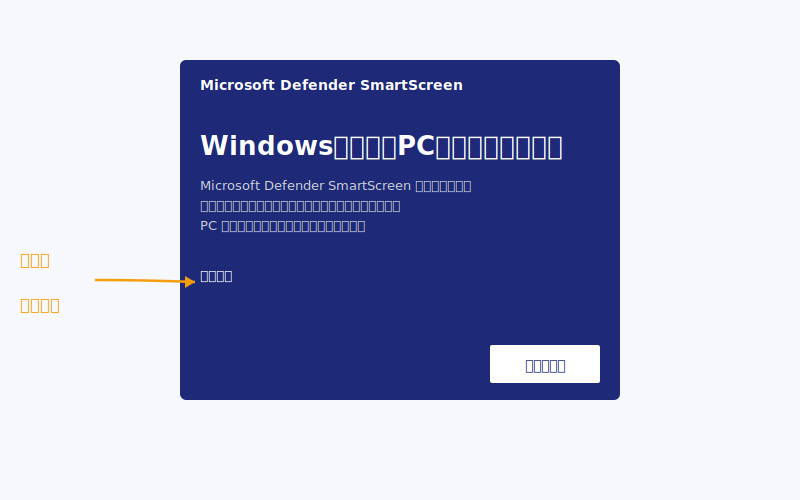
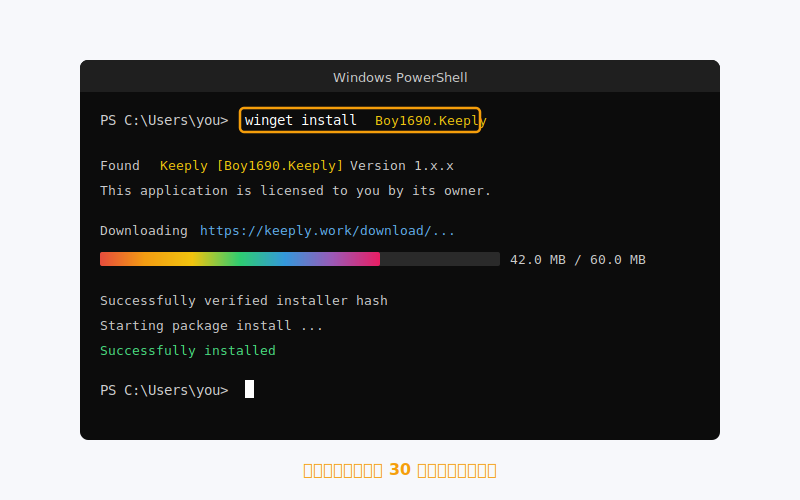
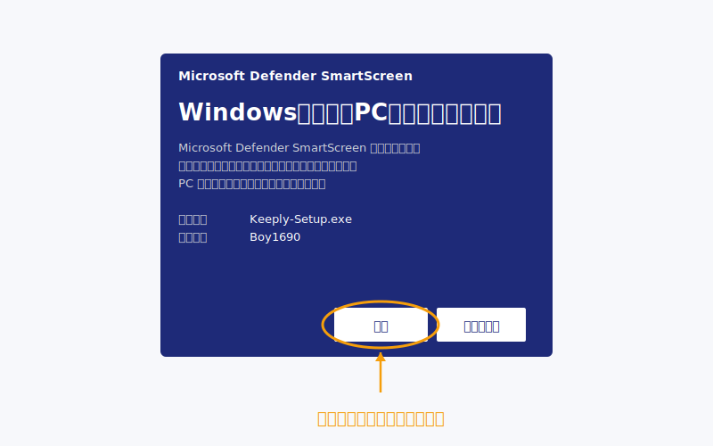
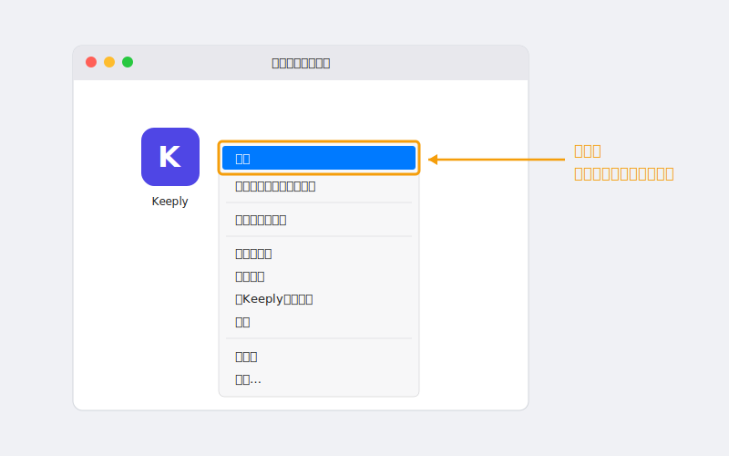
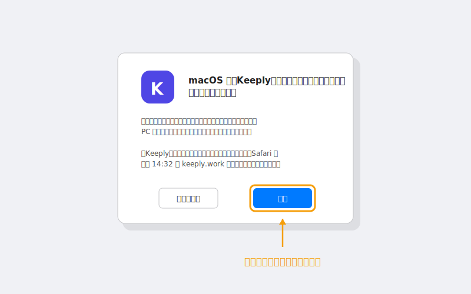

> 「ダブルクリックしたら青い画面が出て、ウイルスかと思って閉じました。」
>
> ——Keeply の説明を聞いたばかりのデザイナーが、その日の午後に返してきたメール。

彼が最初ではない。Windows のあの青い画面に止められる人は、実際にインストールまでこぎつける人より多いかもしれない。

この記事では順を追って説明する：**なぜ青い画面が出るのか → よりすっきりした 3 つのインストール方法 → インストール後すぐ最初のプロジェクトを開く**。

## 目次

1. [なぜ青い画面が出るのか（Keeply のせいではない）](#why-smartscreen)
2. [3 つの道、好きなものを選んで](#three-paths)
3. [Windows 道 1：winget コマンド一行（推奨）](#path-winget)
4. [Windows 道 2：.exe を手動ダウンロード](#path-exe)
5. [macOS インストール：右クリックで開く一手](#path-macos)
6. [インストール後：最初のプロジェクトを入れる](#first-project)
7. [詰まったら？よくあるエラー 5 つ](#troubleshoot)

## なぜ青い画面が出るのか（Keeply のせいではない） {#why-smartscreen}

あの画面は [SmartScreen](https://learn.microsoft.com/ja-jp/windows/security/operating-system-security/virus-and-threat-protection/microsoft-defender-smartscreen/) という。「このソフトに毒があるか」を判定しているのではない。「このソフトを十分な人数が使ったか」を判定している。

別の見方：新しくオープンしたレストランでまだ食べログの評価がないのは、まずいわけではない。まだ誰も食べていないだけだ。

SmartScreen は新しいソフトに対してまったく同じ態度をとる。「**ダウンロード数 + 時間**」で信頼を積み上げる仕組みで、新バージョンが出るたびに観察期間に戻る。Keeply も更新のたびにこのプロセスをくぐる。これは「ソフト自体が安全か」とは関係ない。

ではなぜ怖いのか。画面は「実行しない」という大きなボタンしか出さず、実行するには横の「**詳細情報**」という小さい文字を押さなければならない。視覚的にはお知らせというより、壁に見える。

しかし、この壁に付き合う必要はない。**Keeply は Microsoft の [winget パッケージ repo](https://github.com/microsoft/winget-pkgs) に登録済み**で、その経路では警告自体が出ない。

つまり、警告を回避する方法ではなく、警告が出ない経路を選ぶ話だ。



## 3 つの道、好きなものを選んで {#three-paths}

| 経路 | 向いている人 | 所要時間 | 青い画面？ |
| --- | --- | --- | --- |
| **A. winget コマンド**（Windows） | PowerShell に一行貼ることに抵抗がない | 2 分 | 出ない |
| **B. .exe 公式ダウンロード**（Windows） | 黒い画面を開きたくない | 5 分 | 出る — 対処法を解説 |
| **C. .dmg 公式ダウンロード**（macOS） | Mac ユーザー | 3 分 | 出ないが右クリック必須 |

決まった？該当するセクションへ。他は飛ばしていい。

## Windows 道 1 — winget コマンド一行（推奨） {#path-winget}

**winget** は Windows 標準の「コマンド版アプリストア」。Windows 10 1809 から最初から入っている。追加でインストールするものはない。

PowerShell を開いて（スタートメニューで「PowerShell」を検索）、この一行を貼って Enter：

```powershell
winget install Boy1690.Keeply
```



30 秒ほどで終わる。青い画面なし、「詳細情報」の小さい文字もなし。

なぜこの経路はこんなにすっきりしているのか。winget に登録されるには、Keeply は [Microsoft の公式審査（GitHub 上）](https://github.com/microsoft/winget-pkgs) を通過しなければならない：インストーラの出所、ファイル署名、インストール挙動が綺麗かをチェックされる。通った後でしか掲載されない。

つまりこのコマンドを実行する時点で、Microsoft が一度審査を済ませてくれている。SmartScreen のチェックはこの経路では冗長なので、出ない。

「最短経路」が同時に「信頼経路」でもある。一行で両方解決。

## Windows 道 2 — .exe を手動ダウンロード {#path-exe}

PowerShell を開きたくない？問題ない。keeply.work でダウンロードボタンを押し、`.exe` を取得してダブルクリック。

そこで SmartScreen の青い画面が出る。**これは正常な動作**（[理由は上で説明済み](#why-smartscreen)）。続けるには：

1. 青い画面の「**詳細情報**」（左下の小さい文字）をクリック
2. 「**実行**」ボタンが現れる
3. クリック。インストーラが続きを進める



経路全体で 3 分ほど余分にかかる。多くは心理的なもので、実際の操作量ではない。インストール後は道 1 と同じ流れに合流する。

## macOS インストール — 右クリックで開く一手 {#path-macos}

Mac には青い画面はない。ただし初回はダブルクリックでは開けない。[macOS Gatekeeper](https://support.apple.com/ja-jp/102445) がブロックする。

正しい手順：

1. `.dmg` をダウンロードし、Keeply をアプリケーションフォルダにドラッグ
2. アプリケーションを開いて Keeply を見つける
3. **右クリック → 開く**（ダブルクリックではない）

   

4. ダイアログが出るので「開く」を押す

   

これで完了。**初回だけこの手順が必要**で、以後はダブルクリックで普通に起動する。

なぜ初回だけ遠回りなのか。Gatekeeper は「未公証または新規公証」のアプリのダブルクリック起動を初期設定でブロックする。右クリック → 開くは「自分が何をインストールしているか分かっている」という明示的な同意を Apple 側が用意した動作だ。

これは Keeply に固有の話ではない。あなたの Mac が初めて見る新しいアプリは、初回だけすべてこうなる。

## インストール後 — 最初のプロジェクトを入れる {#first-project}

インストールできたで終わりではない。その日のうちに最初のプロジェクトが守られる、それで完了。

Keeply を開き、「**新規プロジェクト**」を押し、いま作業中のフォルダを 1 つ選ぶ。

<!-- TODO: 替換為真實截圖 keeply-add-project.png（Keeply「新增專案」對話框） -->

**最初に何を入れるか**：「**失いたくない、かつ今も触っている**」もの。提案資料、契約書、デザインデータ、スライドのどれでもいい。半年触っていない古いフォルダは選ばない方がいい。それは「保護」ではなく「アーカイブ」の話で、別のテーマだ。

最初のスキャンは 1〜2 分かかる。その後 Keeply はバックグラウンドでフォルダを見続け、**ファイルを保存するたびに自動でバージョンを記録**する。手動で「チェックポイント」を押す必要はない。

イメージしやすい合成例：あるデザイナーがインストール直後に Q2 の提案フォルダを入れる。最初のスキャンは 2 分。3 日目、土曜日にロゴの色を間違えて変えていたことに気づき、履歴から前のバージョンを戻すのに 20 秒。

インストール当日に最初のプロジェクトで使う人と、1 週間後に初めて使う人では、定着率がまったく違う。

## 詰まったら？よくあるエラー 5 つ {#troubleshoot}

| 症状 | 対処 |
| --- | --- |
| `winget` コマンドが見つからない | あなたの Windows にまだ「アプリ インストーラー」が入っていない。経路 2（.exe 手動ダウンロード）に切り替えればいい。粘らないこと |
| Win 11 で「管理者権限が必要」と表示 | **管理者として実行**で PowerShell を開き直す |
| Mac で「開発元を確認できないため開けない」 | 右クリック → 開く（ダブルクリックではない）。上の macOS セクション参照 |
| 社内ネットワークでダウンロードがブロックされる | winget コマンド経由なら Microsoft CDN を通るので、たいてい通る |
| インストールしたのに開かない | 一度再起動。それでもダメなら [support@keeply.work](mailto:support@keeply.work) へ |

## 覚えておくべき一つのこと

一つだけ覚えておけばいい：

**青い画面は判決ではなく、reputation がまだ積み上がっていないだけ。**

警告を回避する必要はない。警告が出ない winget の経路を通るだけでいい。
