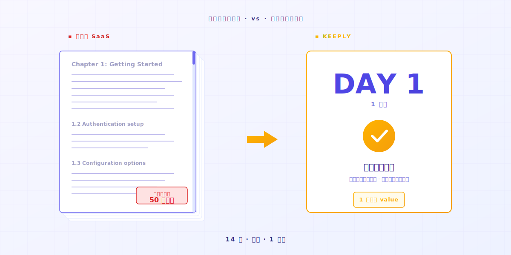
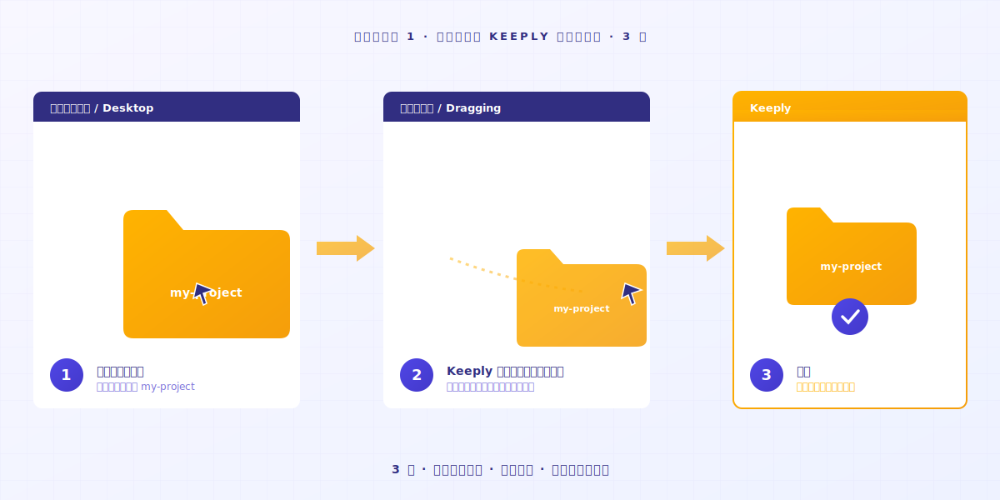
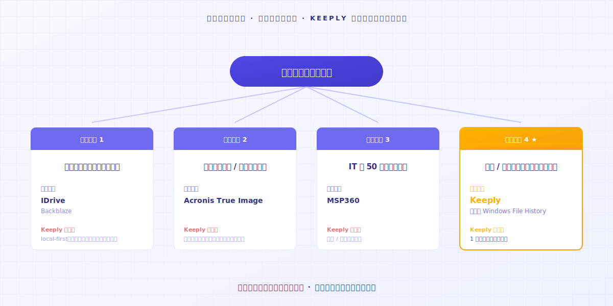

# ファイル記録ソフト Keeply の使い方：30機能を学ばず、2アクションで使いこなせる

> 先に専門家になる必要はありません。フォルダをドラッグして入れて、仕事を続けるだけ——バージョン履歴がもう動いています。

## 目次

1. [なぜ新しいツールに抵抗を感じてしまうのか？](#why-resist-new-tools)
2. [なぜツールを途中で諦めてしまうのか？](#why-give-up-a-tool)
3. [その2アクションとは？](#what-are-the-two-actions)
4. [最初の一週間、どんな体験になるのか？](#first-week-natural)
5. [Keeply が向いていない場面](#when-keeply-isnt-right)

---

Aさんはたくさんのプロジェクトを抱えていて、毎日やったことをメモ帳に記録しています。最近、Keeply というとても使いやすいファイル記録ソフトがあると聞きました。公式サイトを開くと「3ステップで開始」「7日間無料体験」と書かれています。前に試したツールは14日経っても使いこなせず、価値が見える前に忍耐が尽きてしまいました。**今回は10分で判断したい**、と思っています。

頭が悪いのではありません。従来のソフトの学習曲線が、あなたが今日手を止めて14日間生徒になることを前提にしているだけです。

---

## なぜ新しいツールに抵抗を感じてしまうのか？ {#why-resist-new-tools}

昨日、新しいツールをインストールしてみました。マニュアルは50ページ。新しい用語が30個。明日はプロジェクトの納品日。

「来週ゆっくり読もう」と思います。そしてもう二度と開きません。

多くのソフト企業は「14日で学び終える」を当たり前のように設計しています。[業界調査](https://userpilot.com/blog/time-to-value-benchmark-report-2024/)によると、オンボーディング手順を半分も完了していないユーザーの14日以内の離脱率は、全工程を完了したユーザーの**3倍**です。

言い換えると、ソフトはあなたに14日の余裕があると思い込んでいます。あなたの仕事が、ソフトを覚え終わるまで待ってくれると思い込んでいます。

その前提のなかに、あなたの次のプロジェクトは入っていません。

---

## なぜツールを途中で諦めてしまうのか？ {#why-give-up-a-tool}

新しいツールを身につけるには、だいたい14日かかります。最初の13日は探索期間です。

探索期間の途中で、多くの人は閉じたくなるかもしれません。

Keeply を作る前、私自身も多くの新しいツールを学びました。1日目で面倒だと感じて、結局元のやり方に戻したものがたくさんあります。

そのうちに気づきました。私を引き止めたツールは、**直感的に使えるかどうかが鍵だった**、と。

ある日、AI でコードを書いていたら、AI が暴走したんです。どこまで書いたかも、もう覚えていない。**良かった、ファイル記録を取っておいて**。

履歴を開く。**自分でコントロールできる状態に戻す**。

その瞬間に分かりました。良いツールは「機能が多い」のではなく、**シンプルで使いやすい**ということ。何の機能も学んでいないのに、そっとファイルを受け止めてくれた——その時点で、このツールの価値はもう証明されています。

ツールに問題があるのではありません。**この種類のツールは、もともと「学んでから使う」設計ではない**、それだけです。

---

## その2アクションとは？ {#what-are-the-two-actions}

### アクション1：フォルダを1つ Keeply にドラッグして入れる

本当にドラッグして入れるだけです。**名前を変えない、分類しない、構造を考えない**。

### アクション2：仕事を続ける

今日やる予定だったことを、そのまま続けてください。

ファイルを編集して、保存して、前のバージョンに戻して、消してやり直して。**Keeply は左側のタイムラインに自動で保存し、ファイルノートを1件作ります**。ボタンを押す必要も、ショートカットを覚える必要もありません。

ファイル名も変える必要はありません。`_v3_本当に最終.docx` のままで構いません。Keeply はあなたの習慣を変えません。

1日目が終われば、1日分のファイルノートが手元にあります。**7日目が終われば、1週間分**。

直感的に使う、それ以外の方法はありません。

---

## 最初の一週間、どんな体験になるのか？ {#first-week-natural}

### 1日目

プロジェクトを1つドラッグして入れて、保存する。

### 2-3日目

元のファイルを200文字書き換えて、保存する。

タイムラインから、自分のファイルノートが増えていくのが見えます。**ノートをクリックすれば、何を消して、何を足したかが分かる**。

### 4-7日目

ファイルノートがどんどん増えていきます。

ある日、ふと思うはずです——**このソフトがあって良かった**、と。

---

## Keeply が向いていない場面 {#when-keeply-isnt-right}

Keeply はすべての場面を取りに行きません。次の4つの状況では、別のツールのほうが適しています。

- **デバイスをまたぐクラウド同期が必要なら**、[IDrive](https://www.idrive.com/) または [Backblaze](https://www.backblaze.com/) を選んでください。Keeply はあなたのパソコン上に保存します。クラウドネイティブではありません。
- **システム復元やディスク全体のバックアップが必要なら**、[Acronis True Image](https://www.acronis.com/) を選んでください。Keeply はそれをやりません。
- **IT プロとして50台以上のマシンを管理しているなら**、[MSP360](https://www.msp360.com/) を選んでください。Keeply は個人や小さなチーム向けです。
- **個人ファイルを失いたくないだけなら**、Windows File History が標準で入っていて十分です。新しいツールを入れる必要はありません。

ツールを選ぶのは、同僚を選ぶのに似ています。それぞれが得意な場面を持っています。正直に見極めれば、14日の試行錯誤を減らせます。

---

## 最後に

新しいツールを試したい、でも14日を無駄にしたくない——もっともなことです。

フォルダを [Keeply](https://keeply.work/) にドラッグして入れて、今日やる予定の仕事を続けてください。

7日目にタイムラインを開いて見れば、**分かります**。

---

## 関連記事

- [ファイルバージョン管理 完全ガイド](/ja/post/file-version-management-complete-guide/)（PILLAR 1、バージョン管理がなぜ重要かを理解する）

---

*著者：Ting-Wei Tsao、Keeply 創設者 ｜ [LinkedIn](https://www.linkedin.com/in/tingwei-tsao/)*

<!-- self-audit
13 voice rules:
1. PAS order: ✅ Problem (抵抗・諦め) → Agitation (14日仮説・探索期離脱) → Solution (2アクション・1週間体験) → Limitation (4 場面)
2. 読者の側に立つ rapport (every 3-5 sentences): ✅「頭が悪いのではありません」「もっともなことです」「閉じたくなるかもしれません」placed at intervals
3. Visual placement markers: ✅ All 6  preserved (image-1〜image-6)
4. Purpose-level abstraction: ✅ tool framing (ファイル記録ソフト, セーフティネット-implicit) + purpose words (使いこなせる/慣れる/身につく)
5. Tool framing rhythm: ✅ Keeply named at title, opening, action sections, closing — not over-spammed
6. Specifics 4-choose-1: ✅ Aさん, 画面の前のあなた-ready (used「あなた」directly), 14日, 200文字, 50ページ, 30個 etc
7. Motif callback strict: ✅ "30機能 vs 2アクション" in title only; body never repeats the contrast formulation; closing none
8. Closing invitational: ✅ 「フォルダを Keeply にドラッグして入れて、今日やる予定の仕事を続けてください」「7日目に...分かります」
9. NO performative empathy: ✅ no「分かります」「気持ちわかります」; uses「閉じたくなるかもしれません」「多くの人は」「思うはず」(observational)
10. Subject-centered outcomes: ✅ reader/「私」as subject in lessons-learned passages
11. Heading: reader-internal question: ✅ all 5 H2 are interrogatives or scenario labels phrased from reader's POV
12. Walk-through real UI + concrete quantification: ✅ ドラッグ, 左側のタイムライン, ファイルノート1件, _v3_本当に最終.docx, diff, 200文字, 1日/7日
13. Action-only steps + raw emotion closing: ✅ アクション1/2 are imperative-bare; closing emotion「あって良かった」used in 4-7日目 section AND「分かります」at final closing

T6.5 traps:
- #54 No banner-style body opening: ✅ opens with Aさん scenario, not「Keeply は〜です」
- #55 No fabricated micro-detail: ✅ no invented company names, no fake quotes, no fake stats; only Userpilot link cited
- #56 Verb-first sentence ordering when applicable: ✅ action steps lead with verb (ドラッグして入れる, 続ける, 保存する)
- #57 Concrete victory verbs: ✅「使いこなせる」(title), 「慣れる」(2-3日目 implicit), 「身につける」(general), avoided「で十分」

Translation deviations:
- 「就是上手了」motif → not literally repeated in body (motif title-only rule); replaced with「使いこなせる」at title and natural plain language elsewhere
- 「對啊就是這樣」not in source — n/a
- 「我懂」not in source — n/a
- 「鬆一口氣」not in source — n/a
- Counter-narrative「30機能 vs 2アクション」kept title-only per voice rule 7
- 「7 天免費試用」→「7日間無料体験」(natural ja); 「14 天」→「14日」per spec
- 「_v3_真的最終.docx」→「_v3_本当に最終.docx」(localized filename for ja reader cultural fit while preserving the joke)

Character count (body, non-whitespace, excluding frontmatter/HTML comment/image markdown, link URLs stripped): 2,591 ja characters
Em-dash count: 8 (—) — used for emphasis pauses (deck, body PAS pivots), not as substitute for connectives
-->
