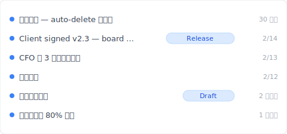

# 【2026 ファイル管理】SharePoint バージョン履歴：500 個の上限 + 自動削除設定の隠れたコスト

> Microsoft が 2024 年に IT 管理者へ「ストレージ節約ボタン」を渡した。押す前に、何を失うのか知っておくべき。

「昨日 SharePoint で 自動削除 100 に設定した。今日クライアントが『3 ヶ月前のあのバージョン』を聞いてきた。履歴を開く——直近 100 個しかない。その前の 250 個、Microsoft が既に削除してくれていた。」

これはバグでもなく、設定ミスでもない。[Microsoft Learn 公式ドキュメント](https://learn.microsoft.com/en-us/sharepoint/document-library-version-history-limits) に明記されたメカニズム：500 メジャーバージョン上限 + 2024 年末リリースの自動削除設定（500 / 100 / 50 / 期限カットオフの 4 段階）です。本記事は SharePoint バージョン履歴の 3 メカニズム + 自動削除オン後**何を失うか**を分解し、[Keeply](https://keeply.work) が上限超過シナリオをどう受け止めるか紹介します。

## 目次

1. [Keeply で SharePoint 履歴を「自動削除で消されない」状態にする](#keeply-timeline)
2. [SharePoint バージョン履歴 3 メカニズム：500 メジャー + 511 マイナー + 自動削除](#three-mechanisms)
3. [500 メジャーバージョン上限：Microsoft 公式の数字、IT 管理者が見落としやすい詳細](#500-cap)
4. [自動削除 4 段階：500 / 100 / 50 / 期限カットオフの実コスト](#自動削除)
5. [SharePoint ストレージ容量：100 にしたら実際どれだけ節約？](#ストレージ-quota)
6. [Keeply のカバー：SP ストレージ階層をまたぐ Release 凍結 + ファイル単位ノート](#keeply-fills)
7. [SharePoint で Keeply が要らない 3 つのシナリオ](#when-not-needed)
8. [よくある質問](#faq)

---

## Keeply で SharePoint 履歴を「自動削除で消されない」状態にする {#keeply-timeline}

実際の場面を見せます。James は中小企業の IT 兼任管理者、5 人チームが SharePoint Online で `proposal.docx` を共同編集。半年で 200 版以上蓄積、SharePoint ストレージ容量は 8 割、彼はちょうど管理センターで 自動削除 100 に設定した——来月には容量が安全域に戻る予定。

しかし今日クライアントが急に「2 月 14 日に取締役会が承認したバージョン」を尋ねてきた。SP バージョン履歴を開くと直近 100 個しかなく、2 月 14 日のバージョンは既に自動削除されていた。

[Keeply](https://keeply.work) に切り替えればこうはならない。同じ `proposal.docx` の Keeply タイムラインはこう見える：

「Client signed v2.3 — 取締役会承認」が自分の行と Release tag を持つ——James が 2 月 14 日、取締役会承認後、Keeply メインウィンドウで「バージョン保存」を押してノートを書いて保存したもの：

「Client signed v2.3 — 取締役会承認」と一行書いて保存。半年後 Keeply タイムラインで tag を見れば一発——**SP 自動削除の影響を受けず、自動削除されません**。

操作は 2 ステップだけ：

1. **保存**——Word で Ctrl+S、SharePoint がクラウドに同期（いつも通り）、Keeply はバックグラウンドで 30 分以内に変更を検知して**自身のタイムライン**にバージョンを自動保存。
2. **マイルストーンをタグ付け**——重要な瞬間（取締役会承認 / クライアント承認 / リリース）に Keeply メインウィンドウで「バージョン保存」を押してノートを書く。

下では SharePoint 自身の 3 メカニズム——なぜ 自動削除 100 設定後 250 版が消えたのか——を分解します。

## SharePoint バージョン履歴 3 メカニズム {#three-mechanisms}

SharePoint の「バージョン履歴」は実際 3 つの異なるものが 1 つの用語に混ぜられています：

| メカニズム | 内容 | 上限 | トリガー |
|---|---|---|---|
| **メジャーバージョン** | 保存ごとの完全版 | **500 個**（[MS Learn](https://learn.microsoft.com/en-us/sharepoint/document-library-version-history-limits)） | デフォルトで保存ごとに自動 |
| **マイナーバージョン** | 下書き状態（メジャー/マイナーバージョニング有効時のみ） | 511 個（追加プール） | 下書き保存 |
| **自動削除設定** | IT 管理者が更に厳しい上限を設定 | 500 / 100 / 50 / 期限カットオフ | 管理センターで設定 |

3 つの異なるもの——1 つに混同すると間違ったレイヤーを探すことに。「3 ヶ月前のバージョンが見つからない」は 500 上限到達かもしれない、自動削除 100 / カットオフ設定かもしれない、管理者がファイルを site 外に移動したかもしれない。**まず自分の site がどの 自動削除 に設定されているか確認してから**どのレイヤーをデバッグするか決まる。

## 500 メジャーバージョン上限：Microsoft 公式の数字 {#500-cap}

[Microsoft Learn](https://learn.microsoft.com/en-us/sharepoint/document-library-version-history-limits) に明確に記載：SharePoint Online ドキュメントライブラリは 1 ファイルあたり最大 **500 メジャーバージョン**を保持。メジャー/マイナーバージョニング有効時はマイナー 511 個まで追加。

**見落としやすい詳細**：

- **「任意の 500 個」ではなく**——**500 メジャー + 511 マイナー**（独立した 2 つのプール）
- **超過時は最古を自動削除、通知なし**——OneDrive と同じメカニズム（[OneDrive バージョン履歴の詳細](/ja/post/onedrive-version-history/) 参照）
- **ファイル単位で計算**——「サイトコレクション で 500 を共有」ではない
- **2024 年末以前はすべての site がデフォルト 500**、以後 IT 管理者が管理センターで小さく設定可能

**500 上限に到達する人**：

- 5 人チームが交代で proposal を編集、1 日 3 回保存 = 月 ~66 版 → **約 7-8 ヶ月**で上限
- IT 管理者がクリーンアップで上限を 100 に圧縮 = 上限到達速度 × 5

## 自動削除 4 段階：500 / 100 / 50 / 期限カットオフの実コスト {#auto-delete}

Microsoft が 2024 年末に SharePoint 管理センターの [バージョン履歴自動削除設定](https://learn.microsoft.com/en-us/sharepoint/version-history-limits) をリリース、IT 管理者は次から選択：

| 段階 | 保持バージョン数 | 適合シーン | 失うもの |
|---|---|---|---|
| **500（デフォルト）** | 直近 500 個 | ストレージ余裕、完全履歴維持 | 501 回目保存後に最古 1 版失う |
| **100** | 直近 100 個 | ストレージ逼迫、チーム編集少 | 101 回目以降で最古版自動削除 |
| **50** | 直近 50 個 | ストレージひっ迫、軽度バージョン需要 | 大量履歴喪失（高頻度保存シーンは厳しい） |
| **期限カットオフ（カスタム日数）** | N 日経過分は永久削除 | 法規制 retention シーン | カットオフ前の旧版復元不可（ごみ箱でも撈えない） |

**実際のストレージ節約**：[日本の IT ケーススタディ](https://note.shiftinc.jp/n/n4eaa1ebddd34) によれば、自動削除有効化後そのテナントのストレージ容量使用率が 85% から 35% に下がった。代価は：カットオフ前のバージョンが永久削除。

**誰も書かない重要リスク**：自動削除は site-collection レベル設定。IT 管理者が設定した後 end user には見えず、通知もない。3 ヶ月後にあるバージョンが見つからないとき、end user は SP が壊れたと思う。

## SharePoint ストレージ容量：100 にしたら実際どれだけ節約？ {#storage-quota}

SharePoint ストレージ容量は テナント レベル + サイトコレクション レベルの合算：

- **Microsoft 365 Business Standard**：1 TB / テナント + 10 GB / user
- **Microsoft 365 Business Premium**：1 TB / テナント + 10 GB / user
- **Enterprise E3/E5**：5 TB / テナント + user 別 ストレージ 追加

`proposal.docx` 平均 1.5 MB × 500 メジャーバージョン = 750 MB / 1 ファイル。500 アクティブドキュメント × 750 MB = 375 GB → 1 TB テナント 上限に逼迫。

**自動削除 100 後**：1.5 MB × 100 = 150 MB / ファイル → 500 ファイル × 150 MB = 75 GB → テナント 使用率 7.5%。確かに 5 倍のストレージ節約。

**しかし**：履歴の 80% を失った。クライアントが 3 ヶ月後に取締役会承認版を尋ねてきたとき、削除された 400 版の中にあるかもしれない。

## Keeply のカバー：SP ストレージ階層をまたぐ Release 凍結 {#keeply-fills}

James のシーン：5 人チーム + SP ストレージひっ迫 + クリーンアップしたいが重要版を失うのは怖い。

[Keeply](https://keeply.work) は 3 つを 1 つのツールで：

- **Release 凍結**：取締役会承認日、James が Keeply「バージョン保存」を押して「Client signed v2.3」とタグ付け——このバージョンは**ローカル + Keeply 自身のバックアップ場所**に凍結、SP 自動削除の影響を受けず、永久保持
- **ファイル単位ノート**：各バージョンに 1-2 行のノート。3 ヶ月後タイムラインで「CFO 第 3 ラウンド修正」「取締役会承認」のタグを見れば、SP 上の 100 版どれがどれか推測する必要なし
- **クロスツール移植性**：Keeply は SP 依存ではない。James が Dropbox / NAS に切り替えても、タイムラインはローカル + Keeply バックアップ場所に残り、どのクラウドベンダーの上限にも縛られない

SP はチームコラボ同期 + ストレージ 100 圧縮を続行、Keeply は無制限のファイル単位履歴 + 重要バージョン凍結を提供。**2 つ並行、各自の強みを担当**。

## SharePoint で Keeply が要らない 3 つのシナリオ {#when-not-needed}

正直に：

**エンタープライズコンプライアンスアーカイブ**。SOX、HIPAA、GDPR は監査チェーン + 暗号化 + 保持期間管理が必要——[Microsoft 365 Backup](https://www.microsoft.com/en-us/microsoft-365/business/microsoft-365-backup) / Veeam / Acronis を使う。Keeply は日常バージョン管理、コンプライアンスツールではない。

**500 版以内 + 自動削除不要の個人 / 小チーム**。ストレージ容量が半分も使われていないなら自動削除設定は不要——SP デフォルト 500 で十分、Keeply はオーバーキル。

**100% モバイル限定ワークフロー**。Keeply はデスクトップ優先、モバイルは軽量。チームの 90% が Office モバイル + SharePoint モバイル で編集なら、Keeply がメインビューに入らず価値が見えない。

## よくある質問 {#faq}

**Q1: SharePoint はファイルあたり何バージョン？**

500 メジャーバージョン（[Microsoft Learn](https://learn.microsoft.com/en-us/sharepoint/document-library-version-history-limits)）。メジャー/マイナーバージョニング有効時はマイナー 511 個まで追加。超過後は最古を自動削除、通知なし。

**Q2: SharePoint 自動削除とは？**

Microsoft が 2024 年末に提供開始した機能、IT 管理者が管理センターで 4 段階設定可能：500 / 100 / 50 / 期限カットオフ。ストレージコスト vs 履歴完全性のトレードオフ。

**Q3: OneDrive バージョン履歴と同じ？**

基盤ストレージは同じ（SP ドキュメントライブラリ）、メカニズムも同じ。違いは使用シーン（個人 vs チーム）+ 管理者設定の可制御性。

**Q4: 自動削除オン後、半年前のバージョンが見つからない場合は？**

カットオフ前のバージョンは永久削除、ごみ箱でも撈えない。外部ツールで重要バージョンを保持して回避——例えば [Keeply](https://keeply.work) Release 凍結。

**Q5: ストレージ容量逼迫、自動削除使わない選択肢？**

3 つの選択肢：（1）ストレージ追加購入；（2）自動削除を受け入れて履歴喪失；（3）外部ツールで重要バージョンを SP 外に移動。

**Q6: Keeply は SharePoint と競合する？**

競合しません、並行運用。SP は同期コラボ、Keeply は無制限ファイル単位履歴 + Release 凍結を提供。

## 関連記事

メイン [ファイルバージョン管理完全ガイド](/ja/post/file-version-management-complete-guide/)。

サイドリーディング：
- [OneDrive バージョン履歴：500 上限 + 30 日窓](/ja/post/onedrive-version-history/)——同 MS family 個人クラウド対位
- [Excel バージョン履歴の限界](/ja/post/excel-version-history-limits/)——Excel 同様 500 メカニズム
- [Keeply とバックアップ・クラウドツールの違い](/ja/post/what-keeply-saves-vs-backup-cloud/)

---

James は SP 管理センターで 自動削除 100 を設定した。来月ストレージは安全域に戻る。

しかし今日クライアントが取締役会承認版を尋ねてきた——SP が既に削除してくれていた。

Microsoft はトレードオフを公式ドキュメントに書いた。SharePoint が変わらないことではなく、SP がストレージ圧縮するときに履歴を受け止めるツールが必要。

---

> 著者について：Ting-Wei Tsao、[Keeply](https://keeply.work) 創業者。
> [LinkedIn](https://www.linkedin.com/in/ting-wei-tsao-b57480152/)
