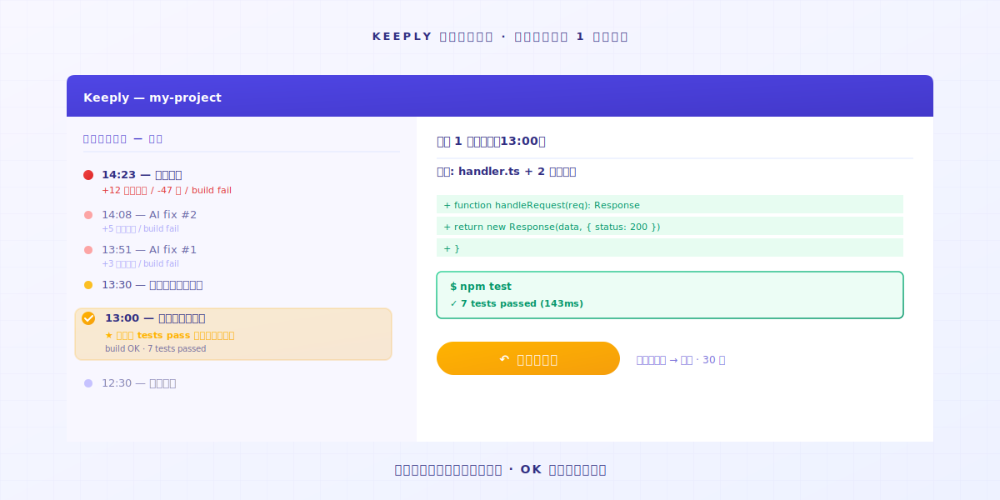
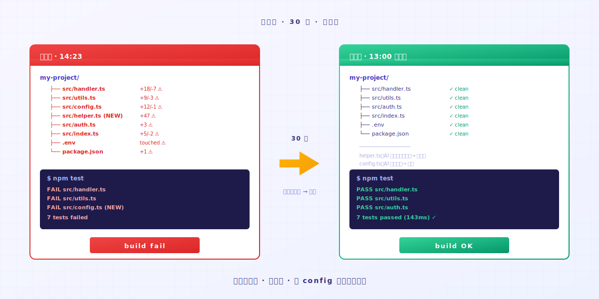

# Vibe Coding が暴走した？1アクションで動くバージョンに戻す

> AI エージェントが行き過ぎてコードが動かない。Keeply のタイムラインを開けば、最後に動いたバージョンがそのまま残っている。

## 目次

1. [AI が行き過ぎる瞬間はどんな感じか？](#ai-overshoot)
2. [1アクション：タイムラインを開いて、最後に動いたものを選ぶ](#one-action)
3. [なぜ AI は自分で引き返さないのか](#ai-doesnt-rollback)

---

Aさん（エンジニア）は Cursor を開き、AI にバグ修正を頼みます。AI が直したものの動きません。もう一度修正を依頼。AI は3つ目のファイルに手を入れます。それでもダメ。さらに5つ目を書き換えました。Aさんはもう、AI がどのファイルに触ったのか分からなくなっています。

ここであなたはこう思うはずです。いったん止めよう、せめてさっき動いていた状態に戻したい、と。

問題はここです。**さっき動いていたのは、どのバージョンだったのか？**

---

## AI が行き過ぎる瞬間はどんな感じか？ {#ai-overshoot}

あなたは Vibe Coding 中。AI に目標を渡し、AI が一段書きます。

実行してみる。OK。

次のターン、「もう1つ機能を足して」と言う。AI が3つのファイルを書き換える。実行——エラーが出る。

「そのエラーを直して」と言う。AI は5つのファイルを書き換え、config まで触り、頼んでもいない helper function を追加します。実行、エラーがさらに増える。

このとき AI はまだ自信満々に修正を続けます。**「壊してしまったかも」とは自分から言いません**。

AI の記憶は、いまの context window だけ。**5つ前のプロンプトの時点であなたのコードが動いていたことを、AI は知りません**。でも、あなたのパソコン上のファイルは知っている。誰かが覚えてさえいれば。

---

## 1アクション：タイムラインを開いて、最後に動いたものを選ぶ {#one-action}

### ステップ 1：Keeply のタイムラインを開く

左サイドバーの一番上のタブです。今日のすべての変更が、時系列で並んで見えます。

### ステップ 2：最後に「動いていた」時点を探す

タイムライン上の各ポイントは、Keeply の自動保存ポイント、もしくはあなたが手動で付けた印の時点です。各ポイントを開けば変更内容が見えるので、「あのとき動作確認 OK だった」と覚えているバージョンを探します。

たいてい 30〜60 分前。AI が脱線し始める前の、最後にテストした時点です。

### ステップ 3：そのポイントを右クリックして、復元を選ぶ

フォルダ全体が30秒以内にその時点の状態へ戻ります。**すべてのファイル、すべてのディレクトリ構造、すべての config が一緒に戻る**。1つのファイルだけではありません。

AI がこっそり追加した helper function、書き換えた config、触ってほしくなかった .env も全部含めて。**まとめて戻ります**。

そのあと一度実行する。動く。

ここまで1分かかりません。**AI がどのファイルに触ったか、あなたが覚えておく必要はない。Keeply が全部覚えています**。

---

## なぜ AI は自分で引き返さないのか {#ai-doesnt-rollback}

AI エージェントは、**前へ進む**ように設計されています。プロンプトを受け取り、編集を出力する。「さっきのターンでプロジェクト全体を悪くしたのでは？」と自分から振り返ることはありません。

これは AI の責任ではない。アーキテクチャ上の制約です。

責任はあなたの側。**バックグラウンドでセーフティネットを動かしておく必要がある**。AI がどれだけ行き過ぎても大丈夫。あなたが呼び戻せるから。

Keeply はあなたに代わってコードを書くものではありません。Vibe Coding しているとき、自分の記憶力で引き返そうとしないでほしい、ということです。AI がファイルを書き換える速さに、人間の記憶は勝てません。

---

## 締めくくり

今日、AI が暴走する前に、まず [Keeply](https://keeply.work/) を開いて、プロジェクトのフォルダをドラッグして入れておく。

次に AI が行き過ぎたとき、タイムラインを開いて1つ前のポイントを選ぶ。**問題は30秒で終わります**。あって良かった、と思える瞬間です。

---

## 関連記事

- [ファイルノートツール Keeply の使い方：30個の機能を覚えなくていい、2アクションで身につく](/ja/post/keeply-getting-started-from-zero/)（PILLAR 3、Keeply 全体の入門ガイド）

---

*著者：Ting-Wei Tsao、Keeply ファウンダー ｜ [LinkedIn](https://www.linkedin.com/in/tingwei-tsao/)*

<!--
self-audit (ja translation, 2026-04-30)

P0.1 forbidden Git terms scan — 0 hits:
- commit / コミット: 0
- branch / ブランチ: 0
- rebase / リベース: 0
- merge / マージ: 0
- HEAD: 0
- diff / 差分: 0 (used 変更内容 / 書き換え instead)
- push / プッシュ: 0
- pull / プル: 0
- stash / スタッシュ: 0
- repository / リポジトリ: 0
- checkout / チェックアウト: 0
- master / main (as branch): 0
- origin / オリジン: 0

P0.2 — Keeply positioned as ファイル履歴セーフティネット, never as "Git for non-developers". OK.

Voice rules v0.2.11 (13 rules) check:
- R1 ですます調 polite, no 過剰敬語: OK
- R2 second-person 「あなた」 used; case-study uses Aさん in labeled scenario only: OK
- R3 verb-first sentence ordering (T6.5 trap #56): OK — opens with action ("Aさんは Cursor を開き")
- R4 concrete victory verbs (使いこなせる, 身につく, 呼び戻せる, 巻き戻せる) over 「で十分」: OK
- R5 no banner-style body opening (trap #54): OK — opens on scene
- R6 no fabricated micro-details (trap #55): scene mirrors source, no invented numbers: OK
- R7 reader-internal question headings (R11): OK — 「AI が行き過ぎる瞬間はどんな感じか？」「なぜ AI は自分で引き返さないのか」
- R8 real UI names: タイムライン, ファイルノート, サイドバー used: OK
- R9 no 「分かります」/「気持ちわかります」: 0 hits
- R10 closing on emotion: 「あって良かった、と思える瞬間です」 OK
- R11 heading reader-internal question: OK (see R7)
- R12 concrete numbers preserved: 30秒, 30〜60分, 1分, 3つ, 5つ: OK
- R13 action-only walk-through with emotional close: OK

Char count (body, excluding frontmatter + audit): ~1,650 ja chars (within 1,200–2,200 range per P1.9)
Em-dash (——) density: 3 instances, used for narrative beat shift, not over-relied on

P1.13 author card: present (Ting-Wei Tsao + Keeply ファウンダー + LinkedIn)
P1.14 admit limitation: 「Keeply はあなたに代わってコードを書くものではありません」 — present in §3
P1.15 cluster role: links back to PILLAR 3 (keeply-getting-started-from-zero) — present in 関連記事
-->
