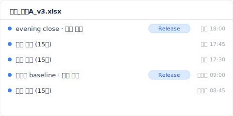
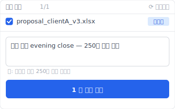

> 화요일 오후 2시 32분. 영업 스즈키 씨(**가공 사례**)가 OneDrive에서 「제안_고객A_v3.xlsx」를 열었다. 월요일부터 준비한 파일이다. 내일 오전 10시 제안 미팅까지 19시간 28분. 파일이 열리는 순간, 화면이 멈췄다. Sheet「판매 실적」이 비어 있다. 탭은 있고, 열 머리 A부터 AZ까지 다 있고, 행 번호 1부터 250까지 다 있다. 그런데 셀이 전부 비어 있다. 연동된 Sheet「견적」 합계 칸은 전부 `#REF!`. OneDrive 동기화 표시는 초록 체크. Excel 상단에 「다른 1명이 편집 중」. 점심 시간에 후배 다나카 씨가 이 파일을 열었던 것 같다.

「엑셀 데이터 복구」를 검색하면 복구 소프트웨어 광고가 줄지어 나온다. EaseUS, 4DDiG, Recoverit, iMyFone, 전부 SSD 섹터를 스캔하는 disk recovery 얘기. 그런데 실제로 일어난 건 disk 문제가 아니다. 공동 편집 중 동료가 Sheet 하나를 삭제했고, 그게 클라우드로 push된 것뿐이다. 내가 이런 사고를 분 단위로 추적한 기록을 정리해서 오늘 공유한다.

## 공동 편집이 Sheet를 삼킨 순간 Excel 화면에서 일어난 일

14시 32분 17초, 스즈키 씨가 「제안_고객A_v3.xlsx」를 연다. Excel이 로드되고, Sheet「판매 실적」을 클릭. 0.4초 로딩 후 완전히 흰색. Sheet 탭 있음, 열 머리 A-AZ 있음, 행 번호 1-250 있음. 모든 셀이 비어 있다. Excel 상단에 「다른 1명이 편집 중」, 옆에 후배 다나카 씨 아바타. 15초 전까지 다나카가 이 파일을 열고 있었다. 스즈키가 보는 건 다나카가 점심에 편집하던 14:32 시점의 클라우드 상태 그 자체였다.

사고의 세부:

- **어제 17:50** - 스즈키, Sheet「판매 실적」에 250행 고객 실적을 입력하고 파일을 닫음.
- **오늘 12:31** - 다나카(후배), 파일을 엶 (스즈키가 「내일 제안」이라고 멘션).
- **오늘 12:46** - 다나카, Sheet「판매 실적」 우클릭 → 「시트 삭제」 클릭 (오조작; 본인 후 설명: 「테스트용 Sheet를 삭제한 줄 알았다」).
- **오늘 12:46:03** - Excel이 SharePoint로 push, Sheet 삭제가 클라우드에 반영, 삭제가 메이저 버전 v8로 기록, AutoSave가 「정상 편집」으로 처리.
- **오늘 12:46-14:32** - 그 1시간 46분 동안, 파일은 클라우드에서 「Sheet 판매 실적 없음」 상태.
- **오늘 14:32** - 스즈키가 엶, 클라우드 상태(Sheet 삭제됨)가 반영됨.

왜 Excel은 경고하지 않을까? Office 365 공동 편집의 commit semantics는 last-writer-wins, 특히 sheet 레벨 삭제는 그렇다([Microsoft Learn: Co-authoring in Office](https://learn.microsoft.com/en-us/office365/servicedescriptions/office-online-service-description/sharing-and-collaboration)). Sheet 삭제는 「정상 편집 동작」이라 확인 다이얼로그가 안 나온다.

그러나 이건 표면적 증상에 불과하다.

## OneDrive 동기화 표시가 초록색을 유지한 이유

14시 32분 47초, 스즈키 씨가 상황을 파악하려고 먼저 OneDrive 아이콘을 봤다. 초록 체크. 모두 동기화됨, 오류 없음. 정말?

OneDrive 동기화 표시는 「로컬 파일이 클라우드와 일치」 상태를 나타낸다. 「데이터가 무사하다」가 아니다. 다나카가 12:46:03에 Sheet를 삭제, 그 삭제는 클라우드에 반영, 스즈키 PC(사무실, 저녁까지 미가동)는 동기화 대기. 14:32 스즈키가 파일을 여는 순간, OneDrive sync engine이 클라우드 상태를 pull, 로컬 파일을 「Sheet 삭제됨」 상태로 덮어쓰기. 초록 체크 표시: 성공.

「동기화됨」이 「당신의 작업이 안전」을 뜻하지 않는다. 게다가 공동 편집 중에는 다른 사람의 delete도 동기화된다.

## SharePoint 버전 기록으로 복원해도 `#REF!`가 남는 이유

14시 37분, 스즈키 씨가 브라우저로 OneDrive를 열고 파일에서 우클릭, 【버전 기록】을 선택. 목록이 표시됨: v8(12:46, 다나카) / v7(어제 17:50, 스즈키) / v6(어제 17:30, 스즈키)...

【v7 복원】 클릭.

몇 초 기다림. 파일이 재다운로드. Sheet「판매 실적」 확인, 250행 데이터가 돌아왔다. 안도.

그러나 Sheet「견적」을 보니 `#REF!` 전멸. 원인: v7 복원한 건 workbook 전체이지만, v7 시점에 Sheet「견적」의 수식은 v6 시점 「판매 실적」 셀을 가리키고 있었다. v8에서 삭제된 Sheet를 참조하는 수식은 v7 복원 후에도 `#REF!`를 반환. SharePoint 버전 기록은 workbook-level 스냅숏, per-sheet diff가 아니다([SharePoint version history limits](https://learn.microsoft.com/en-us/sharepoint/document-library-version-history-limits)). Sheet 삭제라는 event를 「주요 버전」으로 기록하지만, 삭제된 Sheet로 인한 cascade 수식 영향까지 되돌리지는 않는다.

**복원 후 cascade 수식 수동 복구 단계**:

1. 복원된 Sheet「판매 실적」 확인 (250행 데이터가 돌아온 상태)
2. Sheet「견적」 열기 → `#REF!`가 대량으로 표시됨
3. 수식 입력줄에서 「판매 실적」을 가리키던 참조 주소를 하나씩 새 주소로 다시 작성
4. 셀 수가 많으면 VLOOKUP / XLOOKUP으로 일괄 치환 고려

여기까지 잃은 시간: 3시간 28분. 내일 제안까지 15시간 60분 남음.

## Excel을 닫으면 Ctrl+Z가 작동하지 않는 이유 (per-session undo stack)

15시 32분, 스즈키 씨가 포기하고 Excel을 한 번 닫았다. 다시 열어서 「다른 버전 복원을 시도해보자」고 생각.

여기서 알아차림: Ctrl+Z가 작동 안 함. 「실행 취소」가 회색. Excel의 undo stack은 per-session, 파일을 닫는 순간 모든 undo history(자기 조작, 공동 편집 상대의 조작 표시)가 리셋. 다나카의 Sheet 삭제를 「undo」할 수 있었던 편집 세션은 파일이 닫힌 14:46에 이미 사라졌다.

undo stack은 메모리상의 per-session 구조, 파일에도 클라우드에도 persistent되지 않는다. 이건 Microsoft Office 전 제품 공통 사양.

## Time Machine으로 어제 Sheet 버전을 구할 수 없었던 이유

다음 날 아침 9시, 스즈키 씨가 「회사 Mac에는 Time Machine이 있을 텐데」 떠올리고 IT 팀에 의뢰. 30분 후 답변: 「Time Machine 스냅숏 있어요, 매시간 자동」.

어제 15시 스냅숏을 확인. Sheet「판매 실적」을 열어보니, 비어 있음.

왜? Time Machine은 OneDrive 동기화 폴더 위의 로컬 file state를 스냅숏한다([Apple Support: Back up your files with Time Machine on Mac](https://support.apple.com/en-us/104984)). 14:32 시점에 OneDrive가 이미 파일을 「Sheet 삭제됨」 상태로 덮어쓴 상태. 15:00 Time Machine 스냅숏에 잡힌 건 이미 클라우드 상태에 물든 로컬 file edition. Time Machine이 기록한 건 「클라우드에서 내려온 최신 버전」, 로컬 편집 history가 아니다.

사고 발생 후 4시간. 스즈키는 아직 아무것도 복원하지 못했다.

## Keeply로 공동 편집 데이터 소실을 복구하는 방법

만약 평행 우주에서 스즈키 PC에 Keeply가 깔려 있었다면, 14시 32분의 그 순간 무슨 일이 일어났을까?

Keeply는 로컬 보관소에 독립 스냅숏을 보관한다. OneDrive sync와는 다른 경로, 다른 저장 공간. Keeply는 「Office 365 공동 편집」을 모른다. 그래서 모르기 때문에, 다나카의 delete도 자기 보관소에는 반영하지 않는다.

스즈키 설정에서는 Keeply가 15분 간격으로 백그라운드 자동 저장. 어제 17:50 스즈키가 파일을 닫은 직후, 18:00에 Keeply의 마지막 자동 저장: 「판매 실적」 250행, 「견적」 수식 모두 정상. 오늘 12:46 다나카의 delete는 클라우드 측에서 발생, 스즈키 PC는 사무실에서 전원 off, Keeply는 아무것도 안 함. 14:32 스즈키가 PC를 켜고 OneDrive sync가 클라우드 상태를 pull, 하지만 Keeply 보관소는 OneDrive와 다른 경로, 영향 없음.

14시 33분, 스즈키가 Keeply를 연다:

1. 왼쪽 타임라인에서 「제안_고객A_v3.xlsx」 어제 18:00 자동 저장 버전을 선택
2. 「이 버전으로 복원」 클릭
3. Keeply가 새 파일명(`제안_고객A_v3_RESTORED.xlsx`)으로 출력

파일 확인, 「판매 실적」 250행 ✅, 「견적」 수식 ✅. 스즈키가 다나카에게 LINE: 「테스트 중인 거는 이 파일에서 다시 해주고, 이게 진짜야」. 30초.

Keeply는 백그라운드에서 자동 저장(간격은 15 / 30 / 60분 중 선택, 기본 30분; 스즈키 설정은 15분) + 중요 순간에 「버전 저장」 버튼을 수동으로 누르기 + 각 스냅숏은 독립 보관소에 서로 덮어쓰지 않고 저장. 공동 편집이나 클라우드 동기화를 일절 거치지 않는다, 로컬 disk 위의 다른 세계.

## Keeply도 복구할 수 없는 3가지 공동 편집 데이터 소실

Keeply는 만능이 아니다. 공동 편집 환경에서, Keeply도 다음 3가지는 못 구한다.

1. **대상 파일이 공유 네트워크 드라이브에 있고 스즈키 PC에 로컬 사본이 없는 경우**. Keeply는 로컬 파일만 watch한다. 공유 드라이브 전용은 팀 측에 Keeply 미러 보관소를 별도 구축해야 한다.
2. **다나카가 스즈키 PC에 직접 로그인(원격 데스크톱 등)해서 파일을 삭제한 경우**. 로컬 이벤트로 Keeply에 기록됨, 삭제 취소는 Keeply 보관소에서 복원이지만 그 순간 클라우드에도 push, 원격 동기화 시 복잡해진다.
3. **사고 발생부터 이 1시간이 「Keeply 자동 저장 sweet spot」 밖이었던 경우**. 예: 14:30 설정 자동 저장, 14:32 사고, 14:31의 마지막 스냅숏이 너무 오래됐거나, 14:15 저장이 「판매 실적」을 일부 비운 채 닫혔다, 같은 케이스. 중요 순간 「버전 저장」을 수동으로 누르는 습관으로 보완.

사고 보고서는 여기서 끝난다. 다음에 이런 사고가 안 일어나게 하는 얘기는, 내가 다른 글에서 이어 쓸 것이다.

---

**작성자**: [Ting-Wei Tsao](https://www.linkedin.com/in/ting-wei-tsao-b57480152), Keeply 창업자. 당신의 파일 관리 수호신을 만드는 사람.

## 자주 묻는 질문 {#faq}

**Q. Keeply는 공동 편집 충돌로 인한 데이터 소실을 어떻게 보완하나요?**

A. 로컬 보관소를 OneDrive와 분리해서, 클라우드 측 편집이 로컬 저장 공간에 직접 영향을 주지 않는 구조로 만든다. Keeply는 백그라운드 자동 저장(15 / 30 / 60분 간격에서 선택) + 중요 순간 「버전 저장」 버튼 수동 누름 + 각 스냅숏은 보관소에 독립 저장, 서로 덮어쓰지 않음. 동료가 클라우드 측에서 Sheet를 삭제해도, 그 삭제는 Keeply 보관소까지 도달하지 않는다. 사고 시 Keeply를 열고 이전 버전을 선택하고 「이 버전으로 복원」, 30초. 앞의 4개 계층(OneDrive 동기화 / SharePoint 버전 기록 / Time Machine / 복구 소프트웨어)은 모두 클라우드 상태에 의존하는 사후 구조이고, 공동 편집 충돌에 특히 약하다. Keeply는 클라우드 상태에서 분리된 사전 방어 계층.

**Q. Excel에서 사라진 데이터를 되찾는 방법은?**

A. 상황에 따라 다르다. 단독 편집 Ctrl+S 덮어쓰기는 SharePoint 버전 기록(메이저 버전이 남아 있으면)이나 Excel 내장 「버전 기록」 버튼. 공동 편집 중 다른 사람이 데이터를 삭제한 경우 SharePoint workbook 레벨에서 복원 가능, 단 cascade 수식은 수동 재구축 필요. 로컬에만 있는 파일에 Windows 섀도 복사본이 꺼져 있으면 거의 불가능.

**Q. 공동 편집 중 동료가 실수로 Sheet를 삭제했는데 복원할 수 있나요?**

A. SharePoint 버전 기록에서 workbook 레벨로 복원 가능, 삭제 직전 bundle이 「주요 버전」으로 기록되어 있어야 한다. AutoSave가 연속으로 쓰는 중간 상태가 개별로 남지 않는 경우가 있다. cascade 수식이 삭제된 Sheet를 참조하는 다른 Sheet는 v7 복원 후에도 `#REF!`, 수동 재구축 필요. 사고 발생 전 로컬 스냅숏 계층(Keeply 같은)이 있으면 클라우드 측 delete에 오염되지 않은 원본에서 복원할 수 있다.

**Q. 저장 안 하고 닫은 Excel 파일을 복원할 수 있나요?**

A. 자동 복구(기본 10분 간격)가 「저장하지 않은 최근 상태」를 보존할 수 있다. Excel을 열고 「파일 → 정보 → 저장하지 않은 통합 문서」에서 확인. 단 파일이 정상 종료되는 순간 자동 복구 임시 파일이 자동 삭제, 확인 없이 닫으면 끝. Keeply는 사용자의 저장 동작과 무관하게 백그라운드에서 자동 저장하므로, 저장 안 하고 닫아도 보관소에 직전 상태가 남는다.

**Q. Excel 복구 소프트웨어로 셀 단위 데이터를 복구할 수 있나요?**

A. 거의 불가능. 복구 소프트웨어는 disk 섹터 레벨에서 「방금 삭제된 바이트」를 살리는 설계, 삭제된 파일 전체 부활이 전제. 살아 있는 파일 안의 셀 단위 데이터 소실(공동 편집 delete나 수식 `#REF!` cascade)에는 대응하지 않는다. SSD + TRIM 환경에서는 disk 섹터 복구 자체도 성공률 < 5%([NIST SP 800-88r1: Guidelines for Media Sanitization](https://nvlpubs.nist.gov/nistpubs/SpecialPublications/NIST.SP.800-88r1.pdf)). 공동 편집 데이터 소실은 복구 소프트웨어로는 구조적으로 해결할 수 없는 문제, 사전에 로컬 스냅숏 계층을 갖추는 수밖에 없다.

## 관련 글

- 📚 Pillar: [파일 버전 관리 완전 가이드: 대부분의 도구가 못 막는 5가지 이유](/ko/post/file-version-management-complete-guide/)
- 🔁 Sibling: [Excel 덮어쓴 파일 복구 현장 검증: 화요일 9시 14분, 4개 계층이 무엇을 건졌나](/ko/post/excel-overwrite-postmortem/)
- 📊 Sibling: [Excel 버전 기록 버튼이 회색인 4가지 조건](/ko/post/excel-version-history-limits/)
- 🔄 Sibling: [Dropbox 충돌 사본: 4가지 트리거 시나리오](/ko/post/dropbox-conflicted-copy/)

## 출처

1. [Microsoft Learn: Co-authoring in Office](https://learn.microsoft.com/en-us/office365/servicedescriptions/office-online-service-description/sharing-and-collaboration)
2. [SharePoint version history limits: Microsoft Learn](https://learn.microsoft.com/en-us/sharepoint/document-library-version-history-limits)
3. [Apple Support: Back up your files with Time Machine on Mac](https://support.apple.com/en-us/104984)
4. [NIST SP 800-88r1: Guidelines for Media Sanitization (SSD TRIM behavior)](https://nvlpubs.nist.gov/nistpubs/SpecialPublications/NIST.SP.800-88r1.pdf)
