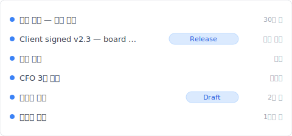

# 【2026 파일 관리】OneDrive 버전 기록은 무제한이 아닙니다 — Microsoft 공식 문서의 500개 상한 + 30일 창

> Microsoft Learn은 명확히 말합니다: 500 + 30일. 그러나 90%의 사용법 기사는 기능을 가르치고 어디서 작동이 멈추는지는 가르치지 않습니다.

"OneDrive가 당신을 200번 구했습니다. 그러다 501번째에 가장 오래된 버전을 조용히 삭제했습니다 — 알리지 않고."

이것은 버그가 아닙니다. [Microsoft Learn](https://learn.microsoft.com/en-us/sharepoint/document-library-version-history-limits)이 처음부터 명시한 500 주요 버전 상한입니다. 그러나 90%의 OneDrive 버전 기록 튜토리얼은 **사용 방법**을 가르치고 **어디서 멈추는지**는 가르치지 않습니다. 이 글은 그 갭을 메웁니다 — 자주 혼동되는 3가지 OneDrive 메커니즘(버전 기록 500 상한 / 휴지통 30일 창 / 자동 복구)을 분해하고, [Keeply](https://keeply.work)가 상한 초과 시나리오를 어떻게 처리하는지 보여줍니다.

## 목차

1. [Keeply가 OneDrive 기록을 501번째 저장에서 사라지지 않게 하는 방법](#keeply-timeline)
2. [OneDrive의 3가지 메커니즘: 500 / 30일 / 자동 복구 — 서로 다른 것들](#three-mechanisms)
3. [500 버전 상한: Microsoft 자체 숫자와 도달하는 시점](#500 상한)
4. [휴지통 30 / 93일: 삭제 시간 창, 버전 기록이 아님](#recycle-bin)
5. [자동 복구: Office 충돌 버퍼, 버전 기록과 완전히 분리됨](#autorecover)
6. [Keeply가 갭을 메웁니다: 상한 후의 Release 잠금 + 파일별 노트](#keeply-fills)
7. [OneDrive에서 Keeply가 필요 없는 3가지 시나리오](#when-not-needed)
8. [FAQ](#faq)

---

## Keeply가 OneDrive 기록을 501번째 저장에서 사라지지 않게 하는 방법 {#keeply-timeline}

Tina는 컨설턴트입니다. 6개월 동안 OneDrive에 `proposal.docx`를 저장하면서 200개 이상의 버전이 누적되었습니다. 오늘 고객이 서명했습니다. 내년 3월에 원래 제안 버전을 다시 보고 싶을 때 — OneDrive에 남아 있을까요?

[Keeply](https://keeply.work)에서는 이 프로젝트의 타임라인이 이렇게 보입니다:

"Client signed v2.3 — board approved"가 자체 행과 Release 태그를 가집니다 — 오늘 오후 고객 서명 후 Tina가 Keeply 메인 창에서 "버전 저장"을 눌러 노트를 작성한 것입니다:

"Client signed v2.3 — board approved"를 한 줄 쓰고 버전을 저장합니다. 내년 3월 타임라인에서 태그를 보면 바로 찾을 수 있습니다 — OneDrive 500 상한에 영향받지 않고 자동 삭제되지 않습니다.

2가지 동작만:

1. **저장** — Word에서 Ctrl+S. OneDrive가 클라우드에 동기화(평소대로). Keeply가 백그라운드에서 30분 내에 변경을 감지하고 자체 타임라인에 버전을 자동 저장합니다.
2. **마일스톤 태그 지정** — 고객 서명 후 Keeply 메인 창에서 "버전 저장"을 누르고 한 줄 노트를 작성합니다.

이제 OneDrive의 3가지 자체 메커니즘 — 왜 501번째에 사라지는지 — 를 분해해 봅시다.

## OneDrive의 3가지 메커니즘: 서로 다른 것들, 자주 혼동됨 {#three-mechanisms}

OneDrive가 "버전 기록"이라고 말할 때, 실제로는 3가지 다른 것이 하나의 용어로 혼합되어 있습니다. **분해해 봅시다**:

| 메커니즘 | 내용 | 한도 | 트리거 |
|---|---|---|---|
| **버전 기록** | 클라우드 파일의 각 버전 | **500 주요 버전** ([MS Learn](https://learn.microsoft.com/en-us/sharepoint/document-library-version-history-limits)) | 저장할 때마다 자동 |
| **휴지통** | 파일 삭제 후 창 | 개인 30일 / 회사 또는 학교 93일 ([MS Support](https://support.microsoft.com/en-us/office/restore-deleted-files-or-folders-in-onedrive-949ada80-0026-4db3-a953-c99083e6a84f)) | 수동 / 동기화 삭제 |
| **자동 복구** | Office 클라이언트 충돌 버퍼 | 기본 10분 간격 | 앱 충돌 / 강제 종료 |

3가지 다른 것 — 하나로 혼동하면 잘못된 계층을 찾게 됩니다. "6개월 전 파일을 찾을 수 없어요"는 버전 기록 500 상한이거나, 휴지통 30일 창이 만료되었거나, 자동 복구가 오래 전에 덮어쓰였을 수 있습니다. 문제마다 다른 해결책이 필요합니다.

## 500 버전 상한: Microsoft 자체 숫자 {#500 상한}

[Microsoft Learn](https://learn.microsoft.com/en-us/sharepoint/document-library-version-history-limits)에 명확히 명시됨: SharePoint / OneDrive 문서 라이브러리는 파일당 최대 **500 주요 버전**을 유지합니다(주/부 버전 관리가 활성화된 경우 추가로 최대 511 부 버전).

**그 후 발생하는 일**: 새 버전을 위한 공간을 확보하기 위해 가장 오래된 버전이 자동 삭제됩니다. 알림 없음. 취소 옵션 없음.

**도달하는 사람**:

- **컨설턴트** — 제안서를 하루 3회 저장 × 22 영업일 = 월 ~66 버전 → **7-8개월** 안에 상한
- **디자이너** — 디자인 파일을 하루 5-8회 저장 → **3-4개월** 안에 상한
- **작가 / 변호사** — 원고를 하루 10회 이상 저장 → **3개월 미만**에 상한

저장 빈도가 높고 + 다개월 프로젝트 = 상한 도달 가능성 높음. Microsoft는 경고하지 않습니다. UI도 표시하지 않습니다. 찾으러 가서야 알게 됩니다.

## 휴지통 30 / 93일 {#recycle-bin}

휴지통은 **삭제 복구 창**이며 버전 기록의 확장이 아닙니다. 일반적인 혼동: "삭제 파일을 30일 동안 복구할 수 있다" ≠ "6개월 전 버전으로 되돌릴 수 있다".

[MS Support](https://support.microsoft.com/en-us/office/restore-deleted-files-or-folders-in-onedrive-949ada80-0026-4db3-a953-c99083e6a84f) 공식 숫자:

- **개인 계정**: 30일 보존
- **회사 또는 학교 계정**: 93일 보존

만료 후 2단계 휴지통에서 영구 삭제됩니다.

버전 기록과 휴지통은 **별개의 두 시스템**입니다. `proposal.docx`를 v200에서 v201로 수정 → 이전 버전이 버전 기록으로 들어갑니다(휴지통이 아님). `proposal.docx`를 삭제 → 전체 파일이 휴지통으로 들어갑니다(버전 기록 포함). 전자는 500 상한에, 후자는 30/93일 상한에 도달합니다.

## 자동 복구 ≠ 버전 기록 {#autorecover}

Word / Excel / PowerPoint 데스크톱 클라이언트의 자동 복구는 `.asd` 임시 파일을 저장합니다 — 기본 **10분 간격** — 다음 경우에만 유용:

- 앱 충돌(블루스크린 / 행)
- 강제 종료 / 시스템 정전
- 저장하지 않고 닫은 후, 다음 열기 시 "복구하시겠습니까?" 프롬프트

OneDrive 클라우드 버전 기록과 **완전히 분리**되어 있으며 같은 계층이 아닙니다.

관련 패턴은 [Photoshop 자동 저장은 버전 기록이 아님](/ko/post/photoshop-autosave-not-version-history/)을 참조 — Adobe 디자인 공간의 동일한 혼동.

## Keeply가 갭을 메웁니다 — OneDrive 상한 후 {#keeply-fills}

Tina의 `proposal.docx`가 500 상한에 도달했습니다. 고객이 갑자기 8개월 전 제안서를 원합니다 — OneDrive에는 더 이상 없습니다.

[Keeply](https://keeply.work)에서는 3가지가 하나의 도구에 있습니다:

- **Release 잠금**: 2월 14일 고객이 서명할 때 Tina가 "버전 저장"을 누르고 "Client signed v2.3"으로 태그 지정 — 그 버전이 별도의 스냅샷으로 동결되어 이후 500회 저장에도 덮어쓰이지 않고 영구 보존. OneDrive 500 상한이 적용되지 않습니다.
- **파일별 노트**: 각 버전에 1-2줄의 노트를 작성할 수 있습니다. 3개월 후 Tina가 타임라인에서 "CFO 3차 수정", "고객 서명", "이사회 준비" 태그를 보면 — 12개의 `_FINAL` 파일 이름을 추측할 필요 없습니다.
- **크로스 도구 이식성**: Keeply는 OneDrive에 의존하지 않습니다. Dropbox / NAS / 새 노트북으로 전환해도 — 타임라인은 로컬 + Keeply 자체 백업 위치에 남습니다. 어떤 클라우드 벤더의 상한도 당신을 가두지 않습니다.

OneDrive는 잘하는 일(협업 동기화)을 계속하고, Keeply는 무제한 파일별 버전 기록을 제공합니다.

## OneDrive에서 Keeply가 필요 없는 3가지 시나리오 {#when-not-needed}

솔직히 말하자면 — Keeply가 모든 사람을 위한 것은 아닙니다:

**엔터프라이즈 컴플라이언스 아카이브**. SOX, HIPAA, GDPR은 감사 체인 + 암호화 + 보존 기간 관리가 필요합니다 — [Microsoft 365 Backup](https://www.microsoft.com/en-us/microsoft-365/business/microsoft-365-backup) / Veeam / Acronis를 선택하세요. Keeply는 일상 버전 관리용이며 컴플라이언스 도구가 아닙니다.

**계약 서명 / 법무 감사**. 서명 + 변경 불가능한 기록 — DocuSign 또는 Adobe Sign 사용. Keeply는 버전 추적을 기록하지만 서명을 인증하지 않습니다.

**하루 1회 미만 저장, 개인 사용**. `notes.docx`를 일주일에 한 번만 편집한다면 — OneDrive 500 상한에 10년이 지나도 도달하지 않습니다. Keeply는 시급하지 않습니다.

## FAQ {#faq}

**Q1: OneDrive는 버전을 몇 개까지 저장하나요?**

500 주요 버전 ([Microsoft Learn](https://learn.microsoft.com/en-us/sharepoint/document-library-version-history-limits)). 가장 오래된 것은 그 이후 자동 삭제, 알림 없음.

**Q2: OneDrive 버전 기록은 얼마나 오래 유지되나요?**

버전 기록 자체는 시간 제한 없음 (500 상한에 의해 제한됨). 시간 제한이 있는 것은 휴지통: 개인 30일, 회사 93일.

**Q3: OneDrive 버전 기록과 자동 복구는 같나요?**

다릅니다. 버전 기록은 OneDrive 클라우드 쪽 버전별 보존, 자동 복구는 Office 데스크톱 충돌 버퍼 (10분 간격). 다른 저장 계층.

**Q4: 왜 6개월 전 OneDrive 파일을 찾을 수 없나요?**

두 가지 가능성: (a) 500-상한 초과, 자동 삭제됨; (b) 휴지통을 대신 검색했는데 30일 창이 닫힘. 헤비 유저는 7-8개월 안에 상한 도달.

**Q5: 500 버전 초과 후 어떻게 되나요?**

OneDrive가 조용히 가장 오래된 것을 삭제, 경고 없음. 해결하려면 상한이 없는 도구가 필요 — 예를 들어 [Keeply](https://keeply.work) Release 잠금.

**Q6: Keeply는 OneDrive와 충돌하나요?**

충돌하지 않습니다, 병행 실행. OneDrive는 협업 동기화용, Keeply는 무제한 파일별 버전 기록 + 노트 + Release 잠금.

## 더 보기

필러 [파일 버전 관리 완전 가이드](/ko/post/file-version-management-complete-guide/) — 도구가 파일 기록 유지를 위해 설계되지 않은 4가지 구조적 이유.

병행 읽기:
- [Excel 버전 기록의 한계](/ko/post/excel-version-history-limits/) — Excel의 동일한 500 메커니즘 + 형제 시나리오
- [Keeply가 백업 및 클라우드 도구와 다른 점](/ko/post/what-keeply-saves-vs-backup-cloud/) — 3가지 다른 것, 전체 비교
- [고객이 어느 버전이 최종본인지 물었을 때](/ko/post/client-asked-which-version/) — Word 버전 기록 + 고객이 특정 버전을 원하는 장면

---

Tina의 `proposal.docx`가 OneDrive에서 500 상한에 도달했습니다. 고객이 다음 달 8개월 전 제안서를 원합니다 — Microsoft 자체 규칙에 따라 공식 문서대로 삭제되었습니다.

그러나 Keeply에서 그녀는 "Client signed v2.3"을 Release로 태그 지정했습니다. 반년 후 고객이 요청 — 3초 만에 찾을 수 있습니다.

Microsoft는 이미 500을 문서에 적어 두었습니다. OneDrive가 변하지 않는 것이 아니라, OneDrive가 느려질 때 받아 줄 도구가 필요합니다.

---

> 저자 소개: Ting-Wei Tsao, [Keeply](https://keeply.work) 창립자.
> [LinkedIn](https://www.linkedin.com/in/ting-wei-tsao-b57480152/)
