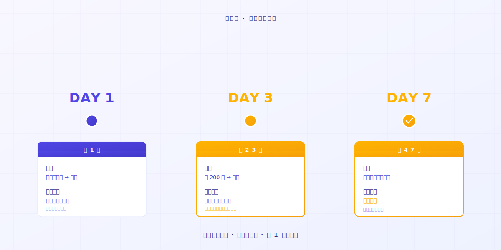

# Jak używać Keeply: pomiń 30 funkcji, wystartuj 2 czynnościami

> Nie musisz najpierw zostać ekspertem. Przeciągnij folder, pracuj dalej — historia wersji już działa.

## Spis treści

1. [Dlaczego opierasz się nowym narzędziom?](#why-resist-new-tools)
2. [Dlaczego rezygnujesz z narzędzia?](#why-give-up-a-tool)
3. [Więc jakie są te 2 czynności?](#what-are-the-two-actions)
4. [Powiem ci, czego doświadczysz](#first-week-natural)
5. [Kiedy Keeply nie jest dla ciebie](#when-keeply-isnt-right)

---

Pan A żongluje wieloma projektami i codziennie używa notesu, by śledzić, co zrobił. Właśnie usłyszał, że Keeply to świetny program do notatek o plikach. Otwiera stronę i widzi „Zacznij w 3 krokach" oraz „7-dniowy darmowy trial". Ostatnie narzędzie, którego próbował, gubił go jeszcze 14. dnia. Cierpliwość skończyła się, zanim pojawiła się jakakolwiek wartość. **Tym razem chce 10 minut, by zdecydować.**

To nie ty jesteś wolny. To krzywa uczenia tradycyjnego oprogramowania zakłada, że jesteś gotów rzucić dziś wszystko i zostać studentem na 14 dni.

---

## Dlaczego opierasz się nowym narzędziom? {#why-resist-new-tools}

Wczoraj próbowałeś zainstalować jedno narzędzie. Dokumentacja ma 50 stron. Jest 30 nowych terminów. Jutro oddajesz projekt.

Myślisz: „Wrócę do tego w przyszłym tygodniu i spokojnie się tym zajmę." Potem już nigdy tego nie otwierasz.

Większość firm softwarowych traktuje „naucz się tego w 14 dni" jako naturalny porządek. [Badania branżowe](https://userpilot.com/blog/time-to-value-benchmark-report-2024/) pokazują, że użytkownicy, którzy kończą mniej niż połowę onboardingu, odpadają w ciągu 14 dni **3 razy** częściej niż ci, którzy kończą całość.

Inaczej mówiąc: oprogramowanie zakłada, że masz 14 wolnych dni. Zakłada, że twoja praca może poczekać, aż się go nauczysz.

Twojego następnego projektu w tym założeniu nie ma.

---

## Dlaczego rezygnujesz z narzędzia? {#why-give-up-a-tool}

Nauka nowego narzędzia zwykle zajmuje około 14 dni. Pierwsze 13 to faza eksploracji.

W połowie tej fazy większość ludzi będzie chciała zamknąć kartę.

Zanim zbudowałem Keeply, sam próbowałem mnóstwa nowych narzędzi. Wiele z nich w 1. dniu wydawało się męczarnią i po cichu wracałem do swojego dawnego sposobu pracy.

Później zdałem sobie sprawę: narzędzia, przy których faktycznie zostałem, miały jedną wspólną cechę — **były na tyle intuicyjne, by po prostu ich użyć**.

Któregoś razu używałem AI do pisania kodu i AI wjechało w krzaki. Zgubiłem już ślad, dokąd dotarło. **Na szczęście cały czas prowadziłem notatki o plikach.**

Otwórz historię. **Powrót do stanu, który mogłem kontrolować.**

Wtedy zrozumiałem: dobre narzędzie to nie to z największą liczbą funkcji, tylko **to wystarczająco proste, by je opanować**. Nie nauczyłem się ani jednej funkcji, a samo to, że narzędzie po cichu złapało ten plik, sprawiło, że się już spłaciło.

Narzędzie nie jest problemem. **Ta kategoria oprogramowania po prostu nie powinna być projektowana wokół „naucz się najpierw, używaj później".**

---

## Więc jakie są te 2 czynności? {#what-are-the-two-actions}

### Czynność 1: Przeciągnij folder do Keeply

Po prostu go przeciągasz. **Nie zmieniaj nazw, nie kategoryzuj, nie myśl o strukturze.**

### Czynność 2: Pracuj dalej

Cokolwiek miałeś dziś robić, rób.

Edytuj plik, zapisz, przywróć poprzednią wersję, skasuj i zrób od nowa. **Keeply auto-zapisuje na Timeline po lewej i tworzy jedną notatkę o pliku.** Nie naciskasz przycisku. Nie zapamiętujesz skrótu.

Nie musisz też zmieniać nazw plików. To `_v3_naprawde_finalna.docx` zachowuje swoją nazwę. Keeply nie rusza twoich nawyków.

Koniec 1. dnia, masz 1 dzień notatek o plikach. **Koniec 7. dnia, masz pełny tydzień.**

Intuicyjne użycie, to cały trik.

---

## Powiem ci, czego doświadczysz {#first-week-natural}

### Dzień 1

Przeciągnij projekt. Zapisz.

### Dzień 2-3

Edytuj 200 słów w istniejącym pliku. Zapisz.

Przez Timeline patrzysz, jak twoje własne notatki o plikach zaczynają się piętrzyć. **Kliknij w notatkę, zobacz, co skasowałeś i co dodałeś.**

### Dzień 4-7

Układasz coraz więcej notatek o plikach.

Pewnego dnia zauważysz — **dobrze, że mam to oprogramowanie**.

---

## Kiedy Keeply nie jest dla ciebie {#when-keeply-isnt-right}

Keeply nie walczy o każdy scenariusz. W 4 przypadkach inne narzędzie to lepszy wybór.

- **Jeśli potrzebujesz synchronizacji chmurowej między urządzeniami**: wybierz [IDrive](https://www.idrive.com/) lub [Backblaze](https://www.backblaze.com/). Keeply żyje na twoim komputerze. Nie jest natywnie chmurowy.
- **Jeśli potrzebujesz przywracania systemu lub pełnej kopii dysku**: wybierz [Acronis True Image](https://www.acronis.com/). Keeply tego nie robi.
- **Jeśli jesteś specjalistą IT zarządzającym 50+ maszynami**: wybierz [MSP360](https://www.msp360.com/). Keeply jest dla osób indywidualnych i małych zespołów.
- **Jeśli po prostu nie chcesz tracić osobistych dokumentów**, Windows File History jest wbudowany i wystarczająco dobry. Nie musisz nic instalować.

Wybór narzędzia jest jak wybór współpracownika. Każde ma swój silny scenariusz. Bądź w tym uczciwy, a spalisz mniej 14-dniowych triali.

---

## Podsumowanie

Chcesz spróbować nowego narzędzia i nie chcesz stracić na nie 14 dni. Fair.

Przeciągnij folder do [Keeply](https://keeply.work/). Rób dziś dalej swoją pracę.

7. dnia otwórz Timeline i rzuć okiem. **Załapiesz.**

---

## Dalsza lektura

- [Kompletny przewodnik po zarządzaniu wersjami plików](/pl/post/file-version-management-complete-guide/) (PILLAR 1, dlaczego zarządzanie wersjami ma znaczenie)

---

*Autor: Ting-Wei Tsao, założyciel Keeply | [LinkedIn](https://www.linkedin.com/in/tingwei-tsao/)*
