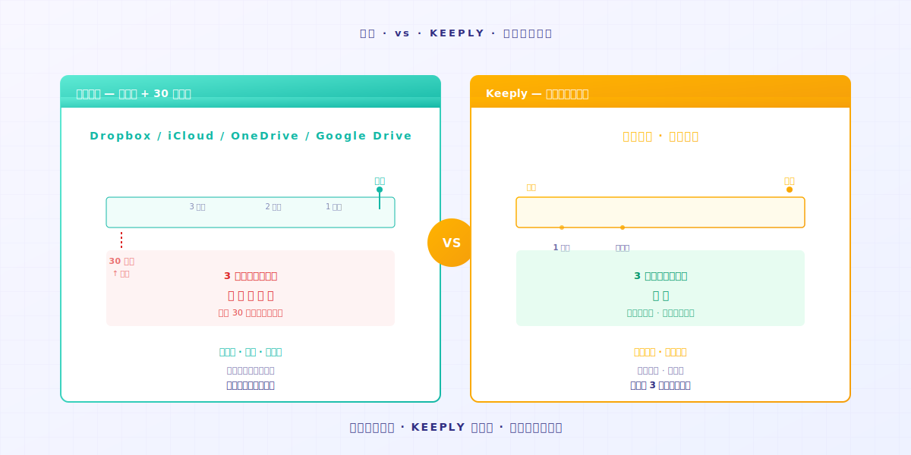

# O que o Keeply de fato salva? Como ele se diferencia de ferramentas de backup e nuvem

> Ferramentas de backup cobrem o disco inteiro. Ferramentas de nuvem cobrem a cópia mais recente. O Keeply cobre o histórico de cada mudança. Três trabalhos diferentes.

## Sumário

1. [O que o Keeply salva?](#what-keeply-saves)
2. [O que ferramentas de backup salvam?](#what-backup-saves)
3. [O que ferramentas de nuvem salvam?](#what-cloud-saves)
4. [De quantos você precisa?](#how-many-do-you-need)

---

O Engenheiro A acabou de instalar o Keeply. O colega B passa por ali e pergunta: "Como isso é diferente do Time Machine que vem no meu Mac?"

O Engenheiro A trava. Sabe que é diferente, mas não consegue cravar onde.

Aqui está a diferença: **backup, nuvem e Keeply são três trabalhos diferentes**. O trabalho deles não se sobrepõe, e é por isso que têm três nomes diferentes.

---

## O que o Keeply salva? {#what-keeply-saves}

O Keeply salva **cada mudança em cada arquivo**.

Você edita `proposta.docx` duas vezes hoje, você salva duas vezes. A Timeline mostra duas notas de arquivo. Quer voltar para a versão do seu primeiro salvamento? Clique naquela entrada. 30 segundos e está lá.

Ele não salva o Google Doc de outra pessoa. Não salva as configurações dos apps do seu computador. Só salva **como cada arquivo no seu computador muda ao longo do tempo**.

Se sua necessidade é "quero voltar para a versão antes das edições de quinta-feira", esse é o trabalho dele.

---

## O que ferramentas de backup salvam? {#what-backup-saves}

Ferramentas como Time Machine, Acronis True Image e Backblaze salvam **um retrato do disco inteiro num ponto no tempo**.

O trabalho delas não é resgatar um arquivo individual. Elas salvam **como o seu computador inteiro estava naquele dia**. Sistema operacional, apps, configurações, cada pasta, tudo junto.

Se seu HD morre ou seu computador inteiro some, um backup pode restaurar tudo. **É essa a verdadeira razão pela qual elas existem**.

Mas se você só quer achar a versão de `proposta.docx` antes da edição das 10h23 de quinta, um backup consegue, mas você tem que restaurar o retrato inteiro primeiro para tirar aquele arquivo. **Não é o problema que ele foi desenhado para resolver**.

---

## O que ferramentas de nuvem salvam? {#what-cloud-saves}

Ferramentas como Dropbox, iCloud, OneDrive e Google Drive salvam **a versão mais recente de um arquivo, mais sincronização entre dispositivos**.

Você edita um arquivo no Computador A, o Computador B automaticamente recebe a cópia mais recente. **O trabalho delas é sincronizar 'a cópia mais recente' para todos os seus dispositivos**.

Elas têm histórico de versões, sim. Mas tipicamente **só guardam 30 dias** — o plano padrão do Dropbox, o Google Drive e o OneDrive todos seguem essa regra. Passou disso, foi-se.

Se sua necessidade é "quero a cópia mais recente em cada computador que uso", esse é o trabalho delas. Mas a versão de 3 meses atrás, a nuvem geralmente já não tem mais.

---

## De quantos você precisa? {#how-many-do-you-need}

| Seu cenário | Ferramenta principal |
|---|---|
| Quer recuperar uma versão antiga de um arquivo | **Keeply** (Timeline, clica e restaura) |
| Computador inteiro quebrou, precisa recuperar dados | **Ferramentas de backup** (Time Machine / Acronis / Backblaze) |
| Sincronizar a versão mais recente entre vários dispositivos | **Nuvem** (Dropbox / iCloud / OneDrive) |

Na prática, **usar os três é o setup mais completo**.

O Keeply cobre a linha do tempo do histórico de cada arquivo. O backup cobre o retrato do computador inteiro. A nuvem cobre a sincronização entre dispositivos. Três trabalhos que se complementam, não que competem.

Se você só pode pegar um, **olhe para qual cenário você mais bate**: você sempre quer achar versões antigas? Keeply. Você está preocupado com HD morto? Backup. Você trabalha em vários computadores? Nuvem.

---

## Fechando

Voltando ao que o Engenheiro A fala para o colega B:

"É diferente do Time Machine. O Time Machine cobre o retrato do computador inteiro. O Keeply cobre a linha do tempo do histórico de cada arquivo. **Eu uso os dois**."

Se você também quer testar o Keeply para essa linha do tempo do histórico, arraste uma pasta para dentro do [Keeply](https://keeply.work/). Ele lembra do resto sozinho.

---

## Leitura adicional

- [Como usar o Keeply, o app de notas de arquivo: 2 ações, sem currículo de 30 funcionalidades](/pt/post/keeply-getting-started-from-zero/) (PILLAR 3, guia completo de onboarding do Keeply)
- [O guia completo de gerenciamento de versões de arquivo](/pt/post/file-version-management-complete-guide/) (PILLAR 1, por que gerenciamento de versões importa)

---

*Autor: Ting-Wei Tsao, Fundador do Keeply | [LinkedIn](https://www.linkedin.com/in/tingwei-tsao/)*
