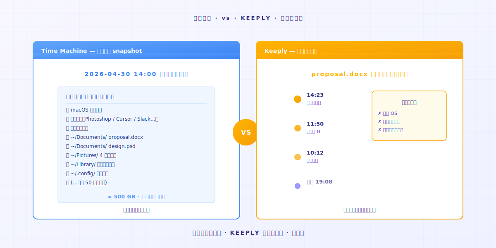

# Keeply เก็บอะไรจริงๆ? ต่างจากเครื่องมือ backup และ cloud อย่างไร

> เครื่องมือ backup ครอบคลุมทั้ง disk เครื่องมือ cloud ครอบคลุมเวอร์ชันล่าสุด Keeply ครอบคลุมประวัติของทุกการเปลี่ยนแปลง สามงานคนละอย่าง

## สารบัญ

1. [Keeply เก็บอะไร?](#what-keeply-saves)
2. [เครื่องมือ backup เก็บอะไร?](#what-backup-saves)
3. [เครื่องมือ cloud เก็บอะไร?](#what-cloud-saves)
4. [คุณต้องการกี่อัน?](#how-many-do-you-need)

---

วิศวกร A เพิ่งติดตั้ง Keeply เสร็จ เพื่อนร่วมงาน B เดินมาถาม: "อันนี้ต่างจาก Time Machine ที่มากับ Mac ของฉันยังไง?"

วิศวกร A ค้าง เขารู้ว่ามันต่าง แต่บอกไม่ได้ว่าต่างตรงไหน

นี่คือความต่าง: **backup, cloud และ Keeply เป็นสามงานคนละอย่าง** งานของพวกมันไม่ทับซ้อน นั่นคือเหตุผลที่มีสามชื่อต่างกัน

---

## Keeply เก็บอะไร? {#what-keeply-saves}

Keeply เก็บ **ทุกการเปลี่ยนแปลงของทุกไฟล์**

คุณแก้ `proposal.docx` สองครั้งวันนี้ คุณบันทึกสองครั้ง Timeline แสดง file note สองอัน อยากกลับไปเวอร์ชันจากการบันทึกครั้งแรก? คลิกรายการนั้น 30 วินาทีคุณก็ถึง

มันไม่เก็บ Google Doc ของคนอื่น มันไม่เก็บ app settings ของคอมพิวเตอร์คุณ มันเก็บแค่ **ทุกไฟล์บนคอมพิวเตอร์คุณเปลี่ยนยังไงตามเวลา**

ถ้าความต้องการของคุณคือ "ฉันอยากกลับไปเวอร์ชันก่อนการแก้วันพฤหัส" นั่นคืองานของมัน

---

## เครื่องมือ backup เก็บอะไร? {#what-backup-saves}

เครื่องมืออย่าง Time Machine, Acronis True Image และ Backblaze เก็บ **snapshot ของทั้ง disk ในจุดเวลาหนึ่ง**

งานของพวกมันไม่ใช่กู้ไฟล์เดียว มันเก็บ **ว่าคอมพิวเตอร์ทั้งเครื่องของคุณหน้าตาเป็นยังไงในวันนั้น** OS, app, settings, ทุกโฟลเดอร์ ทั้งหมดด้วยกัน

ถ้าฮาร์ดไดรฟ์คุณตายหรือทั้งคอมพิวเตอร์หาย backup กู้ทุกอย่างกลับได้ **นั่นคือเหตุผลจริงที่มันมีอยู่**

แต่ถ้าคุณแค่อยากหาเวอร์ชันของ `proposal.docx` ก่อนการแก้ตอน 10:23 วันพฤหัส backup ทำได้ แต่คุณต้องกู้ snapshot ทั้งอันก่อนเพื่อดึงไฟล์เดียวนั้นออกมา **นั่นไม่ใช่ปัญหาที่มันถูกออกแบบมาแก้**

---

## เครื่องมือ cloud เก็บอะไร? {#what-cloud-saves}

เครื่องมืออย่าง Dropbox, iCloud, OneDrive และ Google Drive เก็บ **เวอร์ชันล่าสุดของไฟล์ + sync ข้ามอุปกรณ์**

คุณแก้ไฟล์บนคอมพิวเตอร์ A คอมพิวเตอร์ B sync copy ล่าสุดอัตโนมัติ **งานของพวกมันคือ sync "copy ล่าสุด" ไปยังทุกอุปกรณ์ของคุณ**

พวกมันมี version history แต่ปกติ **เก็บแค่ 30 วัน** — แผนมาตรฐานของ Dropbox, Google Drive และ OneDrive ทำตามกฎนี้ทั้งหมด พ้นจากนั้น มันหายไป

ถ้าความต้องการของคุณคือ "ฉันอยากได้ copy ล่าสุดบนคอมพิวเตอร์ทุกเครื่องที่ใช้" นั่นคืองานของพวกมัน แต่สำหรับเวอร์ชันจาก 3 เดือนที่แล้ว cloud มักไม่มีแล้ว

---

## คุณต้องการกี่อัน? {#how-many-do-you-need}

| Scenario ของคุณ | เครื่องมือหลัก |
|---|---|
| อยากกู้เวอร์ชันเก่าของไฟล์ | **Keeply** (Timeline คลิกแล้วกู้คืน) |
| คอมพิวเตอร์ทั้งเครื่องพัง ต้องกู้ข้อมูล | **เครื่องมือ backup** (Time Machine / Acronis / Backblaze) |
| sync เวอร์ชันล่าสุดข้ามหลายอุปกรณ์ | **Cloud** (Dropbox / iCloud / OneDrive) |

ในทางปฏิบัติ **ใช้ทั้งสามคือ setup ที่สมบูรณ์ที่สุด**

Keeply ครอบคลุมไทม์ไลน์ประวัติของทุกไฟล์ Backup ครอบคลุม snapshot ของทั้งคอมพิวเตอร์ Cloud ครอบคลุม sync ข้ามอุปกรณ์ สามงานที่เสริมกัน ไม่ใช่แข่งกัน

ถ้าเลือกได้แค่อันเดียว **ดูว่า scenario ไหนคุณเจอบ่อยที่สุด**: อยากหาเวอร์ชันเก่าบ่อย? Keeply กังวลว่าไดรฟ์จะตาย? Backup ทำงานข้ามหลายคอมพิวเตอร์? Cloud

---

## สรุป

กลับไปที่สิ่งที่วิศวกร A พูดกับเพื่อนร่วมงาน B:

"มันต่างจาก Time Machine Time Machine ครอบคลุม snapshot ของคอมพิวเตอร์ทั้งเครื่อง Keeply ครอบคลุมไทม์ไลน์ประวัติของทุกไฟล์ **ฉันใช้ทั้งสอง**"

ถ้าคุณก็อยากลอง Keeply เพื่อไทม์ไลน์ประวัติ ลากโฟลเดอร์เข้า [Keeply](https://keeply.work/) มันจำที่เหลือเอง

---

## อ่านเพิ่มเติม

- [วิธีใช้ Keeply, File-Note App: 2 การกระทำ ไม่ต้องเรียน 30 ฟีเจอร์](/th/post/keeply-getting-started-from-zero/) (PILLAR 3, คู่มือ onboarding Keeply ฉบับเต็ม)
- [คู่มือฉบับเต็มเรื่องการจัดการเวอร์ชันไฟล์](/th/post/file-version-management-complete-guide/) (PILLAR 1, ทำไมการจัดการเวอร์ชันถึงสำคัญ)

---

*ผู้เขียน: Ting-Wei Tsao, ผู้ก่อตั้ง Keeply | [LinkedIn](https://www.linkedin.com/in/tingwei-tsao/)*
