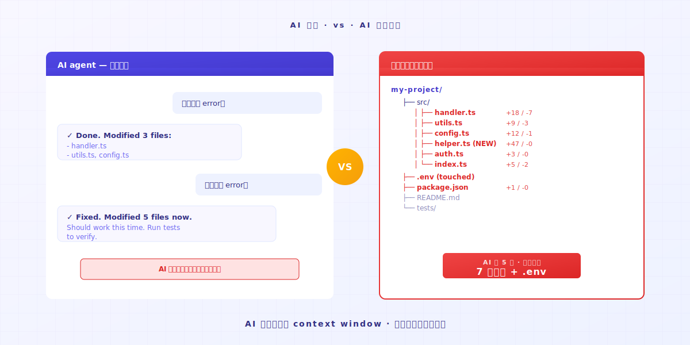

# Vibe Coding chệch đường? Một hành động để khôi phục về phiên bản chạy được

> AI agent lao về phía trước, code không chạy được. Mở Keeply Timeline. Phiên bản chạy được cuối cùng vẫn còn ngay đó.

## Mục lục

1. [Khoảnh khắc AI vượt quá đà trông như thế nào?](#ai-overshoot)
2. [Một hành động: mở Timeline, nhấp vào điểm chạy được cuối cùng](#one-action)
3. [Vì sao AI sẽ không tự khôi phục](#ai-doesnt-rollback)

---

Kỹ sư A mở Cursor và bảo AI sửa một bug. AI làm xong. Code không chạy được. Anh bảo AI sửa lại. AI động vào tệp thứ ba. Vẫn hỏng. Nó chỉnh sửa tệp thứ năm. Đến lúc này Kỹ sư A không còn chắc AI đã thay đổi những tệp nào.

Lúc này có lẽ bạn đang nghĩ: dừng lại, quay về trạng thái mà ít nhất khoảnh khắc trước còn chạy được.

Vấn đề là: **làm sao bạn biết phiên bản nào là phiên bản đã chạy?**

---

## Khoảnh khắc AI vượt quá đà trông như thế nào? {#ai-overshoot}

Bạn đang vibe coding. Bạn đưa AI một mục tiêu. AI viết một đoạn.

Chạy. OK.

Vòng tiếp theo, bạn nói "thêm một tính năng nữa." AI động vào 3 tệp. Chạy — lỗi.

Bạn nói "sửa lỗi đó." AI động vào 5 tệp, chỉnh sửa config, thêm một hàm helper bạn không bao giờ yêu cầu. Chạy — thêm lỗi.

AI vẫn đang tự tin sửa chữa. **Nó sẽ không tự nguyện nói "tôi có thể đã làm hỏng cái này."**

Trí nhớ của nó chỉ là cửa sổ ngữ cảnh hiện tại. **Nó không biết rằng 5 prompt trước code của bạn vẫn ổn.** Nhưng các tệp trên máy tính của bạn biết. Miễn là có ai đó nhớ.

---

## Một hành động: mở Timeline, nhấp vào điểm chạy được cuối cùng {#one-action}

### Bước 1: Mở Keeply Timeline

Tab đầu tiên ở thanh bên trái. Bạn sẽ thấy mọi thay đổi hôm nay, sắp xếp theo thời gian.

### Bước 2: Tìm điểm cuối cùng nơi code "vẫn còn chạy"

Mỗi mục trên Timeline là một điểm lưu tự động của Keeply hoặc một khoảnh khắc bạn đánh dấu thủ công. Mở từng điểm để xem các thay đổi bên trong, và tìm phiên bản bạn nhớ là "đã test OK lúc đó."

Thường là 30-60 phút trước. Lần test cuối trước khi AI bắt đầu đi chệch.

### Bước 3: Nhấp chuột phải vào mục đó, chọn Restore

Cả thư mục trở về điểm thời gian đó trong vòng 30 giây. **Tất cả tệp, toàn bộ cây thư mục, mọi config — tất cả cùng quay lại.** Không chỉ một tệp.

Bao gồm cả hàm helper mà AI đã lén thêm vào, config nó đã chỉnh, file .env nó đáng lẽ không nên động đến. **Tất cả khôi phục về.**

Rồi bạn chạy. Nó hoạt động.

Toàn bộ quá trình mất chưa đến một phút. **Bạn không phải nhớ AI đã động vào những tệp nào. Keeply đã nhớ tất cả.**

---

## Vì sao AI sẽ không tự khôi phục {#ai-doesnt-rollback}

AI agent được thiết kế để **lao về phía trước**. Chúng nhận một prompt, sản xuất một chỉnh sửa. Chúng sẽ không dừng lại để nhìn lại và hỏi "vòng vừa rồi có làm dự án tệ hơn không."

Trách nhiệm đó không nằm ở AI. Đó là giới hạn kiến trúc.

Trách nhiệm nằm ở bạn: **bạn cần một lưới an toàn chạy ở nền.** Cứ để AI lao xa tùy thích, vì bạn có thể kéo nó lại.

Keeply không ở đây để thay thế phần bạn viết code. Nó ở đây để khi bạn đang vibe coding, bạn không phải dựa vào trí nhớ để truy ngược lại. Trí nhớ thua tốc độ AI chỉnh sửa tệp.

---

## Kết

Trước khi phiên AI hôm nay đi chệch đường, mở [Keeply](https://keeply.work/) và thả thư mục dự án của bạn vào.

Lần tới khi nó vượt quá đà, bạn mở Timeline và nhấp vào mục cuối. **Vấn đề được đóng trong 30 giây.**

---

## Đọc thêm

- [Cách dùng Keeply, ứng dụng ghi chú tệp: bỏ qua 30 tính năng, lên thuyền với 2 hành động](/vi/post/keeply-getting-started-from-zero/) (PILLAR 3, hướng dẫn onboarding Keeply đầy đủ)

---

*Tác giả: Ting-Wei Tsao, nhà sáng lập Keeply | [LinkedIn](https://www.linkedin.com/in/tingwei-tsao/)*
