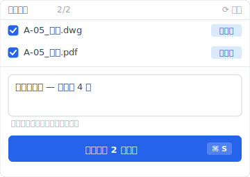

# 【2026 文件管理】图纸版本管理 4 步：为什么施工队总在打开上周的 AutoCAD 旧图

> 早上 9:40 你回办公室、项目经理翻出上周四的修订版。盖板规格早就改了，但你每天在工地、没人通知你。

早上 9:40，你难得回办公室一趟，顺手把昨天现场的照片划给后面项目经理看。排水沟那段混凝土已经灌下去，盖板的承载框也都预埋定位了。

项目经理没说话。他翻开桌上一份 `A-05_水沟_0422_定版.dwg`。

「盖板不是这个规格。设计上礼拜四又改了一次。」

你心里凉了一下。上礼拜四那版是设计寄来办公室的。收信的是小李、他顺手存进 NAS、没通知你。你每天在工地、不是每次都回办公室、这礼拜根本没人告诉过你已经换版。

现场那段已经灌好了。盖板尺寸改。要打石把埋进混凝土的旧框打出来、换上新尺寸的框重新埋、收边、养护、盖板才能盖得下去。工期再往后推两天。

你没传错档给施工队。你只是不知道、档已经换了。

这篇拆完办公室 → 现场那条断线为什么会断、传统做法（严格命名 / 微信通知 / NAS 共享）为什么补不起来、然后让你看 [Keeply](https://keeply.work) 怎么把营造团队版本史一个工具一起做。

## 目录

1. [换 Keeply 后办公室 + 工地看同一条时间轴](#keeply-team-timeline)
2. [「你那份是上礼拜四的修订版吗？」——5 个文件名你记不住哪份算数](#which-version)
3. [定案前会冒出好几版、然后设计又改回去：为什么版本管理不能等定版](#why-iterate)
4. [办公室知道、现场不知道：3 方时间线最容易断的那条](#office-vs-site)
5. [图纸版本管理 4 步实战：办公室 + 现场对齐 + Keeply 同步保管库](#autocad-4-step)
6. [唯一不需要的人：工地现场照图施作的师傅](#when-not-needed)

---

## 换 Keeply 后办公室 + 工地看同一条时间轴 {#keeply-team-timeline}

先让你看现在。同样一个 `A-05_水沟.dwg`、设计从 3 月初版改到今天第 5 版——在 [Keeply](https://keeply.work) 里，这个工地项目保管库的时间轴看起来是这样：

「修改盖板规格 — 设计第 5 版」自己一行、有「最新版」tag。「甲方审阅后正式版」自己一行、有「定版」tag。

办公室小李今天 15:30 收到设计邮件、打开文件改完、点 Keeply 主窗口「保存版本」按钮写笔记：

他写了「盖板规格改 — 设计第 4 版」。

**重点是这个**：小李用的 Keeply 跟你工地用的 Keeply 是**同一个保管库**（公司 NAS）。他存进去那一刻、你的 Keeply 时间轴顶端就会多一条。明天早上你打开电脑、看到「修改盖板规格」那一行有「最新版」标签——你就知道「等等、新版上来了、我得先看再去现场」。

加上 Keeply 在背景每 30 分钟自动轮询——设计可能再改、办公室还没主动标、但文件变了 Keeply 30 分钟内会侦测到。

下面拆传统做法（严格命名 / 微信通知 / NAS 共享）为什么补不起这条断线。

---

## 「你那份是上礼拜四的修订版吗？」——5 个文件名你记不住哪份算数 {#which-version}

这是项目经理回头问你时最常听到的一句。

你打开电脑找「最新版」。NAS 的项目夹里有 `A-05_水沟_0418.dwg`、`A-05_水沟_0422_定版.dwg`、`A-05_水沟_0422_定版_改盖板.dwg`、微信群传过 `A-05_水沟_0420_避开雨水管.dwg`。还有设计 3 月时第一次交的 `A-05_水沟_0315.dwg`、你没删、因为设计改一改有时候又改回接近原版。

5 个文件名、你知道其中一份是现场该照着做的。但你**不记得是哪一份**。你上礼拜在工地三整天、这周的新版进 NAS 的时候你不在。没人通知你。办公室的小李觉得他「有存进去就好」。

这不是你懒、也不是小李坏心。是**新图进办公室跟新图到现场之间、没有人把这条线接起来**。你刚好是站在这条断线两边的人。

---

## 定案前会冒出好几版、然后设计又改回去：为什么版本管理不能等定版 {#why-iterate}

你会问：「那我每次来办公室都重新对一次不就好了？」

理论上可以。实务上困难的原因、是**定案前的版本会一直长新的**。

一个段落的设计、从初稿到定版、中间会出很多版本。甲方提一次意见改一次。现场踏勘发现障碍物改一次。技师复核改一次。**然后设计改到第 5 版、甲方突然说第 2 版的收边比较好、就又改回去**。你看到 NAS 里六个文件、其中两个的内容其实差不多。但你不知道哪一个才是现在算数的。

如果每次都等设计「完全定版」才开工、营造厂会被工期拖死。三个工序卡在你这一段、每一天人力、机具、进度全部在烧。所以营造厂会铤而走险、**先照最新看过的那版做**。赌后面不会再改。

很多时候赌赢。偶尔赌输一次、就是这周这段水沟。

---

## 办公室知道、现场不知道：3 方时间线最容易断的那条 {#office-vs-site}

真正的断点在这里：**办公室收到新图、现场不知道、没人把信息接过去**。

办公室那边、收信的可能是行政、可能是助理、可能是另一个主任。他收完第一个动作是「存好」。进 NAS、分类、归档。他不一定知道现场这周已经做到哪、也不一定知道这版跟上版的差别大到要立刻通知。对他来说、存好就是负责。

现场这边、你天天在工地。就算你每周回办公室一次、从你上次核对到这次之间、设计可能已经出过两版、改过一次、又改回来。你查是查得到、但**你要谨慎地主动回来查**。这件事、没有主任每次都做得到。

施工队那边、照你给他的最后一份做。他不知道办公室是不是已经有新版。他也不该需要知道。他的责任是照图施作、不是追版本。

这三方的时间线里、**办公室跟现场之间那条是最容易断的**。不是因为谁怠惰、是因为没有机制硬逼这条线必须通。微信群里一条「新版已上传」的消息、漏了就是漏了。

---

## 图纸版本管理 4 步实战：办公室 + 现场对齐 + Keeply 同步保管库 {#autocad-4-step}

要做的其实不多。四件事。

**一、新版一进办公室、当下通知现场 + 要一个「收到」回复。** 不是「存好就算」、是**handshake 完成才算**。微信群也好、电话也好、规矩是「现场那个人有没有明确回『收到』」。没这个回复、就不算完成交接。

**二、每次新版覆盖旧版之前、那一版独立留下来。** 文件名写 `A-05_水沟_0418_设计_v3.dwg`、`A-05_水沟_0422_设计_v4.dwg`。这是**为了设计又改回去那一次**。你回头找得到第 3 版原来长什么样。

**三、让 [Keeply](https://keeply.work) 自动记住每一版 + 全部人都看得到。** 第一、二步靠意志力做不到、或做不满的地方、工具补位。每次办公室点「保存版本」+ 写笔记、整个保管库的成员（小李办公室、你工地、陈领班）打开 Keeply 都看到同一条时间线。Keeply 在背景每 30 分钟轮询一次文件变更——设计就算改了没主动标、30 分钟内 Keeply 会侦测到、时间轴自动多一条。

**兼容性**：Keeply 在底层记录、兼容于公司现有的 NAS、SharePoint、OneDrive Business、Synology、QNAP、共享网络磁盘。文件不搬家、不换 AutoCAD、不改施工队作业流程。

诚实说：两张 `.dwg` 的图面要比对细节差异、还是得开 AutoCAD 自己看；Keeply 不做 CAD 图面比对。但「有没有新版进来、是谁、什么时候、你看过没」这件事不会再漏掉。项目经理问「你有没有看过上周四那版」、时间轴一目了然。

**四、一份不在办公室、不在工地 NAS。** 外接硬盘、云端、备份槽、哪个都行。重点是**至少一份异地**。公司 NAS 坏了、被清了、被接手的人用掉、你回不来。异地备份是你给自己买的最便宜的保险。

第一步没有工具也能靠纪律做、但诚实说、做三个月你会漏一半。第三步是让工具接住那一半。

---

## 唯一不需要的人：工地现场照图施作的师傅 {#when-not-needed}

诚实讲：这篇不是写给所有工程人员的。但排除名单比你想像的短。

**唯一完全不需要的人、是现场按图施作的师傅。** 他们的职责是照拿到的那一份图做事、不是追版本。追版本是你的工作。

**公共工程反而最需要。** 你以为大型公共工程、政府案「已经有 BIM 协同平台所以不用」？恰好相反。公共工程的文书量是民间案的好几倍、变更申请一来一往跨月、管理层异动比民间更频繁、文件累积更快、记忆断链更容易。BIM 平台解的是最终交付成果、解不了计划书、公用文件、设计图在过程中的变动笔记。而那才是每天真正在长的东西。

**一个人做的小案也需要。** 你可能会想：「案子就我一个人从头管到尾、还需要版本管理？」需要。因为三个月后你回头看同一个文件、你会**忘记自己当时为什么要变更设计**。时间轴存的不只是图、是你每一次改动当下的理由。未来的你会感谢现在的你留下这条轨迹。

其他所有人。中小型住宅、透天、外构、排水、景观、道路、校园、商办、室内装修、公共工程、BIM 案、独立接案、事务所。**只要你的工作牵涉「这个文件会被改、会被别人或未来的你再打开」、你就需要一条时间线**。每断一次、时间跟钱都从你口袋出去。

---

## 延伸阅读

主篇 [文件版本管理完整指南](/zh-cn/post/file-version-management-complete-guide/) 拆解 4 个结构性原因——为什么工具就是没设计给你这件事。

对照阅读：[共享文件夹的命名税：4 人团队一年花 83 小时改 _v7_FINAL_千万别动 后缀](/zh-cn/post/hidden-cost-shared-folders/) — 共享文件夹的设计缺陷。

备份原则：[3-2-1 备份原则：20 年了还够用吗？](/zh-cn/post/3-2-1-backup-rule/) — NAS + 异地备份的搭配。

---

一张 dwg 不只是一张图。它是设计那边的决定、办公室那边的存档、现场这边的施作。这三件事**必须在同一版上对齐**、才算数。

还记得早上 9:40、项目经理翻开新版、你心里凉了一下的那个瞬间吗？打开 [Keeply](https://keeply.work)、看时间轴顶端那条「最新版」tag——下次新版进办公室、你工地的 Keeply 30 分钟内就会多一条、不会再灌错。

---

> 关于作者：Ting-Wei Tsao，[Keeply](https://keeply.work) 创办人。
> [LinkedIn](https://www.linkedin.com/in/ting-wei-tsao-b57480152/)
