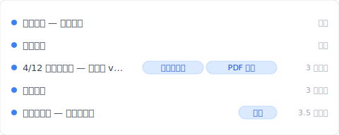
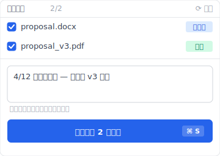

# 【2026 文件管理】Word 存得住版本、存不住 3 个月后的记忆：Keeply 怎么补

> Word 自动恢复、OneDrive 版本历史、Time Machine 都是存储层救援。3 个月后客户问哪版？要工具层的常驻版本历史。

周六晚上 11:23、客户问你：「3 月那版你寄我的提案可以再传一份吗？」

你打开 OneDrive 版本历史。只剩一周。Word 自动恢复 在文件关闭时就清除掉。电脑里 7 个 `_v` 字尾文件、没一个对得上 3 月那次交付。

3 个月前你按下保存那一刻的版本、工具没记得。

Keeply 用户聊过最多次的、是这通晚上 11:23 的消息。这篇拆完 Word 自动恢复 / OneDrive / Time Machine 各自的保留期限制、Microsoft 为什么这样设计、然后让你看 [Keeply](https://keeply.work) 怎么用「常驻版本历史 + 业主核定版 tag + PDF 收执单」根治。

## 重点

Microsoft Word 的「**版本历史**」、自动恢复、OneDrive 版本记录都是**存储层救援机制**。设计给「打到一半崩溃」用、保留期短：从文件关闭就清除、到云端版本历史约 500 个版本上限。这是存储救援、不是交付追踪。3 个月后客户问哪版？要工具层独立的常驻版本历史、加上交付当下的元数据标记、才找得回。

## 本文目录

1. [换 Keeply 后我 3 个月前的提案 3 秒翻得到](#keeply-timeline)
2. [Word 内建版本历史能做什么？自动恢复 / 自动保存 / OneDrive 三种机制](#word-three-mechanisms)
3. [自动恢复 / OneDrive / Time Machine：各能保留多久？4 个保留期数字](#retention-numbers)
4. [为什么这些机制守不到 3 个月后？存储层 vs 工具层的设计差](#storage-vs-tool-layer)
5. [找回 3 个月前的交付版本，Keeply 怎么补：常驻版本历史 + 业主核定版 + PDF 收执单](#keeply-fills-gap)
6. [不必装 Keeply 的 4 种 Word 场景](#when-not-needed)
7. [常见问题](#faq)

---

## 换 Keeply 后我 3 个月前的提案 3 秒翻得到 {#keeply-timeline}

先让你看现在。同样是 `proposal.docx`、同样 3 个月前 4 月那次交付——在 [Keeply](https://keeply.work) 里，这个客户提案保管库的时间轴看起来是这样：

「4/12 业主核定版 — 给客户 v3 简报」自己一行、有「业主核定版」+「PDF 收执」两个 tag——后者是 Keeply 的 Release 机制（对应 ADR-003）：那一版会冻结成独立快照、附当天导出的 PDF 收执单（含 commit hash 证明）、永远不被后续保存覆盖。

3 个月后 11:23 那条消息来、你打开 Keeply、看时间轴顶端「业主核定版」tag——3 秒回客户。

那行笔记怎么来的？4 月 12 日下午、简报定稿给客户之前、你点 Keeply 主窗口「保存版本」按钮、跳出来这个对话框：

写一行「4/12 业主核定版 — 给客户 v3 简报」、保存版本——同时把那天导出的 PDF 也标进这版的 Release。3 个月后客户问哪版、PDF 跟原始 .docx 都在那一行。

加上 Keeply 在背景每 30 分钟轮询 Word 文件变更——你忘记主动标、30 分钟内也会有自动保存版本。Word 自动恢复 限制（文件关闭就清）Keeply 解。

下面拆 Word 自动恢复 / OneDrive / Time Machine 各自的保留期限制、Microsoft 为什么这样设计。

---

## Word 内建版本历史能做什么？自动恢复 / 自动保存 / OneDrive 三种机制 {#word-three-mechanisms}

Word 跟 Office 生态系内建有 3 种「**版本还原**」机制：

- **自动恢复**：崩溃时救回未保存的内容。预设每 10 分钟自动暂存一份。文件正常关闭后就清除。
- **自动保存**（OneDrive / SharePoint 线上 Word）：边打边存到云端。
- **OneDrive 版本历史**：保留每次保存的版本快照、可回头看任意时间点。OneDrive / SharePoint [官方文档](https://learn.microsoft.com/en-us/sharepoint/document-library-version-history-limits)指出预设保留 500 个主要版本（个人 Microsoft 账号限 25 版）。

这 3 种设计目的都很清楚：给「**打到一半崩溃**」、「**刚刚存错了**」这类**短期存储事故**用。它们不是「**3 个月后客户问哪版**」这种场景的设计目标。

---

## 自动恢复 / OneDrive / Time Machine：各能保留多久？4 个保留期数字 {#retention-numbers}

要看这些机制守不守得住、先看保留期数字：

| 机制 | 预设保留期 | 清除条件 | 适合场景 |
| --- | --- | --- | --- |
| Word 自动恢复 | 文件关闭即清除 | 文件关闭、Word 重启 | 崩溃救援 |
| OneDrive 自动保存 | 边打边存 | 实时同步覆写 | 实时协作 |
| OneDrive 版本历史 | 预设约 [500 个版本](https://learn.microsoft.com/en-us/sharepoint/document-library-version-history-limits)（个人账号 25 版） | 超过 500 自动清除最旧 | 短期回滚 |
| Mac [Time Machine](https://support.apple.com/en-us/HT201250) | hourly 24h + daily 30 天 + weekly 直到磁盘满 | 磁盘满 | 系统级备份 |
| Windows 文件历史 | 设定可调 | 设定可调 | 系统级备份 |
| **[Keeply](https://keeply.work)** | **无时间上限**（本机 git 不过期） | **使用者主动删除才清** | **长期交付追踪** |

对啊、每个内建机制都有上限。文件关闭清除到 500 个版本、跨不过 3 个月这条线。3-2-1 防的是磁带腐坏、Word 防的是崩溃、这些都不是同一个问题。

---

## 为什么这些机制守不到 3 个月后？存储层 vs 工具层的设计差 {#storage-vs-tool-layer}

这里要拆一个没人明讲的差别：**存储层** vs **工具层**。

软件内建的版本历史活在**存储层**。它存在的目的是「最近一次写入失败就回滚」、所以保留期设得短。从文件关闭清除到 500 个版本上限、这些设计参考的是「平均使用者一个月内回头找的次数」。3 个月以上不在设计目标内、清除掉是合理的。

A 先生是顾问。周六 11:23 客户问他要 3 月那版报告。他打开 OneDrive 版本历史、最旧的是 4 月 28 日。Word 自动恢复 早关了。他电脑里 8 个 `_v` 开头的 .docx、没一个文件修改日期对得上 3 月那周的交付。

等等、这还不是最糟的。A 先生事后想起来、3 月那次他寄附件给客户用的是当天导出的 PDF。原始 .docx 早被覆盖掉了。**他寄出去的 PDF 在客户邮箱里。但他没办法从 PDF 拼回 .docx 那个版本继续改。**

---

## 找回 3 个月前的交付版本，Keeply 怎么补：常驻版本历史 + 业主核定版 + PDF 收执单 {#keeply-fills-gap}

[Keeply](https://keeply.work) 用两件事补存储层的限制：

**常驻版本历史**——每次保存都留下、不会清除。不依赖 OneDrive 订阅、不依赖 AutoSave、文件存桌面也照存。本机 git 没时间上限、500 版本上限不存在。

**业主核定版冻结 + PDF 收执单**（Release 机制、对应 ADR-003）——交付当下你主动点「保存版本」、写笔记「4/12 业主核定版」、可同时把当天导出的 PDF 一起标进这版的 Release。Keeply 把那一版冻结成独立快照（含 commit hash 证明）、永远不被后续保存覆盖。3 个月后客户问哪版、翻 Release tag 就有完整 .docx + PDF。

B 小姐用 Keeply 半年。周一早上客户问她要 4 月那版设计稿。她打开 Keeply 时间轴、看到「4/12 业主核定版」自己一行、有 tag、有 PDF 收执单——点开就是当时客户看过的内容。3 秒回客户。

---

## 不必装 Keeply 的 4 种 Word 场景 {#when-not-needed}

Keeply 不取代所有 Word 场景：

**Keeply 不取代 自动恢复**。打到一半崩溃、自动恢复 仍是第一道线（Keeply 30 分钟轮询、不会抓到那一刻的中间状态）。崩溃救援走 Word 本身。

**Keeply 不取代 Microsoft 365 共同编辑**。5 人同时改一份文件、走 Microsoft 365 / Google Docs 比较顺。Keeply 是本机 + 主动推送设计、不是实时协作。

**Keeply 不能溯及既往**。没装 Keeply 过的旧交付、本文救不了你（过去那版 Keeply 没记到）。从今天开始的每次交付才救得了。

**法规合规场景**。SOX / HIPAA / GDPR 需要不可变存档走 Veeam / Acronis / 行业专属封存软件。Keeply 是日常版本管理、不是合规工具。

以上都不适用——你常被客户 3 个月后问哪版、想要交付有 PDF 收执单留底——这时候装 Keeply 才划算。

---

## 常见问题 {#faq}

**Q1: Word 自动恢复 预设关不关得掉？**

可以关、但预设是开的。设定路径：「文件 → 选项 → 保存 → 保存自动恢复信息每 10 分钟」。但 自动恢复 在文件正常关闭后会清除。不算长期保留。

**Q2: OneDrive 个人版跟商务版版本历史保留一样多吗？**

不一样。OneDrive 个人预设约 500 个版本。商务版（Microsoft 365）也预设 500 个但管理员可调、到上限就清除最旧。

**Q3: Time Machine 算备份还是版本管理？**

Time Machine 是系统级备份。它保留整个磁盘快照、不会单独追踪「proposal.docx 每次保存的版本」这个层级。要从 Time Machine 救单档特定版本可以做、但很麻烦。

**Q4: Google Docs 修订版能保留多久？**

Google 没公开明确保留期数字。[官方文档](https://support.google.com/docs/answer/190843)指出「较旧的修订版可能会被合并」以节省空间。实务经验：3 个月以上的修订版常被自动合并或清除。

**Q5: Keeply 跟 Git 是同一类东西吗？**

不是。Git 是给软件工程师用的版本控制工具——界面是黑底白字终端机、要学一套词汇才会用。Keeply 是给非工程师从零设计的版本管理工具：界面是文件窗口、看到的词是「保存版本 / 记录 / 还原」、没有工程师术语。两者解类似的问题（保留文件历史）、但设计对象、界面、心智模型都不同。

---

## 延伸阅读

主篇 [文件版本管理完整指南](/zh-cn/post/file-version-management-complete-guide/) 拆 4 个结构性原因——为什么工具就是没设计给你这件事。

对照阅读：[Keeply 跟备份、云端工具有什么不一样](/zh-cn/post/what-keeply-saves-vs-backup-cloud/) — 三件不同事的完整对照。

Excel 版本历史限制：[Excel 历史版本只回 1-2 版？4 个 Microsoft AutoSave 没讲的限制](/zh-cn/post/excel-version-history-limits/) — 同 Microsoft 设计、不同文件类型。

---

11:23 那条消息、下次出现是什么时候你不知道。

但你知道一件事：5 分钟前的版本和 3 个月前的版本、工具不能不分。

打开 [Keeply](https://keeply.work)、看时间轴顶端那条「业主核定版」tag——下次客户 11:23 问你、不必再翻 7 个 `_v` 字尾文件猜哪份是 3 月那次交付。

---

> 关于作者：Ting-Wei Tsao，[Keeply](https://keeply.work) 创办人。
> [LinkedIn](https://www.linkedin.com/in/ting-wei-tsao-b57480152/)
