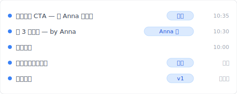
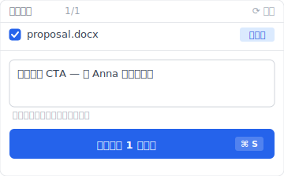

# 【2026 文件管理】Dropbox 冲突的副本：为什么一直出现？4 种触发场景 + Keeply 怎么根治

> Dropbox `(conflicted copy)` 不是 bug，是设计上没做冲突检测层、后存者覆盖前一版的结果。

周四晚上 10:30，你跟同事 Anna 共用 Dropbox 改一份提案。她加了 3 段内容、你同时加了结尾的 CTA。你们都存了档。隔天打开文件夹、多了一份 `提案 (Anna 的 conflicted copy 2026-05-02).docx`。她改的你这里没有、你加的她那里也没有。你花 1 小时手动合并、30 分钟检查有没有漏。

这不是 bug，是 Dropbox 设计上没做冲突检测层的后果。这篇拆完 4 种会触发冲突副本的场景、Dropbox 为什么这样设计、然后让你看 [Keeply](https://keeply.work) 怎么用「本机副本 + 主动推送」根治。

## 目录

1. [换 Keeply 后 Anna 跟你各存一版都进时间轴](#keeply-timeline)
2. [Dropbox 冲突的副本 4 种触发场景：你工作模式至少踩 2 种](#when-it-happens)
3. [Dropbox 为什么这样设计冲突副本？last-writer-wins 的商业取舍](#why-dropbox-design)
4. [手动合并两份文件为什么只是症状治疗？](#why-manual-merge-fails)
5. [3 种同步设计根治冲突副本：Git-style 检测 / 文件锁定 / Keeply 本机副本](#three-designs)
6. [不必装 Keeply 的 Dropbox 冲突副本 4 种场景](#when-not-needed)

---

## 换 Keeply 后 Anna 跟你各存一版都进时间轴 {#keeply-timeline}

先让你看现在。同样是周四晚上 10:30、Anna 加 3 段背景、你加结尾 CTA——在 [Keeply](https://keeply.work) 里，这个项目保管库的时间轴看起来是这样：

「加 3 段背景 — by Anna」自己一行、有「Anna 的」tag。「加完结尾 CTA — 等 Anna 合进来」也自己一行、有「你的」tag。两个版本都在、有笔记说明各自改了什么、可以打开看完后决定怎么合。

没有 `(conflicted copy 2026-05-02)` 后缀。没有「Anna 改的你这里没有」的惊喜。

那行笔记怎么来的？你加完结尾 CTA、点 Keeply 主窗口「保存版本」按钮、跳出来这个对话框：

写一行「加完结尾 CTA — 等 Anna 合进来」、保存版本。Anna 那边也是同样动作。两个版本各自进到保管库的时间轴、互不覆盖。

**Keeply 不自动合并文件内容**——没有同步工具能正确自动合并（那要懂语义）。但 Keeply 把「冲突」变成「两个有笔记的版本并列」、由你决定怎么合。比起 Dropbox 安静地把 Anna 的版本另存成 conflicted copy、你过 3 周才发现、好太多。

下面拆 Dropbox 为什么会这样设计、传统做法（手动合并 / 锁定 / 对齐时间）为什么补不起来。

---

## Dropbox 冲突的副本 4 种触发场景：你工作模式至少踩 2 种 {#when-it-happens}

把「冲突副本一直出现」拆开看、4 种完全不同的场景每个都会触发：

| # | 场景 | 机制 |
|---|---|---|
| 1 | **两人同时编** | 两端都改完上传、Dropbox 不知道前面已被改 |
| 2 | **离线编后上线** | 火车上改一段、回到 Wi-Fi 同步时跟云端版本不一致 |
| 3 | **多设备切换** | 笔电写到一半切手机继续、笔电后来同步撞到手机版 |
| 4 | **跨操作系统时钟差** | Mac 跟 Windows 系统时钟差几秒、Dropbox 判定为冲突 |

没人告诉你的是：4 种之中只要踩到一种、冲突副本就会出现。**而你的工作模式里至少会踩到 2 种**。

---

## Dropbox 为什么这样设计冲突副本？last-writer-wins 的商业取舍 {#why-dropbox-design}

Dropbox 用「后存者覆盖、前一版另存」这个机制：两人同时改、后上传的版本胜出、前一版不丢掉、存成 `(conflicted copy)`。

不是技术做不到冲突检测、是商业取舍：

- **实时体验优先**：同步不能挡你工作。每次都跳「请选择合并方式」会让 Dropbox 变难用
- **冲突解析推给使用者**：把另一版另存 = 「我都帮你留着、你自己决定」
- **设计者的选择**：谁也不丢、但使用者得做工

对啊、这就是让人烦的地方。Dropbox 把工具该做的事（冲突检测 + 提示）推给使用者纪律。而纪律永远赢不过自动化。

---

## 手动合并两份文件为什么只是症状治疗？ {#why-manual-merge-fails}

Dropbox Help Center 教你的修法：「打开两份文件、比对差异、手动合并到主档、删掉冲突副本。」一听很合理。

但这个修法**不改变机制**。你下个礼拜还会再撞到同步冲突、还会再产生新冲突副本、还会再手动合并。一个月之后你已经做这件事 4-5 次。

你不是不会合并。你是在用一个**设计上不挡冲突的工具**。解法是换同步机制、不是训练自己合并得更快。

对比 Google 前 3 名搜索结果（Dropbox Help / EaseUS / Wondershare）：他们都是症状治疗指南、没人从机制角度切入。

---

## 3 种同步设计根治冲突副本：Git-style 检测 / 文件锁定 / Keeply 本机副本 {#three-designs}

把同步设计能做的事拆成 3 种模式。每种对应不同的冲突场景：

### 设计 A：检测 + 提示（同步时主动问你）

两端改同档、同步时检测冲突、跳界面提示给使用者选：留 A、留 B、或把两个变更合并。**例子**：工程师圈用的版本控制工具用这种模式。**Keeply** 把同样的检测搬进办公室工具：撞到冲突时、用「Anna 的版本」「你的版本」这种白话让你选、不会跳出术语。**解场景 #1 + #2**。

### 设计 B：文件锁定（谁开了谁先用）

你打开文件、工具自动锁住。同事打开看到「Anna 在用」、不能改、要等。**例子**：SharePoint、Adobe Creative Cloud Files、Bentley ProjectWise（建筑业项目管理系统）。**解场景 #1 + #3 + #4**、取舍：同事得等。

### 设计 C：本机副本 + 主动推送（Keeply 模型）

你的工作版本在本机、Keeply 在背景每 30 分钟轮询自动存（不是 Dropbox 那种实时同步到云端）。每个人各自在自己电脑上改、各自点「保存版本」、推送时把自己的版本进到共用保管库。如果 Anna 已经推了一版、你推时看得到她的版本在时间轴、有笔记能看她改了什么、你决定怎么合并后再推。**Keeply** 走这条路。**解场景 #1-#4**、取舍：不像 Dropbox 实时镜像、有 30 分钟轮询间隔 + 主动推送的延迟。

---

## 不必装 Keeply 的 Dropbox 冲突副本 4 种场景 {#when-not-needed}

Keeply 不解所有 Dropbox 场景。诚实列出来：

**大文件实时同步**。Premiere 项目边改边同步、Adobe Creative Cloud Sync 那种、Keeply 本机副本模型不适合（推送一次要几分钟）。

**移动设备访问**。Keeply 是桌面优先、Dropbox 在手机上顺得多。

**外部分享连结**。Dropbox 的「Share link」Keeply 没对应功能。要分享给没装 Keeply 的人看、用 Dropbox / Google Drive 比较直接。

**协作频率超高**（1 小时内多人轮流编辑）。Keeply 比 Dropbox 慢、那种场景该用 Google Docs 共同编辑。

以上都不适用——你常踩 `(conflicted copy)`、想要每个版本有笔记、半年后翻得回——这时候装 Keeply 才划算。

---

## 延伸阅读

主篇 [文件版本管理完整指南](/zh-cn/post/file-version-management-complete-guide/) 拆 4 个结构性原因——为什么工具就是没设计给你这件事。

对照阅读：[Keeply 跟备份、云端工具有什么不一样](/zh-cn/post/what-keeply-saves-vs-backup-cloud/) — 三件不同事的完整对照。

共享文件夹的另一面：[共享文件夹的命名税：4 人团队一年花 83 小时改 _v7_FINAL_千万别动 后缀](/zh-cn/post/hidden-cost-shared-folders/) — 同样是多人协作的设计缺陷、不同切入。

---

下次文件夹多出 `(conflicted copy)` 文件名、你不会再花 1 小时手动合并。你会知道那是机制问题、而且你有别的选项。

打开 [Keeply](https://keeply.work)、看时间轴上 Anna 跟你各自的版本各一行——没有 `(conflicted copy)`、有笔记能看、可以决定怎么合。

---

> 关于作者：Ting-Wei Tsao，[Keeply](https://keeply.work) 创办人。
> [LinkedIn](https://www.linkedin.com/in/ting-wei-tsao-b57480152/)
