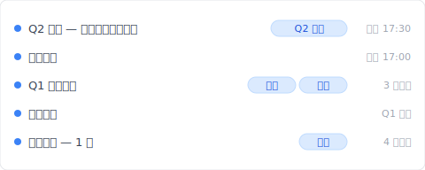
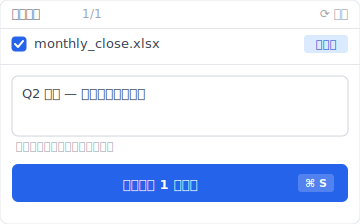

# 【2026 文件管理】Excel 历史版本只回 1-2 版？4 个 Microsoft AutoSave 没讲的限制 + Keeply 怎么补

> Excel 版本历史按钮变灰、只回 1-2 版？不是 错误、是 Microsoft 把 AutoSave 当 OneDrive 订阅诱饵设计。

周五下午 5:47、你在改月底结算 Excel。刚刚删了一段公式想试另一个算法、结果改错了。Ctrl+Z 一直按、按到上限就回不去。打开「文件 > 信息 > 版本历史」——按钮是灰的、按不下去。你才想到：这份结算表存桌面、没上 OneDrive。30 分钟的公式工作没了。

这不是个案。每个用 Excel 工作的人都会遇到、因为 Microsoft 把版本历史当 OneDrive 订阅诱饵设计。这篇拆完 4 个你会撞到的限制、Microsoft 为什么这样设计、然后让你看 [Keeply](https://keeply.work) 怎么补本机 Excel 的版本管理。

## 目录

1. [换 Keeply 后我的 monthly_close.xlsx 时间轴长这样](#keeply-timeline)
2. [Excel 版本历史按钮为什么是灰的？4 个条件你 1 个都没中](#why-grayed-out)
3. [Microsoft AutoSave 没讲的 4 个限制：桌面只回 1-2 版 / 30 天过期 / 本机无记录 / 没单元格比对](#four-limits)
4. [Microsoft 为什么这样设计？OneDrive 订阅差异化的商业取舍](#why-microsoft)
5. [3 种工具设计怎么补 Excel 版本历史：每次存自动快照 / 自动里程碑 / 版本搜索](#three-designs)
6. [不必装 Keeply 的 4 种 Excel 场景](#when-not-needed)

---

## 换 Keeply 后我的 monthly_close.xlsx 时间轴长这样 {#keeply-timeline}

先让你看现在。同样是 `monthly_close.xlsx`、同样每月跑结算——在 [Keeply](https://keeply.work) 里，这个会计项目保管库的时间轴看起来是这样：

「Q1 结算定版」自己一行、有「定版」「冻结」两个 tag——这是 Keeply 的「发行版」冻结机制（对应 ADR-003）：那一版会被冻结成独立快照、永远不被后续保存覆盖。3 个月后 Q3 出问题你想对照 Q1 那版的公式逻辑、点开那一行就有。

今天 17:30「Q2 结算 — 改完应收账款公式」自己一行——是我下午改完公式时主动点 Keeply 主窗口「保存版本」、跳出来这个对话框、写笔记再存的：

写一行「Q2 结算 — 改完应收账款公式」、保存版本。Keeply 不依赖 OneDrive、不依赖 AutoSave 开不开、文件存桌面也照存。半年后翻时间轴、看到的是描述、不是纯时间戳。

加上 Keeply 在背景每 30 分钟轮询文件变更（有改才存）——你忘记主动标、30 分钟内也会自动有一版。Excel AutoSave 限制 #1（桌面只回 1-2 版）Keeply 解。

下面拆 Microsoft AutoSave 那 4 个限制各自是什么、为什么 Microsoft 故意这样设计。

---

## Excel 版本历史按钮为什么是灰的？4 个条件你 1 个都没中 {#why-grayed-out}

「文件 > 信息 > 版本历史」这个按钮**只在 4 个条件同时成立时才能用**：(1) 文件存在 OneDrive 或 SharePoint、(2) AutoSave 已开启、(3) 你是商业版授权、(4) 用桌面版而不是网页版。任一条件不符、按钮就变灰按不下去。

没人告诉你的是：多数人的工作模式 4 个条件**一个都没中**——文件存桌面、AutoSave 默认关闭、个人版、桌面跟网页版交替用。所以按钮是灰的才是预设情况、不是你哪里做错。

---

## Microsoft AutoSave 没讲的 4 个限制：桌面只回 1-2 版 / 30 天过期 / 本机无记录 / 没单元格比对 {#four-limits}

把「Excel 版本历史不够用」拆开看、4 个结构性限制不论你怎么设定都绕不过：

| # | 限制 | 后果 |
|---|---|---|
| 1 | **桌面 AutoSave 只回 1-2 版** | 你改错 30 分钟前 = 救不回 |
| 2 | **OneDrive/SharePoint 30 天过期** | 季度检讨时客户要看 60 天前版本 = 没了 |
| 3 | **本机文件完全没版本历史** | 为了隐私存桌面 = 无历史 |
| 4 | **没有单元格层级的比对** | 不能说「保留新加的栏、但救回旧公式」 |

每个限制都是 Microsoft 工程上**故意不解**的选择、不是技术做不到。下一段讲为什么。

---

## Microsoft 为什么这样设计？OneDrive 订阅差异化的商业取舍 {#why-microsoft}

完整的文件历史记录层技术上不难做。Apple 从 2007 年起就在每一台 Mac 内建一个叫 Time Machine 的功能：每小时自动存一版、想回到 3 个月前那一版点两下就有、全部免费。技术早就成熟。Microsoft 工程上做得到、商业上不做。

问题在商业设计：版本历史是 OneDrive 订阅的差异化卖点。如果桌面 Excel 自己就有完整记录、本机文件也有、无时间限制、OneDrive 订阅会少一个绑定理由。

对啊、这就是让人烦的地方。你撞到的不是 错误、是付费墙。只是 Microsoft 不会这样讲。版本历史对使用者是**文件安全网**；对 Microsoft 是**订阅上钩诱饵**。同一个功能两个角色、谁决定行为？决定的人不是你。

---

## 3 种工具设计怎么补 Excel 版本历史：每次存自动快照 / 自动里程碑 / 版本搜索 {#three-designs}

把工具能做的事拆成 3 种设计模式。每种对应前面 4 个限制里的某一些。

### 设计 A：背景轮询自动快照（不依赖云端、不依赖 AutoSave）

工具在背景每 N 分钟轮询文件变更（不是 hook 你按 Ctrl+S 那一刻、是事后检查文件系统）、无论文件存桌面还是云端。**例子**：macOS Time Machine（系统层整个磁盘）、[Keeply](https://keeply.work)（文件层、锁定你指定的工作文件夹）。**Keeply 的区别**：每版完整保留、无时间限制、不像 OneDrive 30 天就清掉。**解限制 #1 + #2 + #3**。

### 设计 B：手动里程碑（每月底/每季度冻结）

工具让你主动标「这版是月底结算 v3」「这版是 Q2 结算」、冻结点之后不论怎么改都还在。**例子**：GitHub Release（工程师圈把某个时间点的程式码冻结成版本的功能、只给开发者用）。**Keeply** 内建一个叫「发行版」的功能（对应 ADR-003）、做同一件事但你不用学任何术语：在版本历史里选一版按「冻结为发行版」、之后永远回得来。**解限制 #2 的延长场景**：季度检讨还能找到当时的版本。

### 设计 C：版本内容搜索

从历史任何版本搜索单元格内容（不只是文件名）。**Keeply** 可以对版本历史内的文字内容做搜索。**解限制 #4 的部分**：虽然不是单元格层级的差异比对、但能找到「那个 100 元的数字最后一次出现是哪一版」。

这时候你就会发现、4 个限制里 #4（单元格层级比对）是真实边界、下一节老实讲为什么。

---

## 不必装 Keeply 的 4 种 Excel 场景 {#when-not-needed}

Keeply 不解所有 Excel 场景：

**单元格层级的差异比对**。Keeply 显示「整档 v3 → v4」、不显示「单元格 B7 从 100 变 105」。要单元格比对仍要用 Microsoft 365 共同编辑、或专门的电子表格 diff 工具（如 Spreadsheet Compare）。

**公式逻辑错误**。Keeply 救「上一版的公式」、不救「公式本身写错」。后者是 Excel 除错工具的领域（如 Trace Precedents、Evaluate Formula）。

**多人实时协作**。Microsoft 365 共同编辑比 Keeply 强（不同场景）。如果你的 Excel 是 5 人同时改、走 Microsoft 365 / Google Sheets 比较顺。

**文件大小仍受硬盘限制**。100 个 50MB 模型 = 5GB、Keeply 本机也是 5GB。云端订阅有自己的容量规则、Keeply 不解云端容量问题。

以上都不适用——本机 Excel 工作、要回去看 30 天 / 90 天前的版本、有特殊版本要冻结——这时候装 Keeply 才划算。

---

## 延伸阅读

主篇 [文件版本管理完整指南](/zh-cn/post/file-version-management-complete-guide/) 拆 4 个结构性原因——为什么工具就是没设计给你这件事。

对照阅读：[Keeply 跟备份、云端工具有什么不一样](/zh-cn/post/what-keeply-saves-vs-backup-cloud/) — 三件不同事的完整对照。

备份原则：[3-2-1 备份原则：20 年了还够用吗？](/zh-cn/post/3-2-1-backup-rule/) — Excel 结算表 + 异地备份的搭配。

---

下次你撞到 Excel 版本历史按钮是灰的、不会再以为自己没做对。你会知道那是 Microsoft 故意设计的结果、而且你有别的选项。

打开 [Keeply](https://keeply.work)、看时间轴顶端那条「Q2 结算」tag——下次月底改公式改错、点时间轴还原、不必再等 OneDrive 订阅开通才有版本。

---

> 关于作者：Ting-Wei Tsao，[Keeply](https://keeply.work) 创办人。
> [LinkedIn](https://www.linkedin.com/in/ting-wei-tsao-b57480152/)
