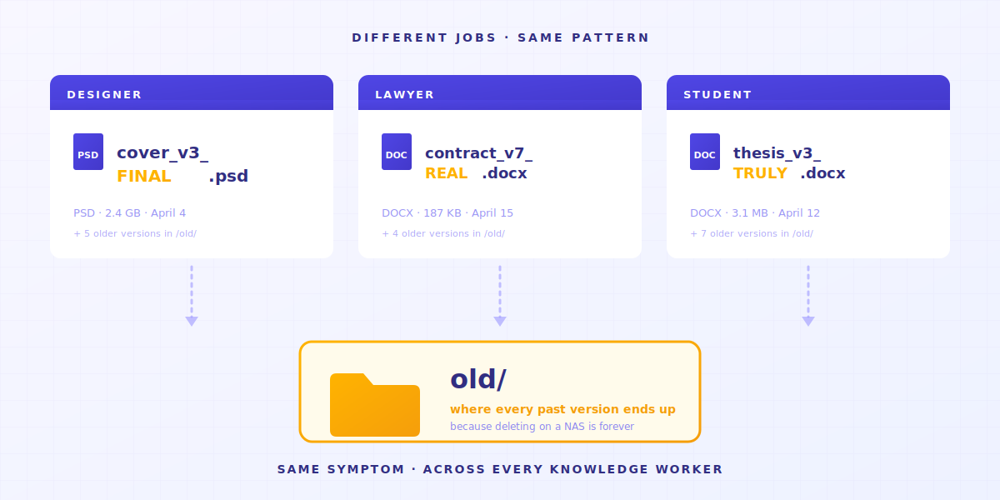
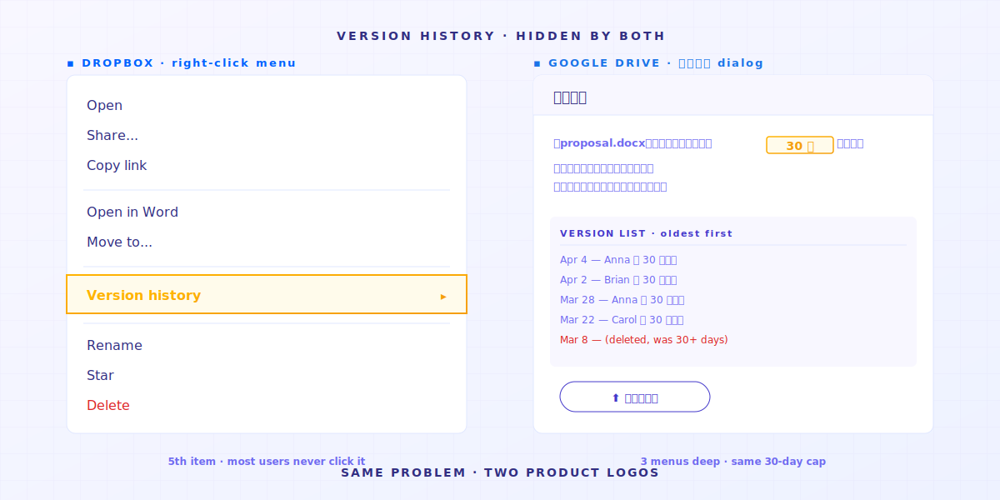
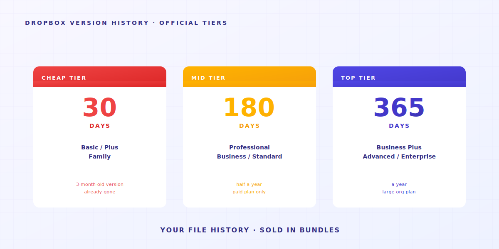
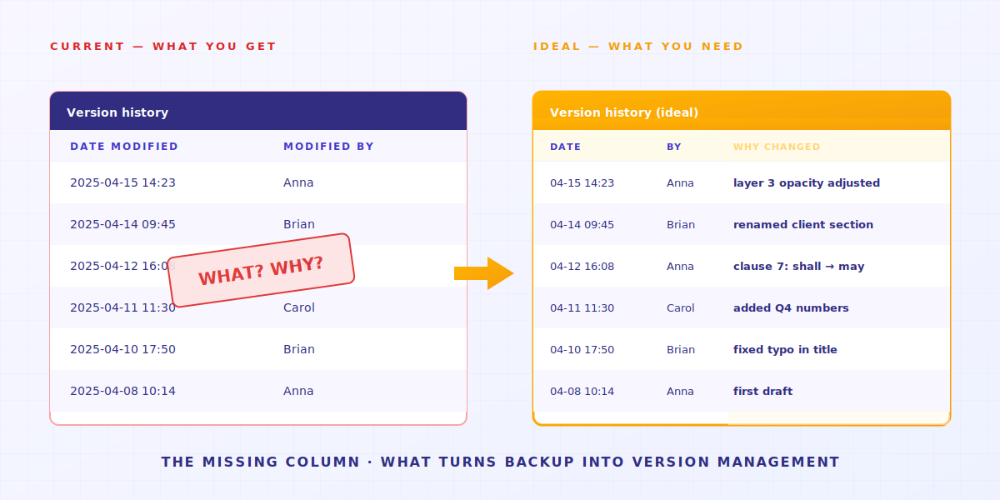
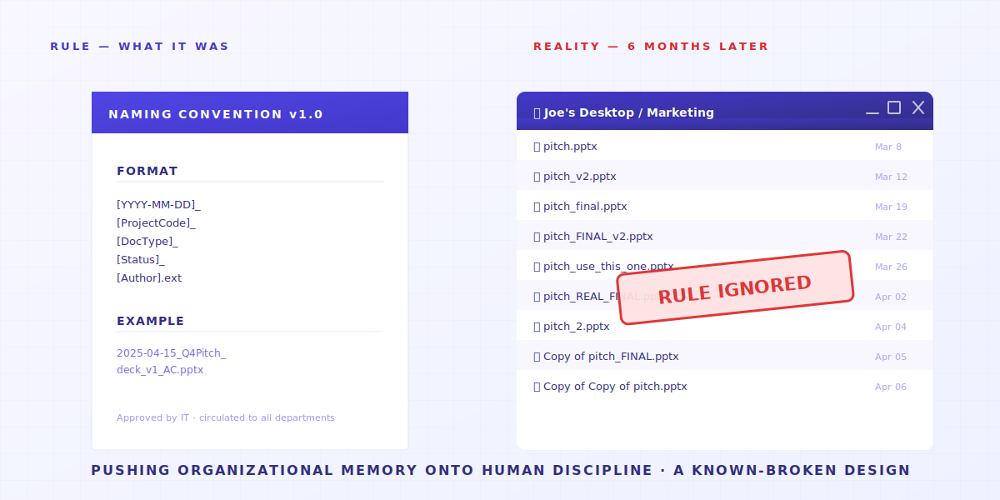

> 不是你不够纪律。是你的工具没设计这个功能。

A 先生是接案设计师。他的桌面有 `_v3_final_FINAL.psd`。
B 小姐在律师事务所当助理。她的硬盘有 `合约_v7_客户版_2025-04-15.docx`。
还有屏幕前的你，可能正打开那个叫 `论文_第三章_老师批改后_真的最终版_v2.docx` 的文件。

不同职业，不同文件名，**同一套症状**。

不是这些人都有强迫症。
而是如果不这样做，**文件结构就会乱成一锅粥**。而且如果你存在 NAS 里面，删掉就再也无法恢复。
所以你常常会看见一个 `old/` 文件夹，暂存以前变更过的所有内容。



---

> **TL;DR** 。 共享文件夹、Dropbox、NAS 这些工具，**本来就不是设计来管文件历史的**。它们有 4 个设计缺口，每个都把工具该做的事推给你。这篇文章一个一个拆，并承认 Keeply 补哪些、不补哪些。

## 文章地图

1. [「上一版」按钮从来不存在](#reason-1)
2. [30 天版本历史是有条件的](#reason-2)
3. [版本历史告诉你「何时」，但为什么不告诉你「为何」？](#reason-3)
4. [命名惯例把组织记忆推给人类纪律](#reason-4)
5. [什么时候 Keeply 不是文件版本管理的正确答案？](#limitations)

---

## 1. 「上一版」按钮从来不存在 {#reason-1}

打开 Dropbox、Google Drive、公司 NAS，你找不到「上一版」按钮——这些工具没做这个功能。它们在乎的是让你三台电脑看到同一份文件，不是让你回到昨天写的那版。

你想找昨天那版设计文件。

打开 Dropbox 或 Google Drive，全部是最新文件。版本历史藏在第三层菜单，不讲真的不知道。



打开公司 NAS，上面那些杂乱的编号就是你的版本历史。


**这类工具本来就不是设计管理文件历史的工具**。

云盘最在乎的事，是让你三台电脑看到一样的文件。
这跟「保留所有旧版」会打架。

所以工具选了同步，**不让你看到历史的历程**。

> 2015 年，UCSD 语言学博士 Will Styler 的论文文件消失了。他有 7 套备份计划，每一套都失效。他事后写了一篇分析给未来的研究生，最后一句是：「Redundancy doesn't prevent stupidity」（多重备份救不了笨）。
> [事故全文](https://wstyler.ucsd.edu/posts/lost_dissertation_files.html)

→ 延伸阅读：[把两年论文压在一台电脑上的赌局](/zh-cn/post/thesis-single-point-of-failure/)

---

## 2. 30 天版本历史是有条件的 {#reason-2}

Dropbox 给你 30 天版本历史，再前面的就没了。30 天不是技术做不到，是商业设计——刚好让你救得回昨天的失误，救不回上季的提案。

技术上做得到吗？做得到。Apple 从 2007 年起就在每一台 Mac 内建一个叫 Time Machine 的功能：每小时自动帮你存一版，要回到 3 个月前那一份文件打开，点两下就有，全部免费。技术早成熟。Dropbox 是故意把 30 天以前藏起来，要你升级付费才看得到。

好。你发现 Dropbox 真的有版本历史。松一口气？

等等。下一个坏消息正在等你：**30 天上限**。



换算成日常：你想找 3 个月前那一版客户提案？除非你付钱，**否则它已经不存在了**。

工具把文件历史变成升级的理由。
（Keeply 让你的文件历史永远免费。）

> 2026 年 4 月，Hacker News 用户 julianozen 发帖：他爸爸把一个 2 年没动的文件覆盖掉，2 天后想救。救不回。Dropbox 解释：超过 30 天保留期上限。julianozen 回：「这不是『30 天记录』的定义。」隔壁网友 lazide 补一句：「Which is bonkers.」 [完整 thread](https://news.ycombinator.com/item?id=47772260)

30 天设计给「我昨天不小心覆盖了」场景。
对「我下周客户要看上一季提案」，**用错工具往往得不到你要的效果**。

→ 延伸阅读：[共享文件夹的隐藏成本](/zh-cn/post/hidden-cost-shared-folders/)

---

## 3. 版本历史告诉你「何时」，但为什么不告诉你「为何」？ {#reason-3}

版本历史只记下「谁、什么时候改了」，不记「改了什么意思」。设计师改了一个图层的透明度、律师把合同「应」改成「得」、研究生把「但仍有局限」改成「明显成立」——版本历史只看到「有人改了」，看不出含义整个翻过去了。

假设你解决了前两个问题：版本历史开了，30 天够用。
还会碰到一个更深的问题。

版本历史告诉你「2025-04-15 14:23 修改」。
**它没告诉你那 14:23 改了什么。也没告诉你为什么改。**



对某些工作这完全 OK。对某些工作直接致命：

- **设计师**改了一个图层透明度 30%。版本历史看到「修改」。看不出哪个图层。
- **律师**改了第 7 条合同「应」变「得」。一字之差。版本历史看到「修改」。看不出哪个字。
- **研究生**把第三章「但仍有局限」改成「明显成立」。从谨慎变武断。版本历史看到「修改」。看不出含义已经反过来。

> 2025 年 1 月，Legal Cheek 收录一则匿名律师故事：实习律师把错的遗嘱当附件寄给错的死者家属。灾难不是「没留版本」，是「他不知道手上哪一份才是当前那版」。 [收录全文](https://www.legalcheek.com/2025/01/courtroom-etiquette-email-blunders-and-document-mix-ups-lawyers-share-their-most-embarrassing-mistakes/)

这就是大家搞错的地方。

**备份是把文件留着。**
**版本管理是把文件留着，还要记下你那次改了什么、为什么改。**

**备份给你前者。管理给了你后者。**

所以你开始把意图塞进文件名：`合同_v7_客户要求改第3条.docx`。
文件名塞不下，你开试算表。试算表负担不了，你开 Slack 频道。
**到最后你的「版本管理系统」是文件名 + 试算表 + Slack + 你的记忆**。任何一个环节失败，整个系统走样。
3 个月后，你打开你的记录，又变得跟以往的记录习惯不一样。

---

## 4. 命名惯例把组织记忆推给人类纪律 {#reason-4}

公司写的命名规则 PDF，6 个月后通常没人遵守。不是同事懒，是这套规则要每个人、每次保存，都记得、愿意、又刚好有时间照规则写文件名。三个条件少一个都不行——譬如赶件赶到一半，谁会停下来想文件名？最后就是 `FINAL`、`FINAL_v2`、`真的最终`。

碰到上面 3 个问题，每家公司的反应都一样，**写一份命名惯例 PDF**。

通常长这样：

```text
[YYYY-MM-DD]_[ProjectCode]_[DocType]_[Status]_[Author].ext
```

很整齐。



然后 6 个月后没人遵守。

不是同事懒。
**而是我们想要控制一群不可控的生物，这个想法本身就可以看到结局。**

> Asana 论坛 2023 年 6 月有一串讨论「最爆笑文件命名失败」。Becky_Caday 写：「同一个文件多版本，因为有人不知道可以打开原文件编辑，就把一个字改大写。`List 2.0` 变成 `LIST 2.0`」。Arndt_Dienstbier 写：「他们用空格做版本」（多个 `Document.docx`，差别只在尾端的空格数）。 [完整讨论](https://forum.asana.com/t/share-your-epic-file-naming-fails-and-lets-laugh-together/462366)

每个成员、每次保存，都要记得 + 愿意 + 有时间照规则命名。任何一条失败，**恭喜你又获得一锅粥**。

记得每次的命名规则，这事**工具自己做就好**。
不该推给每个人的纪律。

→ 延伸阅读：[AutoCAD 跑错版本害垮整组](/zh-cn/post/autocad-wrong-version-crew/)

---

## 5. 什么时候 Keeply 不是文件版本管理的正确答案？ {#limitations}

四种场景 Keeply 不该用：开会即时做共同笔记、视频素材 50GB 起跳、对外给律师事务所签合同、大公司 IT 部门要严控存取。这四种各有更对的工具，下面一个一个说。Keeply 适合的是你一个人、或小团队，每天会回头翻自己写过的文件。

我们做 Keeply 是为了补这 4 个结构缺口。
但有些场景 **Keeply 不是答案**：

- **即时协作会议笔记** → 用 Notion / Google Docs。Keeply 是个人 + 小团队长期版本记忆，不是即时协作工具。
- **视频素材 50GB+** → 用 Frame.io / PostHaste。Keeply 的版本管理逻辑（每次只记差异）对这类二进制大文件不划算。
- **对外法务签核** → 用 DocuSign / Adobe Sign。合同要给 10 个律师事务所，Keeply 不在那个监管框架里。

剩下 80% 的知识工作者场景：**设计师、律师事务所内部、会计、研究生、PM 团队、接案者**。前面那 4 个结构缺口每天都会打到你。
那 4 个缺口就是 Keeply 要解决的。

---

回到开场那个问题：为什么每个用过共享文件夹的人，都会发明一套命名规则？

因为他们**初心就是要让结构干净，避免使用到错误的信息来做决策**。
所以他们把版本记在文件名里，记在试算表里，记在记忆里。

把组织记忆推给人类纪律，是**已知会坏的设计**。

**问题不是你怎么把命名惯例执行得更好。
是你的工具有没有把这件事，代替你执行得更好。**

## 相关文章

- **[共享文件夹的文件版本问题：每天都在缴的微型恐慌税（一年 83 小时）](/zh-cn/post/hidden-cost-shared-folders/)** 。 共享文件夹的真实成本不是文件丢失，是每天每个人都在付的防御性命名税。
- **[硕士论文的单点故障：两年心血押在一台电脑，而你连差异都想不起来](/zh-cn/post/thesis-single-point-of-failure/)** 。 论文写到一半硬盘坏了。你只有一份就没了。
- **[为什么施工队总在打开上周的 AutoCAD 旧图：办公室的版本卡住了](/zh-cn/post/autocad-wrong-version-crew/)** 。 工班一直拿到旧版 CAD，因为办公室收新版没转告现场。
- **[数据备份的 3-2-1 原则：20 年了，2026 还够用吗？](/zh-cn/post/3-2-1-backup-rule/)** 。 3-2-1 防硬件损毁，不防你自己覆盖掉的版本。Keeply 内建 3-2-1 加上版本历史，一套搞定。

---

> 关于作者：Ting-Wei Tsao，Keeply 创办人。
> [LinkedIn](https://www.linkedin.com/in/ting-wei-tsao-b57480152/)
