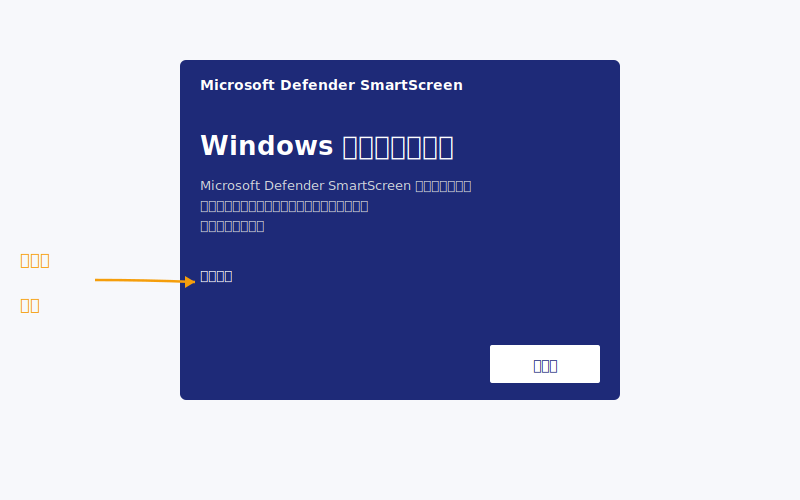
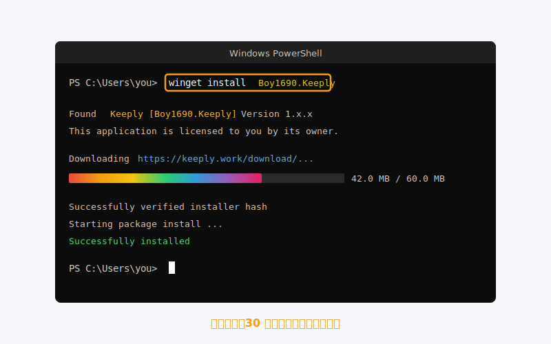
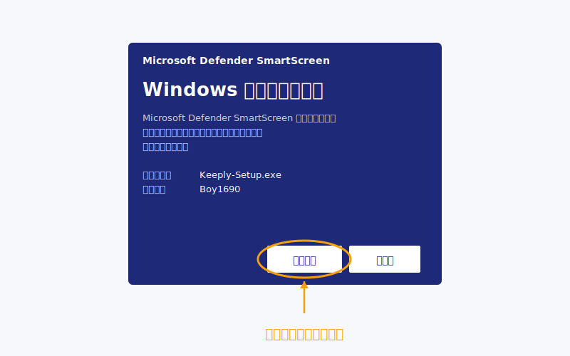
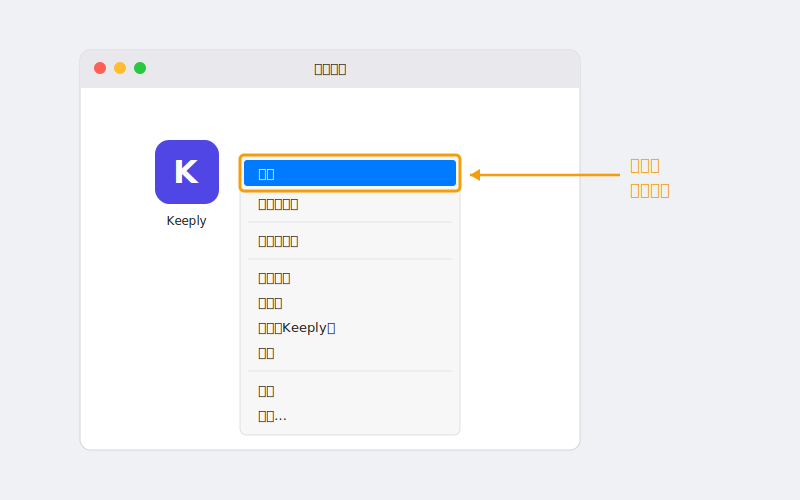
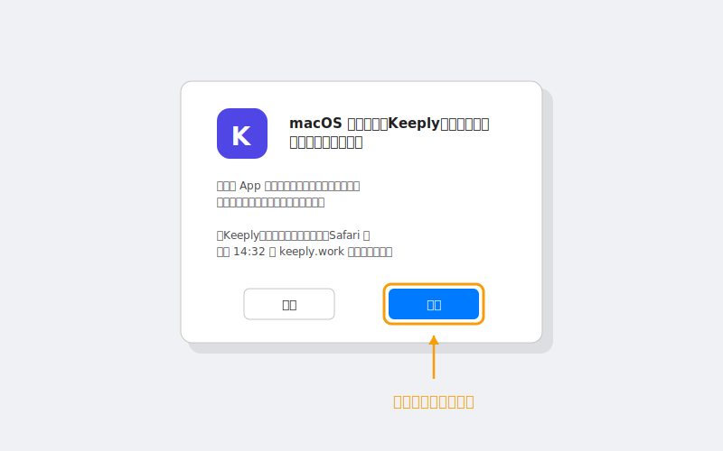

> 「我双击跳出蓝屏，以为是病毒就关了。」
>
> 。某刚听完 Keeply 介绍的设计师，当天回信这样写。

他不是第一个。Windows 那个蓝色画面拦下的人，可能比真正装起来的还多。

这篇从头走一次：**为什么会跳蓝屏 → 三条更干净的路 → 装完马上开第一个项目**。

## 目录

1. [为什么会跳出那个蓝屏（不是 Keeply 的问题）](#why-smartscreen)
2. [三条路任你选：先看哪条最快](#three-paths)
3. [Windows 路径 1：winget 一行指令（推荐）](#path-winget)
4. [Windows 路径 2：手动下载 .exe](#path-exe)
5. [macOS 安装：右键打开的关键步骤](#path-macos)
6. [装完之后：把第一个项目丢进去](#first-project)
7. [卡住了？5 个常见错误排除](#troubleshoot)

## 为什么会跳出那个蓝屏（不是 Keeply 的问题） {#why-smartscreen}

那个画面叫 [SmartScreen](https://learn.microsoft.com/zh-cn/windows/security/operating-system-security/virus-and-threat-protection/microsoft-defender-smartscreen/)。它不是判断「这个软件有没有毒」，是判断「这个软件有没有累积够多人用过」。

换个角度：新开的餐厅还没大众点评评价，不代表难吃。是还没人吃过给星。

SmartScreen 对新软件的态度一模一样。它用「**下载量 + 时间**」累积信任，新版本一推出就会回到观察期。Keeply 每次更新都会经历一轮这个过程。这跟「软件本身安全吗」没关系。

那为什么还是会吓到人？因为画面只给你一颗很大的「不执行」钮，要按执行得先点旁边那个叫「**其他信息**」的小字。视觉上，它不像个提示，比较像个阻挡。

但你不必跟它打交道。**Keeply 已经被 Microsoft 的 [winget 套件 仓库](https://github.com/microsoft/winget-pkgs) 收录**，那条路根本不会跳警告。

所以重点不是怎么绕过警告。是怎么走一条警告不会跳出来的路。



## 三条路任你选：先看哪条最快 {#three-paths}

| 路径 | 适合谁 | 预估时间 | 跳蓝屏？ |
| --- | --- | --- | --- |
| **A. winget 指令**（Windows） | 不怕贴一行字到 PowerShell | 2 分钟 | 不会 |
| **B. 官方下载 .exe**（Windows） | 完全不想开黑色窗口 | 5 分钟 | 会，下面教你怎么处理 |
| **C. 官方下载 .dmg**（macOS） | Mac 用户 | 3 分钟 | 不会，但要按右键 |

选好了？跟着对应段落走，其他可以略过。

## Windows 路径 1：winget 一行指令（推荐） {#path-winget}

**winget** 是 Windows 内建的「软件商店指令版」，从 Windows 10 1809 起就在你电脑里了。你不必另外装任何东西。

打开 PowerShell（开始菜单搜「PowerShell」），贴这一行进去，按 Enter：

```powershell
winget install Boy1690.Keeply
```



30 秒左右会跑完。没有蓝屏。没有「其他信息」那颗小字。

为什么这条路这么干净？因为要列进 winget，Keeply 得通过 [Microsoft 在 GitHub 上的官方审查](https://github.com/microsoft/winget-pkgs)：检查安装包来源、文件签名、安装行为是否干净。把关过才放上架。

换句话说，你跑这行指令的时候，Microsoft 已经先帮你做了一次审核。SmartScreen 那层判断在这条路上是多余的，所以它根本不会出来。

这是「短路径」顺便也是「信任路径」。两件事一行解决。

## Windows 路径 2：手动下载 .exe {#path-exe}

不想开 PowerShell？也行。去 [keeply.work](https://keeply.work/) 点下载，拿到 `.exe` 安装文件，双击。

接下来会跳出 SmartScreen 蓝屏。**这是正常的**（[原因见上面](#why-smartscreen)）。要继续装，动作是这样：

1. 点蓝色画面上的「**其他信息**」（左下角的小字）
2. 才会出现「**仍要执行**」按钮
3. 点下去，安装向导接手



整个过程多花约 3 分钟，多在心理建设，不在实际操作。装完跟路径 1 殊途同归，下一段一起。

## macOS 安装：右键打开的关键步骤 {#path-macos}

Mac 不会跳蓝屏。但首次打开不能双击。双击会被 [macOS Gatekeeper](https://support.apple.com/zh-cn/102445) 挡下。

正确流程：

1. 下载 `.dmg`，把 Keeply 拖进 应用 文件夹
2. 打开 应用，找到 Keeply
3. **右键 → 打开**（不是双击）

   

4. 对话框跳出来，按「打开」

   

到这就完成了。**只有第一次需要这样**，之后双击正常用。

为什么第一次要绕？Gatekeeper 对任何「未公证或新公证」的 应用 默认不允许双击启动。右键打开是 Apple 自己提供的「我知道我在装什么」的明确同意动作。

这不是 Keeply 特殊状况。每个没被你电脑看过的新 Mac 应用 第一次打开都这样。

## 装完之后：把第一个项目丢进去 {#first-project}

装好不算成功。当天有项目被保护住，才算。

打开 Keeply，点「**新增项目**」，挑一个你正在做的文件夹。

**建议第一个丢什么**：你目前手上「**不想搞丢、又一直在动**」的那个。提案、合同、设计稿、PPT，都可以。最好不是你已经半年没碰的旧文件夹。那个的价值不在「保护」，在「归档」，是另一个故事。

第一次扫描需要 1 到 2 分钟。之后 Keeply 会在后台看着这个文件夹，**改文件自动记录**版本，不必你手动按存档点。

举个合成范例帮你想象：某设计师装完当下丢的是 Q2 提案文件夹。第一次扫描花了 2 分钟。第三天，他发现自己上周六改错一个 标志 颜色，从历史拉回前一版花了 20 秒。

装完当天就用第一个项目，比装完一周才用，留存率高很多。

## 卡住了？5 个常见错误排除 {#troubleshoot}

| 症状 | 处理 |
| --- | --- |
| `winget` 找不到指令 | 表示你的 Windows 还没装「应用安装程序」。改用路径 2（手动下载 .exe）就好，不必跟它纠结 |
| Win 11 跳「需要管理员」 | 用「**以管理员身份运行**」重开 PowerShell |
| Mac「无法打开因为无法验证开发者」 | 右键 → 打开（不是双击），见上面 macOS 段 |
| 公司网络挡下载 | 改用 winget 指令，走 Microsoft CDN，多半放行 |
| 装完打不开 | 重启一次；仍不行寄 [support@keeply.work](mailto:support@keeply.work) |

## 唯一要记住的一件事

记住一件事就好：

**蓝屏不是判决，是 信誉 还在累积。**

你不需要绕过警告，你只需要走 winget 那条没有警告的路。

---

> 关于作者：Ting-Wei Tsao，Keeply 创办人。
> [LinkedIn](https://www.linkedin.com/in/ting-wei-tsao-b57480152/)
