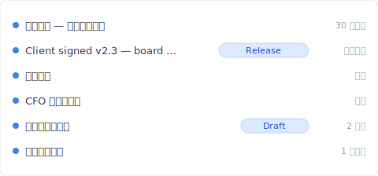
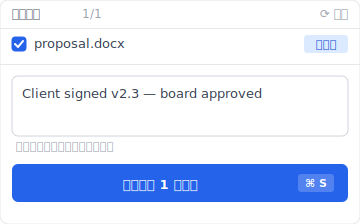

# 【2026 文件管理】OneDrive 版本历史不是无限的：500 个版本天花板 + 30 天救援窗的 Microsoft 官方数字

> Microsoft Learn 写得很清楚 500 + 30 天。但 90% 教学文章只教怎么用、不讲何时碰壁。

“OneDrive 把你救了 200 次。然后在第 501 次，悄悄删掉了你最旧的版本——还不通知你。”

这不是 错误、不是 BUG report。是 [Microsoft Learn 文件](https://learn.microsoft.com/en-us/sharepoint/document-library-version-history-limits)早就写清楚的 500 主要版本 上限。但 90% 的 OneDrive 版本历史教学文章只教**怎么用**、不讲**它什么时候会碰壁**。本文补这层——三件被混在一起的 OneDrive 机制（version history 500 上限 / 回收站 30 天 / 自动恢复）拆开、加上 [Keeply](https://keeply.work) 怎么接住超过 上限 后的场景。

## 本文目录

1. [Keeply 怎么让 OneDrive 版本历史“不会在第 501 次消失”](#keeply-timeline)
2. [OneDrive 版本历史的 3 个机制：500 / 30 天 / 自动恢复 分别在说什么](#three-mechanisms)
3. [500 version 上限：Microsoft 官方数字 + 你什么时候会撞到](#500-cap)
4. [回收站 30 / 93 天：删档后的时间窗、不是 version history 的延伸](#recycle-bin)
5. [自动恢复：Office 客户端紧急救援、跟 version history 完全分开](#autorecover)
6. [Keeply 补位：超过 OneDrive 上限 之后的 发布版冻结 + 单档笔记](#keeply-fills)
7. [3 种你不需要 Keeply 的 OneDrive 场景](#when-not-needed)
8. [常见问题](#faq)

---

## Keeply 怎么让 OneDrive 版本历史“不会在第 501 次消失” {#keeply-timeline}

先看现在会发生什么。Tina 是顾问、用 OneDrive 存 `proposal.docx`、半年来累积 200 多版。客户今天签了、明年 3 月想回头看当初提案、她想抓 8 个月前那版——OneDrive 还在吗？

换到 [Keeply](https://keeply.work)，这个专案的时间轴长这样：

“Client signed v2.3 — 董事会核可”自己一行、有 Release tag——是她今天客户确认后、主动点 Keeply 主视窗“保存版本”+ 写笔记存的：

写一行“Client signed v2.3 — 董事会核可”、保存版本。明年 3 月翻时间轴看 tag 就有——不受 OneDrive 500 上限 影响、不被自动删除。

操作只有 2 个动作：

1. **存档**——她在 Word 按 Ctrl+S，OneDrive 同步云端（如常）、Keeply 在背景 30 分钟内轮询看到变更、自动存一版进时间轴。
2. **标里程碑**——客户确认后点 Keeply“保存版本”+ 写笔记。

下面拆 OneDrive 自家的三件机制——为什么会在第 501 次消失。

---

## OneDrive 版本历史的 3 个机制 {#three-mechanisms}

OneDrive 讲“版本历史”其实是 3 件不同的事被混在一起讲。**先拆开**：

| 机制 | 是什么 | 上限 | 触发 |
|---|---|---|---|
| **Version History** | 云端文件每一版 | **500 主要版本**（[MS Learn](https://learn.microsoft.com/en-us/sharepoint/document-library-version-history-limits)） | 自动每次保存 |
| **回收站** | 删档后保留窗 | 个人 30 天 / 公司 93 天（[MS Support](https://support.microsoft.com/en-us/office/restore-deleted-files-or-folders-in-onedrive-949ada80-0026-4db3-a953-c99083e6a84f)） | 手动 / 同步删除 |
| **自动恢复** | Office 客户端紧急救援 | 预设 10 分钟间隔 | 软件当机 / 没保存就关 |

三件不同事、混在一起问会找错方向。你“找不到 6 个月前那版”可能是 Version History 撞 500 上限、可能是 回收站 30 天过期、也可能是 自动恢复 暂存早被覆盖——不同问题要走不同层解。

## 500 version 上限：Microsoft 官方数字 {#500-cap}

[Microsoft Learn 文件](https://learn.microsoft.com/en-us/sharepoint/document-library-version-history-limits)写得清楚：SharePoint / OneDrive 文件库每个文件最多保留 **500 个 主要版本**（搭配主要 / 次要 版本管理 开启时、可再加 511 个 次要版本）。

**超过会发生什么**：自动删最旧的版本来腾出空间给新的、不通知你、不能取消。

**什么人会撞到**：

- **顾问**——每天 3 次保存 proposal、月 ~66 版、**7-8 个月**就到 上限
- **设计师**——每天 5-8 次保存设计稿、**3-4 个月**就到 上限
- **作家 / 律师**——每天 ≥10 次保存逐字稿、**< 3 个月**到 上限

每天保存频率高 + 半年以上专案 = 高几率撞 上限。MS 没提醒、UI 没警告、撞到的人才知道。

## 回收站 30 / 93 天 {#recycle-bin}

回收站 是“**删档回收**”、不是“版本历史延伸”。常见误解：“我删了还有 30 天可以救”≠“我修改了还可以还原半年前”。

[MS Support](https://support.microsoft.com/en-us/office/restore-deleted-files-or-folders-in-onedrive-949ada80-0026-4db3-a953-c99083e6a84f) 官方数字：

- **个人账号**：30 天保留
- **公司 / 学校账号**（work or school）：93 天保留

过期后从第二阶段 回收站 永久删除、不可救回。

Version History 跟 回收站 是**两个独立系统**：你修改 `proposal.docx` 从 v200 到 v201、旧版进 Version History（不进 回收站）。你删掉 `proposal.docx`、整个文件进 回收站（连同它的所有 version history）。前者撞 500 上限、后者撞 30/93 天 上限。

## 自动恢复 ≠ version history {#autorecover}

Word / Excel / PowerPoint 桌面客户端的 自动恢复 暂存 `.asd` 档——预设 **10 分钟间隔**——只在以下情况有用：

- 软件当机（蓝底白字当掉）
- 强制关闭 / 系统停电
- 没保存就关闭视窗、下次开启提示“要还原吗？”

跟 OneDrive cloud version history **完全分开**、不算同一体系。Office 开启时提示“我们找到一份未保存的版本”就是 自动恢复，不是云端历史。

相关详细请看 [Photoshop autosave 不是 version history](/zh-cn/post/photoshop-autosave-not-version-history/)——Adobe 那层同款混淆机制。

## Keeply 补位 — 超过 OneDrive 上限 之后 {#keeply-fills}

Tina 那个 `proposal.docx` 撞了 500 上限、客户忽然要 8 个月前提案——OneDrive 已经没有那版了。

换到 [Keeply](https://keeply.work)、3 件事一个工具：

- **发布版冻结**：在 2 月 14 日客户签约那天、Tina 点“保存版本”标“Client signed v2.3”——这版会被冻结成独立快照、不被后续 500 次保存覆盖、永久保留。OneDrive 500 上限 不适用。
- **单档笔记**：每版可以写 1-2 行笔记。3 个月后 Tina 在时间轴看“CFO 第三轮修改”“客户签”一行行 tag、不必翻 12 个 `_FINAL` 档名猜哪个是哪个。
- **跨工具 portability**：Keeply 不依赖 OneDrive。她以后换 Dropbox / NAS / 换工作笔电——时间轴还在本机 + Keeply 自己的备援位置、不被任何云端 vendor 的 上限 锁死。

OneDrive 留给同步协作（这是它强项）、Keeply 给她 无上限 的单档版本历史。

## 3 种你不需要 Keeply 的 OneDrive 场景 {#when-not-needed}

诚实写、Keeply 不是万灵丹：

**企业合规封存**。SOX、HIPAA、GDPR 要 审计轨迹 + 加密 + 保留期管理——走 [Microsoft 365 Backup](https://www.microsoft.com/en-us/microsoft-365/business/microsoft-365-backup) / Veeam / Acronis。Keeply 是日常版本管理、不是合规工具。

**合约签核 / 法务 audit**。需要签章 + 不可篡改纪录走 DocuSign / Adobe Sign。Keeply 纪录版本轨迹、但不认证签章。

**每天 < 1 次保存的个人用**。如果你的 `notes.docx` 一周才改一次——OneDrive 500 上限 你 10 年都用不到、Keeply 没急需。

## 常见问题 {#faq}

**Q1: OneDrive 版本历史最多保留几个？**

500 主要版本（[Microsoft Learn](https://learn.microsoft.com/en-us/sharepoint/document-library-version-history-limits)）。超过自动删最旧、不通知。

**Q2: OneDrive 版本历史保留多久？**

Version history 本身没有时间限制（受 500 上限 限制）。有时间限制的是 回收站：个人 30 天、公司 93 天。

**Q3: OneDrive 版本历史和 自动恢复 一样吗？**

不一样。Version history 是 OneDrive 云端的每一版文件、自动恢复 是 Office 桌面客户端的紧急救援（10 分钟间隔）、两个完全不同存储层。

**Q4: 为什么我找不到 OneDrive 6 个月前的版本？**

两个可能：(a) 超过 500 上限 被自动删、(b) 搜的是 回收站 而 30 天窗已过。重度用户 7-8 个月就会撞 上限。

**Q5: 超过 500 个版本后怎么办？**

OneDrive 默默删最旧的、没警告。要解决需要无 上限 的工具——例如 [Keeply](https://keeply.work) 的 发布版冻结。

**Q6: Keeply 跟 OneDrive 冲突吗？**

不冲突、并行运作。OneDrive 同步协作、Keeply 给 无上限 单档版本历史 + 笔记 + 发布版冻结。

## 延伸阅读

主篇 [文件版本管理完整指南](/zh-cn/post/file-version-management-complete-guide/)——4 个结构性原因、为什么工具就是没设计给你这件事。

对照阅读：
- [Excel 版本历史的限制](/zh-cn/post/excel-version-history-limits/)——Excel 同款 500 机制 + sibling 场景
- [Keeply 跟备份、云端工具有什么不一样](/zh-cn/post/what-keeply-saves-vs-backup-cloud/)——三件不同事的完整对照
- [客户问哪一版才是定稿](/zh-cn/post/client-asked-which-version/)——Word 版本历史 + 客户要某版场景

---

Tina 的 `proposal.docx` 在 OneDrive 撞了 500 上限、客户下个月要 8 个月前那版——Microsoft 自家规则、按官方文件删了。

但她在 Keeply 标了“Client signed v2.3”Release。半年后客户要那版、3 秒就翻到。

Microsoft 已经把 500 写进文件。你不需要 OneDrive 不变、你需要 OneDrive 变慢时还有工具接得住。

---

> 关于作者：Ting-Wei Tsao，[Keeply](https://keeply.work) 创办人。
> [LinkedIn](https://www.linkedin.com/in/ting-wei-tsao-b57480152/)
