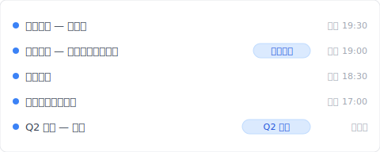
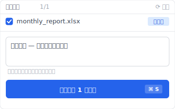

# 【2026 文件管理】找回被覆盖文件的极限：自动恢复 救不到、数据恢复软件赌运气，Keeply 怎么补事前防御

> 自动恢复 是为崩溃救援设计的、数据恢复软件赌覆盖后几分钟扇区还在。覆盖保存后你需要的是事前防御。

周五晚上 19:30、月底结算文件用 Excel 编辑中、不小心把前一张工作表覆盖掉了。

Ctrl+Z 已经没用（刚才关闭了）。自动恢复 文件也消失了。

周一早上前要恢复。但来得及吗？

这篇拆完 自动恢复 / OneDrive 版本历史 / 数据恢复软件各自能救什么、为什么「覆盖保存后」事后救援都有极限、然后让你看 [Keeply](https://keeply.work) 怎么用事前防御补这层。

## 重点

搜索「**找回被覆盖的文件**」的人多数在求事后救援。但 Microsoft 自动恢复 是为崩溃设计的、数据恢复软件的成功率以覆盖后几分钟为胜负。这些工具都不适用于「正常关闭后才发现覆盖」的场景。**事后救援不是答案、事前防御才是**。在工具层放一份常驻版本历史、覆盖保存就不再是破坏性动作。

## 本文目录

1. [换 Keeply 后我周五 19:00 的版本还在](#keeply-timeline)
2. [自动恢复 到底是为什么设计的？崩溃救援不是覆盖救援](#autorecover-design)
3. [自动恢复 / 卷影副本 / 恢复软件：各自能救什么？5 个机制的边界](#five-mechanisms)
4. [为什么「覆盖保存后」就来不及了？存储层依赖发现时机](#why-too-late)
5. [事后救援之外：Keeply 常驻版本历史 + 30 分钟自动轮询](#keeply-fills-gap)
6. [不必装 Keeply 的 3 种覆盖场景](#when-not-needed)
7. [常见问题](#faq)

---

## 换 Keeply 后我周五 19:00 的版本还在 {#keeply-timeline}

先让你看现在。同样是周五 19:30 覆盖掉月底结算——在 [Keeply](https://keeply.work) 里，这个会计项目保管库的时间轴看起来是这样：

「月底结算 — 应收应付对账完成」自己一行、有「月底结算」tag——是周五下午 19:00 对账完成那一刻、我主动点 Keeply「保存版本」+ 写笔记存的。19:30 覆盖之后 Keeply 在背景自动又存了一版（也在时间轴上）——但前一版「应收应付对账完成」**没有消失**。

A 先生周五 19:30 那一刻发现覆盖了、打开 Keeply、点时间轴上「月底结算 — 应收应付对账完成」那一行——3 秒还原。周一早上前的 60 小时根本不需要熬夜重做。

那行笔记怎么来的？周五 19:00 对完账的时候、A 先生点 Keeply 主窗口「保存版本」按钮、跳出来这个对话框：

写一行「月底结算 — 应收应付对账完成」、保存版本——半年后翻时间轴、看到的是描述、不是纯时间戳。

加上 Keeply 在背景每 30 分钟自动轮询文件变更——你忘记主动标、30 分钟内也会有自动保存版本。覆盖掉的灾难对 Keeply 来说只是时间轴上多一条记录、不会抹掉前面那一版。

下面拆 Microsoft 内建跟数据恢复软件各自为什么救不了「正常关闭后才发现覆盖」这个场景。

---

## 自动恢复 到底是为什么设计的？崩溃救援不是覆盖救援 {#autorecover-design}

Microsoft Office 内建有 3 种「**版本还原**」机制：

- **自动恢复**：崩溃时救回未保存内容。预设每 10 分钟自动暂存一份。**文件正常关闭后就清除**。
- **卷影副本**（Windows）：透过卷影复制功能还原到过去快照。需要事前设定。
- **OneDrive 版本历史**：每次保存的版本快照。[Microsoft 官方文档](https://learn.microsoft.com/en-us/sharepoint/document-library-version-history-limits)指出预设保留 500 个主要版本（个人 Microsoft 账号限 25 版）。

设计目的明确：这 3 个机制是给「**崩溃救援**」、「**最近的存储事故**」使用的。「**正常关闭后才发现覆盖错**」这种场景不在设计目标内。

---

## 自动恢复 / 卷影副本 / 恢复软件：各自能救什么？5 个机制的边界 {#five-mechanisms}

要看每个机制的边界、并列对比：

| 机制 | 救得到的场景 | 救不到的场景 | 注意事项 |
| --- | --- | --- | --- |
| 自动恢复 | 编辑中崩溃 | 正常关闭后的覆盖错 | 文件关闭即清除 |
| OneDrive [版本历史](https://learn.microsoft.com/en-us/sharepoint/document-library-version-history-limits) | 过去 500 版以内（个人账号 25 版） | 超过 500 版的旧版、纯本地文件 | 需云端存储 |
| Windows 卷影副本 | 有卷影复制的话 | 没设定、SSD 环境 | 需事前设定 |
| 数据恢复软件 | 覆盖直后、扇区未被新写入 | 过了一段时间、SSD TRIM 后 | 成功率视环境而定 |
| Mac [Time Machine](https://support.apple.com/en-us/HT201250) | 最近的快照 | 快照间隔之外 | 需另外设定 |
| **[Keeply](https://keeply.work)** | **30 分钟轮询 + 主动保存版本，每版有笔记** | **编辑中崩溃那一刻（30 分钟轮询间隔内）** | **必须事前启动、不能溯及既往** |

对啊、这就是让人烦的地方。Microsoft 内建没有一个机制能结构性地触及「正常关闭后覆盖错」这种典型场景。Keeply 补的就是这层。

---

## 为什么「覆盖保存后」就来不及了？存储层依赖发现时机 {#why-too-late}

这里要拆一个没人明讲的差别：**存储层** vs **工具层**。

这些机制活在**存储层**。设计目标是「最近一次写入失败就回滚」、所以保留期设得短。500 版、30 天这些数字、参考的是「平均使用者一个月内回头找的次数」。3 个月以上不在设计目标内、清除掉是合理的。

A 先生是会计。周五晚上 19:30、他不小心把月底结算 Excel 覆盖掉了。他找 自动恢复 文件、找不到。试了数据恢复软件、跳出「扇区已被覆写」消息。周一早上前还剩 60 小时。

这里是真正的问题。A 先生事后想到、如果是周五白天覆盖的、自动恢复 30 分钟间隔可能有抓到。**但他「发现的时间点」已经太晚。事后救援依赖「发现的时机」。事前防御不依赖发现。每次保存早就留下版本了。**

SSD 环境下更糟。数据恢复软件依赖扇区未被新写入——但 SSD TRIM 指令会在覆盖发生时立即清除被覆盖的扇区、给操作系统「这格可以重用」的信号。HDD 还能赌几分钟、SSD 赌几秒钟都不一定有。

---

## 事后救援之外：Keeply 常驻版本历史 + 30 分钟自动轮询 {#keeply-fills-gap}

要超越事后救援的极限、靠的是**事前防御**。在工具层放一份常驻版本历史。

[Keeply](https://keeply.work) 在背景对你指定的工作文件夹自动轮询：每 30 分钟检查一次文件变更（有改才存）、不依赖 Word / OneDrive 的保留期政策。本机 git 没时间上限、500 版本上限不存在。「覆盖保存」就**不再是破坏性动作**——前一个版本永远留着。

加上 Keeply 主动「保存版本」+ 笔记功能：重要时刻（月底结算、季度报告、业主签约版）你亲手点按钮、写一行说明、那一版单独被冻结。3 个月后翻时间轴、看到「月底结算 — 应收应付对账完成」自己一行、不用猜时间戳。

B 小姐用 Keeply 半年。周一早上发现月底结算被覆盖成前一张表。她打开 Keeply。周五 19:00 那版「月底结算 — 应收应付对账完成」自己一行有 tag、19:15 / 19:30 也都自动保存在时间轴上。她点「回到 19:00 的版本」、3 秒后 Excel 开启那个版本。周一上班前根本不需要熬夜重做。

---

## 不必装 Keeply 的 3 种覆盖场景 {#when-not-needed}

Keeply 不取代所有覆盖救援场景：

**编辑中崩溃那一刻**。Keeply 30 分钟轮询、不会抓到那一刻的中间状态。自动恢复 仍是第一道线（10 分钟间隔）。Keeply + 自动恢复 互补、不取代彼此。

**Keeply 启用前的覆盖**。Keeply 不能溯及既往（过去那版 Keeply 没记到）。今天装、今天起的每次覆盖才救得了。

**SSD 物理损毁**。Keeply 是本机版本历史、SSD 整颗坏掉它跟其他本机数据一起没。要搭 [3-2-1 备份原则](/zh-cn/post/3-2-1-backup-rule/)的异地备份。

---

## 常见问题 {#faq}

**Q1: 自动恢复 预设是开的吗？**

是。设定路径：「文件 → 选项 → 保存 → 保存自动恢复信息每 10 分钟」。但 自动恢复 在文件正常关闭后会清除、不算长期保留。

**Q2: 数据恢复软件的成功率多高？**

覆盖直后几分钟内有成功率、但 SSD（多数现代电脑）由于 TRIM 指令会立即清除被覆盖的扇区、成功率比 HDD 低。HDD 过几天后成功率也急遽下降。

**Q3: OneDrive 个人版跟商务版版本历史保留一样多吗？**

不完全一样。OneDrive 个人预设约 500 版。商务版（Microsoft 365）也预设 500 版但管理员可调整。到上限就清除最旧。

**Q4: Time Machine 有用吗？**

Mac 的 Time Machine 是系统级备份。在快照间隔（预设 1 小时）内发生覆盖就救不到。它也不是文件级的版本管理、要从 Time Machine 救单档特定版本很麻烦。

**Q5: Keeply 是 自动恢复 的替代吗？**

不是。自动恢复 处理崩溃救援、Keeply 处理正常保存后的版本保留。两者是互补关系。Keeply 必须事前启动（不能溯及既往）。

---

## 延伸阅读

主篇 [文件版本管理完整指南](/zh-cn/post/file-version-management-complete-guide/) 拆 4 个结构性原因——为什么工具就是没设计给你这件事。

Word 场景：[Word 存得住版本、存不住 3 个月后的记忆](/zh-cn/post/client-asked-which-version/) — 同样是 Microsoft 内建保留期限制、不同切入。

Excel 场景：[Excel 历史版本只回 1-2 版？4 个 Microsoft AutoSave 没讲的限制](/zh-cn/post/excel-version-history-limits/) — 同 Microsoft AutoSave 机制。

---

「啊、覆盖掉了」的 19:30 那个瞬间、未来还会出现。你不知道什么时候。

但有一件事要知道：事后救援有极限。事前防御不依赖发现的时机。

打开 [Keeply](https://keeply.work)、看时间轴顶端那条「月底结算」tag——下次 19:30 覆盖发生、点时间轴 3 秒还原、不必赌数据恢复软件有没有抓到扇区。

---

> 关于作者：Ting-Wei Tsao，[Keeply](https://keeply.work) 创办人。
> [LinkedIn](https://www.linkedin.com/in/ting-wei-tsao-b57480152/)
