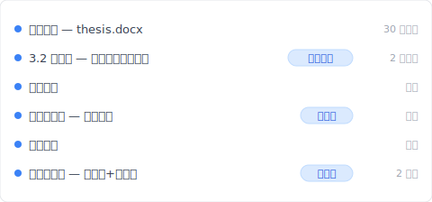
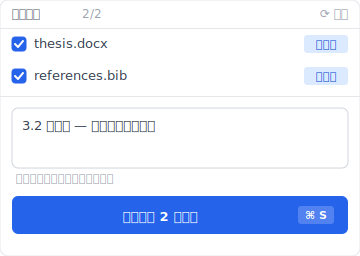

# 【2026 文件管理】硕士论文版本管理 4 步：导师问「上一版那段」你答得出来吗？

> 周三下午三点，导师发来消息：「你上一版那段比较好，怎么不见了？」你打开 thesis_final_v7、想不起 v5 跟 v6 差在哪。论文真正的风险不是写不完，是你忘了差异是什么——而文件系统也不会帮你记。

周三下午三点。你在咖啡店，那杯美式还剩半杯。导师消息跳出来：「你上一版第三章那段论证比较好，怎么不见了？」

你打开笔电。Google Drive 里躺着 `thesis_final.docx`、`thesis_final_v2.docx`、`thesis_修改版_0415.docx`。你一份一份点开，翻到第三章，对照眼前这一版。

完全想不起上一版那段跟现在差在哪。

你打字回导师：「我找找看哦。」然后你心里知道。找不到了。

你以为论文最大的敌人是 截止日。从这个下午开始，不是了。

这篇拆完云端同步 / Word 修订追踪 / 3-2-1 异地备份各自能解什么、为什么都救不了「上一版那段在哪」这个问题，然后让你看 [Keeply](https://keeply.work) 怎么把论文的时间轴一个工具一起做。

## 目录

1. [换 Keeply 后我的论文时间轴长这样](#keeply-timeline)
2. [云端同步、Word 版本历史、3-2-1 为什么都救不了论文](#why-fail)
3. [论文不是一份文件，是一条时间线](#thesis-as-timeline)
4. [硕士论文版本管理 4 步实战：每日存档 + 交导师留底 + Keeply 自动版本 + 异地备份](#thesis-4-step)
5. [不必装 Keeply 的 3 种研究生情境](#when-not-needed)

---

## 换 Keeply 后我的论文时间轴长这样 {#keeply-timeline}

先让你看现在。同样是 `thesis.docx`、同样两年累积——在 [Keeply](https://keeply.work) 里，导师问「3.2 节你上一版那段」的时候，我打开时间轴看到的是这个：

「3.2 节重写 — 导师第三轮反馈后」自己一行、有我写的笔记。点开就是导师看过的那一版。不用翻 `thesis_final_v2_真的这版.docx` 猜哪个是哪个。

导师前礼拜开会时要的「送导师前那一版」也在——「第二轮完稿 — 送导师前」自己一行、有 tag。

那一行笔记是怎么来的？开完导师会、回到咖啡店、点 Keeply 主窗口的「保存版本」按钮、跳出来这个对话框：

写一行笔记说明这一版为什么存——例如「3.2 节重写 — 导师第三轮反馈后」、「第一轮完稿」、「送导师前」、「答辩版」。半年后翻时间轴、看到的是描述、不是时间戳。

加上 Keeply 在背景每 30 分钟自动存一次——你忘记主动标也没关系、最少 30 分钟有一版。

下面拆云端同步 / Word 版本历史 / 3-2-1 各自为什么救不了这场战役。

---

## 云端同步、Word 版本历史、3-2-1 为什么都救不了论文 {#why-fail}

你会想：「我不是有存云端吗？iCloud、OneDrive、Google Docs、都自动存着啊。」

这里有个容易混淆的点：**云端同步解的是「文件不会消失」、不是「上一版那段在哪」**。

拆开来看四个常见方法各自解什么：

**云端同步（iCloud、OneDrive、Dropbox）**解硬件故障。笔电坏了、文件还在云端。但今天存的会盖掉昨天的。它是「最新备份」、不是「每一版的累积」。

**Word 修订追踪、Google Docs 版本历史**对「当下这一份」有用。谁改了哪一句、记得清楚。但它不解决跨日期、跨文件的差异。Google Docs 的自动版本会随时间被系统合并、清除；3 个月前那一版的第三章全文、你看不到。

**手动改文件名 `v1 v2 v3`**。听起来理所当然。但 6 个月后你看到 `thesis_v7_真的.docx` 跟 `thesis_v7_fix.docx`、哪一份是导师那时候看的？你答不出来。改文件名能留版本、留不住意义。

**3-2-1 异地备份**（[U.S. CISA. Data Backup Options](https://www.cisa.gov/news-events/news/data-backup-options)：3 份备份、2 种媒体、1 份异地）解的是「资料不会一次全没」。它重要。但它不回答差异的问题。

把这五件事摆一起对照：

| 工具 | 解什么 | 不解什么 |
|---|---|---|
| 云端同步（Dropbox / OneDrive / iCloud） | 笔电坏了文件还在 | 上一版第三章在哪 |
| Word / Google Docs 版本历史 | 当下这份谁改了哪句 | 跨日期、跨文件差异 |
| 手动改文件名 `v1 v2 v3` | 留下分版的形式 | 哪一版意义是什么 |
| 3-2-1 异地备份 | 资料不会一次全没 | 哪一版你想找回 |
| **[Keeply](https://keeply.work)** | **每次保存版本自动记、可以写笔记、半年后翻时间轴看得到差异** | **整颗 SSD 物理坏掉（要搭 3-2-1）** |

每个工具有它对的场景。问题是论文这场战役**同时**需要「差异记忆 + 有笔记的版本史」这层——而前 4 个工具没有一个专做这层。

---

## 论文不是一份文件，是一条时间线 {#thesis-as-timeline}

换个角度想：**论文不是一份文件，是一条时间线**。

导师最后拿到的那个 PDF、只是这条时间线的一张切面。真正重要的，是你这一年半怎么想的。为什么删掉那段、为什么补这段、导师反馈之后你怎么改。那条轨迹才是你论文的骨架。

PDF 是结果。时间线是过程。

把论文当「文件」的学生，写着写着、累积被摊成一滩。每次保存覆盖前一次、每次改完桌面上只剩最新那份。这不是做错。这是绝大多数人预设的做法。代价是：导师问「你上一版那段」的时候、你没得拿。

把论文当「时间线」的学生不一样。每周一份、每次交给导师一份、每次改章节结构一份。不是为了收藏、是为了**留下证据**。

证据有什么用？最关键的一点是：**导师不是在挑 PDF、是在帮你审想法的演化**。他问「你上一版那段比较好」不是在刁难你、是在跟你一起回忆当时的思路。这是学术工作最核心的动作。**迭代思考**。

答辩的时候也一样。委员问「为什么第三章结构变成这样」、你如果翻得出来历程、就不是在背答案。你是在跟委员走一条你自己走过的路。

还有更现实的。如果有一天你的论文被质疑（引用来源、剽窃指控、研究伦理），版本历程就是你的辩护。没有时间线、你只有目前这份 PDF、什么都证明不了。

所以**差异记忆**不是「有没有」的问题、是「主动 vs 被动」的问题。你可以主动靠意志力每周改文件名、每次备份。诚实说、很少人做得到。或者、你让工具帮你做。

---

## 硕士论文版本管理 4 步实战：每日存档 + 交导师留底 + Keeply 自动版本 + 异地备份 {#thesis-4-step}

要做的其实不多。四件事：

**一、每天收工前存一份带日期的文件。** 文件名像 `论文-0423.docx`。听起来很简单。但 6 个月下来诚实检查一下、你做到了几天？我自己以前写长文的时候、第一个月做得到、第二个月就忘了——这层需要工具补位。

**二、每次交给导师前、把那一份单独留下来。** 文件名写 `论文-0423-交导师.docx`。这是导师会回头问「上一版那段」时、你最常需要的那一份。

**三、让 [Keeply](https://keeply.work) 自动记住每一版 + 你重要时刻写笔记。** 第一、二步做不满的地方、Keeply 补位。它在背景每 30 分钟轮询一次文件变更（有改才存）——所以即使你忘了手动存日期档、最少 30 分钟有一版。同时你开完导师会、可以主动点 Keeply 主窗口的「保存版本」、写一行笔记「导师第三轮反馈后」、那一版就单独标起来、半年后翻得回。

**四、至少一份不在这台笔电。** 云端、外接硬盘、随身碟、哪个都行。重点是**不在这台电脑**。笔电在咖啡店被偷。SSD 突然坏掉。空调水滴进键盘。这些事每年都在某个研究生身上发生一次。异地备份是你给自己买的最便宜的保险。

---

## 不必装 Keeply 的 3 种研究生情境 {#when-not-needed}

诚实讲一件事：这篇不是写给所有研究生的。

**你已经在用 LaTeX 搭配工程师的版本工具**。如果你会 git、写 `.tex`、已经 `git commit` 每天三五次——你早就有了完整的时间线。它比这里讲的任何方法都强。

**你的论文全程在 Overleaf**。Overleaf 自带版本历程——线上会合作、线上会留版。只是记得导出 PDF 后不会保留、要另外备份那份 `.tex` 来源项目。

**你的写作路径是纯线性、每天字数只增不减、从不回头改**。也不需要这一切。诚实说、第三类人几乎不存在。

还有一件事即使工具都到位也解决不了：**导师的口头反馈不会自动被记下来**。你跟导师周会时他讲的那些、是你的责任：笔记、录音（先问过）、会后整理。工具帮你留住文件、留不住对话。

---

## 延伸阅读

主篇 [文件版本管理完整指南](/zh-cn/post/file-version-management-complete-guide/) 拆解 4 个结构性原因——为什么工具就是没设计给你这件事。

对照阅读：[Keeply 跟备份、云端工具有什么不一样](/zh-cn/post/what-keeply-saves-vs-backup-cloud/) — 三件不同事的完整对照。

备份原则：[3-2-1 备份原则：20 年了还够用吗？](/zh-cn/post/3-2-1-backup-rule/) — 论文 + 3-2-1 防的是不同的灾难。

---

论文不只是最后那个交出去的 PDF。它是你这两年怎么想、怎么改、怎么被导师反驳又怎么回应的那整条轨迹。那条轨迹每一天都在发生。

值不值得给它一条自己的时间线？

还记得周三下午三点、咖啡店里那杯没喝完的美式吗？导师下次再问「你上一版那段比较好」、你不用再翻 `thesis_final_真的最终.docx` 猜哪份是哪份。打开 [Keeply](https://keeply.work) 时间轴、点「导师第三轮反馈后」那一行、3 秒就在眼前。

---

## 研究来源

- [U.S. CISA. Data Backup Options](https://www.cisa.gov/news-events/news/data-backup-options)（3-2-1 备份原则）

---

> 关于作者：Ting-Wei Tsao，[Keeply](https://keeply.work) 创办人。
> [LinkedIn](https://www.linkedin.com/in/ting-wei-tsao-b57480152/)
