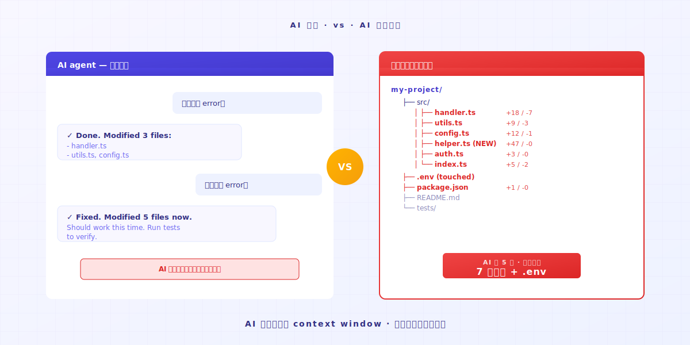
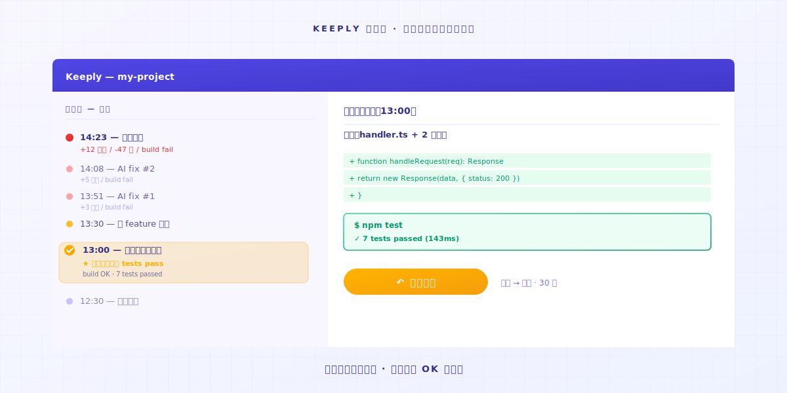
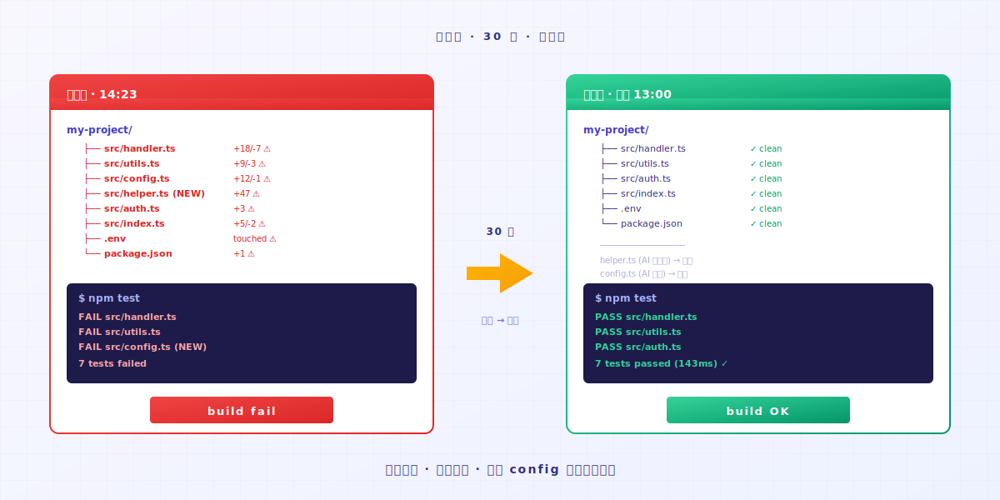

# Vibe Coding 失控了？1 个动作回到上一个能跑的版本

> AI agent 冲太远，code 不能跑。打开 Keeply 时间轴，最后一笔能跑的版本还在。

## 目录

1. [AI 冲太远的时刻长什么样？](#ai-overshoot)
2. [1 个动作：打开时间轴，点上一笔能跑的](#one-action)
3. [为什么 AI 不会自己回头](#ai-doesnt-rollback)

---

A 工程师打开 Cursor，让 AI 改一个 bug。AI 改完跑不过。他让 AI 再修。AI 动了第 3 个文件。还是不行。又改了第 5 个。A 工程师此刻已经不确定 AI 动过哪几个文件了。

这时候你大概会想：先停下来，至少要回到刚才那个还能跑的状态。

问题是这个：**你怎么知道刚才能跑的是哪一版？**

---

## AI 冲太远的时刻长什么样？ {#ai-overshoot}

你在 vibe coding。你给 AI 一个目标，AI 写了一段。

跑跑看，OK。

下一轮，你说「再加一个 feature」。AI 动了 3 个文件。跑。出错。

你说「修那个 error」。AI 动了 5 个文件，改到 config，加了一个你没问过的 helper function。跑，更多 error。

这时候 AI 还在自信地修。**它不会主动说「我可能写崩了」**。

它的记忆只有当前 context window。**它不知道 5 个 prompt 之前你的 code 是好的**。但你电脑上的文件知道。只要有人记住。

---

## 1 个动作：打开时间轴，点上一笔能跑的 {#one-action}

### 第 1 步：打开 Keeply 时间轴

左侧 sidebar 第一个 tab。你会看到今天的所有变动，按时间排。

### 第 2 步：找最后一笔「还在跑」的时间点

时间轴上每一笔是 Keeply 的自动保存点或你手动标记的时间点。每个点进去看变动内容，找你记得「那时候测过 OK」的版本。

通常是 30-60 分钟前。AI 开始跑偏前的最后一次测试。

### 第 3 步：右键那一笔，选还原

整个文件夹在 30 秒内回到那个时间点的状态。**所有文件、所有目录结构、所有 config 全部一起回去**。不只是一个文件。

包括 AI 偷加的 helper function、改过的 config、不该被动的 .env。**全部回去**。

接着你跑一次。能跑。

整个过程不到 1 分钟。**你不用记 AI 动过哪几个文件。Keeply 全记了**。

---

## 为什么 AI 不会自己回头 {#ai-doesnt-rollback}

AI agent 设计成**往前推进**的。它收到 prompt，产出 edit。它不会主动回望「我刚才那一轮是不是把整个项目变糟了」。

这个责任不在 AI 身上。是它的架构限制。

责任在你：**你需要 safety net 在背景跑**。AI 冲多远都行，因为你叫得回它。

不是 Keeply 要取代你写 code。是你 vibe coding 的时候，不该靠记忆力回头。记忆力会输给 AI 改文件的速度。

---

## 收尾

今天 AI 写到失控之前，先打开 [Keeply](https://keeply.work/)，把项目文件夹拖进去。

下次它冲过头，你打开时间轴点上一笔。**问题 30 秒内结束**。

---

## 延伸阅读

- [文件记事软件 Keeply 怎么用：不用学 30 个功能，2 个动作就上手](/zh-cn/post/keeply-getting-started-from-zero/)（PILLAR 3，Keeply 整体上手指南）

---

*作者：Ting-Wei Tsao，Keeply 创办人 ｜ [LinkedIn](https://www.linkedin.com/in/tingwei-tsao/)*

---

> 关于作者：Ting-Wei Tsao，Keeply 创办人。
> [LinkedIn](https://www.linkedin.com/in/ting-wei-tsao-b57480152/)
