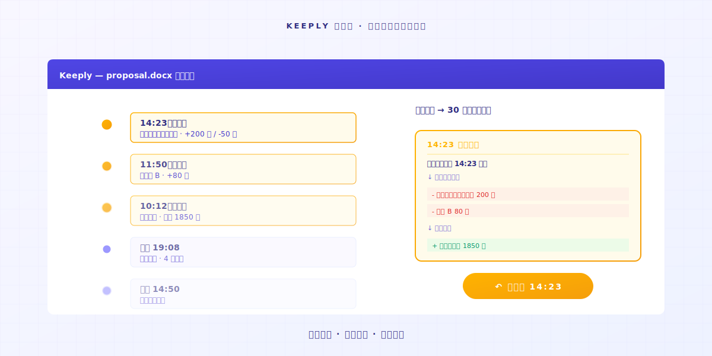
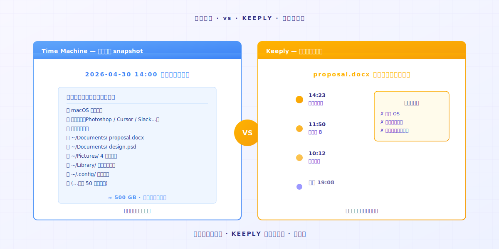
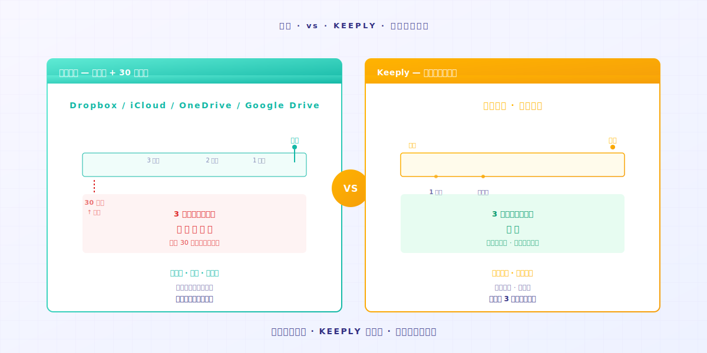

# Keeply 到底存什么？跟备份、云端工具有什么不一样

> 备份顾整个磁盘。云端顾最新一份。Keeply 顾每次变动的历史。三件不同事。

## 目录

1. [Keeply 存什么？](#what-keeply-saves)
2. [备份工具存什么？](#what-backup-saves)
3. [云端工具存什么？](#what-cloud-saves)
4. [你需要几个？](#how-many-do-you-need)

---

A 先生刚装完 Keeply。同事 B 走过来问：「这跟我 Mac 内建的 Time Machine 不一样吗？」

A 先生卡住。他知道不一样，但说不上来差在哪。

差别是这个：**备份、云端、Keeply 是三件不同的事**。它们的工作不重叠，所以名字才分三种。

---

## Keeply 存什么？ {#what-keeply-saves}

Keeply 存的是**每个文件的每次变动**。

你今天改 `proposal.docx` 两次，存两次。时间轴上会有两笔文件笔记。你想回到第一次存档的版本，点那一笔。30 秒回去。

它不存别人的 Google Doc。它不存你电脑的应用程序设置。它只存**你电脑上每个文件随着时间怎么变**。

如果你的需求是「我想回到上周四改之前的版本」，这就是它的工作。

---

## 备份工具存什么？ {#what-backup-saves}

Time Machine、Acronis True Image、Backblaze 这类工具存的是**某个时间点整个磁盘的快照**。

它们的工作不在救一个文件。它们存的是「**那一整天我整台电脑长什么样子**」。OS、应用程序、设置、所有文件夹，全部一起。

如果你的硬盘坏了、整台电脑遗失，备份能还原一切。**这是它们真正存在的理由**。

但如果你只想找回 `proposal.docx` 在周四 10:23 改之前的版本，备份做得到，但你要先还原整个 snapshot 才能挑出那个文件。**这不是它设计来解的问题**。

---

## 云端工具存什么？ {#what-cloud-saves}

Dropbox、iCloud、OneDrive、Google Drive 这类工具存的是**文件的最新版本，加上跨设备同步**。

你在 A 电脑改一个文件，B 电脑自动拉到最新版。**它们的工作是让「最新一份」同步到你所有设备**。

它们也有版本历史。但通常**只保留 30 天**——Dropbox 标准方案、Google Drive、OneDrive 都是这条规则。超过就删掉。

如果你需要「不管在哪台电脑都能拿到最新版」，这是它们的工作。但 3 个月前的版本，云端通常已经没了。

---

## 你需要几个？ {#how-many-do-you-need}

| 你的场景 | 主要工具 |
|---|---|
| 想找回某个文件的旧版本 | **Keeply**（时间轴即点即还原） |
| 整台电脑坏了想救数据 | **备份工具**（Time Machine / Acronis / Backblaze） |
| 多设备间同步最新版 | **云端**（Dropbox / iCloud / OneDrive） |

实务上**三个都用最完整**。

Keeply 顾每个文件的历史轴。备份顾整台电脑的快照。云端顾多设备同步。三件事互补不互斥。

如果只能挑一个，**看你最常遇到哪个情境**：你常想找旧版本？Keeply。你怕硬盘坏掉？备份。你常在多台电脑工作？云端。

---

## 收尾

回到 A 先生对 B 同事的回答：

「跟 Time Machine 不一样。Time Machine 顾整台电脑的 snapshot。Keeply 顾每个文件的历史轴。**我两个都用**。」

如果你也想试 Keeply 顾那条历史轴，把文件夹拖进 [Keeply](https://keeply.work/) 就好。剩下的它自己记。

---

## 延伸阅读

- [文件笔记软件 Keeply 怎么用：不用学 30 个功能，2 个动作就上手](/zh-cn/post/keeply-getting-started-from-zero/)（PILLAR 3，Keeply 整体上手指南）
- [文件版本管理完整指南](/zh-cn/post/file-version-management-complete-guide/)（PILLAR 1，了解版本管理为什么重要）

---

*作者：Ting-Wei Tsao，Keeply 创办人 ｜ [LinkedIn](https://www.linkedin.com/in/tingwei-tsao/)*

---

> 关于作者：Ting-Wei Tsao，Keeply 创办人。
> [LinkedIn](https://www.linkedin.com/in/ting-wei-tsao-b57480152/)
