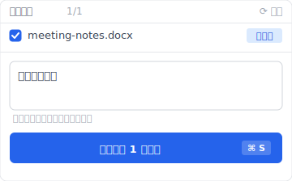
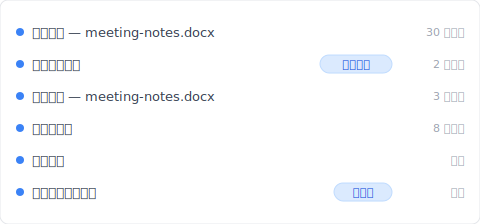

# 【2026 文件管理】我跟 Windows File History 要昨天的草稿，它给我 2019 年的文件

> File History 没坏，它把它有的版本还我了。是我问了它答不出来的问题。

周二晚上。我想找昨天那份 Word 草稿——会议里写的结论那版，因为今晚我又改过，但不确定改得好不好，想对照一下。

右键 → 还原旧版本。对话框打开。

最旧的版本是 2019 年的。

中间少了一年半我没注意到。

那颗外接硬盘自从去年夏天出差以后就没再插过。File History 没有「昨天」可以给我，就把它有的最近一版给我——也就是我上次插那颗硬盘那一天。我才意识到，那是换新笔电之前的事了。

它没坏。是我这套组合撞上了 File History 的盲点。后来我把版本管理换成 [Keeply](https://keeply.work) 才把这层坑补起来——它跑在我电脑本机上、不靠外接硬盘，这篇拆完 File History 两个盲点后会讲为什么这就解决了。

## 换 Keeply 后我的时间轴长这样

先让你看现在。同样的「meeting-notes.docx」、同样昨天到今天的修改、在 [Keeply](https://keeply.work) 里长这样。

昨天会议结束后我亲手存了一版——点 Keeply 主窗口的「保存版本」按钮、跳出来这个对话框：

写完笔记、点保存版本、关电脑走人。这时候时间轴长这样：

要找「会议后加结论」那版——点那一行就好。不用看一排 14:00、15:00、16:00 时间戳猜。

Keeply 怎么把这个做到？

- **背景每 30 分钟自动轮询**——文件有变更才存（没改不会空存）
- **随时可以手动「保存版本」**——重要时刻你点按钮、跳对话框、写一行笔记再存
- **完全本机跑**——版本就在我电脑上、不需要外接硬盘、不需要云端账号

下面拆 File History 为什么这两件事都做不到。

## 为什么 File History 给我 2019——盲点 1：硬盘连线

File History 按时间拍快照。默认：每小时一次。但这一次只在外接硬盘（或网络位置）接得到的时候才会发生。

硬盘没插（出差没带、被别台机器拿走、单纯忘记）——它就没地方写新快照。File History 程序还在背景跑，但写不到任何地方。版本目录就停在原地不增长。

硬盘接回来的时候，File History 从上次停的地方接着拍。新的快照进到当下这一刻往后算。但你硬盘离线那几天，它没办法回补。

所以我问「昨天」的时候，File History 从目录里往回找，给我它有的最近一版——就是我硬盘离线之前那一次。18 个月前。

这不是程序错误。这就是这个机制设计的样子——**只在硬盘连着时才工作**。

[Keeply](https://keeply.work) 没这个盲点，因为它根本不靠外接硬盘。它跑在你电脑本机上、版本存在你笔电里。出差不带硬盘它照样每 30 分钟存一次、你照样可以随时手动「保存版本」。硬盘接不接已经跟它无关了。

## 就算硬盘一直连着——盲点 2：版本没有笔记

退一万步——就算我那颗硬盘天天接着、File History 真的给我「昨天 19:00 的快照」，我还是有麻烦。

那一版上面只有时间戳：`yesterday 19:00`。

「会议后加结论」那一版是 14:47 还是 15:30 还是 16:12？File History 不会告诉我。它的版本没有笔记、没有「为什么改」的描述、没有「★ 这版是业主确认的版本」这种标记。

我要的不是「离 14:47 最接近的那次计划拍照」。我要的是「我会议后亲手存的、写了结论进去的那一版」。

这两件事不一样。File History 没有笔记字段、机制里根本没设计这个。

[Keeply](https://keeply.work) 有。每次你手动点「保存版本」、会跳对话框让你填一行笔记——「会议后加结论」、「业主确认版」、「砍掉重练前留底」。半年后翻回来看到的是描述、不是时间戳。

## File History 还是有它擅长的事

公平讲，File History 有它真正擅长的工作、而且做得到。

它是按时间把文件夹持续复制到外接硬盘。笔电 SSD 坏掉、File History 还你 Documents、Pictures、Desktop 这些监看的文件夹，退回最近一次快照。这是完整有用的事。

它擅长的情境：

- 原始文件损毁或不见了，你想要几小时前的副本拿回来
- 你关心的文件夹刚好在它监看的清单里
- 备份硬盘连着很稳（台式机、永远插着的扩展坞、家里的 NAS）
- 你不需要区分「哪一版有笔记、哪一版是会议后存的」——最近一个没坏的副本就够

它帮不了你的情境（也就是 [Keeply](https://keeply.work) 补位的地方）：

- 你带笔电出差，备份硬盘留在家
- 你要某个特定意义的版本（会议后那版、业主确认那版）——而不只是某个时间点
- 你想看半年前某一版改了什么、为什么改——但时间戳没写
- 你想找几年前的某一版

两个工具的区别不是好坏、是设计目标。File History 的目标是「时间计划把文件夹复制到外接硬盘」；Keeply 的目标是「有笔记的版本历史、本机跑」。两件事都需要的人就两个都装。

## 完整对照——File History、Keeply、其他 Windows 内建工具

| 你遇到的事 | File History | Keeply | Windows Backup | OneDrive |
|---|---|---|---|---|
| 出差没带外接硬盘、想存版本 | ❌ 没地方写 | ✅ 本机跑 | ❌ 也要外接 | ⚠️ 看网络 |
| 找「会议后加结论」那版 | ❌ 只有时间戳 | ✅ 你写的笔记找得到 | ❌ | ❌ 只有时间戳 |
| 想退回几小时前的版本 | ⚠️ 看硬盘有没有接 | ✅ 自动每 30 分钟 | ❌ 颗粒太粗 | ✅ 有同步、保留期内 |
| SSD 物理坏掉 | ❌ | ⚠️ 看有没有同步到外部 | ✅ | ✅ 只救已同步的 |
| Windows 起不来 | ❌ | ❌ 救不了系统 | ✅ | ❌ |

延伸：[你以为自己有备份，但「备份」在 Windows 里有 3 种意思](/zh-cn/post/windows-file-history-vs-backup/) 走完整的 4 轴思路，把 Keeply 跟 Windows 三个内建备份放在同一张表对照。

## 不必加 Keeply 或类似工具的场景

有些情况其实不必加另一层：

**你的工作短周期**。如果你不需要救回好几小时以前的版本、也不在意「哪版有笔记」，File History 每小时拍一次抓到的就涵盖大部分了。

**你的硬盘一直连着**。永远插着的扩展坞、NAS、固定在桌上的备份硬盘——File History 在这种配置下很少漏，最近一次计划快照会贴得很近你的保存时间。

**重要的文件都在云端**。如果重要东西都在 OneDrive、Dropbox、Google Drive，而且还在保留期内，云端版本历史多少能补一点（不过云端有上限——[云端版本历史的天花板](/zh-cn/post/cloud-version-history-cliff/)）。

以上都不适用——笔电族、硬盘有时离线、要回去找超过 30 天的版本、半年后还会想知道哪一版为什么存——这时候加一层像 Keeply 才划算。

## 延伸阅读

主篇 [文件版本管理完整指南](/zh-cn/post/file-version-management-complete-guide/) 拆 4 个根本原因——为什么工具就是没设计给你这件事。

对照阅读：[你以为自己有备份，但「备份」在 Windows 里有 3 种意思](/zh-cn/post/windows-file-history-vs-backup/) — 完整的 4 轴对照、加上 Keeply 补的那一层。

Mac 对应：[Time Machine vs Dropbox：备份、同步、跟两者都不是的第三轴](/zh-cn/post/time-machine-vs-dropbox/) — 同样的思路、换到 Mac。

---

File History 没辜负我。它还我它有的东西。2019 那一版是我硬盘连线史上的事实，不是它坏掉。

教训是这样：每个工具能答的是哪种问题、自己要分清楚。「外接硬盘连着时的每小时快照」是 File History 的问题类型。「我会议后亲手存了、写过笔记的那一版」是 [Keeply](https://keeply.work) 的问题类型。Windows 内建没有给你答第二类的工具。

我继续用 File History 顾第一类问题。第二类我留给 Keeply。

---

> 关于作者：Ting-Wei Tsao，[Keeply](https://keeply.work) 创办人。
> [LinkedIn](https://www.linkedin.com/in/ting-wei-tsao-b57480152/)
