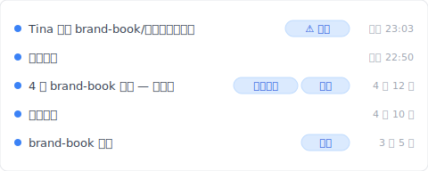
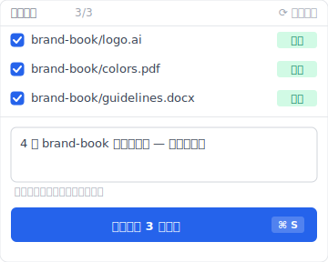

# 【2026 檔案管理】員工離職把公司資料清光了？同步工具不擋、法律救不了、Keeply 怎麼補不可逆歷史

> Dropbox 忠實同步 Tina 的刪除動作。法律打 2 年、DLP 只防未來——都救不了上週末已經發生的事。

## 本文目錄

1. [週六晚上 11 點 03 分——同步工具看著她清空](#hook)
2. [換 Keeply 後週一早上 9 點 14 分我直接點時間軸還原](#keeply-restore)
3. [法律救不了火、DLP 來不及裝——事後救援的兩條死路](#alternatives)
4. [為什麼她刪得這麼容易？同步工具的「兩端一致」設計缺陷](#why)
5. [Keeply 不可逆歷史 + Release 凍結：管理員權限也刪不掉的那一層](#keeply)
6. [Keeply 不是萬靈丹——3 種它不解的離職場景](#limits)

---

## 週六晚上 11 點 03 分——同步工具看著她清空 {#hook}

那個週六晚上 11 點 03 分、Tina 在家裡把整個 `brand-book` 資料夾拖進垃圾桶、並且順手按了清空。

不到一分鐘、Dropbox 忠實地把這個動作同步到雲端。

星期一客戶打來要原稿、你打開資料夾、裡面是空的。你以為還有救、但她手動清空垃圾桶的動作、直接繞過了 Dropbox 的版本還原機制。

（Dropbox 個人版保留 30 天、商務版 180 天、但兩種都救不了「使用者主動清空垃圾桶」這個動作。詳見 [Dropbox 官方說明](https://help.dropbox.com/delete-restore/recover-deleted-files)。）

你查不到她有沒有把檔案拷走、也交不出東西給客戶。

這篇拆完法律 / DLP 為什麼都救不了已經發生的事、同步工具為什麼設計上就不擋這層、然後讓你看 [Keeply](https://keeply.work) 怎麼用「不可逆歷史 + Release 凍結」補同步工具看不到的盲區。

---

## 換 Keeply 後週一早上 9 點 14 分我直接點時間軸還原 {#keeply-restore}

先讓你看現在。同樣是 Tina 週六 23:03 清空 `brand-book/`——在 [Keeply](https://keeply.work) 裡，這個品牌專案保管庫的時間軸看起來是這樣：

「Tina 刪除 brand-book/（管理員權限）」在時間軸最上方、用「⚠ 已刪」tag 標記——是 Keeply 把那次刪除動作記錄下來的軌跡（不是檔案本體、是「Tina 在 23:03 對這個資料夾做了刪除」的事實）。

下面那行「4 月 brand-book 交付 — 完整集」自己一行、有「業主交付」+「凍結」兩個 tag——是 4 月 12 日交付給業主那一刻、主動點 Keeply 主視窗「儲存版本」+ 寫筆記 + 凍結成 Release（對應 ADR-003）的版本。**就算 Tina 有管理員權限、Release 凍結版本也刪不掉**（不可變存檔的設計）。

那行筆記是怎麼來的？4 月 12 日交付當下、把整個 `brand-book/` 集點 Keeply「儲存版本」按鈕、跳出來這個對話框：

寫一行「4 月 brand-book 交付完整集 — 已交給業主」、儲存版本——同時把那一版凍結成 Release（業主接收選項：純資料夾 / ZIP / repo 路徑 / git clone、含 PDF 收執單 + commit hash 證明）。週一早上 9:14 你打開 Keeply、點「業主交付」tag 那一行——3 秒還原整個 brand-book 完整集、交給客戶。Tina 那次刪除徒勞無功。

加上 Keeply 在背景每 30 分鐘輪詢檔案變更——就算員工故意大量改動、軌跡都被記錄下來。

下面拆法律 / DLP 為什麼都救不了已經發生的事。

---

## 法律救不了火、DLP 來不及裝——事後救援的兩條死路 {#alternatives}

遇上這種事、你上網找解法。

想走法律途徑？律師只會跟你談營業秘密、但現實是、你現在連舉證都做不到（你查不到 Tina 有沒有拷走檔案、只看到資料夾空了）。就算耗上一兩年打贏官司、那份原稿也老到沒人要了。

既然法律救不了火、你轉向企業資安軟體（DLP、Data Loss Prevention）。這是一條更深的坑。DLP 確實能擋下拷貝、但它的月費對十幾人的團隊來說根本不成比例、你還得專門請個工程師來顧系統。最致命的是、**DLP 只能防禦未來**。Tina 週末已經做完的事、你現在刷卡買再貴的資安軟體都來不及了。

這兩條路都在解決「事後怎麼辦」、卻沒人問最基本的問題。

---

## 為什麼她刪得這麼容易？同步工具的「兩端一致」設計缺陷 {#why}

**為什麼她刪得這麼容易？**

因為你用錯工具了。

Dropbox、Google Drive 或 OneDrive 沒壞、它們的核心設計叫做「兩端一致」。你刪了、雲端就跟著刪；你改了、雲端就覆蓋。它的責任是同步你的動作、不是保護你的資產。

把同步工具當成檔案保管庫、等於把整間公司的命脈押在沒有保險的裸倉上。

詳細的同步 vs 版本歷史拆解可看 [Keeply 跟備份、雲端工具有什麼不一樣](/zh-tw/post/what-keeply-saves-vs-backup-cloud/)——三件不同事、3-2-1 防硬碟 / 雲端防裝置遺失 / Keeply 防自己人。

---

## Keeply 不可逆歷史 + Release 凍結：管理員權限也刪不掉的那一層 {#keeply}

這就是為什麼你需要真正的檔案版本管理工具。它的底層邏輯不是同步、而是**不可逆歷史 + Release 凍結**。

換到 Keeply、Tina 刪了檔案、你根本不需要去翻什麼垃圾桶、點開時間軸直接拉回上一版就好。就算她有管理員權限、Keeply 的 Release 凍結機制（ADR-003 — git commit + tag、commit hash 原生不可變）讓她也刪不掉那些被標記為里程碑的版本。至於她動了什麼、軌跡紀錄全都定死在那裡（git history 不可竄改）、不需要你事後像偵探一樣去拼湊。

3 件事一個工具：

- **不可逆歷史**——每次儲存進時間軸、git history 寫死、本機 git 沒時間上限
- **Release 凍結**——重要交付（業主交付版、年度報告、客戶確認版）標 Release、管理員權限也刪不掉
- **軌跡定死**——誰、什麼時候、做了什麼動作、git log 全部留底

---

## Keeply 不是萬靈丹——3 種它不解的離職場景 {#limits}

我得誠實說、Keeply 不是萬靈丹。

**即時監控 + USB 鎖死那種事走 DLP**。如果你要的是「員工插 USB 立刻擋 / 監控他截圖了什麼 / 拷貝到 USB 就警報」、那是 DLP 的工作（Symantec、McAfee、Microsoft Purview 那群）。Keeply 補的是「事後還原 + 不可逆軌跡」、不取代即時防禦。

**第三方平台帳號交接走帳號管理**。Slack、Figma、Notion 那些 SaaS 平台的權限撤銷、要走帳號管理（Okta、JumpCloud、Google Workspace Admin）。Keeply 顧的是檔案層的版本歷史、不管 SaaS 帳號生命週期。

**法律意見走律師**。Keeply 提供版本軌跡證據、但「該不該告」「能不能贏」是律師的判斷。Keeply 不是合規工具。

你得先想清楚一件事：你要的是花大錢防堵員工犯錯、還是**「不管員工做了什麼、你都有把握一秒復原」**？

我做 Keeply、選的是後者。

---

下一個員工提離職、當你週一早上 9 點 14 分打開系統、看到他過去 6 個月經手的所有檔案、每一次有意義的修改、都安穩地躺在時間軸上。

你根本不需要擔心他離職前最後一個週末做了什麼。因為紀錄早就定死了——點 [Keeply](https://keeply.work) 時間軸頂端那條「業主交付」tag、3 秒就有。

---

> 關於作者：Ting-Wei Tsao，[Keeply](https://keeply.work) 創辦人。
> [LinkedIn](https://www.linkedin.com/in/ting-wei-tsao-b57480152/)
