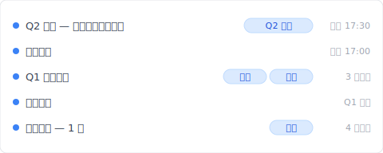
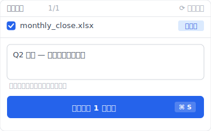

# 【2026 檔案管理】Excel 還原版本只回 1-2 版？4 個 Microsoft AutoSave 沒講的限制 + Keeply 怎麼補

> Excel 版本歷史按鈕變灰、只回 1-2 版？不是 bug、是 Microsoft 把 AutoSave 當 OneDrive 訂閱誘餌設計。

週五下午 5:47、你在改月底結算 Excel。剛剛刪了一段公式想試另一個算法、結果改錯了。Ctrl+Z 一直按、按到上限就回不去。打開「檔案 > 資訊 > 版本歷史」——按鈕是灰的、按不下去。你才想到：這份結算表存桌面、沒上 OneDrive。30 分鐘的公式工作沒了。

這不是個案。每個用 Excel 工作的人都會遇到、因為 Microsoft 把版本歷史當 OneDrive 訂閱誘餌設計。這篇拆完 4 個你會撞到的限制、Microsoft 為什麼這樣設計、然後讓你看 [Keeply](https://keeply.work) 怎麼補本機 Excel 的版本管理。

## 目錄

1. [換 Keeply 後我的 monthly_close.xlsx 時間軸長這樣](#keeply-timeline)
2. [Excel 版本歷史按鈕為什麼是灰的？4 個條件你 1 個都沒中](#why-grayed-out)
3. [Microsoft AutoSave 沒講的 4 個限制：桌面只回 1-2 版 / 30 天過期 / 本機無紀錄 / 沒儲存格比對](#four-limits)
4. [Microsoft 為什麼這樣設計？OneDrive 訂閱差異化的商業取捨](#why-microsoft)
5. [3 種工具設計怎麼補 Excel 版本歷史：每次存自動快照 / 自動里程碑 / 版本搜尋](#three-designs)
6. [不必裝 Keeply 的 4 種 Excel 場景](#when-not-needed)

---

## 換 Keeply 後我的 monthly_close.xlsx 時間軸長這樣 {#keeply-timeline}

先讓你看現在。同樣是 `monthly_close.xlsx`、同樣每月跑結算——在 [Keeply](https://keeply.work) 裡，這個會計專案保管庫的時間軸看起來是這樣：

「Q1 結算定版」自己一行、有「定版」「凍結」兩個 tag——這是 Keeply 的「發行版」凍結機制（對應 ADR-003）：那一版會被凍結成獨立快照、永遠不被後續存檔覆蓋。3 個月後 Q3 出問題你想對照 Q1 那版的公式邏輯、點開那一行就有。

今天 17:30「Q2 結算 — 改完應收帳款公式」自己一行——是我下午改完公式時主動點 Keeply 主視窗「儲存版本」、跳出來這個對話框、寫筆記再存的：

寫一行「Q2 結算 — 改完應收帳款公式」、儲存版本。Keeply 不依賴 OneDrive、不依賴 AutoSave 開不開、檔案存桌面也照存。半年後翻時間軸、看到的是描述、不是純時間戳。

加上 Keeply 在背景每 30 分鐘輪詢檔案變更（有改才存）——你忘記主動標、30 分鐘內也會自動有一版。Excel AutoSave 限制 #1（桌面只回 1-2 版）Keeply 解。

下面拆 Microsoft AutoSave 那 4 個限制各自是什麼、為什麼 Microsoft 故意這樣設計。

---

## Excel 版本歷史按鈕為什麼是灰的？4 個條件你 1 個都沒中 {#why-grayed-out}

「檔案 > 資訊 > 版本歷史」這個按鈕**只在 4 個條件同時成立時才能用**：(1) 檔案存在 OneDrive 或 SharePoint、(2) AutoSave 已開啟、(3) 你是商業版授權、(4) 用桌面版而不是網頁版。任一條件不符、按鈕就變灰按不下去。

沒人告訴你的是：多數人的工作模式 4 個條件**一個都沒中**——檔案存桌面、AutoSave 預設關閉、個人版、桌面跟網頁版交替用。所以按鈕是灰的才是預設情況、不是你哪裡做錯。

---

## Microsoft AutoSave 沒講的 4 個限制：桌面只回 1-2 版 / 30 天過期 / 本機無紀錄 / 沒儲存格比對 {#four-limits}

把「Excel 版本歷史不夠用」拆開看、4 個結構性限制不論你怎麼設定都繞不過：

| # | 限制 | 後果 |
|---|---|---|
| 1 | **桌面 AutoSave 只回 1-2 版** | 你改錯 30 分鐘前 = 救不回 |
| 2 | **OneDrive/SharePoint 30 天過期** | 季度檢討時客戶要看 60 天前版本 = 沒了 |
| 3 | **本機檔案完全沒版本歷史** | 為了隱私存桌面 = 無歷史 |
| 4 | **沒有儲存格層級的比對** | 不能說「保留新加的欄、但救回舊公式」 |

每個限制都是 Microsoft 工程上**故意不解**的選擇、不是技術做不到。下一段講為什麼。

---

## Microsoft 為什麼這樣設計？OneDrive 訂閱差異化的商業取捨 {#why-microsoft}

完整的檔案歷史紀錄層技術上不難做。Apple 從 2007 年起就在每一台 Mac 內建一個叫 Time Machine 的功能：每小時自動存一版、想回到 3 個月前那一版點兩下就有、全部免費。技術早就成熟。Microsoft 工程上做得到、商業上不做。

問題在商業設計：版本歷史是 OneDrive 訂閱的差異化賣點。如果桌面 Excel 自己就有完整紀錄、本機檔案也有、無時間限制、OneDrive 訂閱會少一個綁定理由。

對啊、這就是讓人煩的地方。你撞到的不是 bug、是付費牆。只是 Microsoft 不會這樣講。版本歷史對使用者是**檔案安全網**；對 Microsoft 是**訂閱上鉤餌**。同一個功能兩個角色、誰決定行為？決定的人不是你。

---

## 3 種工具設計怎麼補 Excel 版本歷史：每次存自動快照 / 自動里程碑 / 版本搜尋 {#three-designs}

把工具能做的事拆成 3 種設計模式。每種對應前面 4 個限制裡的某一些。

### 設計 A：背景輪詢自動快照（不依賴雲端、不依賴 AutoSave）

工具在背景每 N 分鐘輪詢檔案變更（不是 hook 你按 Ctrl+S 那一刻、是事後檢查檔案系統）、無論檔案存桌面還是雲端。**例子**：macOS Time Machine（系統層整顆磁碟）、[Keeply](https://keeply.work)（檔案層、鎖定你指定的工作資料夾）。**Keeply 的差別**：每版完整保留、無時間限制、不像 OneDrive 30 天就清掉。**解限制 #1 + #2 + #3**。

### 設計 B：手動里程碑（每月底/每季度凍結）

工具讓你主動標「這版是月底結算 v3」「這版是 Q2 結算」、凍結點之後不論怎麼改都還在。**例子**：GitHub Release（工程師圈把某個時間點的程式碼凍結成版本的功能、只給開發者用）。**Keeply** 內建一個叫「發行版」的功能（對應 ADR-003）、做同一件事但你不用學任何術語：在版本歷史裡選一版按「凍結為發行版」、之後永遠回得來。**解限制 #2 的延長場景**：季度檢討還能找到當時的版本。

### 設計 C：版本內容搜尋

從歷史任何版本搜尋儲存格內容（不只是檔名）。**Keeply** 可以對版本歷史內的文字內容做搜尋。**解限制 #4 的部分**：雖然不是儲存格層級的差異比對、但能找到「那個 100 元的數字最後一次出現是哪一版」。

這時候你就會發現、4 個限制裡 #4（儲存格層級比對）是真實邊界、下一節老實講為什麼。

---

## 不必裝 Keeply 的 4 種 Excel 場景 {#when-not-needed}

Keeply 不解所有 Excel 場景：

**儲存格層級的差異比對**。Keeply 顯示「整檔 v3 → v4」、不顯示「儲存格 B7 從 100 變 105」。要儲存格比對仍要用 Microsoft 365 共同編輯、或專門的試算表 diff 工具（如 Spreadsheet Compare）。

**公式邏輯錯誤**。Keeply 救「上一版的公式」、不救「公式本身寫錯」。後者是 Excel 除錯工具的領域（如 Trace Precedents、Evaluate Formula）。

**多人即時協作**。Microsoft 365 共同編輯比 Keeply 強（不同場景）。如果你的 Excel 是 5 人同時改、走 Microsoft 365 / Google Sheets 比較順。

**檔案大小仍受硬碟限制**。100 個 50MB 模型 = 5GB、Keeply 本機也是 5GB。雲端訂閱有自己的容量規則、Keeply 不解雲端容量問題。

以上都不適用——本機 Excel 工作、要回去看 30 天 / 90 天前的版本、有特殊版本要凍結——這時候裝 Keeply 才划算。

---

## 延伸閱讀

主篇 [檔案版本管理完整指南](/zh-tw/post/file-version-management-complete-guide/) 拆 4 個結構性原因——為什麼工具就是沒設計給你這件事。

對照閱讀：[Keeply 跟備份、雲端工具有什麼不一樣](/zh-tw/post/what-keeply-saves-vs-backup-cloud/) — 三件不同事的完整對照。

備份原則：[3-2-1 備份原則：20 年了還夠用嗎？](/zh-tw/post/3-2-1-backup-rule/) — Excel 結算表 + 異地備份的搭配。

---

下次你撞到 Excel 版本歷史按鈕是灰的、不會再以為自己沒做對。你會知道那是 Microsoft 故意設計的結果、而且你有別的選項。

打開 [Keeply](https://keeply.work)、看時間軸頂端那條「Q2 結算」tag——下次月底改公式改錯、點時間軸還原、不必再等 OneDrive 訂閱開通才有版本。

---

> 關於作者：Ting-Wei Tsao，[Keeply](https://keeply.work) 創辦人。
> [LinkedIn](https://www.linkedin.com/in/ting-wei-tsao-b57480152/)
