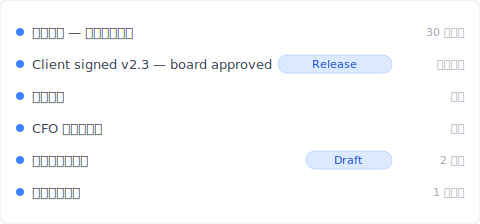

# 【2026 檔案管理】OneDrive 版本歷史不是無限的：500 個版本天花板 + 30 天救援窗的 Microsoft 官方數字

> Microsoft Learn 寫得很清楚 500 + 30 天。但 90% 教學文章只教怎麼用、不講何時碰壁。

「OneDrive 把你救了 200 次。然後在第 501 次，悄悄刪掉了你最舊的版本——還不通知你。」

這不是 bug、不是 BUG report。是 [Microsoft Learn 文件](https://learn.microsoft.com/en-us/sharepoint/document-library-version-history-limits)早就寫清楚的 500 主要版本 上限。但 90% 的 OneDrive 版本歷史教學文章只教**怎麼用**、不講**它什麼時候會碰壁**。本文補這層——三件被混在一起的 OneDrive 機制（version history 500 上限 / 資源回收筒 30 天 / 自動回復）拆開、加上 [Keeply](https://keeply.work) 怎麼接住超過 上限 後的場景。

## 本文目錄

1. [Keeply 怎麼讓 OneDrive 版本歷史「不會在第 501 次消失」](#keeply-timeline)
2. [OneDrive 版本歷史的 3 個機制：500 / 30 天 / 自動回復 分別在說什麼](#three-mechanisms)
3. [500 version 上限：Microsoft 官方數字 + 你什麼時候會撞到](#500-cap)
4. [資源回收筒 30 / 93 天：刪檔後的時間窗、不是 version history 的延伸](#recycle-bin)
5. [自動回復：Office 客戶端緊急救援、跟 version history 完全分開](#autorecover)
6. [Keeply 補位：超過 OneDrive 上限 之後的 發行版凍結 + 單檔筆記](#keeply-fills)
7. [3 種你不需要 Keeply 的 OneDrive 場景](#when-not-needed)
8. [常見問題](#faq)

---

## Keeply 怎麼讓 OneDrive 版本歷史「不會在第 501 次消失」 {#keeply-timeline}

先看現在會發生什麼。Tina 是顧問、用 OneDrive 存 `proposal.docx`、半年來累積 200 多版。客戶今天簽了、明年 3 月想回頭看當初提案、她想抓 8 個月前那版——OneDrive 還在嗎？

換到 [Keeply](https://keeply.work)，這個專案的時間軸長這樣：

「Client signed v2.3 — board approved」自己一行、有 Release tag——是她今天客戶確認後、主動點 Keeply 主視窗「儲存版本」+ 寫筆記存的：

寫一行「Client signed v2.3 — board approved」、儲存版本。明年 3 月翻時間軸看 tag 就有——不受 OneDrive 500 上限 影響、不被自動刪除。

操作只有 2 個動作：

1. **存檔**——她在 Word 按 Ctrl+S，OneDrive 同步雲端（如常）、Keeply 在背景 30 分鐘內輪詢看到變更、自動存一版進時間軸。
2. **標里程碑**——客戶確認後點 Keeply「儲存版本」+ 寫筆記。

下面拆 OneDrive 自家的三件機制——為什麼會在第 501 次消失。

---

## OneDrive 版本歷史的 3 個機制 {#three-mechanisms}

OneDrive 講「版本歷史」其實是 3 件不同的事被混在一起講。**先拆開**：

| 機制 | 是什麼 | 上限 | 觸發 |
|---|---|---|---|
| **Version History** | 雲端檔案每一版 | **500 主要版本**（[MS Learn](https://learn.microsoft.com/en-us/sharepoint/document-library-version-history-limits)） | 自動每次儲存 |
| **資源回收筒** | 刪檔後保留窗 | 個人 30 天 / 公司 93 天（[MS Support](https://support.microsoft.com/en-us/office/restore-deleted-files-or-folders-in-onedrive-949ada80-0026-4db3-a953-c99083e6a84f)） | 手動 / 同步刪除 |
| **自動回復** | Office 客戶端緊急救援 | 預設 10 分鐘間隔 | 軟體當機 / 沒儲存就關 |

三件不同事、混在一起問會找錯方向。你「找不到 6 個月前那版」可能是 Version History 撞 500 上限、可能是 資源回收筒 30 天過期、也可能是 自動回復 暫存早被覆蓋——不同問題要走不同層解。

## 500 version 上限：Microsoft 官方數字 {#500-cap}

[Microsoft Learn 文件](https://learn.microsoft.com/en-us/sharepoint/document-library-version-history-limits)寫得清楚：SharePoint / OneDrive 文件庫每個檔案最多保留 **500 個 主要版本**（搭配主要 / 次要 versioning 開啟時、可再加 511 個 minor versions）。

**超過會發生什麼**：自動刪最舊的版本來騰出空間給新的、不通知你、不能取消。

**什麼人會撞到**：

- **顧問**——每天 3 次儲存 proposal、月 ~66 版、**7-8 個月**就到 上限
- **設計師**——每天 5-8 次儲存設計稿、**3-4 個月**就到 上限
- **作家 / 律師**——每天 ≥10 次儲存逐字稿、**< 3 個月**到 上限

每天儲存頻率高 + 半年以上專案 = 高機率撞 上限。MS 沒提醒、UI 沒警告、撞到的人才知道。

## 資源回收筒 30 / 93 天 {#recycle-bin}

資源回收筒 是「**刪檔回收**」、不是「版本歷史延伸」。常見誤解：「我刪了還有 30 天可以救」≠「我修改了還可以還原半年前」。

[MS Support](https://support.microsoft.com/en-us/office/restore-deleted-files-or-folders-in-onedrive-949ada80-0026-4db3-a953-c99083e6a84f) 官方數字：

- **個人帳號**：30 天保留
- **公司 / 學校帳號**（work or school）：93 天保留

過期後從第二階段 資源回收筒 永久刪除、不可救回。

Version History 跟 資源回收筒 是**兩個獨立系統**：你修改 `proposal.docx` 從 v200 到 v201、舊版進 Version History（不進 資源回收筒）。你刪掉 `proposal.docx`、整個檔案進 資源回收筒（連同它的所有 version history）。前者撞 500 上限、後者撞 30/93 天 上限。

## 自動回復 ≠ version history {#autorecover}

Word / Excel / PowerPoint 桌面客戶端的 自動回復 暫存 `.asd` 檔——預設 **10 分鐘間隔**——只在以下情況有用：

- 軟體當機（藍底白字當掉）
- 強制關閉 / 系統停電
- 沒儲存就關閉視窗、下次開啟提示「要還原嗎？」

跟 OneDrive cloud version history **完全分開**、不算同一體系。Office 開啟時提示「我們找到一份未儲存的版本」就是 自動回復，不是雲端歷史。

相關詳細請看 [Photoshop autosave 不是 version history](/zh-tw/post/photoshop-autosave-not-version-history/)——Adobe 那層同款混淆機制。

## Keeply 補位 — 超過 OneDrive 上限 之後 {#keeply-fills}

Tina 那個 `proposal.docx` 撞了 500 上限、客戶忽然要 8 個月前提案——OneDrive 已經沒有那版了。

換到 [Keeply](https://keeply.work)、3 件事一個工具：

- **發行版凍結**：在 2 月 14 日客戶簽約那天、Tina 點「儲存版本」標「Client signed v2.3」——這版會被凍結成獨立快照、不被後續 500 次儲存覆蓋、永久保留。OneDrive 500 上限 不適用。
- **單檔筆記**：每版可以寫 1-2 行筆記。3 個月後 Tina 在時間軸看「CFO 第三輪修改」「客戶簽」一行行 tag、不必翻 12 個 `_FINAL` 檔名猜哪個是哪個。
- **跨工具 portability**：Keeply 不依賴 OneDrive。她以後換 Dropbox / NAS / 換工作筆電——時間軸還在本機 + Keeply 自己的備援位置、不被任何雲端 vendor 的 上限 鎖死。

OneDrive 留給同步協作（這是它強項）、Keeply 給她 unlimited 的單檔版本歷史。

## 3 種你不需要 Keeply 的 OneDrive 場景 {#when-not-needed}

誠實寫、Keeply 不是萬靈丹：

**enterprise compliance archive**。SOX、HIPAA、GDPR 要 audit chain + 加密 + 保留期管理——走 [Microsoft 365 Backup](https://www.microsoft.com/en-us/microsoft-365/business/microsoft-365-backup) / Veeam / Acronis。Keeply 是日常版本管理、不是合規工具。

**合約簽核 / 法務 audit**。需要簽章 + 不可篡改紀錄走 DocuSign / Adobe Sign。Keeply 紀錄版本軌跡、但不認證簽章。

**每天 < 1 次儲存的個人用**。如果你的 `notes.docx` 一週才改一次——OneDrive 500 上限 你 10 年都用不到、Keeply 沒急需。

## 常見問題 {#faq}

**Q1: OneDrive 版本歷史最多保留幾個？**

500 主要版本（[Microsoft Learn](https://learn.microsoft.com/en-us/sharepoint/document-library-version-history-limits)）。超過自動刪最舊、不通知。

**Q2: OneDrive 版本歷史保留多久？**

Version history 本身沒有時間限制（受 500 上限 限制）。有時間限制的是 資源回收筒：個人 30 天、公司 93 天。

**Q3: OneDrive 版本歷史和 自動回復 一樣嗎？**

不一樣。Version history 是 OneDrive 雲端的每一版檔案、自動回復 是 Office 桌面客戶端的緊急救援（10 分鐘間隔）、兩個完全不同存儲層。

**Q4: 為什麼我找不到 OneDrive 6 個月前的版本？**

兩個可能：(a) 超過 500 上限 被自動刪、(b) 搜的是 資源回收筒 而 30 天窗已過。重度使用者 7-8 個月就會撞 上限。

**Q5: 超過 500 個版本後怎麼辦？**

OneDrive 默默刪最舊的、沒警告。要解決需要無 上限 的工具——例如 [Keeply](https://keeply.work) 的 發行版凍結。

**Q6: Keeply 跟 OneDrive 衝突嗎？**

不衝突、並行運作。OneDrive 同步協作、Keeply 給 unlimited 單檔版本歷史 + 筆記 + 發行版凍結。

## 延伸閱讀

主篇 [檔案版本管理完整指南](/zh-tw/post/file-version-management-complete-guide/)——4 個結構性原因、為什麼工具就是沒設計給你這件事。

對照閱讀：
- [Excel 版本歷史的限制](/zh-tw/post/excel-version-history-limits/)——Excel 同款 500 機制 + sibling 場景
- [Keeply 跟備份、雲端工具有什麼不一樣](/zh-tw/post/what-keeply-saves-vs-backup-cloud/)——三件不同事的完整對照
- [客戶問哪一版才是定稿](/zh-tw/post/client-asked-which-version/)——Word 版本歷史 + 客戶要某版場景

---

Tina 的 `proposal.docx` 在 OneDrive 撞了 500 上限、客戶下個月要 8 個月前那版——Microsoft 自家規則、按官方文件刪了。

但她在 Keeply 標了「Client signed v2.3」Release。半年後客戶要那版、3 秒就翻到。

Microsoft 已經把 500 寫進文件。你不需要 OneDrive 不變、你需要 OneDrive 變慢時還有工具接得住。

---

> 關於作者：Ting-Wei Tsao，[Keeply](https://keeply.work) 創辦人。
> [LinkedIn](https://www.linkedin.com/in/ting-wei-tsao-b57480152/)
