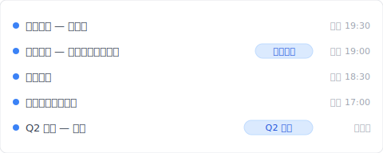
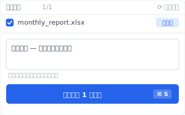

# 【2026 檔案管理】找回被覆蓋檔案的極限：AutoRecover 救不到、資料復原軟體賭運氣，Keeply 怎麼補事前防禦

> AutoRecover 是為當機救援設計的、資料復原軟體賭覆蓋後幾分鐘磁區還在。覆蓋儲存後你需要的是事前防禦。

週五晚上 19:30、月底結算文件用 Excel 編輯中、不小心把前一張工作表覆蓋掉了。

Ctrl+Z 已經沒用（剛才關閉了）。AutoRecover 檔案也消失了。

週一早上前要復原。但來得及嗎？

這篇拆完 AutoRecover / OneDrive 版本歷史 / 資料復原軟體各自能救什麼、為什麼「覆蓋儲存後」事後救援都有極限、然後讓你看 [Keeply](https://keeply.work) 怎麼用事前防禦補這層。

## 重點

搜尋「**找回被覆蓋的檔案**」的人多數在求事後救援。但 Microsoft AutoRecover 是為當機設計的、資料復原軟體的成功率以覆蓋後幾分鐘為勝負。這些工具都不適用於「正常關閉後才發現覆蓋」的場景。**事後救援不是答案、事前防禦才是**。在工具層放一份常駐版本歷史、覆蓋儲存就不再是破壞性動作。

## 本文目錄

1. [換 Keeply 後我週五 19:00 的版本還在](#keeply-timeline)
2. [AutoRecover 到底是為什麼設計的？當機救援不是覆蓋救援](#autorecover-design)
3. [AutoRecover / 以前的版本 / 復原軟體：各自能救什麼？5 個機制的邊界](#five-mechanisms)
4. [為什麼「覆蓋儲存後」就來不及了？儲存層依賴發現時機](#why-too-late)
5. [事後救援之外：Keeply 常駐版本歷史 + 30 分鐘自動輪詢](#keeply-fills-gap)
6. [不必裝 Keeply 的 3 種覆蓋場景](#when-not-needed)
7. [常見問題](#faq)

---

## 換 Keeply 後我週五 19:00 的版本還在 {#keeply-timeline}

先讓你看現在。同樣是週五 19:30 覆蓋掉月底結算——在 [Keeply](https://keeply.work) 裡，這個會計專案保管庫的時間軸看起來是這樣：

「月底結算 — 應收應付對帳完成」自己一行、有「月底結算」tag——是週五下午 19:00 對帳完成那一刻、我主動點 Keeply「儲存版本」+ 寫筆記存的。19:30 覆蓋之後 Keeply 在背景自動又存了一版（也在時間軸上）——但前一版「應收應付對帳完成」**沒有消失**。

A 先生週五 19:30 那一刻發現覆蓋了、打開 Keeply、點時間軸上「月底結算 — 應收應付對帳完成」那一行——3 秒還原。週一早上前的 60 小時根本不需要熬夜重做。

那行筆記怎麼來的？週五 19:00 對完帳的時候、A 先生點 Keeply 主視窗「儲存版本」按鈕、跳出來這個對話框：

寫一行「月底結算 — 應收應付對帳完成」、儲存版本——半年後翻時間軸、看到的是描述、不是純時間戳。

加上 Keeply 在背景每 30 分鐘自動輪詢檔案變更——你忘記主動標、30 分鐘內也會有自動儲存版本。覆蓋掉的災難對 Keeply 來說只是時間軸上多一條記錄、不會抹掉前面那一版。

下面拆 Microsoft 內建跟資料復原軟體各自為什麼救不了「正常關閉後才發現覆蓋」這個場景。

---

## AutoRecover 到底是為什麼設計的？當機救援不是覆蓋救援 {#autorecover-design}

Microsoft Office 內建有 3 種「**版本還原**」機制：

- **AutoRecover**：當機時救回未儲存內容。預設每 10 分鐘自動暫存一份。**檔案正常關閉後就清除**。
- **以前的版本**（Windows）：透過陰影複製功能還原到過去快照。需要事前設定。
- **OneDrive 版本歷史**：每次儲存的版本快照。[Microsoft 官方文件](https://learn.microsoft.com/en-us/sharepoint/document-library-version-history-limits)指出預設保留 500 個主要版本（個人 Microsoft 帳號限 25 版）。

設計目的明確：這 3 個機制是給「**當機救援**」、「**最近的儲存事故**」使用的。「**正常關閉後才發現覆蓋錯**」這種場景不在設計目標內。

---

## AutoRecover / 以前的版本 / 復原軟體：各自能救什麼？5 個機制的邊界 {#five-mechanisms}

要看每個機制的邊界、並列對比：

| 機制 | 救得到的場景 | 救不到的場景 | 注意事項 |
| --- | --- | --- | --- |
| AutoRecover | 編輯中當機 | 正常關閉後的覆蓋錯 | 檔案關閉即清除 |
| OneDrive [版本歷史](https://learn.microsoft.com/en-us/sharepoint/document-library-version-history-limits) | 過去 500 版以內（個人帳號 25 版） | 超過 500 版的舊版、純本地檔案 | 需雲端儲存 |
| Windows 以前的版本 | 有陰影複製的話 | 沒設定、SSD 環境 | 需事前設定 |
| 資料復原軟體 | 覆蓋直後、磁區未被新寫入 | 過了一段時間、SSD TRIM 後 | 成功率視環境而定 |
| Mac [Time Machine](https://support.apple.com/en-us/HT201250) | 最近的快照 | 快照間隔之外 | 需另外設定 |
| **[Keeply](https://keeply.work)** | **30 分鐘輪詢 + 主動儲存版本，每版有筆記** | **編輯中當機那一刻（30 分鐘輪詢間隔內）** | **必須事前啟動、不能溯及既往** |

對啊、這就是讓人煩的地方。Microsoft 內建沒有一個機制能結構性地觸及「正常關閉後覆蓋錯」這種典型場景。Keeply 補的就是這層。

---

## 為什麼「覆蓋儲存後」就來不及了？儲存層依賴發現時機 {#why-too-late}

這裡要拆一個沒人明講的差別：**儲存層** vs **工具層**。

這些機制活在**儲存層**。設計目標是「最近一次寫入失敗就回滾」、所以保留期設得短。500 版、30 天這些數字、參考的是「平均使用者一個月內回頭找的次數」。3 個月以上不在設計目標內、清除掉是合理的。

A 先生是會計。週五晚上 19:30、他不小心把月底結算 Excel 覆蓋掉了。他找 AutoRecover 檔案、找不到。試了資料復原軟體、跳出「磁區已被覆寫」訊息。週一早上前還剩 60 小時。

這裡是真正的問題。A 先生事後想到、如果是週五白天覆蓋的、AutoRecover 30 分鐘間隔可能有抓到。**但他「發現的時間點」已經太晚。事後救援依賴「發現的時機」。事前防禦不依賴發現。每次儲存早就留下版本了。**

SSD 環境下更糟。資料復原軟體依賴磁區未被新寫入——但 SSD TRIM 指令會在覆蓋發生時立即清除被覆蓋的磁區、給作業系統「這格可以重用」的訊號。HDD 還能賭幾分鐘、SSD 賭幾秒鐘都不一定有。

---

## 事後救援之外：Keeply 常駐版本歷史 + 30 分鐘自動輪詢 {#keeply-fills-gap}

要超越事後救援的極限、靠的是**事前防禦**。在工具層放一份常駐版本歷史。

[Keeply](https://keeply.work) 在背景對你指定的工作資料夾自動輪詢：每 30 分鐘檢查一次檔案變更（有改才存）、不依賴 Word / OneDrive 的保留期政策。本機 git 沒時間上限、500 版本上限不存在。「覆蓋儲存」就**不再是破壞性動作**——前一個版本永遠留著。

加上 Keeply 主動「儲存版本」+ 筆記功能：重要時刻（月底結算、季度報告、業主簽約版）你親手點按鈕、寫一行說明、那一版單獨被凍結。3 個月後翻時間軸、看到「月底結算 — 應收應付對帳完成」自己一行、不用猜時間戳。

B 小姐用 Keeply 半年。週一早上發現月底結算被覆蓋成前一張表。她打開 Keeply。週五 19:00 那版「月底結算 — 應收應付對帳完成」自己一行有 tag、19:15 / 19:30 也都自動儲存在時間軸上。她點「回到 19:00 的版本」、3 秒後 Excel 開啟那個版本。週一上班前根本不需要熬夜重做。

---

## 不必裝 Keeply 的 3 種覆蓋場景 {#when-not-needed}

Keeply 不取代所有覆蓋救援場景：

**編輯中當機那一刻**。Keeply 30 分鐘輪詢、不會抓到那一刻的中間狀態。AutoRecover 仍是第一道線（10 分鐘間隔）。Keeply + AutoRecover 互補、不取代彼此。

**Keeply 啟用前的覆蓋**。Keeply 不能溯及既往（過去那版 Keeply 沒記到）。今天裝、今天起的每次覆蓋才救得了。

**SSD 物理損毀**。Keeply 是本機版本歷史、SSD 整顆壞掉它跟其他本機資料一起沒。要搭 [3-2-1 備份原則](/zh-tw/post/3-2-1-backup-rule/)的異地備份。

---

## 常見問題 {#faq}

**Q1: AutoRecover 預設是開的嗎？**

是。設定路徑：「檔案 → 選項 → 儲存 → 儲存自動回復資訊每 10 分鐘」。但 AutoRecover 在檔案正常關閉後會清除、不算長期保留。

**Q2: 資料復原軟體的成功率多高？**

覆蓋直後幾分鐘內有成功率、但 SSD（多數現代電腦）由於 TRIM 指令會立即清除被覆蓋的磁區、成功率比 HDD 低。HDD 過幾天後成功率也急遽下降。

**Q3: OneDrive 個人版跟商務版版本歷史保留一樣多嗎？**

不完全一樣。OneDrive 個人預設約 500 版。商務版（Microsoft 365）也預設 500 版但管理員可調整。到上限就清除最舊。

**Q4: Time Machine 有用嗎？**

Mac 的 Time Machine 是系統級備份。在快照間隔（預設 1 小時）內發生覆蓋就救不到。它也不是檔案級的版本管理、要從 Time Machine 救單檔特定版本很麻煩。

**Q5: Keeply 是 AutoRecover 的替代嗎？**

不是。AutoRecover 處理當機救援、Keeply 處理正常儲存後的版本保留。兩者是互補關係。Keeply 必須事前啟動（不能溯及既往）。

---

## 延伸閱讀

主篇 [檔案版本管理完整指南](/zh-tw/post/file-version-management-complete-guide/) 拆 4 個結構性原因——為什麼工具就是沒設計給你這件事。

Word 場景：[Word 存得住版本、存不住 3 個月後的記憶](/zh-tw/post/client-asked-which-version/) — 同樣是 Microsoft 內建保留期限制、不同切入。

Excel 場景：[Excel 還原版本只回 1-2 版？4 個 Microsoft AutoSave 沒講的限制](/zh-tw/post/excel-version-history-limits/) — 同 Microsoft AutoSave 機制。

---

「啊、覆蓋掉了」的 19:30 那個瞬間、未來還會出現。你不知道什麼時候。

但有一件事要知道：事後救援有極限。事前防禦不依賴發現的時機。

打開 [Keeply](https://keeply.work)、看時間軸頂端那條「月底結算」tag——下次 19:30 覆蓋發生、點時間軸 3 秒還原、不必賭資料復原軟體有沒有抓到磁區。

---

> 關於作者：Ting-Wei Tsao，[Keeply](https://keeply.work) 創辦人。
> [LinkedIn](https://www.linkedin.com/in/ting-wei-tsao-b57480152/)
