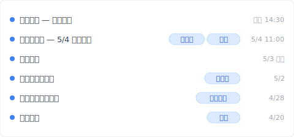
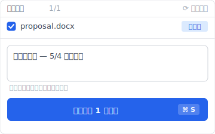

# 【2026 檔案管理】檔案命名規則救不了你：3 種讓你不必再命名 _v3_FINAL 的工具設計 + Keeply 怎麼接手

> `_v3_FINAL_真的最終.docx` 不是強迫症、是工具沒給你回頭路的求生反應。

週四晚上 11:47、你在桌面找客戶今天簽好的版本。11 個 `提案_v*_FINAL.docx` 排在那裡。哪個是客戶簽的、哪個是你自己加註的、哪個是 IM 收到後又改一次的。你不敢刪、但留著找不到。

這不是個案。每個用儲存鍵工作的人都遇得到。這篇拆完為什麼會這樣、「太多版本」其實是 4 種不同的痛、然後讓你看 [Keeply](https://keeply.work) 怎麼用「30 分鐘背景輪詢 + 主動里程碑」接手 `_v3_FINAL` 這層責任。

## 目錄

1. [換 Keeply 後我的 11 個 _v3_FINAL.docx 變一條時間軸](#keeply-timeline)
2. [為什麼你會命名 `_v3_FINAL`？工具沒給你回頭路的求生反應](#why-naming)
3. [「太多版本」其實是 4 種不同的痛點：誤覆蓋 / 客戶反饋輪 / 同步衝突 / 自動儲存殘留](#four-types)
4. [你做的事是對的、工具沒接棒——3 種工具設計怎麼解](#three-designs)
5. [不必裝 Keeply 的 4 種「太多版本」場景](#when-not-needed)

---

## 換 Keeply 後我的 11 個 _v3_FINAL.docx 變一條時間軸 {#keeply-timeline}

先讓你看現在。同樣一份 `proposal.docx`、同樣從初稿改到客戶簽約——在 [Keeply](https://keeply.work) 裡，這個提案保管庫的時間軸看起來是這樣：

「客戶簽約版 — 5/4 業主確認」自己一行、有「客戶簽」+「定版」兩個 tag——是 5/4 客戶簽完那一刻、我主動點 Keeply「儲存版本」+ 寫筆記 + 凍結為 Release（對應 ADR-003）的版本。「老闆第三輪修改」「客戶第一輪回饋後」「初稿提案」也各自一行、有 tag。

資料夾裡只有一個檔案：`proposal.docx`。沒有 `_v3_FINAL`、沒有 `_真的最終`、沒有 `_老闆要再改_v2`。檔名乾淨、版本史在 Keeply 時間軸看。

那行筆記怎麼來的？5/4 客戶簽完那一刻、我點 Keeply 主視窗「儲存版本」按鈕、跳出來這個對話框：

寫一行「客戶簽約版 — 5/4 業主確認」、儲存版本——同時凍結成 Release、業主簽過的那一版永遠不被後續存檔覆蓋。3 個月後客戶問哪版、翻時間軸看 tag 就有。

加上 Keeply 在背景每 30 分鐘輪詢檔案變更——就算我忘了主動標、30 分鐘內也會有自動儲存版本。覆蓋掉的災難不再存在。

下面拆為什麼你會本能打 `_v3_FINAL`、那其實是 4 種不同的痛。

---

## 為什麼你會命名 `_v3_FINAL`？工具沒給你回頭路的求生反應 {#why-naming}

存檔是個永久動作。你按下去、舊版本就被覆蓋。沒有「半小時前那一版」可以回去。設計師的 PSD、律師的合約 docx、學生的論文、全都是這樣。**不命名你會丟掉**。所以你才在檔名後面加 `_v3`、`_FINAL`、`_真的最終`。

對啊、這就是讓人煩的地方。你做的事不是強迫症、是作業系統沒給你「復原半小時前那一版」這條路時的求生反應。

---

## 「太多版本」其實是 4 種不同的痛點：誤覆蓋 / 客戶反饋輪 / 同步衝突 / 自動儲存殘留 {#four-types}

把「太多版本」拆開看、會發現是 4 種完全不同的問題。每種要的解法也不同。

| # | 痛點類型 | 典型現場 | Keeply 對應 |
|---|---|---|---|
| 1 | **用戶誤覆蓋** | 存完才發現「啊半小時前那一版才是對的」 | 30 分鐘背景輪詢 + 時間軸還原 |
| 2 | **客戶反饋輪** | `合約_v3_客戶意見.docx` / `提案_v5_老闆要再改.docx` 連環往復 | 主動「儲存版本」+ 寫筆記標里程碑 |
| 3 | **雲端同步衝突** | Dropbox / OneDrive 兩端同改、產生 `提案 (Bill 的 conflicted copy).docx` | 本機副本 + 主動推送（[Dropbox 衝突副本](/zh-tw/post/dropbox-conflicted-copy/) 細講） |
| 4 | **軟體自動儲存殘留** | Word `.asd` / Premiere `.bak` / PSD `.psb` 自動備份散在各處 | 工具教學（學會清快取）、跟版本管理無關 |

你以為在解的是同一件事、其實是 4 件不同的事。第 1 類要工具自動保留歷史；第 2 類要凍結里程碑；第 3 類要同步衝突解析；第 4 類要工具教學。**先診斷你是哪一種、再去找解法**。

---

## 你做的事是對的、工具沒接棒——3 種工具設計怎麼解 {#three-designs}

你在檔名後加 `_v3_FINAL` 邏輯上是對的——你需要標記版本的意義。錯的不是你、是工具層沒提供「自動存檔點」「自動標里程碑」這些機制、把責任丟回給檔名。你只好用唯一能用的工具——檔名——來解這個問題。

整理大師會教你「命名要有規則」、列 14 頁的命名慣例 PDF、要團隊背前綴順序。聽起來很合理、但做起來只能撐三天。

問題在於：**規則把版本管理的責任丟給人類紀律**。而紀律永遠贏不過自動化。你今天記得 `2026-05-04_提案_v3_客戶簽.docx`、明天趕時間就變 `提案_v3_最終.docx`、後天客戶再改一次就是 `提案_v3_最終_v2.docx`。

把工具能做的事拆成 3 種設計模式：

### Design A：自動存檔點（不依賴使用者紀律）

工具背景輪詢檔案變更、無論你存幾次都留下歷史、你不必命名。**例子**：macOS Time Machine（Apple 內建、每小時自動存一版）、Word AutoSave（只回最近 1-2 版）、Dropbox 30 天版本史。**Keeply** 在背景每 30 分鐘輪詢你的工作資料夾：文字檔只記變動內容、影像跟設計檔每版完整保留、這樣大檔案不會把硬碟撐爆。**解第 1 類痛點**。

### Design B：里程碑凍結（你自己標「客戶簽」「上線」）

你主動標「這版客戶簽了」、「這版上線了」、之後不論怎麼改、凍結點還在。**例子**：GitHub Release（工程師圈把某個時間點的程式碼凍結成版本的功能、只給開發者用）。**Keeply** 內建一個叫「發行版」的功能（對應 ADR-003）、做同一件事但你不用學任何術語：在版本歷史裡選一版、按一下「凍結為發行版」、之後永遠回得來。**解第 2 類痛點**。

### Design C：單檔還原（從歷史拉一個檔案出來）

從歷史任何版本還原**單一檔案**、不必整資料夾退回。**例子**：Dropbox 的單檔 restore、Time Machine 單檔還原。**Keeply** 加上版本內文搜尋——你記得「上週改過某段話」、可以直接搜尋變動內容、定位到那一版、把那個檔案拉出來。**解第 1 + 2 類混合場景**。

這時候你就會發現、4 種痛點裡第 4 類（軟體自動儲存殘留）走的是另一條路徑：工具教學（學會清快取）、跟版本管理無關。

---

## 不必裝 Keeply 的 4 種「太多版本」場景 {#when-not-needed}

Keeply 不解所有場景：

**Raw 影音素材**。每天累積幾十 GB Premiere 素材、disk 真的不夠、Keeply 不是冷存方案。要走專業影音 archive（Adobe Bridge / DAM 系統）。

**百萬檔以上的資料夾**。Keeply 設計範圍是數百到數千檔的工作資料夾、再多會卡。企業級走 Veeam / Acronis / 集中備份系統。

**純跨團隊頻繁衝突合併**。1 小時內 5 人輪流改一份文件、Keeply 衝突解析 UI 仍受限、用 Google Docs 共同編輯比較順。

**合約終版凍結 / 客戶 deliverable 簽核流程**。那種場景就該手動命名 + 走 DocuSign 等專業簽核工具、Keeply 不是合規簽署平台。

以上都不適用——你常踩「太多 _v3_FINAL 找不到哪個是定版」、想要客戶簽 / 老闆改 / 客戶回饋各自一行 tag——這時候裝 Keeply 才划算。

---

## 延伸閱讀

主篇 [檔案版本管理完整指南](/zh-tw/post/file-version-management-complete-guide/) 拆 4 個結構性原因——為什麼工具就是沒設計給你這件事。

對照閱讀：[Dropbox 衝突的副本：為什麼一直出現？](/zh-tw/post/dropbox-conflicted-copy/) — 解第 3 類痛點。

共用資料夾的命名稅：[共用資料夾的命名稅：4 人團隊一年花 83 小時改 _v7_FINAL_千萬別動 後綴](/zh-tw/post/hidden-cost-shared-folders/) — 多人共用的設計缺陷。

---

下次你存檔、不會再害怕「萬一這版是錯的」。因為「萬一」根本不存在了。每一版都還在、你只要找得到。

打開 [Keeply](https://keeply.work)、看時間軸頂端那條「客戶簽」tag——資料夾裡只有一個 `proposal.docx`、版本史在 Keeply 看、不必再 `_v3_FINAL_真的最終`。

---

> 關於作者：Ting-Wei Tsao，[Keeply](https://keeply.work) 創辦人。
> [LinkedIn](https://www.linkedin.com/in/ting-wei-tsao-b57480152/)
