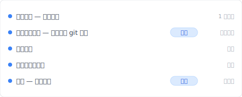
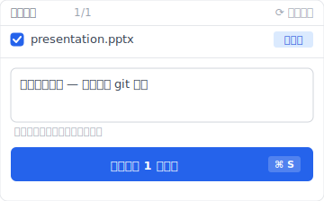

# 【2026 檔案管理】「版本管理軟體」搜出來都是 git？非開發者的 3 種選擇 + Keeply 不用打一行指令

> Google 把「版本管理」這個詞預設成「工程師搜尋」。非開發者的選項被擠到第二頁以後。

你 Google「版本管理軟體」。跳出來的是 git、SVN、Mercurial 教學。終端機指令、黑底白字、存檔點、合併、推送。讀 5 分鐘就放棄了。你不是工程師、是設計師、行政、接案者。你只是想要一個「看得到檔案的視窗」就能管版本的軟體而已。

這不是你哪裡搜錯、是 Google 把「版本管理」這個詞預設成「工程師搜尋」。這篇拆完為什麼會這樣、非開發者需要什麼、然後讓你看 [Keeply](https://keeply.work) 怎麼用「30 分鐘背景輪詢 + 主動標里程碑」做版本管理——**不打一行 git 指令**。

## 目錄

1. [換 Keeply 後我的版本管理長這樣（不打一行 git 指令）](#keeply-timeline)
2. [為什麼搜「版本管理軟體」只跑出 git？SERP 把非開發者擠到第二頁](#why-only-git)
3. [非開發者需要的 4 個設計要件：檔案層 / 免指令 / 二進位 / 直覺還原](#four-requirements)
4. [軟體業早就解決版本管理、為什麼沒搬給非開發者？設計思維沒過來](#why-never-crossed-over)
5. [非開發者實際能用的 3 個選擇：Time Machine / Dropbox 版本歷史 / Keeply](#three-options)
6. [Keeply 不適合的 4 種使用情境](#when-not-needed)

---

## 換 Keeply 後我的版本管理長這樣（不打一行 git 指令） {#keeply-timeline}

先讓你看現在。同樣是 `presentation.pptx`、同樣從初稿改到客戶簽——在 [Keeply](https://keeply.work) 裡，這個簡報專案保管庫的時間軸看起來是這樣：

「客戶簡報定版 — 不打一行 git 指令」自己一行、有「定版」tag——是我今天上午客戶確認後、主動點 Keeply 主視窗「儲存版本」+ 寫筆記存的。不用打 `git commit -m "client approved"`、不用懂 `HEAD~3` 是什麼。

整個操作只有 2 個動作：

1. **存檔**——你在 PowerPoint 按 Ctrl+S。Keeply 在背景 30 分鐘內輪詢看到變更、自動存一版進時間軸。
2. **標里程碑**——重要時刻（客戶簽 / 上線版）點 Keeply 主視窗「儲存版本」按鈕、跳對話框寫一行筆記：

寫一行「客戶簡報定版 — 不打一行 git 指令」、儲存版本。3 個月後回頭看、翻時間軸看 tag 就有。

沒有 `git commit`、沒有 `branch / merge / checkout`、沒有黑底白字終端機。Keeply 底層其實用 git engine（技術上是好的）、但 UI 完全沒有工程師術語——介面是「儲存版本 / 紀錄 / 還原」這種日常詞。

下面拆為什麼 Google 不會自然給你看這層、傳統工具為什麼不滿足非開發者。

---

## 為什麼搜「版本管理軟體」只跑出 git？SERP 把非開發者擠到第二頁 {#why-only-git}

「版本管理軟體」搜尋意圖其實**一半一半**：一半是工程師（要比較 git / SVN / Mercurial 這類版本控制系統）、另一半是非開發者（要看得到檔案的視窗、不想學指令）。

但 Google 搜尋結果**100% 都顯示工程師那一半**：Atlassian、GitHub、Stack Overflow 把前 10 名霸佔了。非開發者的需求被擠到結果第二頁以後。

沒人告訴你的是：你找不到不是因為你搜不對、是你需要的工具被擠出視野了。

---

## 非開發者需要的 4 個設計要件：檔案層 / 免指令 / 二進位 / 直覺還原 {#four-requirements}

把「版本管理軟體要什麼」拆開看、工程師工具滿足不了 4 個要件：

| # | 要件 | 工程師工具滿足不了的原因 | Keeply 對應 |
|---|---|---|---|
| 1 | **看得到檔案的介面** | git 是用「存檔點」當單位、看不到你想看的「proposal.docx 在哪裡」 | 檔案層 UI、視窗看得到 |
| 2 | **不用打指令** | git 預設要用終端機（有 GUI 但學習曲線一樣陡） | 純 GUI、沒終端機 |
| 3 | **大檔案能裝得下** | git 為純文字優化、PSD、DWG、影片這類大檔不擅長 | 底層 LFS、PSD/DWG 都支援 |
| 4 | **直覺的還原介面** | git 的「checkout」「reset」「revert」三個概念對非工程師很混亂 | 一個「還原」按鈕、不用學三個概念 |

git 是**為文字程式碼設計的工具**。設計師、行政、接案者的檔案場景跟它本質上不對。

---

## 軟體業早就解決版本管理、為什麼沒搬給非開發者？設計思維沒過來 {#why-never-crossed-over}

軟體業 20 年前就解決版本管理：工程師按一次儲存、整份程式碼的歷史軌跡都留得乾乾淨淨。問題是那層工具從來沒搬給非開發者用。

不是技術做不到、是設計思維沒過來。工程師工具的詞彙（branch、merge、HEAD）、預設流程（先 commit 才能切換）、UI（黑底白字終端機）、都假設使用者已經是工程師。你不是工程師、那套工具就跟你無關。

非開發者需要的是**從零為他們設計的版本管理工具**、不是把工程師工具的介面換個顏色。[Keeply](https://keeply.work) 走的是這條路：不假設你懂 git、也不教你 git、從檔案層的視角設計版本歷史。底層用 git engine（技術上是好的）、UI 完全藏起來。

對啊、這就是讓人煩的地方。Atlassian、GitHub、Stack Overflow 都對工程師講話、從來沒有人正面回答「不是工程師的人想要的版本管理長什麼樣」。

---

## 非開發者實際能用的 3 個選擇：Time Machine / Dropbox 版本歷史 / Keeply {#three-options}

3 個非開發者可以實際用的選項、各有取捨：

### 選項 A：macOS Time Machine（Mac 內建）

Apple 從 2007 年起在每一台 Mac 內建的功能：插上外接硬碟、系統每小時自動存一份完整快照、要回到 3 個月前那一份檔案打開、點兩下就有。**優點**：免費、看得到檔案、不用打指令、什麼檔案都行。**缺點**：只限 Mac、還原介面要走時間軸動畫、沒有「凍結成里程碑」這個功能、要外接硬碟接著才存得到。**適合**：Mac 個人使用、只要偶爾還原。

### 選項 B：Dropbox 版本歷史（30 天限定）

30 天內的版本 Dropbox 自動留著、從檔案右鍵→「之前的版本」就能還原。**優點**：跨平台、團隊共享方便。**缺點**：超過 30 天就清掉、不支援儲存格層級比對、會產生「衝突副本」（[參考另一篇](/zh-tw/post/dropbox-conflicted-copy/)）、版本只有時間戳沒有筆記。**適合**：30 天內的協作場景。

### 選項 C：[Keeply](https://keeply.work)

從零為非開發者設計：背景每 30 分鐘輪詢檔案變更（不用打指令、不依賴使用者紀律）、主動點「儲存版本」可以寫筆記標里程碑、UI 完全沒有工程師術語。**優點**：看得到檔案、不用打指令、大檔案都能裝（底層 LFS）、無時間限制、可以把某一版凍結成「發行版」（對應 ADR-003）永遠不被覆蓋。**缺點**：桌面優先（手機端弱）、即時同步不是強項、即時多人協作不適合。**適合**：設計師、研究生、接案者、中小團隊、有長期版本需求或設計檔多的工作。

選哪個的提示：(1) 只要偶爾還原 → Time Machine；(2) 團隊在 30 天內協作 → Dropbox；(3) 長期 + 個人 / 小團隊 + 設計檔多 → Keeply。

---

## Keeply 不適合的 4 種使用情境 {#when-not-needed}

老實講、Keeply 不適合所有人：

**真正的工程師**。要用終端機、要看版本歷史的圖表結構、要 `git rebase` / `git bisect` 那些進階指令——Keeply UI 故意藏太多、不適合。直接用 git / GitHub Desktop。

**大企業需要 SSO / AD 整合**。沒有 Single Sign-On / Active Directory 整合。要走企業集中身份管理走 Veeam / Acronis Enterprise / 集中備份系統。

**手機優先的使用者**。Keeply 是桌面優先。手機上看 / 改檔案多的場景用 Google Workspace / Microsoft 365 比較順。

**即時多人協作**（1 小時內 5 人輪流改一份檔案）。Microsoft 365 共同編輯 / Google Docs 比較強。Keeply 是本機 + 主動推送設計、不是即時鏡像。

---

## 延伸閱讀

主篇 [檔案版本管理完整指南](/zh-tw/post/file-version-management-complete-guide/) 拆 4 個結構性原因——為什麼工具就是沒設計給你這件事。

對照閱讀：[Keeply 跟備份、雲端工具有什麼不一樣](/zh-tw/post/what-keeply-saves-vs-backup-cloud/) — 三件不同事的完整對照。

衝突副本：[Dropbox 衝突的副本：為什麼一直出現？](/zh-tw/post/dropbox-conflicted-copy/) — Dropbox 30 天限制下的設計缺陷。

---

下次搜「版本管理軟體」、不會再被 git 教學挫敗。你不是工程師、那也沒關係——非開發者的選項存在、只是 Google 不會給你看而已。

打開 [Keeply](https://keeply.work)、看時間軸頂端那條「定版」tag——資料夾裡只有一個 `presentation.pptx`、版本史在 Keeply 看、不打一行 git 指令。

---

> 關於作者：Ting-Wei Tsao，[Keeply](https://keeply.work) 創辦人。
> [LinkedIn](https://www.linkedin.com/in/ting-wei-tsao-b57480152/)
