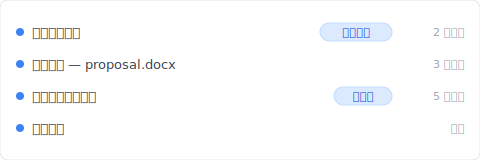

# 【2026 檔案管理】Keeply 到底存什麼？跟備份、雲端工具有什麼不一樣

> 備份顧整顆磁碟。雲端顧最新一份。Keeply 顧那條沒人顧的版本軸。三件不同事。

## 目錄

1. [Keeply 跟備份、雲端有什麼不一樣？同事 B 卡住的問題](#a-and-b)
2. [Time Machine / Acronis 在做什麼：整顆磁碟快照](#what-backup-saves)
3. [Dropbox、OneDrive、iCloud 在做什麼：跨裝置同步 + 30 天版本歷史](#what-cloud-saves)
4. [Keeply 補的第三層：有筆記的版本歷史](#the-third-pit)
5. [我有 Time Machine 了還要裝 Keeply 嗎？3 件事不取代的理由](#why-not-replace)
6. [不必裝 Keeply 的 4 種情境](#when-not-needed)

---

## Keeply 跟備份、雲端有什麼不一樣？同事 B 卡住的問題 {#a-and-b}

A 先生剛裝完 [Keeply](https://keeply.work)。同事 B 走過來問：「這跟我 Mac 內建的 Time Machine 不一樣嗎？」

A 先生卡住。他知道不一樣，但說不上來差在哪。

差別是這個：**備份、雲端、Keeply 是三件不同的事**——它們的設計目標不重疊。Time Machine 救硬碟壞掉那種災難。Dropbox 救你想在筆電跟手機看到同一份。第三種怕——「我會議後存的那版在哪」、「業主上週確認過的那一版我改掉了」——前兩個都答不出來。

這篇拆完前兩個各自在做什麼、然後讓你看那第三種坑長什麼樣。

---

## Time Machine / Acronis 在做什麼：整顆磁碟快照 {#what-backup-saves}

Time Machine、Acronis True Image、Backblaze 這類工具存的是**某個時間點整顆磁碟的快照**。

它們的工作不在救一個檔案——它們存的是「**那一整天我整台電腦長什麼樣子**」：OS、應用程式、設定、所有資料夾，全部一起。

如果你的硬碟壞了、整台電腦遺失，備份能還原一切。**這是它們真正存在的理由**。

但如果你想找回 `proposal.docx` 在週四 10:23 改之前的版本，備份做得到，**但你要先還原整個快照才能挑出那個檔案**。而且還原回來的那一版只有時間戳——你還是不知道哪一版是業主確認那版。

這不是 Time Machine 的設計目標問題。它本來就不是來解這個的。

---

## Dropbox、OneDrive、iCloud 在做什麼：跨裝置同步 + 30 天版本歷史 {#what-cloud-saves}

Dropbox、iCloud、OneDrive、Google Drive 存的是**檔案的最新版，加上跨裝置同步**。

你在 A 電腦改一個檔案，B 電腦自動拉到最新版。它們的工作是讓「最新一份」同步到你所有裝置。

它們也有版本歷史。但**通常只保留 30 天**——Dropbox 標準方案、Google Drive、OneDrive 都這樣，超過就刪掉。

而且雲端的版本歷史**只有時間戳**：`2025/03/14 15:00`、`2025/03/14 16:00`。哪一版是會議後加結論的、哪一版是業主說錯了又改回來的——你打開看才知道。

雲端救「我筆電在公司、回家想用平板繼續看」這種事。它不是來解「3 個月後找回某個有意義版本」的。

---

## Keeply 補的第三層：有筆記的版本歷史 {#the-third-pit}

最常踩、但沒名字的那種坑：

「上禮拜業主確認的那版 proposal.docx 我改掉了。我要找回業主看的那版。」

「我會議後加結論那一版在哪？我下午改了之後不太確定改得好。」

「3 個月前的那份合約底稿，我想對照現在這版看我們從哪改的。」

備份能還原整顆磁碟、但你要先還原才挑得出單檔。雲端 30 天就刪、而且只有時間戳。OS 內建的版本歷史（Windows File History、Time Machine）也只有時間戳——而且 File History 還要外接硬碟接著才存。

這層空缺了。

A 先生裝的 Keeply 就是補這層的。它在背景跑、加上他重要時刻可以主動點「儲存版本」、跳對話框寫筆記：

半年後翻時間軸、你看到的是這個：

「會議後加結論」自己一行——不用看時間戳猜「下午 2:00、2:30、3:00 哪一個是會議後」。

要那一版——點那一行。`design.psd` 也好、`contract-final-v3.docx` 也好，同樣那一條時間軸往下滑。

---

## 我有 Time Machine 了還要裝 Keeply 嗎？3 件事不取代的理由 {#why-not-replace}

很多人問：「我有 Time Machine 了、為什麼還要裝 Keeply？」或「我用 OneDrive 同步、版本歷史不是有嗎？」

A 先生回 B 同事的時候是這樣說的：

「Time Machine 是萬一這台 Mac 摔到地上、或者 SSD 壞掉，能讓我從上禮拜的快照重新長出一台一模一樣的機器。OneDrive 是我筆電在公司、回家想拿手機看那份檔案。Keeply 是我下禮拜回來找『業主上次說 OK 的那一版』，能直接點到那一版、不用猜時間戳。」

這 3 件事**不是同一件事**。把 Time Machine 拿去做 Keeply 的工作會做得很糟（你要還原整個快照）。把 OneDrive 版本歷史拿去做 Keeply 的工作也會做得很糟（30 天就消失、而且沒筆記）。

它們互補：

- 怕硬體災難 → 備份
- 怕跨裝置看不到最新版 → 雲端
- 怕自己改錯、想找特定意義的舊版 → Keeply

裝其中一個不會讓另外兩個變多餘。

---

## 不必裝 Keeply 的 4 種情境 {#when-not-needed}

幾種情況確實不需要：

**你的工作短週期、不在乎「哪版有筆記」**。如果你的需求是「找回幾小時前」、不會半年後才回頭找特定版本，雲端版本歷史 30 天就涵蓋了。

**你的工作完全在雲端文件（Google Docs / Notion）**。這些平台自己有內建版本歷史。Keeply 監看的是本機檔案系統、不會去碰 Google Doc。

**法規合規場景需要不可變存檔**。SOX、HIPAA、GDPR 要正規封存工具（Veeam、Acronis、產業專屬封存軟體）。本篇講的是日常工作版本管理、不是合規。

**你在公司 IT 管控環境**。IT 用 SCCM、Veeam 或別的集中備份系統——能不能裝 Keeply 不是你決定。先去問 IT。

---

## 收尾

A 先生對 B 同事的最後一句：

「**我兩個都用。Time Machine 顧硬碟壞掉，Keeply 顧『業主上次說 OK 的那一版』。**」

如果你也想顧那條時間軸，把資料夾拖進 [Keeply](https://keeply.work) 就好。剩下的它在背景記。

---

## 延伸閱讀

- [檔案記事軟體 Keeply 怎麼用：不用學 30 個功能，2 個動作就上手](/zh-tw/post/keeply-getting-started-from-zero/)（Keeply 整體上手指南）
- [檔案版本管理完整指南](/zh-tw/post/file-version-management-complete-guide/)（為什麼版本管理一直沒人做好）
- [你以為自己有備份，但「備份」在 Windows 裡有 3 種意思](/zh-tw/post/windows-file-history-vs-backup/)（Windows 版的同類拆解）

---

> 關於作者：Ting-Wei Tsao，[Keeply](https://keeply.work) 創辦人。
> [LinkedIn](https://www.linkedin.com/in/ting-wei-tsao-b57480152/)
